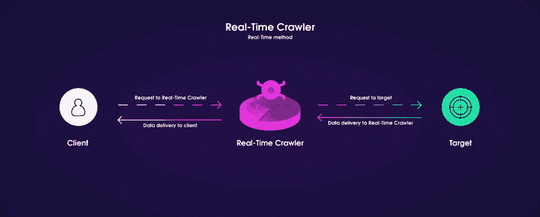
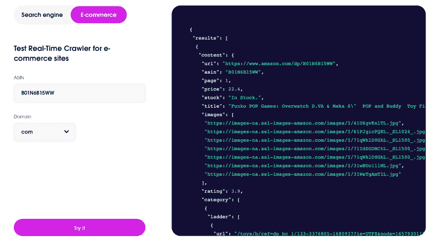
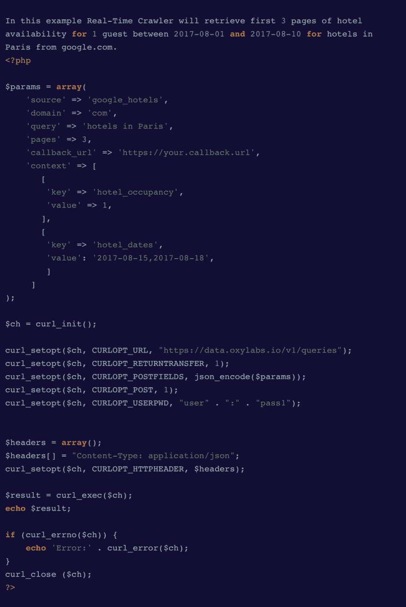

# 带有 Scraper API 的网页抓取教程

> 原文：<https://dev.to/smusca/web-scraping-tutorial-with-real-time-crawler-22m3>

网络抓取是当今营销世界中不可替代的工具，被公司用来保持竞争力和创造更多的销售。通过分析收集到的数据，公司可以比较他们提供的内容、商品、价格和可用性。在大多数情况下，将价格与竞争对手进行比较，并至少降低 1 美元，可以在很长一段时间内促进销售。另一方面，如果你不是一家大公司，你应该从哪里开始，你应该做什么来获得你需要的所有数据，这可能会变得棘手。

首先，你应该决定是自己写一个网络爬虫，还是使用一个现成的网络抓取工具。如果您知道所需的特定内容，用特定的语言获取数据或使用精确的方法，编写自己的爬虫会很有用。不利的一面是——你需要一些人，他们会编码，会为你创造有用的工具。此外，它需要结合自己的爬虫代码，购买代理，并以易于阅读的方式导出所有收集的数据。如果你没有一个团队可以为你提供这样的工具，总是有可能使用预制的工具。预制的 web 抓取工具下载特定的 web 页面并提取所需的数据，如可用项目列表、它们的价格、可用性和其他详细信息。让我们考虑其中一个工具，并检查它是如何工作的-[Scraper API](https://oxylabs.io/products/scraper-api)。

这个工具的工作方式非常简单——用户请求需要什么数据，爬虫接收请求并尝试访问数据。如果成功，crawler 会将数据发送回用户。

如果你想看到它的实际应用，你可以在他们的网页上试用他们的样本——你可以用搜索引擎或者电子商务搜索网站来试用。因为它使用 ASIN (Amazon 标准识别号)，所以您只需要在字段中粘贴一个产品号，并以 JSON 或 HTML 格式获取关于该产品的数据。

您可以从产品页面、产品报价列表页面、评论、问答、搜索结果或任何 URL 中提取数据。在如何检索数据方面也有两种选择——使用回调数据交付方法，您不需要检查您的任务状态——Scraper API 让您知道数据是否准备好了。对于实时数据传递，数据是在同一连接上检索的。代理可以在没有 IP 禁令的情况下收集数据，这也保证了匿名性。Scraper API 也是如此，因为它同时使用数据中心和住宅代理。

至于搜索引擎，你可以用两种语言提出请求——Python 或者 PHP。您也可以在 shell 中编写命令。所有你需要的是一个关键字，域名，语言和国家，这将用于搜索结果。Scraper API 支持任何位置和任何关键字的任意数量的请求。通过使用自然地理定位的 IP 地址来确保高准确性。这就是你的请求的样子。

你的结果将被提取到给定的链接。[在本例中是](https://data.oxylabs.io/v1/queries)——结果是 JSON 格式的 SERP(搜索结果页面)。它在 JSON 中有一段 HTML 代码。因此，我们需要解析 JSON 来查看结果页面。

形成有效负载所需的所有参数，以及爬虫如何工作的所有示例，都可以在 [Oxylabs 学习中心](https://learn.oxylabs.io/)上找到。他们还解释了他们的其他工具，以及如何为特定的搜索或提取编写代码。

总而言之，Scraper API 对于电子商务和搜索引擎抓取来说都是一个易于使用的便捷工具，可以帮助您的业务变得更加有利可图，并收集所需的数据。