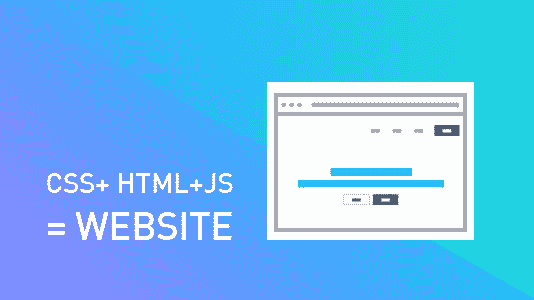
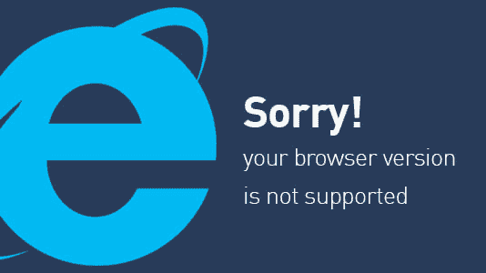
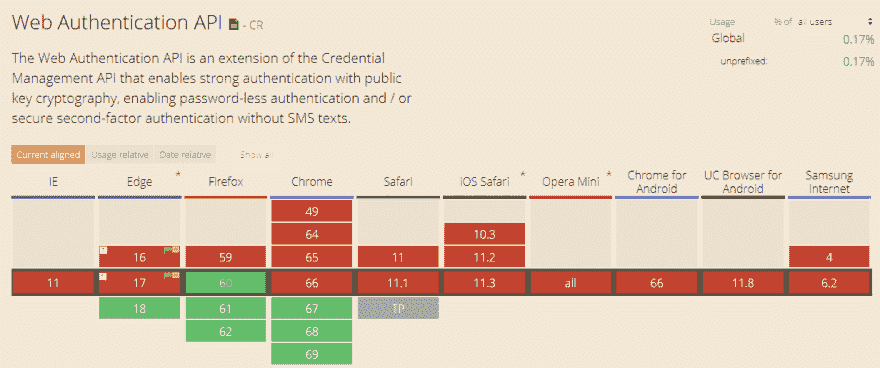
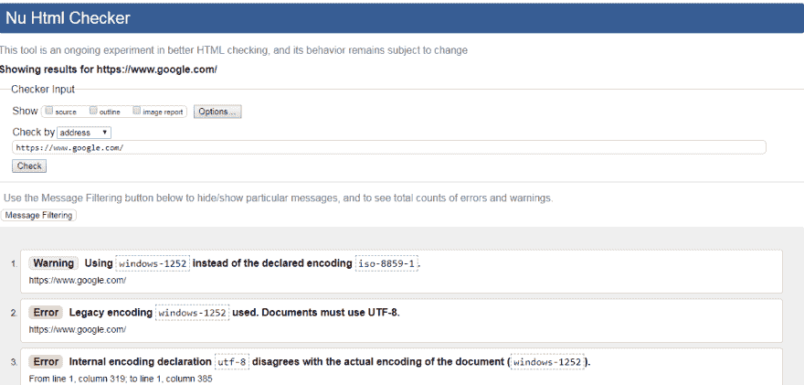
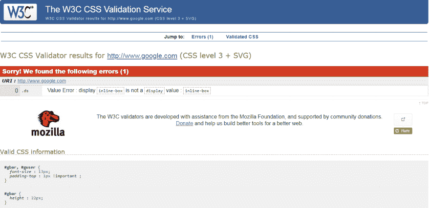

# 如何做一个跨浏览器兼容的网站？

> 原文：<https://dev.to/lambdatest/how-to-make-a-cross-browser-compatible-website-3398>

近来，一个好的应用程序或网站已经不仅仅是静态的部门元素的集合。现代网站是交互式、高性能的应用程序，有助于完成复杂的端到端业务流程。JavaScript 为我们达到这一水平做出了重大贡献。它在开发者中非常受欢迎，但是并不是所有的浏览器都支持它。开发运行 javascript 的跨浏览器兼容网页有时是一个挑战。帮助开发者应对这一挑战是我们开发[浏览器兼容性测试平台](https://www.lambdatest.com/)的驱动力之一。

在开发一个网站时，通常你会使用 Javascript、CSS 和 HTML 的组合，CSS3 和 HTML5 是最新的，我们喜欢最新的，所以，正如所料，它是开发者的首选。
T3T5】

如果你也在用这些技术开发你的网站(不要介意是否是最新的😉你可能需要注意一些问题，以使你的网站适合每一种浏览器。

所以，让我们一步一步开始吧。

大多数开发者做的第一件事就是开始为他们最喜欢的浏览器开发网站，或者在某些情况下，为你的潜在目标受众最常用的浏览器开发网站。让我们假设它是谷歌 chrome 的最新版本，通常都是这样。该网站使用所有最新的 CSS，JS 和框架技术。该网站是美丽的令人敬畏的动画过渡和干净的字体。最重要的是，它运行良好。更正:在最新的 chrome 浏览器上运行良好。

当你决定去测试各种版本的 IE 或 Safari 时，海啸就来了。现在没有什么是完美的工作，每个部分都堆叠不正确，有些元素甚至没有显示出来，因为动画甚至没有被触发。

[](https://res.cloudinary.com/practicaldev/image/fetch/s--zFOw2gDY--/c_limit%2Cf_auto%2Cfl_progressive%2Cq_auto%2Cw_880/https://www.lambdatest.com/blog/wp-content/uploads/2018/05/IE.jpg)

正如我已经解释过的，IE 仍然占据着主要的市场份额，并且是市场上最被低估的浏览器之一。它会给你的发展造成重大失误。所以第一步也是最必要的一步是定义一个完美的[跨浏览器测试策略](https://www.lambdatest.com/blog/cross-browser-testing-strategy-explained-in-three-easy-steps/)。

所以，你现在必须为不同的浏览器测试它，正如我所说的，为那些被低估的和著名的浏览器测试😉

该是你发现一些重大失误的时候了。所以，让我们来解决它们。

### 不能在不同浏览器上工作？

如果你发现你的网站不能在浏览器上运行，是时候对你的代码做一些细微的改变了。当[执行跨浏览器测试](https://www.lambdatest.com/)时，你会注意到你的网站在某些特定的浏览器中无法工作。原因可能是使用了一些浏览器不支持的技术和功能。所以，如果你的网站不能在不同的浏览器上运行，你需要找出这个特定的浏览器出现了什么问题。

**查找 Opera Mini 移动浏览器的跨浏览器兼容性问题:**

如果您使用的元素如下:

*   CSS3 3D 转换
*   2D 变换
*   背景图像
*   HTML5 表单功能
*   语义元素
*   占位符显示的 CSS 伪类
*   Web 身份验证 API
*   主题颜色元标签

那么你的网站将无法在 Opera Mini 浏览器上运行。

**查找 Firefox 浏览器的跨浏览器兼容性问题:**

Firefox 通常支持最新的技术。Mozilla 是网络技术的引领者。然而，仍然有一些元素 firefox 浏览器不完全支持，例如:

*   文件系统和文件写入器 API
*   Web SQL 数据库
*   XHTML+SMIL 动画
*   EOT fonts

这些都是最新稳定的 Firefox(60)不支持的主要元素。所以，使用这些技术和风格可能会让你的网站在最新版本的火狐浏览器中收支平衡。

**查找 Safari 的跨浏览器兼容性问题**

共享 Web Workers，CSS overflow-anchor，Web Authentication API，如果使用的话，在 safari 浏览器中根本无法工作。然而，safari 部分支持一些功能，如 HTML5 表单功能、CSS 遮罩。因此，如果使用这些功能，也可能会导致您的网站在 Safari 浏览器中无法正常工作。

如果你使用一些其他的功能和技术，并且想知道一些浏览器是否支持它，那么你可以自己使用[can use](http://www.caniuse.com/)找到它。因此，为了确保您使用了所有浏览器支持的技术，您只需输入技术并比较浏览器即可。它会显示如下结果:

[](https://res.cloudinary.com/practicaldev/image/fetch/s--oLajEM9a--/c_limit%2Cf_auto%2Cfl_progressive%2Cq_auto%2Cw_880/https://www.lambdatest.com/blog/wp-content/uploads/2018/05/CanIUse.png)

因此，正如你所看到的，web 身份验证 API 仅在 Edge、Firefox 和 Chrome 的最新浏览器版本中受支持，因此它将无法在其他版本中工作，从而出现跨浏览器不兼容问题。同样，你也可以查看其他网络技术和特性。

除了事先检查浏览器是否支持这项技术之外，你还必须遵循一些主要准则，以确保最终的网站能够跨浏览器兼容。

### 检查文档类型

您需要确定的最重要的事情是，您是否在 HTML 文件中添加了 DOCTYPE。

如果你还没有，那就马上去做。

Doctype 基本上可以帮助你的浏览器识别你的网站代码是用哪种语言编写的。如果你不指定，一些智能浏览器会自己理解它，但一些愚蠢的浏览器将无法弄清楚发生了什么，他们会以你不喜欢的方式呈现你网站的某些元素。

因此，如果你想让 IE6 及以上版本模仿 chrome 和 firefox 等浏览器的行为，你可能需要添加一个严格的 doctype。

```
<!DOCTYPE HTML PUBLIC "-//W3C//DTD HTML 4.01//EN"
"http://www.w3.org/TR/html4/strict.dtd"> 
```

如果你不这样做，浏览器将会以奇怪的方式工作，并模仿旧版本的行为。

### 有没有应用 CSS 重置？

不同的浏览器工作方式不同。一种风格可能在一个浏览器上工作，但在另一个浏览器上会显示一些不同的风格。这里最重要的因素是 CSS。

例如，你可能已经看到很多次提交按钮在不同的浏览器上看起来不同，这是因为 CSS。因此，如果一些元素在不同的浏览器中不能正确呈现，那可能是因为 CSS。当您应用 CSS 重置时，您告诉每个浏览器移除导致跨浏览器不兼容的默认 CSS 样式。

这对 Internet explorer 来说有很大的价值！

非常著名的 [Eric Meyer 的 CSS 重置](https://cssreset.com/scripts/eric-meyer-reset-css/)可以用来帮助你解决这个浏览器不兼容的问题。或者你可以使用标准的 CSS 重置，比如 [normalize.css](https://github.com/necolas/normalize.css/) 。

添加 CSS 重置非常简单，你所要做的就是下载 CSS 文件并把它包含在你的头文件中，就像:

```
<link rel="stylesheet" href="assets/styles/normalize.css">
<link rel="stylesheet" href="assets/styles/main.css">
```

但是，请确保在主样式表之前添加重置样式表。

### 不同的浏览器使用不同的样式表

这将把您从大量样式表问题中解救出来。您可以使用条件注释链接到每个浏览器的不同样式表。所以 chrome 将呈现 Chrome 的样式表，firefox 将使用它的样式表等等。

基本的条件注释如下所示:

```
<!-- [if IE ]>
    <link href="iecss.css" rel="stylesheet" type="text/css">
<![endif]-->
```

或者你也可以试试。

```
 <!-- [If IE]>
    <link type="text/css" href="IEHacks.css" />
 <![endif]-->
 <!-- [if !IE]>
    <link type="text/css" href="NonIEHacks.css" />
 <![endif]-->
```

### 使用跨浏览器友好的库和框架

喜欢使用跨浏览器友好的 javascript 库，如 jQuery、AngularJS、ReactJS、MooTools 和一些 CSS 框架，如 Bootstrap、Foundation、960 grid 等。使用这些跨浏览器兼容的库和框架的原因是，你可以以某种方式依赖它们，它们不会引入一些你可以很容易避免的愚蠢错误。

### 都设定好了？我们来验证一下！

一旦你采取了所有的编码预防措施，是时候验证你的网站了。你可以使用 HTML，CSS 验证器。这将指出您所有的错误和改进，以确保您的代码不会中断。

您可以使用 [w3 验证器](http://validator.w3.org/)来验证您网站的 HTML。
T3T5】

一旦你验证，你会看到错误和警告，然后你可以进一步解决。

类似地，您也可以验证 CSS。使用 W3 的 [Jigsaw validator 进行尝试。您将再次看到如下结果:](https://jigsaw.w3.org/css-validator/)

[](https://res.cloudinary.com/practicaldev/image/fetch/s--ZEhS5SNB--/c_limit%2Cf_auto%2Cfl_progressive%2Cq_auto%2Cw_880/https://www.lambdatest.com/blog/wp-content/uploads/2018/05/CSS-valiidator.png)

获得关于你所犯错误的信息，然后你可以解决它们。

### 不要错过跨浏览器兼容性测试

错过[跨浏览器测试](https://www.lambdatest.com/)就好像你为[跨浏览器兼容](https://www.lambdatest.com/feature)网站所做的一切努力都白费了。如果没有跨浏览器测试，你将无法确定你所做的跨浏览器兼容网站的工作是否成功。

所以，需要制定一个合适的测试策略和选择一个完美的工具。你可以用 LambdaTest 作为你的跨浏览器测试朋友。

有了 [LambdaTest](https://www.lambdatest.com/) ，你可以非常容易地找到爬进来的 bug。你可以在交互模式下这样做，在这种模式下，你甚至不用安装就可以检查各种浏览器。或者你可以使用自动截图，你只需要输入你的网址，选择浏览器，然后分析结果。检查响应也很简单。您可以在文档中了解更多信息。

一旦你执行了测试，发现了错误，然后去解决它们。希望它们不会太多😉但是如果他们这样做了，在我们下一篇博客的帮助下找出并调试他们。

你的用户会在他们喜欢的平台上喜欢你的网站。毕竟，这就是跨浏览器兼容性的意义所在。

来源: [LambdaTest 博客](https://goo.gl/K1Fbxs)