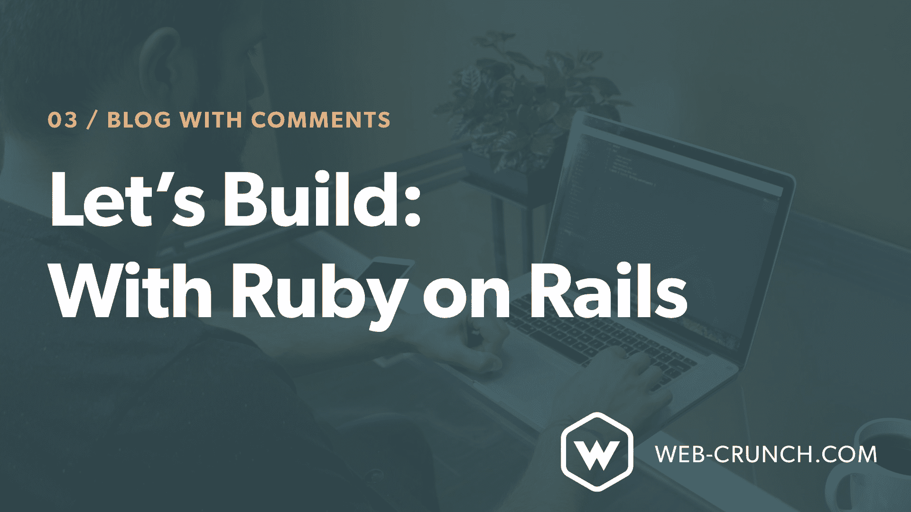

# 让我们构建:用 Ruby on Rails——一个带评论的博客

> 原文：<https://dev.to/justalever/lets-build-with-ruby-on-rails---a-blog-with-comments-17lc>

使用 Ruby on Rails 构建一个带有评论的博客是我为了更好地了解这个框架而进行的一个基础练习。在处理动态数据时，Ruby 和 Rails 一起工作，帮助我们生成一个基于 CRUD 方法的相当简单的 MVC 模式。

### 观察整个构建

[https://www.youtube.com/embed/XEkJ3vZb6-Q](https://www.youtube.com/embed/XEkJ3vZb6-Q)

### 用博客拉开序幕

为了简单地演示使用 Ruby on Rails 的原理，我选择构建一个基本的博客。每个博客帖子都可以被创建、阅读、编辑和删除。还会有与每篇博文相关的评论。可以创建和删除评论。

有了 Ruby on Rails，就可以构建什么而言，可能性是无穷无尽的。我相信在我指导你创建博客的过程中，我们的博客的新功能和改进很容易被发现。我的目标是让新来的人适应那些在我第一次尝试时对我帮助最大的约定、方法和代码模式。我希望你也能受益。

最终，本教程和视频的目的是帮助任何刚接触这个框架的人理解它是如何操作的，以及使用 Ruby on Rails 创建博客所需的必要约定。我会谈到路由、控制器、视图、模型、迁移、关系等等。在这个项目中，我们使用了一些`gems`来帮助我构建应用程序，让我的生活变得更加轻松。你可以在下面找到更多的信息。

### 项目中使用的宝石

*   [更好的错误](https://rubygems.org/gems/better_errors) -当出现错误时，眼睛更容易看到。

*   布尔玛——大多数时候我会使用自己的 CSS 或者只是使用框架的一部分。我是布尔玛的忠实粉丝，所以我们会在这个系列中经常用到它。

*   [守卫](https://github.com/guard/guard) -这个宝石对实时重装我们的`scss`、`js`、`css`和`erb`文件很有用，尽管它能做更多！*护卫者需要护卫者的肝脏来装载宝石*

在`Gemfile`的开发空间中添加以下内容。确保运行`bundle`并重启你的服务器(视频中有介绍)。

```
 group :development do

    # Guard is a command line tool to easily handle events on file system modifications.

    gem 'guard', '~> 2.14', '>= 2.14.1'

  end 
```

*   守卫肝装载 -这个宝石依赖于守卫宝石。我用它来在 Guard 检测到代码库发生变化时自动重新加载浏览器。

1.  为您的浏览器下载 [livereload 浏览器扩展](http://livereload.com/extensions/)。
2.  在`Gemfile`的开发空间内增加以下内容。确保运行`bundle`并重启你的服务器。

```
 group :development do

    # reload the browser after changes to assets/helpers/tests 

    gem 'guard-livereload', '~> 2.5', '>= 2.5.2', require: false

  end 
```

1.  运行`guard init livereload`

2.  如果是为您的项目生成的，请确保在“Guardfile”中注释掉下面的块。

    ```
     # comment this whole block out as we won't be making use if minitest

     # guard :minitest do

     # ....

     # end 
    ```

3.  为了更好的措施，再次重启你的服务器。运行:

    ```
    bundle exec guard
    ```

    在您的项目目录中启动“监视”过程。我们在这里使用`bundle exec`作为前缀，这样 guard 可以访问我们在项目中的所有依赖项。​

4.  导航到您的应用程序时，请确保您的浏览器扩展处于活动状态。如果您的控制台读回类似下面的内容，那么您的状态很好。

    ```
     00:00:00 - INFO - LiveReload is waiting for a browser to connect.
     00:00:00 - INFO - Guard is now watching at '/path/to/your/project/'
     [1] guard(main)> 00:00:00 - INFO - Browser connected. 
    ```

*   [简单形式](https://github.com/plataformatec/simple_form) -对于更简单的形式！

我们最后的帖子形式部分如下。在这里，我添加了布尔玛特定的类，以获得简单的形式来很好地使用 CSS 框架。如果你使用简单的表单和 [Bootstrap](https://getbootstrap.com) 或者 [Foundation](https://foundation.zurb.com/sites/download.html/) ，你可能需要比这更少的标记。

```
 <div class="section">
  <%= simple_form_for @post do |f| %>
    <div class="field">
      <div class="control">
        <%= f.input :title, input_html: { class: 'input' }, wrapper: false, label_html: { class: 'label' } %>
      </div>
    </div>

    <div class="field">
      <div class="control">
        <%= f.input :content, input_html: { class: 'textarea' }, wrapper: false, label_html: { class: 'label' }  %>
      </div>
    </div>
    <%= f.button :submit, 'Create new post', class: "button is-primary" %>
  <% end %>
  </div> 
```

​

### 岗位负责人

当我们在博客上创建、编辑、显示、更新和删除帖子时，帖子控制器帮助处理我们的操作。

**创建后控制器(见视频)**

1.  运行`rails g controller posts`

2.  更新`app/config/routes.rb`中的路线文件以使用`resources :posts`并添加`root: "posts#index"`

3.  在`posts_controller.rb`文件和`app/views/posts/`中的`index.html.erb`视图上创建`index`动作

4.  使用最终控制器重复所有 CRUD 操作，如下所示(跟随视频以获得完整的解释)

```
 class PostsController < ApplicationController

       def index
           @posts = Post.all.order("created_at DESC")
       end

       def new
           @post = Post.new
       end

       def create
           @post = Post.new(post_params)

           if @post.save
               redirect_to @post
           else
               render 'new'
           end
       end

       def show
           @post = Post.find(params[:id])
       end

       def update
           @post = Post.find(params[:id])

           if @post.update(post_params)
               redirect_to @post
           else
               render 'edit'
           end
       end

       def edit
           @post = Post.find(params[:id])
       end

       def destroy
           @post = Post.find(params[:id])
           @post.destroy

           redirect_to posts_path

       end

       private

       def post_params
           params.require(:post).permit(:title, :content)
       end

   end 
```

### 岗位模型

1.  我们的应用程序依赖于一个`Post`模型，我们可以通过运行

```
rails g model Post title:string content:text
```

模型负责我们帖子的数据，并与数据库进行交互。我已经声明了我们将使用的两种新的记录类型。`title`属于类型`string`而`content`属于类型`text`。您可以随意命名它们，但是描述它们对于提到的特定数据模型是什么是有意义的。您可以随时使用`migrations`添加更多的数据类型。最好从基础开始，然后随着你的进展添加新的`migrations`。

1.  生成`Post`模型后，您需要运行`rails db:migrate`将这些新记录迁移到数据库中。这样做之后，您现在应该能够与这些特定的记录进行交互了。

### 注释控制器

类似于我们的帖子控制器，我们需要为评论生成一个。

```
rails g controller comments
```

我们只希望能够创建和删除与帖子相关的评论。为此，我们需要控制器与 Post 模型和 Comment 模型进行交互(仍然需要生成这个模型)。

```
 class CommentsController < ApplicationController

    def create
        @post = Post.find(params[:post_id])
         @comment = @post.comments.create(params[:comment].permit(:name, :comment))
        redirect_to post_path(@post)    
    end

    def destroy
        @post = Post.find(params[:post_id])
        @comment = @post.comments.find(params[:id])
        @comment.destroy
        redirect_to post_path(@post)
    end

end 
```

### 评论模式

要生成评论模型，我们可以运行:

```
rails g model Comment name:string comment:text
```

这将创建一个新的注释表，其中一个命名行的数据类型为`string`，一个注释行的数据类型为`text` 。

生成模型后，您需要运行`rails db:migrate`将新行迁移到数据库表中。

## 数据关系

我们的博客帖子需要一种方式来与我们的评论交流，因为评论应该只属于创建它们的博客帖子。为此，我们需要在`Post`模型和`Comment`模型之间建立一些关系。

修改`Post`模型以包括以下内容

```
 # found in app/models/post.rb

class Post < ApplicationRecord
    has_many :comments, dependent: :destroy 
      # dependent: :destroy means the comments related 
      # to the specific post in mention get deleted if the post does.
end 
```

修改`Comment`模型以包括以下内容:

```
 # found in app/models/comment.rb

class Comment < ApplicationRecord
    belongs_to :post
end 
```

有了这种关系，我们的应用程序就可以在 post 和 comment 模型之间进行通信了。

### 关联一个 id

为了让评论起作用，我们需要将一个来自文章的 id 添加到数据库表中。为此，我们需要运行一个迁移，添加另一行将关系联系在一起。

运行以下迁移:

```
rails g migration AddPostIdToComments
```

然后导航到`app/db/migrate/XXXXXXXXXXXX_add_post_id_to_comments.rb`并添加以下代码:

```
 class AddPostIdToComments < ActiveRecord::Migration[5.1]
  def change
      add_column :comments, :post_id, :integer
  end
end 
```

这里我们在 comments 列上创建一个名为`post_id`的新行，类型为`integer`。运行`rails db:migrate`来迁移新迁移。

现在，我们可以创建关于`Comment`模型上的`post_id`与`Post`模型上的`id`匹配的注释。

## 视图

从博客的角度来看，这些观点非常简单。我们有一个基本的布局文件，作为我们的各种“主”文件。你可以在`app/views/layouts/`里找到`application.htm.erb`。在这里，我添加了一些来自布尔玛框架的标记以及一些导航链接，以帮助浏览博客更容易。

最终的`application.html.erb`文件如下:

```
 <!DOCTYPE html>
<html>
  <head>
    DemoBlog
    <%= csrf_meta_tags %>

    <%= stylesheet_link_tag    'application', media: 'all', 'data-turbolinks-track': 'reload' %>
    <%= javascript_include_tag 'application', 'data-turbolinks-track': 'reload' %>
  </head>

  <body>
      <section class="hero is-primary is-medium">
      <!-- Hero head: will stick at the top -->
      <div class="hero-head">
        <nav class="navbar">
          <div class="container">
            <div class="navbar-brand">
              <%= link_to 'Demo Blog', root_path, class: "navbar-item" %>
              <span class="navbar-burger burger" data-target="navbarMenuHeroA">
                <span></span>
                <span></span>
                <span></span>
              </span>
            </div>
            <div id="navbarMenuHeroA" class="navbar-menu">
              <div class="navbar-end">
                <%= link_to "Create New Post", new_post_path, class:"navbar-item" %>
              </div>
            </div>
          </div>
        </nav>
      </div>

      <!-- Hero content: will be in the middle -->
      <div class="hero-body">
        <div class="container has-text-centered">
          <h1 class="title">
            <%= yield :page_title %>
          </h1>
        </div>
      </div>
    </section>
    <%= yield %>
  </body>
</html> 
```

#### 帖子视图

我们的帖子视图文件夹也很简单。在我们的应用程序中，每个路由都有一个新文件。首先是索引页:

在`app/views/posts/index.html.erb`中找到该代码

```
 <% content_for :page_title,  "Index" %>

<div class="section">
    <div class="container">
        <% @posts.each do |post| %>
            <div class="card">
          <div class="card-content">
            <div class="media">
              <div class="media-content">
                <p class="title is-4"><%= link_to post.title, post  %></p>
              </div>
            </div>
            <div class="content">
                 <%= post.content %>
            </div>
            <div class="comment-count">
                <span class="tag is-rounded"><%= post.comments.count %> comments</span>
            </div>
          </div>
        </div>
        <% end %>
    </div>
</div>
```

我们渲染了一个局部，它习惯了在`posts`视图文件夹中的`edit.html.erb`和`new.html.erb`页面。

在`app/views/posts/new.html.erb`中找到的`new.html.erb`页面。

```
 <% content_for :page_title, "Create a new post" %>
<%= render 'form' %> 
```

在`app/views/posts/edit.html.erb`中找到的`edit.html.erb`页

```
 <% content_for :page_title, "Edit Post" %>
<%= render 'form' %> 
```

当然还有在`app/views/posts/_form.html.erb`中找到的`_form.html.erb`部分

```
 <div class="section">
<%= simple_form_for @post do |f| %>
  <div class="field">
    <div class="control">
      <%= f.input :title, input_html: { class: 'input' }, wrapper: false, label_html: { class: 'label' } %>
    </div>
  </div>

  <div class="field">
    <div class="control">
      <%= f.input :content, input_html: { class: 'textarea' }, wrapper: false, label_html: { class: 'label' }  %>
    </div>
  </div>
  <%= f.button :submit, 'Create new post', class: "button is-primary" %>
<% end %>
</div> 
```

最后是在`app/views/posts/show.html.erb`中找到的`show.html.erb`文件

```
 <% content_for :page_title, @post.title %>

<section class="section">
    <div class="container">
        <nav class="level">
          <!-- Left side -->
          <div class="level-left">
            <p class="level-item">
                <strong>Actions</strong>
            </p>
          </div>
          <!-- Right side -->
          <div class="level-right">
              <p class="level-item">
                <%= link_to "Edit", edit_post_path(@post), class:"button" %>
              </p>
              <p class="level-item">
                <%= link_to "Delete", post_path(@post), method: :delete, data: { confirm: "Are you sure?" }, class:"button is-danger" %>
                </p>
          </div>
        </nav>
        <hr/>

        <div class="content">
            <%= @post.content %>
        </div>
    </div>
</section>

<section class="section comments">
    <div class="container">
        <h2 class="subtitle is-5"><strong><%= @post.comments.count %></strong> Comments</h2>
        <%= render @post.comments %>
        <div class="comment-form">
            <hr />
            <h3 class="subtitle is-3">Leave a reply</h3>
             <%= render 'comments/form' %>
        </div>
    </div>
</section> 
```

#### 评论意见

我们的大多数评论视图都嵌套在显示视图中。我们确实创建了部分评论和评论表单。

在`app/views/comments/`中找到的评论部分(`_comment.html.erb`)是每个评论在创作时包含的内容。下面是该部分的最终代码。

```
 <div class="box">
  <article class="media">
    <div class="media-content">
      <div class="content">
        <p>
          <strong><%= comment.name %>:</strong>
          <%= comment.comment %>
        </p>
      </div>
    </div>
     <%= link_to 'Delete', [comment.post, comment],
                  method: :delete, class: "button is-danger", data: { confirm: 'Are you sure?' } %>
  </article>
</div> 
```

评论`_form.html.erb`被嵌入到我们的`Posts`展示页面的展示页面中。

```
 <%= simple_form_for([@post, @post.comments.build]) do |f| %>
<!--
collection.build(attributes = {}, …) Returns one or more new objects of the collection type that have been instantiated with attributes and linked to this object through a foreign key, but have not yet been saved. Note: This only works if an associated object already exists, not if it‘s nil!
-->
<div class="field">
  <div class="control">
    <%= f.input :name, input_html: { class: 'input' }, wrapper: false, label_html: { class: 'label' } %>
  </div>
</div>

<div class="field">
  <div class="control">
    <%= f.input :comment, input_html: { class: 'textarea' }, wrapper: false, label_html: { class: 'label' }  %>
  </div>
</div>
<%= f.button :submit, 'Leave a reply', class: "button is-primary" %>
<% end %> 
```

## 四舍五入

如果你看完了视频，你会很好地了解到使用 Ruby on Rails 构建一个带有评论的基本博客需要做些什么。我邀请您[下载源代码](https://github.com/justalever/demo_blog_rails)以查看视频中显示的最终结果，并在您自己的项目中排除故障时使用。Rails 善于在开发过程中使用错误来告诉你什么是错的。有时错误很明显，而有时则不明显。在谷歌上搜索错误信息经常能让我找到答案。由于 Ruby on Rails 是一个大型的基于约定的框架，大多数遇到错误的人都会毫不费力地找到他们需要的答案。有一个固执己见的堆栈肯定有好处！

我希望你喜欢这个教程和视频。接下来，我计划构建一个流行应用程序的克隆，它将开始更多地关注用户角色、身份验证、安全性等等。如果你喜欢这个，请在评论中告诉我。我也很乐意帮助解决您在此过程中发现的任何错误，如果您愿意的话！

#### 下载源代码

## [just alever](https://github.com/justalever)/[demo _ blog _ rails](https://github.com/justalever/demo_blog_rails)

### 如何使用 Ruby on Rails 构建一个基本博客的演示

<article class="markdown-body entry-content container-lg" itemprop="text">

# 让我们构建:用 Ruby on Rails——带评论的博客

[](https://camo.githubusercontent.com/7ae96be3cf3de6f738fe961a1336e3fdb9e31c248725f8db3a67692825f7fb6f/68747470733a2f2f692e696d6775722e636f6d2f446b5a535465652e6a7067)

阅读完整的博客文章，并观看在[Web-Crunch.com](https://web-crunch.com/lets-build-with-ruby-on-rails-blog-with-comments)的截屏

使用 Ruby on Rails 构建一个带有评论的博客是我为了更好地了解这个框架而进行的一个基础练习。在处理动态数据时，Ruby 和 Rails 一起工作，帮助我们生成一个基于 CRUD 方法的相当简单的 MVC 模式。

### 从博客开始

为了简单地演示使用 Ruby on Rails 的原理，我选择构建一个基本的博客。每个博客帖子都可以被创建、阅读、编辑和删除。还会有与每篇博文相关的评论。可以创建和删除评论。

有了 Ruby on Rails，就可以构建什么而言，可能性是无穷无尽的。我相信新功能和…

</article>

[View on GitHub](https://github.com/justalever/demo_blog_rails)

#### 到目前为止的级数

*   [01 -简介](https://web-crunch.com/lets-build-with-ruby-on-rails-introduction/)
*   [02 -安装](https://web-crunch.com/lets-build-with-ruby-on-rails-installation/)
*   [03 -创建一个带有评论的博客](https://web-crunch.com/lets-build-with-ruby-on-rails-blog-with-comments/) -您在这里

## 不要脸的插头

如果你喜欢这篇文章，我在 [YouTube](https://youtube.com/c/webcrunch) 和我的[博客](https://web-crunch.com)上有更多内容。我计划在这里开始创作更多的作品。希望收件箱中有更多这样的内容吗？[订阅我的简讯](https://web-crunch.com/subcribe)自动获取。

 [](https://hellorails.io) 
☝想从头开始学习 Ruby on Rails？看看我即将推出的课程 [Hello Rails](https://hellorails.io) 。