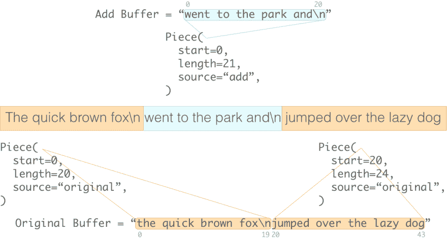

# 文本编辑器的无名英雄

> 原文：<https://dev.to/_darrenburns/the-piece-table---the-unsung-hero-of-your-text-editor-al8>

piece 表是一种无名英雄数据结构，它负责我们对文本编辑器所期望的大部分功能和性能特征。Visual Studio 代码有一个。微软 Word 2.0 早在 1984 年就有一个。

尽管这是现代文本编辑器的一个几乎无处不在的特性，但它仍然相对缺乏文档记录。在本文中，我将解释片段表是如何构造的，为什么使用它们，以及在编辑文件时文本编辑器如何与之交互。

我的目标是让这篇文章尽可能对初学者友好，所以我们将慢慢地探索每个概念。但是，在继续之前，您应该对数组、字符串和对象(或字典/结构)有一个基本的了解。

* * *

当您在文本编辑器中打开一个文件时，内容将从磁盘中读取并存入内存中的数据结构中。如果你要写一个文本编辑器，你将如何在内存中存储一个打开的文件？

## 第一本能——字符串的排列

我们的第一感觉可能是使用字符串数组，其中每个字符串都是文件中的一行。换句话说，我们将表示这个文件…

```
the quick brown fox
jumped over the lazy dog 
```

…像这样:

```
lines = [
    "the quick brown fox",       # line 1 of the file
    "jumped over the lazy dog",  # line 2 of the file ] 
```

这是一种在内存中表示文本文件的直观方式。它让我们以一种类似于它在我们的文本编辑器中出现在屏幕上的方式来思考文件。

这也是一个完全可以接受的方法，你可以说它的直观性超过了它可能存在的任何潜在缺陷。事实上，Visual Studio 代码在 2018 年初之前一直使用类似的模型。

不幸的是，当我们处理大文件时，这种方法成本很高。要知道为什么，想想如果有人在文件中间插入一个新行(`"went to the park and"`):
会发生什么

```
the quick brown fox
went to the park and
jumped over the lazy dog 
```

为了给这个新行腾出空间，数组中它下面的所有行都需要在内存中向前移动。对于大文件，这很快变得昂贵。随着文件变大，需要移动的数据也越来越多。

[](https://res.cloudinary.com/practicaldev/image/fetch/s--12MUbiU7--/c_limit%2Cf_auto%2Cfl_progressive%2Cq_auto%2Cw_880/https://thepracticaldev.s3.amazonaws.com/i/k21rt35uetkehabyuhwa.png)

这只是这种方法的缺点之一。在 Visual Studio 代码团队发布的这篇精彩的[博客文章](https://code.visualstudio.com/blogs/2018/03/23/text-buffer-reimplementation#_piece-tree)中，他们强调了这种方法的其他缺陷，比如过多的内存使用和与将文件分成换行符上的多个字符串相关的性能问题。

## 仅附加的表示

如果我们在数组的末尾添加内容，我们不需要移动任何数据来为它腾出空间，所以我们不会像在数组中间插入内容那样导致相同的性能损失(从技术上讲，添加内容的时间复杂度为 O(1)，但是插入的时间复杂度为 O(n))。

*片段表*是许多新旧文本编辑器背后强大的数据结构。片段表的一个关键特征是，它以只追加的方式记录了我们对文件的所有插入。

让我们探索一下计件表是如何工作的。

当我们把一个文件从磁盘读入一个片段表时，文件中的文本被存储在一个单独的字符串中，我们从不修改它。我们称这个字符串为*原始缓冲区*。

```
piece_table = {
    "original": "the quick brown fox\njumped over the lazy dog",
    ...
} 
```

当我们在编辑器中向文件添加文本时，该文本被追加到片段表的*添加缓冲区*中，该缓冲区最初只是一个空字符串。

在文件顶部添加版权声明？将其添加到添加缓冲区。文件中间的一个新函数？添加缓冲。在文件末尾多加一行？加缓冲！

添加缓冲区是组成片段表的两个缓冲区中的第二个，并且它是仅附加的。

```
{
    "original": "the quick brown fox\njumped over the lazy dog",
    "add": "",
  ...
} 
```

通过将插入到文件中的所有内容追加到 add buffer 中，我们记录了用户输入到编辑器中的文本，同时避免了我们前面提到的那些讨厌的中间数组插入。

让我们再次打开假设的文本编辑器，像以前一样在文件中间添加一行。这使得我们的工件表看起来像这样:

```
{
    "original": "the quick brown fox\njumped over the lazy dog",
    "add": "went to the park and\n",
  ...
} 
```

我们添加到文件中间的文本在添加缓冲区中。最初的缓冲区保持不变(并将永远保持不变)。

这两个字符串,`original`和`add`,包含了在编辑器中打开的文件的全部内容，以及文件打开后包含的所有内容。

当编辑器显示一个打开的文件时，它将这两个字符串的不同部分组合在一起，形成您在屏幕上看到的内容。如果这些字符串的某些部分不再出现在文件中，则可能会被忽略(例如，如果文本编辑器的用户删除了一些文本)。

在下面的文本中，中间部分来自添加缓冲区，因为它是插入的，其余的文本来自原始缓冲区，因为它是原始文件的一部分。

[](https://res.cloudinary.com/practicaldev/image/fetch/s--feKmxmN4--/c_limit%2Cf_auto%2Cfl_progressive%2Cq_auto%2Cw_880/https://thepracticaldev.s3.amazonaws.com/i/nw7ezjpvygc7do16tg61.png)

现在，我们假设的编辑器知道用户已经将字符串`"went to the park and\n"`插入到文件中，但是不知道*插入到了*的位置。我们还没有在片段表中获得足够的信息，使编辑器能够正确显示文件的内容。这个难题缺少的部分(双关语)是跟踪用户在文档中插入文本的位置。

## 片描述符

为了知道用户在文件中插入文本的位置，piece 表需要跟踪文件的哪些部分来自`original`缓冲区，哪些部分来自`add`缓冲区。它通过遍历一系列的*片段描述符*来实现这一点。片段描述符包含三位信息:

*   告诉我们从哪个缓冲区读取。
*   告诉我们从缓冲区的哪个索引开始读取。
*   告诉我们从缓冲区中读取多少字符。

当我们第一次在编辑器中打开一个文件时，只有`original`缓冲区有内容，有一个单独的描述符告诉我们的编辑器完全从`original`缓冲区读取。添加缓冲区是空的，因为我们还没有向文件中添加任何文本。

```
{
    "original": "the quick brown fox\njumped over the lazy dog",
    "add": "",
  "pieces": [Piece(start=0, length=44, source="original")],
} 
```

## 向文件中添加文本

现在让我们像以前一样在文件中间添加相同的文本。下面是如何更新片段表来反映这一点:

```
{
    "original": "the quick brown fox\njumped over the lazy dog",
    "add": "went to the park and\n",
    "pieces": [
        Piece(start=0, length=20, source="original"),
        Piece(start=0, length=21, source="add"),
        Piece(start=20, length=24, source="original"),
    ],
} 
```

我们使用文本编辑器在文件中插入的文本已经被追加到添加缓冲区中，以前是一个片段，现在是三个。

*   现在，列表中的第一部分告诉我们，只有原始缓冲区的前 20 个字符(`the quick brown fox\n`)构成了文件中的第一段文本(注意，`\n`，代表一个换行符，是一个单独的字符)。
*   第二部分告诉我们，文件接下来的 21 个字符可以在 add buffer ( `went to the park and\n`)中的索引 0 和 21 之间找到。
*   第三段也是最后一段告诉我们，文件中文本的最终跨度可以在原始缓冲区(`jumped over the lazy dog`)的索引 20 和 44 (start + length)之间找到。

将文本插入文件的行为通常会导致将一段文本分割成三段:

1.  一片指向新插入文本左侧的文本。
2.  另一段引用插入的文本本身(在添加缓冲区中)。
3.  第三段引用被推到新插入文本右侧的文本。

[](https://res.cloudinary.com/practicaldev/image/fetch/s--rUNAl_7P--/c_limit%2Cf_auto%2Cfl_progressive%2Cq_auto%2Cw_880/https://thepracticaldev.s3.amazonaws.com/i/h1kgfx3rh901nzsj4jcc.png)

当你在一篇文章的开头或结尾插入文本时，情况会有所不同。在这种情况下，添加文本不会将现有的部分“分割”成两半，因此我们只需要一个额外的部分来表示新插入的文本。

## 保存并显示打开的文件

正如本文开头提到的，当我们在文本编辑器中打开一个文件时，它会从磁盘中读取并存储在内存中的一个数据结构中(很可能是一个片段表或某种变体)。同样，当我们执行相反的操作并保存文件时，我们的编辑器需要能够读取片段表并将内容写回磁盘上的文件。

通过以连续的顺序读取片段描述符，我们的文本编辑器可以将其在片段表中的文件的内部表示转换为您在屏幕上看到的内容，以及当您保存文件时写入文件的内容。

```
for piece in piece_table["pieces"]:
    source: str = piece.source  # "original" or "add"
    buffer: str = piece_table[source]
    span_of_text: str = buffer[piece.start:piece.start+piece.length]
    print(span_of_text)  # alternatively, write to a file 
```

*注意:*在 Python 中，`string[start:end]`语法可以用来从字符串中返回子串。例如，`“hello”[1:3]`返回`"el"`。

## 删除文本

当我们从一个文件中删除一些文本时，我们将一个现有的部分分成两部分:

1.  一片指向被删除文本左边的文本。
2.  第二部分指向被删除文本右边的文本。

被删除的文本将仍然存在于我们的一个缓冲区中，但是没有片段引用它，它不被认为是我们文件的一部分。

你可以把片段描述符想象成指向一面墙的聚光灯，墙上画着曾经写入文件的所有文本。在任何时间点，这些灯光照亮部分墙壁，显示那里的文字。被照亮的文本被视为文件的一部分。虽然我们知道墙上写着更多，但它隐藏在黑暗中，被认为是无关紧要的。

## 撤销和重做

保留所有这些文本的一个好处是，即使它们不是当前文件的一部分，也可以使撤销/重做的实现变得相当容易。

当前“处于黑暗中”的文本将来可能会再次被需要。如果我们可以调整灯光再次照亮文字，而不是重新粉刷墙壁，这不是很好吗？

在本文开头讨论的字符串数组方法中，撤销操作可能导致在数百万个不同的字符串中插入或删除数百万个字符。有了计件表法，这个动作的成本就变得微不足道了。作为撤销或重做的一部分，要添加或删除的文本已经在其中一个缓冲区中，我们只需要更新我们的片段描述符，使其再次指向它。

## 结论

我们有几种方法可以改进上面描述的工件表。它们通常与树等其他数据结构相结合，以提高它们的性能。

也就是说，我写这篇文章的目的是让你对文本编辑器的内部工作方式有一个直觉和一些了解，这些调整与这个目标是一致的。

如果你对这篇文章有任何建设性的反馈，或者你发现了其中的任何错误，请告诉我！

如果你对更多类似的内容感兴趣，请关注我的 [Twitter](https://twitter.com/_darrenburns) 、 [DEV](https://dev.to/_darrenburns) ，并查看我的[博客](https://darrenburns.net/)！

## 参考文献/进一步阅读

*   [文本序列的数据结构(PDF)](https://www.cs.unm.edu/~crowley/papers/sds.pdf) -查尔斯·克劳利
*   [用棋子桌做了什么？](https://web.archive.org/web/20160308183811/http://1017.songtrellisopml.com/whatsbeenwroughtusingpiecetables)——陆三金(我想)
*   [文本缓冲区重新实现，一个 Visual Studio 代码的故事](https://code.visualstudio.com/blogs/2018/03/23/text-buffer-reimplementation#_piece-tree) -彭 Lyu