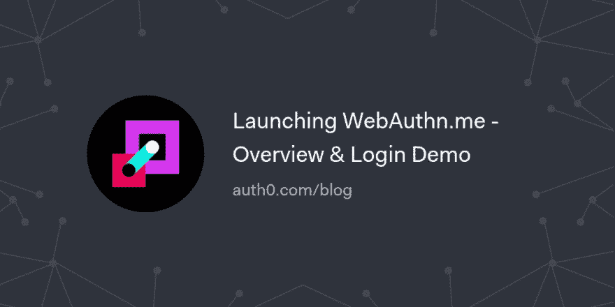

# 启动 WebAuthn.me -概述和登录演示

> 原文：<https://dev.to/auth0/launching-webauthnme---overview--login-demo-bn0>

在本文中，我们将回顾 WebAuthn 规范和最新资源， [WebAuthn.me，这是 WebAuthn 规范](https://webauthn.me/)的完全交互式演示。我们将回顾身份场景是如何发展的，以及如何趋向于强身份认证的主流采用和启用。虽然用户名和密码的组合现在还没有普及，但是很快我们就会看到更多的用于身份验证的生物识别技术...

[读下去🔑](https://auth0.com/blog/web-authentication-webauthn-overview-demo-tool/?utm_source=dev&utm_medium=sc&utm_campaign=webauthn_launch)

