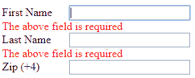

# 表单验证:你(可能)做错了

> 原文：<https://dev.to/dexygen/form-validation-youre-likely-doing-it-wrong-37h9>

首先，跑，不要走，阅读下面关于[“内联表单验证的可用性测试”](https://baymard.com/blog/inline-form-validation)的内容，它包含了更多的一般细节，尽管我可能会跟进一篇关于他们没有涉及的一小部分的帖子。这篇文章涉及的两大类问题是:

1.  “过早内联验证”，以及
2.  "过时的错误消息"

这里我主要关心的是第一个陷阱。事实上，如果你看看我写的一些代码，你会看到我避免了第二个，特别是设置错误信息为空的那一行:`errEl.innerHTML = '';`

```
let fnameEl = document.getElementById('fname');
let lnameEl = document.getElementById('lname');

function confirmEntry() {
    let errEl = document.getElementById('err4-' + this.id);

    if (this.value) {
        errEl.innerHTML = '';
    }
    else {
        errEl.innerHTML = 'The above field is required';
    }
}

fnameEl.focus();

fnameEl.addEventListener('blur', function() {
    confirmEntry.call(this);
});

lnameEl.addEventListener('blur', function() {
    confirmEntry.call(this);
}); 
```

不幸的是，如上所述，如果第一个字段是 tab 键通过的，上面将正确地显示一个错误，但如果试图 shift-tab 键返回以纠正该错误，它将令人恼火地显示第二个字段的错误。这类事情在上面引用的文章中有所涉及。

[](https://res.cloudinary.com/practicaldev/image/fetch/s--f0gMXoE3--/c_limit%2Cf_auto%2Cfl_progressive%2Cq_auto%2Cw_880/https://thepracticaldev.s3.amazonaws.com/i/8o4yk12z98mtwfgl32t0.PNG)

一个解决方案似乎是添加一些“状态”，以下是快速和肮脏的，可能并不完美，但应该对用户不那么讨厌:

```
let lastError;  

function confirmEntry() {
    let errEl = document.getElementById('err4-' + this.id);

    if (this.value) {
        errEl.innerHTML = '';
        lastError = '';
    }
    else if (lastError) {
        lastError.focus();
    }
    else {
        lastError = this;
        errEl.innerHTML = 'The above field is required';
    }
} 
```

我已经创建了一个包含上述代码的要点，[两个版本都可以在这里得到](https://gist.github.com/dexygen/3edb947c8ef30e3f4faa25969ba03e4a/revisions)。这里是前面提到的的后续帖子[。](https://dev.to/dexygen/form-validation-youre-doing-it-wrong-part-two-5545)