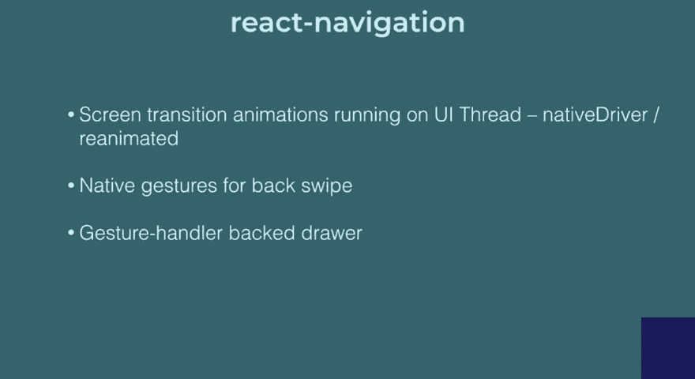
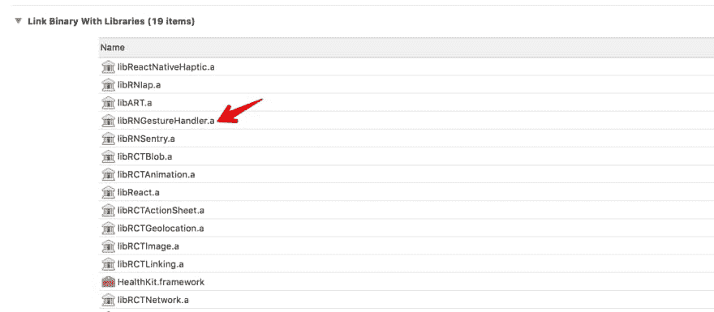

# 在 react 原生应用中使用 react-navigation 3.0

> 原文：<https://dev.to/onmyway133/using-react-navigation-30-in-react-native-apps-2o6l>

[](https://res.cloudinary.com/practicaldev/image/fetch/s--oqOQn-cT--/c_limit%2Cf_auto%2Cfl_progressive%2Cq_auto%2Cw_880/https://cdn-images-1.medium.com/max/2600/0%2A1EVWN_3rsetHSa3t.jpg)

[react-navigation](https://github.com/react-navigation/react-navigation) 可能是我在 react 原生应用中使用的唯一依赖项。到目前为止，我对它很满意，然后[3.0 版](https://reactnavigation.org/blog/2018/11/17/react-navigation-3.0.html)推出了一些突破性的变化。这没什么大不了的，但是如果我们不够注意的话，可能需要一段时间来升级。下面是我的探索，以及如何克服升级的阵痛。

> React 导航诞生于 React 原生社区对完全用 JavaScript 编写的可扩展且易于使用的导航解决方案的需求(因此您可以阅读并理解所有源代码)，基于强大的原生原语。

我喜欢 react-navigation 的一点是它全面的文档化，易于定制 API，使用起来非常漂亮。它解决了几乎所有的基本需求。

## [反应导航](https://reactnavigation.org/blog/2018/11/17/react-navigation-3.0.html)

> 这是 React 导航依赖于 React 本机核心之外的本机模块的第一个版本:它现在依赖于 react-native-gesture-handler。这个库为利用操作系统的本机手势 API 提供了一组优秀的原语，并使我们能够修复堆栈和抽屉导航器的各种问题。

我喜欢看源代码，惊讶的发现 [react-navigation](https://github.com/react-navigation/react-navigation/blob/master/src/react-navigation.js) 全是纯 Javascript 代码。

```
module.exports = {
  // Native
  get createAppContainer() {
    return require('[@react](http://twitter.com/react)-navigation/native').createAppContainer;
  },
  get createNavigationContainer() {
    console.warn(
      '`createNavigationContainer()` has been deprecated, please use `createAppContainer()` instead. You can also import createAppContainer directly from [@react](http://twitter.com/react)-navigation/native'
    );
    return require('[@react](http://twitter.com/react)-navigation/native').createAppContainer;
  },
  get createKeyboardAwareNavigator() {
    return require('[@react](http://twitter.com/react)-navigation/native').createKeyboardAwareNavigator;
  },
} 
```

react-navigation/native 指的是这个分离的 [react-navigation-native](https://github.com/react-navigation/react-navigation-native) ，它反过来又依赖于 [react-navigation-core](https://github.com/react-navigation/react-navigation-core) 并且都是 Javascript 代码。我以为它只是围绕 Activity 或 UINavigationViewController 的 Javascript 包装器，但它们不是。多漂亮啊。所有代码都值得一看。

此外，出于模块化的考虑，所有的标签和堆栈导航器，如[反应导航标签](https://github.com/react-navigation/react-navigation-tabs)和[反应导航堆栈](https://github.com/react-navigation/react-navigation-stack)都被移出到单独的仓库。路由器和事件机制似乎是由[导航上下文](https://github.com/react-navigation/react-navigation-core/blob/master/src/views/NavigationContext.js)中的 react 上下文驱动的

```
import createReactContext from 'create-react-context'; 
const NavigationContext = createReactContext(undefined); 
export default NavigationContext; 
```

## 升级到 3.0

到 3.0 的[迁移指南](https://reactnavigation.org/blog/2018/11/17/react-navigation-3.0.html)非常简单，但是有一些问题我们需要小心。升级之前我用的是 react-native 0.57.5 和 react-navigation 2.0

首先，安装 3.0 版和 react-native-手势处理器

```
npm install react-navigation@^3.0.0
npm install react-native-gesture-handler 
```

正如 [brentvatne](https://github.com/onmyway133/notes/issues/443#issuecomment-441769279) 所指出的，@react-navigation/core 和@react-navigation/native 是由 react-navigation 安装的。3.0 版本也是 react 第一次——导航依赖 React 原生核心之外的原生模块。

[React-Native-gesture-handler](https://github.com/kmagiera/react-native-gesture-handler)是一组声明式 API，将平台原生触摸和手势系统暴露给 React Native。你可以在演讲[中看到更多关于它在反应导航中的应用，这一切都始于导航](https://www.youtube.com/watch?v=Z0Jl1KCWiag)

[](https://res.cloudinary.com/practicaldev/image/fetch/s--sRh8zw50--/c_limit%2Cf_auto%2Cfl_progressive%2Cq_auto%2Cw_880/https://cdn-images-1.medium.com/max/2744/1%2AA4XGdGS9kQfU6NIcob9gNg.png)

### **无法读取 iOS** 中未定义的属性‘状态’

[react-native-gesture-handler](https://github.com/kmagiera/react-native-gesture-handler)有一些 Objective C，就是 native APIs。这个问题是因为这个库没有链接到我们的 Xcode 项目中。我经常遇到 react-native link 和 CocoaPods 的问题，所以我一般都是把 Drag RNGestureHandler.xcodeproj 拖到 Xcode 里。你可以在../node _ modules/react-native-gesture-handler/IOs/rngesturehandler . xcode proj

然后在将二进制文件与库链接中，记得选择 libRNGestureHandler.a

[](https://res.cloudinary.com/practicaldev/image/fetch/s--L0AdLdQP--/c_limit%2Cf_auto%2Cfl_progressive%2Cq_auto%2Cw_880/https://cdn-images-1.medium.com/max/3500/1%2AOKD_Qc4M5EtchKFAg045zA.png)

### (0，_reactNavigation.default)不是函数

根导航器所需的[显式 app 容器一节中说“过去，任何导航器都可以充当你的 app 顶层的导航容器，因为它们都被包裹在“导航容器”中。导航容器，现在称为应用程序容器，是一个高阶组件，它维护应用程序的导航状态，并处理与外部世界的交互，将链接事件转换为导航操作等。”。](https://reactnavigation.org/blog/2018/11/17/react-navigation-3.0.html)

现在需要一个显式的应用程序容器。当我们这样声明时，这个问题就出现了

```
import createAppContainer from 'react-navigation' 
```

仔细看看示例代码，它就像

```
import {
  createStackNavigator,
  createAppContainer
} from 'react-navigation';
const MainNavigator = createStackNavigator({...});
const App = createAppContainer(MainNavigator); 
```

如果你看一下[代码](https://github.com/react-navigation/react-navigation/blob/master/src/react-navigation.js#L5)中 react-navigation top 属性是如何导出的，很明显 createAppContainer 不是默认导出，所以我们需要使用花括号。

```
module.exports = {
  // Native
  get createAppContainer() {
    return require('[@react](http://twitter.com/react)-navigation/native').createAppContainer;
  },
} 
```

createAppContainer 的源代码在 [react-navigation-native](https://github.com/react-navigation/react-navigation-native/blob/master/src/createAppContainer.js) 中，为好奇的读者提供了额外的信息。

```
/**
 * Create an HOC that injects the navigation and manages the navigation state
 * in case it's not passed from above.
 * This allows to use e.g. the StackNavigator and TabNavigator as root-level
 * components.
 */
export default function createNavigationContainer(Component) {
  class NavigationContainer extends React.Component {
    subs = null;

_renderLoading() {
      return this.props.renderLoadingExperimental
        ? this.props.renderLoadingExperimental()
        : null;
    }
} 
```

现在我们可以像下面这样使用 react-navigation 3.0。我通常将导航器分开，所以我让 RootNavigator 负责根屏幕设置。

```
// [@flow](http://twitter.com/flow)

import React from 'react'
import createAppContainer from 'react-navigation'
import makeRootNavigator from './src/screens/root/RootNavigator'

const RootNavigator = makeRootNavigator({})
const AppContainer = createAppContainer(RootNavigator)

type Props = {}

export default class App extends React.Component<Props> {
  render() {
    return <AppContainer />
  }
} 
```

### undefined 不是评估“RNGestureHandlerModule”的对象。Android 中的状态

现在我们又遇到了这个问题，但是是在 Android 上。我不信任 react-native 链接，所以手动链接库。

转到 app build.gradle，查找依赖块并声明

```
implementation project(':react-native-gesture-handler') 
```

另外，在 [settings.gradle](https://stackoverflow.com/questions/45387971/when-to-use-gradle-properties-vs-settings-gradle) 中，添加

```
include ':react-native-gesture-handler'
project(':react-native-gesture-handler').projectDir = new File(rootProject.projectDir, '../node_modules/react-native-gesture-handler/android') 
```

> settings.gradle 文件就像 build.gradle 文件一样，是一个 Groovy 脚本。每个生成中只执行一个 settings.gradle 脚本(与多项目生成中的 build.gradle 脚本相比)。它将在任何 build.gradle 之前执行，甚至在创建[项目](https://docs.gradle.org/current/javadoc/org/gradle/api/Project.html)实例之前执行。因此，它是针对一个[设置](https://docs.gradle.org/3.3/dsl/org.gradle.api.initialization.Settings.html)对象进行评估的。使用这个 settings 对象，您可以将子项目添加到您的构建中，从命令行( [StartParameter](https://docs.gradle.org/3.3/javadoc/org/gradle/StartParameter.html) )修改参数，并访问 [Gradle](https://docs.gradle.org/3.3/dsl/org.gradle.api.invocation.Gradle.html) 对象来注册生命周期处理程序。如果您的设置与构建相关，但不一定与项目相关，或者在包含可能的子项目之前需要逻辑**，请使用该文件。**

然后在 MainApplication.java，导入库并声明 React 原生包

```
import com.swmansion.gesturehandler.react.RNGestureHandlerPackage;

[@Override](http://twitter.com/Override)
protected List<ReactPackage> getPackages() {
    return Arrays.<ReactPackage>asList(
        new MainReactPackage(),
        new RNGestureHandlerPackage(),
    )
} 
```

react-native-gesture-handler 文档提到了类似 createReactActivityDelegate 的东西，但我认为这是不必要的。

```
[@Override](http://twitter.com/Override)
protected ReactActivityDelegate createReactActivityDelegate() {
  return new ReactActivityDelegate(this, getMainComponentName()) {
    [@Override](http://twitter.com/Override)
    protected ReactRootView createRootView() {
     return new RNGestureHandlerEnabledRootView(MainActivity.this);
    }
  }
} 
```

### 清除 gradle 并反应本机缓存

缓存有时可能会让我们感到困惑，所以最好在升级期间清空缓存，以确保我们重新开始。

我们可以通过显式删除缓存来清除 gradle

```
rm -rf $HOME/.gradle/caches/ 
```

或者利用 gradlew

```
./gradlew cleanBuildCache 
```

此外，我们应该使当前项目的 react 本机缓存无效

```
npm start -- --reset-cache 
```

就这些，感谢阅读。愿你的代码继续编译。

原帖[https://code burst . io/using-react-navigation-3-0-in-react-native-apps-38cd 5020 fbbe](https://codeburst.io/using-react-navigation-3-0-in-react-native-apps-38cd5020fbbe)