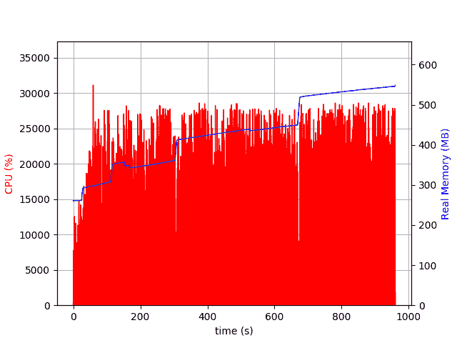

# Ruby memory、ActiveRecord 和 Draper

> 原文：<https://dev.to/appaloosastore/ruby-memory-activerecord-and-draper-1j8i>

在 Appaloosa，我们经常处理 CSV。当我们处理需要添加到组中(或从组中删除)的成千上万行 CSV 用户时，我们会看到内存的巨大增长。有时，赫洛库·达诺斯无法控制它。

我们将解释在处理 4_000 个用户时，我们是如何从这里跳出来的(看蓝线和时间):

[](https://res.cloudinary.com/practicaldev/image/fetch/s--LOrhmAOv--/c_limit%2Cf_auto%2Cfl_progressive%2Cq_auto%2Cw_880/https://cdn-images-1.medium.com/max/2000/1%2AzrMYSVUKpuAmSBDqHVHx8g.png)

对此:

[](https://res.cloudinary.com/practicaldev/image/fetch/s--fyFxC-8E--/c_limit%2Cf_auto%2Cfl_progressive%2Cq_auto%2Cw_880/https://cdn-images-1.medium.com/max/2000/1%2AKOcjkjqmc4oeAiTgjCyp6g.png)

## 内存分析器

我们使用了 [stackprof](https://github.com/tmm1/stackprof) 、 [memory_profiler](https://github.com/SamSaffron/memory_profiler) 。我们查看像 [speedscope](https://github.com/jlfwong/speedscope) 这样的工具来获取堆栈利润结果，它总是指向 ActiveRecord 的大量使用。我们还注意到，在 memory_profiler 的“分配的字符串报告”中，一个字符串被分配了多次。

拥有 4000 名用户:

```
Allocated String Report
-----------------------------------
   1619100  "decorated?"
   1619100  .rvm/gems/ruby-2.5.3@app/gems/activerecord-5.2.1/lib/active_record/attribute_methods.rb:279 
```

## “授勋？”它从哪里来？

在这里实例化:`.rvm/gems/ruby-2.5.3@app/gems/activerecord-5.2.1/lib/active_record/attribute_methods.rb:281`