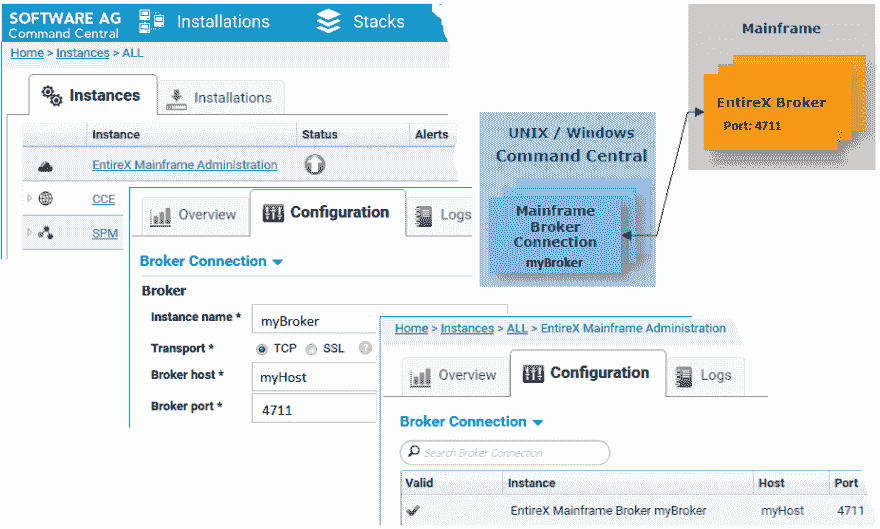
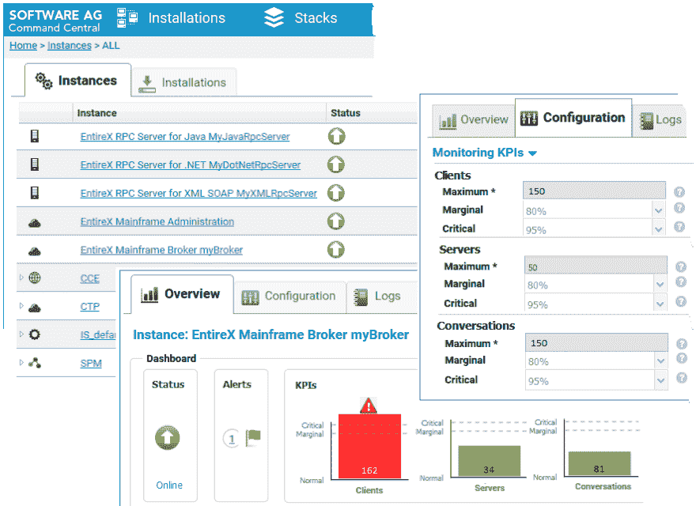
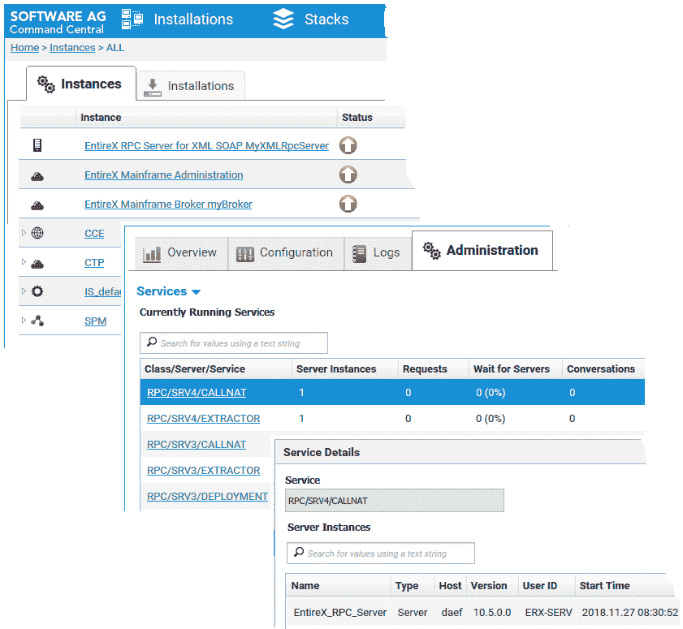
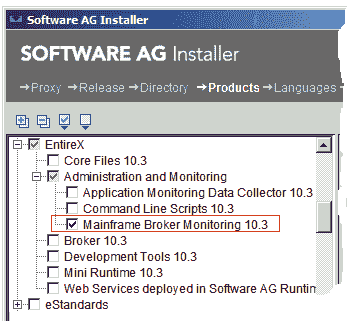
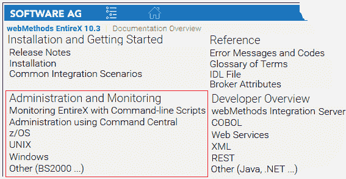

# 如何使用命令中心监控您的 EntireX 大型机代理

> 原文：<https://dev.to/techcommunity/how-to-monitor-your-entirex-mainframe-broker-using-command-central-515a>

# webMethods EntireX

想象一下，你正在 z/OS、Z/VSE 或 BS2000 等大型平台上运行 EntireX Broker。如何检查它是否在运行？有哪些服务器可用？有多少客户端、服务器和会话处于活动状态？使用软件 AG Command Central 为您监控这一切！

*由产品管理总监 Juergen Lind、Adabas & Natural、EntireX Development 的资深软件专家 Bernhard Fricke 和 Software AG 的资深首席软件工程师 Peter Hofer*

## 了解指挥中心

让我们回过头来解释一下 Software AG Command Central。您可以使用它从一个位置远程执行管理任务。指挥中心协助配置、管理和监控任务。作为操作员，您可以监控服务器的状态和运行状况。您可以启动和停止服务器，还可以配置在意外停机时发送的警报。

EntireX 如何融入指挥中心？您可以:

*   管理您的 EntireX Broker:启动、停止和配置它，监控状态、KPI 和警报。创建或删除实例(自 EntireX 9.9/2015 年 10 月起)
*   管理相关的 RPC 服务器:启动、停止、配置和监控它们；创建或删除实例(自 EntireX 10.1/2017 年 10 月起)
*   使用基于模板的配置:安装 EntireX，同时在本地甚至远程主机上添加 EntireX Broker 和多个 RPC 服务器等实例(从 EntireX 10.1/2017 年 10 月开始)

所有这些功能涵盖了通过 Software AG 的安装程序或 Command Central 安装的运行在 Linux、UNIX 和 Windows 上的 EntireX 组件。

那么，大型机组件呢？借助 EntireX 10.3(2018 年 10 月发布)，您现在还可以监控运行在 z/OS、z/VSE 或 BS2000 上的 EntireX 大型机代理。

## EntireX 主机代理监控

**为 EntireX 大型机代理监控创建一个实例**

让我们以运行在大型机上的 EntireX Broker 为例。要使用命令中心对其进行监控，需要在命令中心内为其定义一个实例。该实例保存远程代理的连接信息。

 

_ **图 1:** 为 EntireX 大型机代理监控创建一个实例 _

创建这个实例非常简单:登录到 Command Central 并导航到*Home>Instances>ALL>EntireX Mainframe Administration*。点击*配置页签*:添加名称——*my broker*用于图 1——和连接信息。仅此而已。现在，您将在实例列表中找到您的大型机代理的新代理实例。

**监控您的 EntireX 大型机代理**

在 Command Central 中，导航到 Home > Instances > ALL:在上一步中创建的实例 *mybroker* 显示为 *EntireX 大型机代理 myBroker* 。点击这个实例，选择 *Overview 选项卡*来观察它的状态(在线或停止)、警报和 KPI:活动的客户端、注册的服务器以及它们之间正在进行的对话(图 2)。

*** 

图 2:** EntireX 主机代理监控:状态和 KPI*

在*配置选项卡*的下拉框中选择*监控 KPI*，以调整 KPI、客户端、服务器和会话的比例和边界值(最大/边际/临界)。如果越过了定义的边界值，颜色会发生变化，将您的注意力引向 KPI:如果越过了边缘线，颜色为橙色；如果达到了临界边界值，颜色为红色(图 2)。

此外，如果需要，更改 EntireX 大型机代理的连接参数:在*配置选项卡的下拉框中选择*代理连接*。*

**查看注册的服务和服务器**

导航到您的实例 *EntireX 大型机代理 myBroker。*使用*管理选项卡*查看当前运行的服务(图 3)。

* 

**图 3:** 查看注册到 EntireX 主机代理的服务和服务器*

观察活动的*服务器实例*(复制)、*请求的数量，等待服务的服务器*和*会话*。特别感兴趣的是列*等待服务器。*这告诉您由于所有正在运行的服务器实例都很忙，客户端必须等待的请求的数量和百分比。如果这些值很高，请考虑启动更多的服务器实例。

## 如何得到它

您可以使用 Software AG 安装程序来安装用于 EntireX 大型机代理监控的软件包。或者，使用命令中心；参见命令中心文档中的*安装、配置和升级命令中心*部分。

**主机代理监控包**

在 Software AG 安装程序中:选择 *EntireX - >管理和监控*，并明确标记*主机代理监控*(图 4)。

* 

**图 4:** 用软件 AG 安装程序安装*

**z/VSE 和 BS2000 上的大型机代理**

除了 z/OS，您还可以使用 Command Central 监控所有运行在 z/VSE 和 BS2000 上的 EntireX 大型机代理。

## 更多监控选项

除了 Command Central GUI 之外，还有其他选项来控制如何监控您的 EntireX 大型机代理。

所有可能性都记录在 EntireX 文档中(图 5):

*   **使用命令中央命令行:**参照*管理监控*；选择*管理使用命令中心->T5】监控 EntireX 主机代理使用命令中心命令行*
*   **带命令行脚本的 EntireX:**参考*管理和监控；*选择*用命令行脚本监控 EntireX】*
*   **EntireX utility ETBINFO:** 指*管理和监控*；选择你的平台*(z/OS | bs 2000 | z/VSE)；*跟随超链接*代理加载项- >代理命令行实用程序- > ETBINFO*
*   **操作员命令:**指*管理监控*；选择您的平台*(z/OS | bs 2000 | z/VSE)*；跟随超链接*代理加载项- >操作员命令*

* 

**图 5:** EntireX 文档*

## 所以综上…

借助 EntireX 大型机代理监控，您可以轻松监控运行在 z/OS、z/VSE 或 BS2000 等大型机平台上的代理。直接识别代理是否在线，KPI 是否在您的组织预期的范围内。切换到管理页面，列出已注册的服务和服务器，并直接检查是否需要更多的服务器实例。

EntireX 大型机代理监控在 EntireX 版本 10.3 (GA: 2018Oct)中提供。要了解更多信息，请阅读 webMethods EntireX 文档中的使用 Command Central 的**管理。**

**Command Central **–远程管理软件产品的工具

**EntireX 经纪人**–中央 EntireX 通信枢纽

**ETBINFO**–用于从 EntireX 代理中查询状态信息的 EntireX 命令行实用程序

**GUI **–图形用户界面

**KPI **–关键绩效指标

**SPM **–软件 AG 平台经理；由命令中心使用

**基于模板的供应**–用于远程实例部署的命令中心功能

|

**相关文章**

*   "[如何使用命令行脚本监控您的 EntireX 环境](http://techcommunity.softwareag.com/techniques-blog/-/blogs/how-to-monitor-your-entirex-environment-with-command-line-scripts)，《技术》，2018 年 4 月(第 2 期)
*   如何使用命令行脚本来监控 EntireX？《技术》，2017 年 10 月(第四期)
*   "[如何监控您的 EntireX 环境](http://techcommunity.softwareag.com/web/guest/techniques-blog/-/blogs/how-to-monitor-your-entirex-environment)，《技术》，2017 年 7 月(第 3 期)。
*   “EntireX 文档，版本 10.3 (GA: 2018Oct)”，参见:[https://documentation . software ag . com/web methods/EntireX/ex X10-3/10-3 _ EntireX/overview . htm](https://documentation.softwareag.com/webmethods/entirex/exx10-3/10-3_EntireX/overview.htm)
*   “软件 AG 命令中心帮助，版本 10.3 (GA: 2018Oct)”，介绍如何使用命令中心从一个位置远程管理您的软件 AG 产品；参见:[https://documentation . software ag . com/web methods/Command _ Central/CCE 10-3/10-3 _ Command _ Central _ web help/index . html](https://documentation.softwareag.com/webmethods/command_central/cce10-3/10-3_Command_Central_webhelp/index.html)
*   “使用软件 AG 安装程序，版本 10.3 (GA: 2018Oct)”参见:[https://documentation . Software AG . com/a _ Installer _ and _ update _ manager/2018 oct _ Using _ SAG _ Installer . pdf](https://documentation.softwareag.com/a_installer_and_update_manager/2018Oct_Using_SAG_Installer.pdf)