# 打造属于自己的 Alfabet 第 8 部分

> 原文：<https://dev.to/techcommunity/making-alfabet-your-own-part-8-3l2d>

# 配置报告，第 2 部分

在这个“让 Alfabet 成为您自己的”系列文章中，我们将探讨如何配置 Alfabet 产品，以实现业务和 it 转型的最佳契合和最佳实践。这一集是两集的第二集，集中讨论在 Alfabet 中可以配置什么类型的报告。

| 2019 年第一期 | [ 下载 PDFT4】](http://techcommunity.softwareag.com/ecosystem/download/techniques/2019-issue1/SAG_Making_Alfabet_Your_Own_TECHniques_Jan19_WEB.pdf) |
| --- | --- |

## Alfabet 是变革的推动者

Alfabet 有助于在整个生命周期中规划和监控业务 IT 支持的绩效，确保业务战略和需求得到理解、优先排序和执行。它还确保在决策过程中了解并考虑 It 支持的成本、质量和风险。

Alfabet 是负责业务和 IT 转型的规划师、战略家、架构师、投资组合经理和 CIO 办公室团队的推动者。它使他们能够将业务愿景发展成成功的项目和可靠的运营。

当然，这样做的先决条件是手头要有一个全面的信息库，并有直观的辅助工具来使这些信息能够很快被理解。信息的可视化方式可能有助于理解变化对景观的影响，也可能是一种阻碍。Alfabet 能够捕捉每个规划元素之间的许多关系，这使得它的存储库成为信息的发电站。通过了解复杂的网络结构和多级层次结构，用户可以更好地管理当今业务 IT 现实的复杂性。

## 可配置的可视化效果

Alfabet 提供了多种可视化信息的方法。除了提供 1，000 多种现成的报告外，Alfabet 还提供模板和配置助手来设计显示数据集、矩阵、生命周期图、条形图、饼图、地理图等的报告。这些可以用提供手头问题答案所需的任何信息组合来填充。

颜色、可变大小、不同的线型和图标可在报告中用作某一指标或标准的指示器，并引起对重要信息的注意。所有报告都支持深入查看显示中描述的特定对象。交互式过滤标准还允许用户更改视图，以满足他/她的精确信息需求。

本文第 1 部分重点介绍的报告有:

*   表格报告
*   生命周期图表或甘特图
*   投资组合图
*   树形图报告
*   图层图表
*   网格报告

## 这里有更多可以用 Alfabet 配置的报告:

**聚类图**在多层嵌套的盒子中显示相关对象。最外面的盒子可以垂直或水平排列。盒子代表对象，它们的嵌套通过关系或业务规则来描述。框可以基于灵活配置的规则来着色，并且也可以与基于可配置规则的指示符相关联。

图 1 显示了两个级别的业务功能，以及哪些应用程序属于较低级别的功能。与树形图一样，聚类图在使用有限的空间显示许多关系方面非常高效。不同单元格中对象之间的连接可用于显示对象之间的关系。连接的基础是可自由定义的。例如，用户可以基于特定指示符来定义一个子域中的应用如何连接到其他子域中的应用。用户可以根据可用数据定义箭头的颜色、线型以及开始和结束类型。可以对显示进行过滤，仅显示所选单元的连接。

[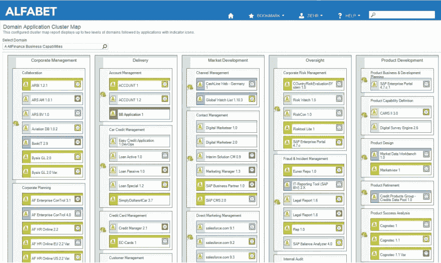](https://res.cloudinary.com/practicaldev/image/fetch/s--wJXWLqa2--/c_limit%2Cf_auto%2Cfl_progressive%2Cq_auto%2Cw_880/http://techcommunity.softwareag.com/documents/10157/10221817/Alfabet_1.jpg/73d8c43a-0f30-4665-899a-b9a4da7e5f8e%3Ft%3D1548162439006) 

***图 1** :聚类图以嵌套聚类的方式显示相关对象。他们对空间的利用效率很高。连接显示了其他域中的应用程序，这些应用程序通过一些选定的方面与源应用程序相关。*

**矩阵报告**显示矩阵中的对象依赖关系，其中报告的列和行代表 Alfabet 数据库中的对象。单元格显示与相应单元格的行标题中的对象和列标题中的对象相关的对象。在这个上下文中，关系可以直接从元模型中获取，也可以通过业务规则来定义。框的颜色和图标用于指示器以及框的可变大小和框之间的连接。图标可以用来表示质量、使用或战略重要性等指标。例如，规模可以代表成本或战略实现。例如，连接可用于显示迁移，在不同的迁移阶段使用不同的线条样式或颜色。矩阵图可以有多级行和列标题。这使得能够更详细地理解关系。它清楚地显示了从属对象以及它们是如何被支持的。

[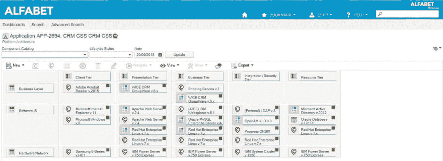](https://res.cloudinary.com/practicaldev/image/fetch/s--De5zylEG--/c_limit%2Cf_auto%2Cfl_progressive%2Cq_auto%2Cw_880/http://techcommunity.softwareag.com/documents/10157/10221817/Alfabet_3.jpg/1f91d09c-bc99-4fc4-bd73-9405079cd2a1%3Ft%3D1548162444847) 

***图 2** :矩阵报告通过从属对象显示对象之间的关系，如应用程序“CRM CSS”的平台架构中所示*

[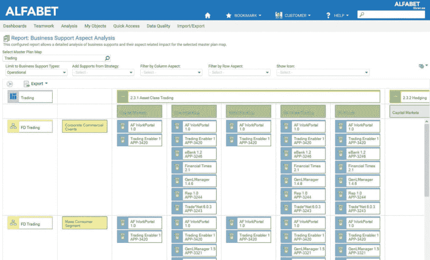](https://res.cloudinary.com/practicaldev/image/fetch/s--Hjqgy1_D--/c_limit%2Cf_auto%2Cfl_progressive%2Cq_auto%2Cw_880/http://techcommunity.softwareag.com/documents/10157/10221817/Alfabet_2.jpg/60e3fcc9-67a0-41e5-939e-754fb2748d63%3Ft%3D1548162441872) 

***图 3** :这个业务支持的多级矩阵图，展示了一个“交易”的总平面图，以及“资产类交易”和“对冲”等下属流程，这些流程也是按照横轴上的“资本市场”、“直销银行”等来划分的。纵轴是属于“交易”的组织此处，根据“公司商业客户”、“大众消费者细分市场”等对下属组织“金融衍生产品交易”进行描述。因此，这些单元显示了与每个从属对象相关的业务支持，从而在更详细的层次上，仍然在上级对象的上下文中。*

**Lane reports** 提供了与特定方面相关的对象集合之间关系的概述。因此，用户可以更好地理解对象组的行为和关系，而不仅仅是单个对象。例如，图 4 显示了如果我们计划对交易领域中的应用程序进行任何更改，将会如何影响与这些应用程序相关联的项目，进而影响项目中正在执行的战略主题。

[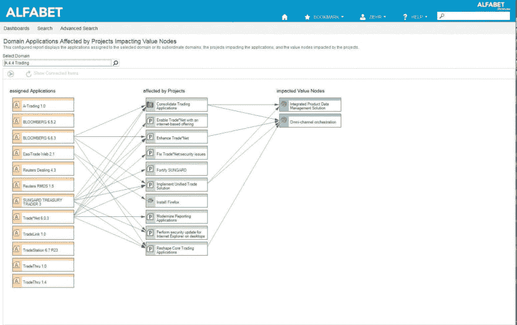](https://res.cloudinary.com/practicaldev/image/fetch/s--nRBAJLHe--/c_limit%2Cf_auto%2Cfl_progressive%2Cq_auto%2Cw_880/http://techcommunity.softwareag.com/documents/10157/10221817/Alfabet_4.jpg/eee0af23-3586-474a-b57a-3aa0b7df01ac%3Ft%3D1548162447783) 

***图 4** :车道报表显示各组对象之间的关系*

**分支图**允许将可扩展表的内容显示为图形树，第一级对象在报表左侧上下排列，下一级对象显示在第一级对象的右侧，并有一条线将它们连接起来。报表可以使用对象的图标来显示对象，也可以将对象显示为具有定义颜色的气泡。报告还可以在连接线上显示标题。这种图表容易阅读，而且节省空间。它可以垂直或水平呈现。

[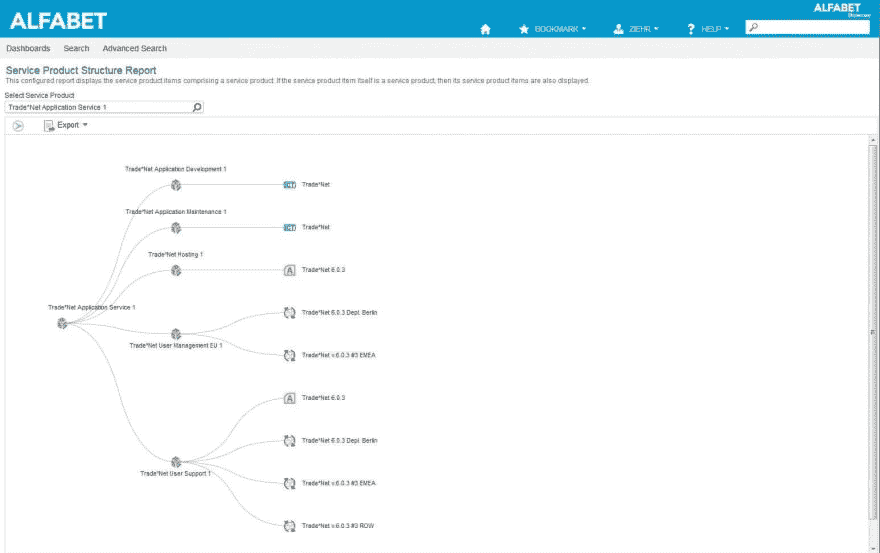](https://res.cloudinary.com/practicaldev/image/fetch/s--At_QMoxV--/c_limit%2Cf_auto%2Cfl_progressive%2Cq_auto%2Cw_880/http://techcommunity.softwareag.com/documents/10157/10221817/Alfabet_5.jpg/2f9c2e30-4fbf-469d-af31-7a17a1876549%3Ft%3D1548162451518) 

***图 5** :该分支图显示了服务产品“贸易*网应用服务 1”的结构在右侧，我们可以看到由主要服务产品组成的服务产品，在右侧，可以看到由从属服务产品组成的服务项目(例如，ICT 对象、应用程序和部署)。*

**地理地图报告**是基于地理的分析，以支持当今业务的全球和地理上相互依赖的性质。与组织单位、市场产品或分销渠道相关联的区域是企业规划决策的重要背景。基于位置的数据为 KPI 分析增加了另一个维度。了解一个地区的某些方面的表现可能有环境原因，可以提供额外的洞察力，这对评估非常重要。成本、收入、客户满意度、渠道有效性——当把这些与位置联系起来时，表现差异的原因就变得更清楚了。当与公司的业务部门就企业转型进行协作时，地理仪表板会特别有效。Alfabet 提供产品中捕获的任何信息的地理映射。有近一千张地图可供使用——覆盖全球或你所在的角落。用于定义所需 KPI 和深入链接的简单查询以及用于定义色阶的报告助手使创建地理图报告变得容易。用户可以深入某个区域，例如，了解更多关于应用程序成本高或客户支持困难的组织的信息—任何深入链接都是可能的。报告中的“标记”可用于关注特定位置的绩效或建立位置之间的联系，例如，用于指示位置之间的流量或依赖性，例如用于容量管理或风险管理。

[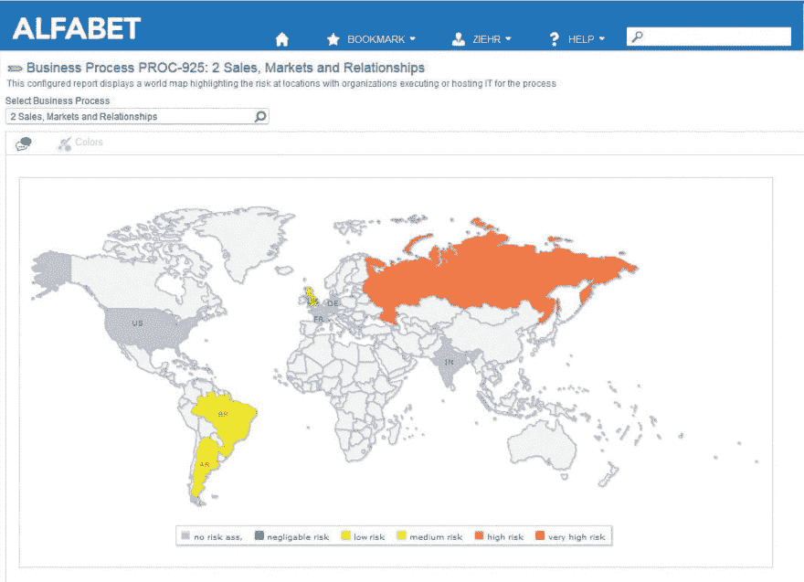](https://res.cloudinary.com/practicaldev/image/fetch/s--OGwxrvIr--/c_limit%2Cf_auto%2Cfl_progressive%2Cq_auto%2Cw_880/http://techcommunity.softwareag.com/documents/10157/10221817/Alfabet_6.jpg/84f6acfb-0f1d-4e12-93c7-df13b15f1ff4%3Ft%3D1548162454189) 

***图 6** :该地理图报告显示了执行或托管流程“销售、市场和关系”的地点的风险*

**循环路线图**旨在为大型组织提供支持，这些组织通常拥有大量属于特定观察范围的对象，例如，项目、应用或技术，根据其与时间、战略重要性、技术领域、创新领域、生命周期阶段和规划等因素的关联而相互关联。圆形路线图提供了更高效、更易于查看的信息表示。圆形路线图由被划分为多个扇区的同心圆组成。根据项目与其他对象的关系或它们在已定义指标中的值，将项目放入特定的圆圈和扇形中。圆圈通常代表一个时间线，但也可以定义为表示一些其他范围，如战略视野或优先级。部门在主题的上下文中相互关联，如技术领域、组织、分数、能力等。，并且大小可以彼此不同，以展示关系，例如，战略重要性或优先级。对象以特定的形状放置在路线图上——圆形、三角形、正方形等。—也拥有意义。

例如，在应用程序退役的情况下，它可以指示应用程序是传统的、客户端服务器的、移动的还是云的。或者在项目的情况下，项目的目标是差异化、创新还是记录系统。特定圆和扇区中的精确位置是通常由物体上的指示器确定的轴向值和角度值的函数。用户可以通过使用连接线来指示趋势、计划或相关性，从而快速识别变化。

[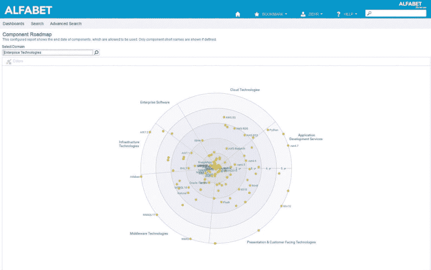](https://res.cloudinary.com/practicaldev/image/fetch/s--LKZDigfF--/c_limit%2Cf_auto%2Cfl_progressive%2Cq_auto%2Cw_880/http://techcommunity.softwareag.com/documents/10157/10221817/Alfabet_7.jpg/8a91c6bd-4c65-4cb4-b73b-ce08efad3bb1%3Ft%3D1548162457299) 

***图 7** :这个圆形路线图根据技术的终止日期显示了它们在时间轴上的位置。颜色表示它们是免费使用(绿色)还是需要批准(橙色)。该图根据技术类别进行了划分。*

**有向图**(或“节点弧报告”)有助于更好地理解架构中的依赖关系，有更丰富的表示选项。它们允许用户在一个表示中自动生成信息流、数据沿袭、迁移和不同级别上的其他关系。它们对于表示具有一大组对象的对象关系是有用的，并且其中的关系是任意构造的，而不一定在层次结构中。可以使用各种布局机制来选择最适合当前数据集的布局机制。查询用于确定节点和弧。节点允许定义图表项模板、着色和属性值的动态分配。也支持指标规则。弧线允许定义连接线的样式、重量、颜色和装饰。

[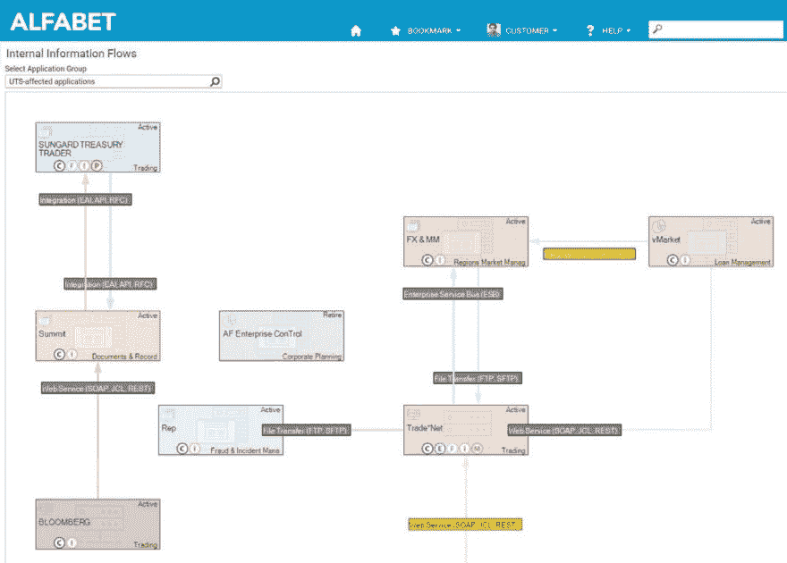](https://res.cloudinary.com/practicaldev/image/fetch/s--WTcgAUN4--/c_limit%2Cf_auto%2Cfl_progressive%2Cq_auto%2Cw_880/http://techcommunity.softwareag.com/documents/10157/10221817/Alfabet_8.jpg/e72dd6aa-2523-42cc-8edc-b3c4160acb0e%3Ft%3D1548162461196) 

***图 8** :节点弧报表允许信息的多层表示。节点弧报告的典型用法是可视化信息流，如下所示。节点弧报告也在 Alfabet 中使用，用于基于用户的现有对象/关系值的 Alfabet 元模型的可视化。*

**窗口小部件报告**使用“窗口小部件”作为一个简单的、可重复使用的用户界面元素，它结合了文本和图像，以快速传达信息，例如总结或指示与对象相关的特别相关信息的计数或图像。AQL (Alfabet 查询语言)或 SQL 查询用于定义窗口小部件上下文，即确定文本和图像内容以及文本颜色和大小。小部件的图形设计可以重复用于不同的内容。小部件报告建立在小部件上，可以嵌入到驾驶舱或向导视图中。

[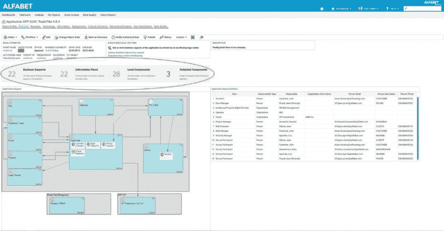](https://res.cloudinary.com/practicaldev/image/fetch/s--od0ygUTC--/c_limit%2Cf_auto%2Cfl_progressive%2Cq_auto%2Cw_880/http://techcommunity.softwareag.com/documents/10157/10221817/Alfabet_9.jpg/82551d25-29bc-4e72-91ca-2cba93d03a36%3Ft%3D1548162464458) 

***图 9** :此驾驶舱中显示的小部件报告提供了 Trade*Net 6.0.3 应用程序的业务支持、信息流、本地组件和过时组件的数量统计。*

[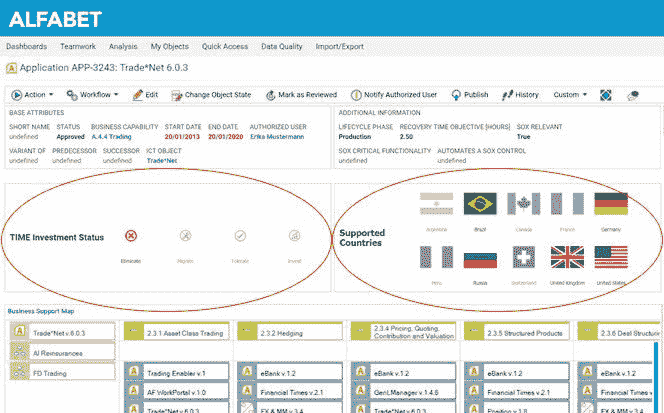](https://res.cloudinary.com/practicaldev/image/fetch/s--4-idcVcA--/c_limit%2Cf_auto%2Cfl_progressive%2Cq_auto%2Cw_880/http://techcommunity.softwareag.com/documents/10157/10221817/Alfabet_10.jpg/1fbde09d-5a26-4842-814a-2e1e08b7e6b6%3Ft%3D1548162467321) 

***图 10** :这个驾驶舱中显示的小部件报告显示了 Trade*Net 6.0.3 应用程序的时间投资状态对象状态和支持的国家。*

**图表报告**用于表达事物的度量(而之前呈现的报告描述了对象彼此之间的关系)。图表报告是商业中常用的图表类型:条形图、折线图、饼图、雷达图、仪表图和瀑布图。这里，再次向用户提供模板，以输入要比较的对象，并根据什么标准以及定义颜色、标签等。组合图和多级饼图等图表上的差异提供了更多的背景信息。

[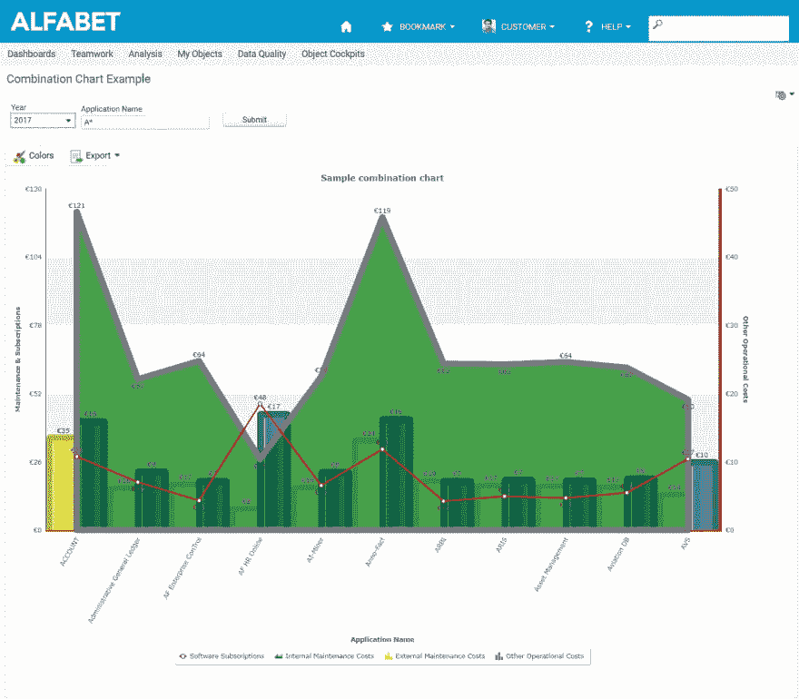](https://res.cloudinary.com/practicaldev/image/fetch/s--SOPfLNPu--/c_limit%2Cf_auto%2Cfl_progressive%2Cq_auto%2Cw_880/http://techcommunity.softwareag.com/documents/10157/10221817/Alfabet_11.jpg/68186726-5b81-402b-8e4b-c61424045f98%3Ft%3D1548162470319) 

***图 11** :组合图通过将几个图形组合成一个视图来为评估添加上下文。用户可以使用不同的图形样式和轴系统来增加探索的深度。*

[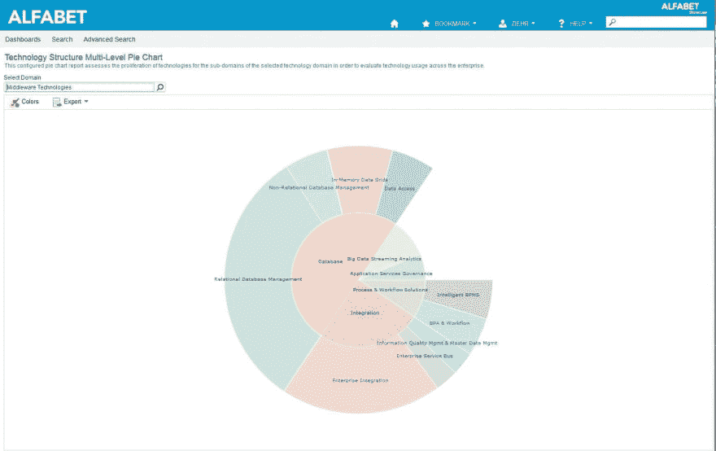](https://res.cloudinary.com/practicaldev/image/fetch/s--KpNOhMvd--/c_limit%2Cf_auto%2Cfl_progressive%2Cq_auto%2Cw_880/http://techcommunity.softwareag.com/documents/10157/10221817/Alfabet_12.jpg/629f7439-a29d-4ad4-97ad-7933a12b57bc%3Ft%3D1548162474135) 

***图 12** :多级饼状图用于将分层数据以同心圆的形式可视化。它为观察者提供了同一层级上的对象之间的良好的比例感。沿着同心圆的切片的大小由诸如成本、计数、风险、关键程度等定性指标来确定。*

## 发布报告

由于企业规划流程涉及许多 it 领域之外的利益相关方，因此以非 IT 环境中的工作人员熟悉的格式拥有有吸引力的文档非常重要。Alfabet 能够创建将任何类型的信息、报告和图表汇集在一起的文档。这些文档可以是 Microsoft Word 文档或 Microsoft PowerPoint 演示文稿。

对于 Microsoft Word 文档，用户定义 Microsoft Word 文档模板，确定文本布局，创建静态和动态字段，并根据公司标准或其他发布准则格式化文档。动态字段由 Alfabet 中的内容填充，如应用程序、域和业务流程的名称，以及在 Alfabet 中创建的任何标准或自定义报告。模板可以保存不同对象上的独立文档的嵌套结构。创建完成后，模板被上传到 Alfabet 中，用于生成出版物。

对于 Microsoft PowerPoint 文档，Alfabet 使用 PowerPoint 的幻灯片母版概念来创建演示文稿的设计。单个幻灯片具有单独的布局，其名称与 Alfabet 中出版物配置引擎中的名称相关。

发布引擎使用规则来填充布局。布局中的所有元素——文本框、形状等——都有与 Alfabet 中的对象相关的单独名称，并且可以进行交互。元素可以是静态文本，如“结束日期:”或“负责组:”或者可以是用来自 Alfabet 的输入填充的变量，即实际结束日期和负责组。

使用查询在 Alfabet 中找到对象，然后根据定义的元素将其映射到 PowerPoint 幻灯片。

可视化由 Alfabet 提供。上下文由应用程序名称或负责用户等条目提供。数据集、业务支持矩阵和业务图形都可以放入出版物中。

## Alfabet 的出版设施提供:

*   一种灵活的方式来合并信息，以便结果在内容、格式、可用性和吸引力方面与目的相关
*   创建出版物以使用户能够自给自足的标准化过程
*   与公司文档标准兼容，便于与非 Alfabet 用户协作

通过应用程序发布工具(APF)创建的发布对于以下方面非常有用:

*   管理层的决策支持文件
*   报告存档
*   审计员或其他外部利益相关者的报告

## 真实价值

Alfabet 存储库中丰富的信息使其成为规划和管理的发电站。然而，正是 Alfabet 提供的向各种利益相关者可视化传达信息的工具证明了它的真正价值——肯定超过一千个单词。

访问 www.alfabet.softwareag.com 了解更多信息。