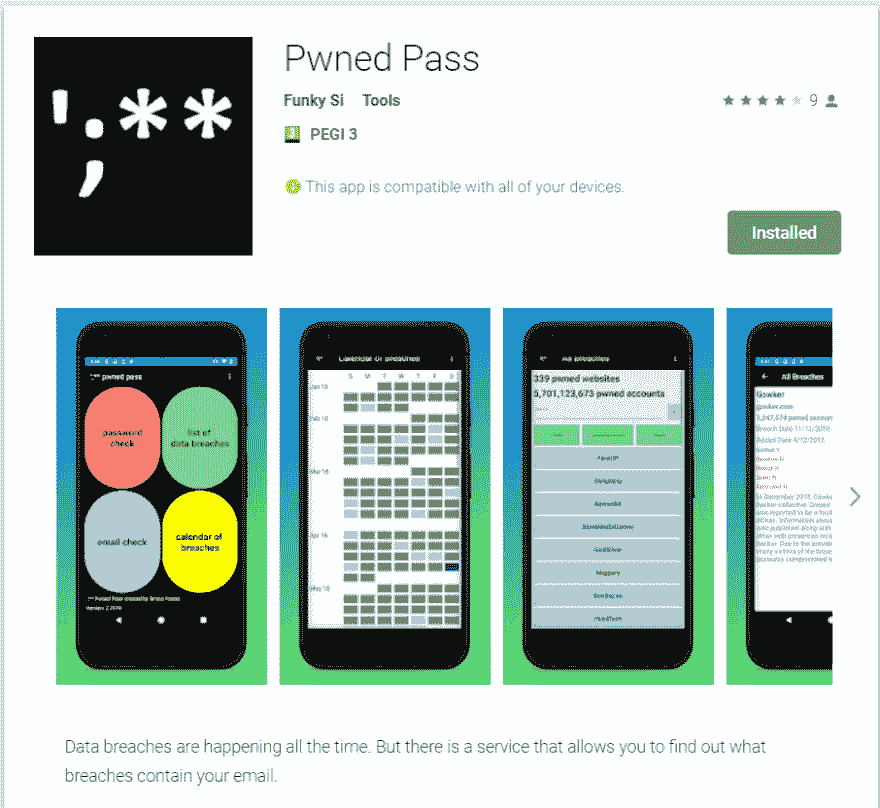
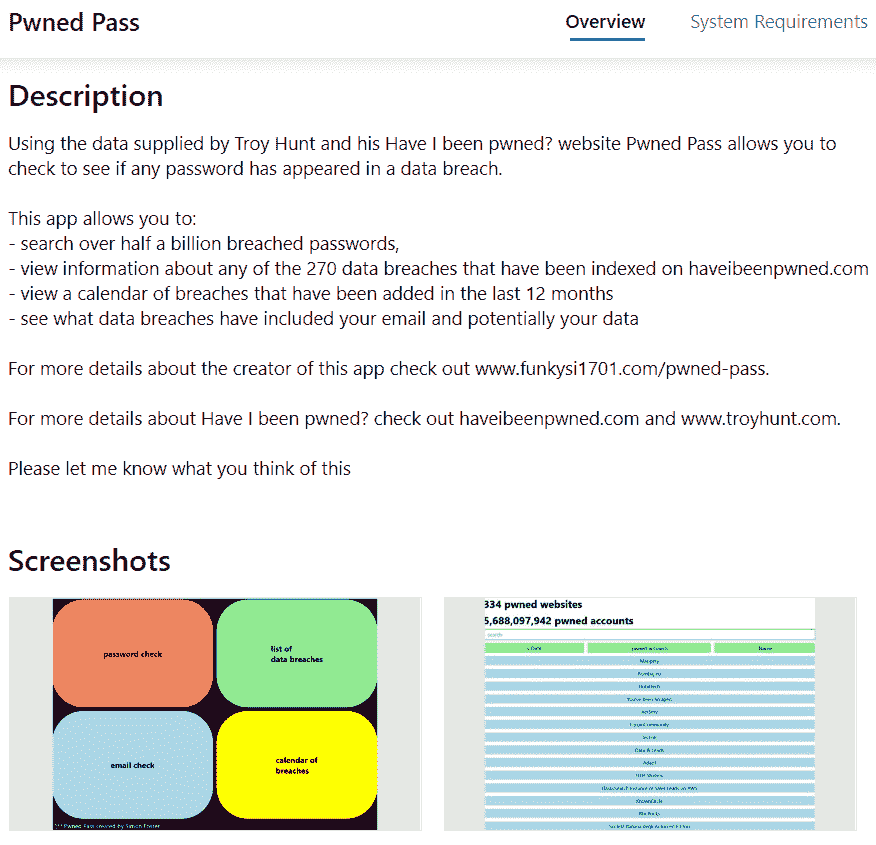

# Pwned Pass 更新

> 原文：<https://dev.to/funkysi1701/pwned-pass-update-55io>

自从我第一次发布 Pwned Pass 以来已经有一段时间了，所以让我们看看我们现在在哪里。

Google Play 的下载量非常接近 500 次，我们最近突破了 100 次活跃安装，峰值达到 116 次，即使现在我们仍然超过 100 次。我收到了 9 条评论(6 x 5*，2 x 1 *和 4 *)，平均分为 4 *
 
。圣诞节期间，我发布了一个 UWP 版本，可以在[微软商店](https://www.microsoft.com/store/apps/9NM2WHNZTNLT)找到。目前已经有 9 次下载，甚至有一次下载到了 windows mobile(有人仍然喜欢这个平台！)
 
我使用 Azure DevOps 的部署过程还算顺利。每次签入代码后，都会运行一个编译 UWP 和安卓版本的构建。该版本还会增加部署到任一应用商店所需的版本号。

主分支的每一次成功构建都将开启 Google Play 测试版的发布。如果我满意，我就发布 10%的生产轨道，然后可以增加到 100%(或停止)。在 Google Play 测试版发布后，微软商店将会发布。这一顺序的唯一原因是，没有 UWP 应用的测试区，所以我想在推出 windows 之前快速测试 android 上的变化。

所有这些步骤在继续之前都需要我的确认，而且通常不会超过 beta 版。

更进一步的发展是，我已经向 github 开源了源代码，如果你好奇或者想要贡献的话，可以看看。随着微软的收购，将 github 仓库连接到 Azure DevOps 有了简单的方法。一旦我在 github 中创建了一个 Pull 请求，它就会在 Azure DevOps 中创建一个构建，所有的构建和发布步骤都可以发生。

我仍然不能 100%确定我是否想在 github 或 Azure DevOps 中保持我的 bug 和问题跟踪，因为两者都有这样做的功能。

我想做的一个未来的改进是自动创建截图。当我创建一个新特征并将其检入时。我想自动创建关键页面的截图，并提交给不同的应用程序商店。目前我不确定这是否可能或者如何去做。我有一些想法可以尝试，所以我们会看看我能做些什么。