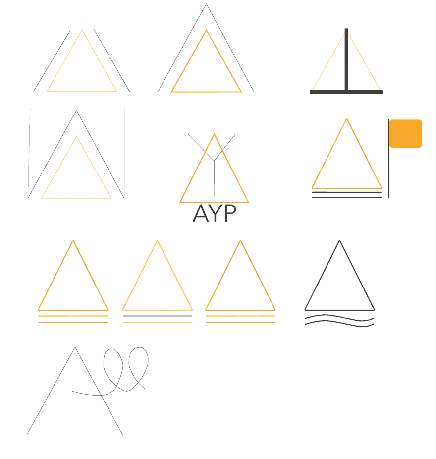
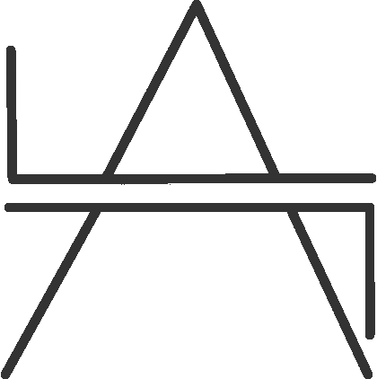

# 第 22 天:为讨厌云的人提供 Swift macOS 密码管理器

> 原文：<https://dev.to/swlkr/day-22-swift-macos-password-manager-for-people-who-hate-the-cloud-2ih3>

[<——第 21 天去这里](https://dev.to/swlkr/day-21-swift-macos-password-manager-for-people-who-hate-the-cloud-48fk)

📅2019 年 1 月 22 日
🚀[离](https://www.producthunt.com/upcoming/all-your-passwords)发射还有 8 天
🔥21 日连胜
💰5.00 美元的价格(不要超过 0.99 美元，我讨厌这种策略)
🤑0 美元收入
📈0 客户
⌚️花了 36 个小时
💻102 个文件被更改，249709 个插入(+)，549 个删除(-)
🏁今天的目标: **Logo**

**晚上 9:24**
所以今天我要试着设计一个标志。

幸运的是，我今天读了这篇文章，所以现在我是一个成熟的设计师，可以做出一个经得起时间考验的伟大标志！

让我们像所有伟大的标志设计师一样在 [logojoy](https://logojoy.com) 开始吧😂

晚上 9:31
我对锁、钥匙孔、星号和安全表单域输入标志毫无兴趣。我想我会即兴发挥，尝试一些疯狂的东西，希望看起来不会太糟糕

**晚上 10:22**
这就是我不是设计师的原因

**晚上 10:43**
时间不早了，有点乏味，但我真的不介意这个，它是一个 A 和两个 L 或者至少它应该是。我还有 7 天时间😱所以你知道，没有压力的标志。

我只想重申，不是设计师。也许我应该坚持锁或钥匙或什么的…

*叹息*明天见🌊