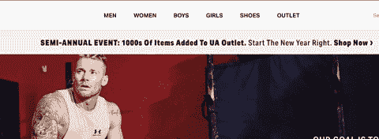
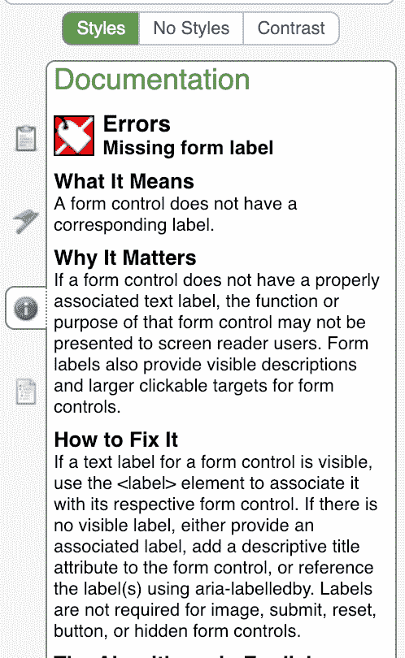

# 我总是手动测试的 4 件事

> 原文：<https://dev.to/lkopacz/4-things-that-i-always-manually-test-2je8>

[https://api.parler.io/ss/player?url=https://www.parler.io/audio/502080242/fe487c06f516e2c9a627b987a5ed0a7b4aa7b405.49f907de-8e08-421a-be73-a522dc5894c6.mp3](https://api.parler.io/ss/player?url=https://www.parler.io/audio/502080242/fe487c06f516e2c9a627b987a5ed0a7b4aa7b405.49f907de-8e08-421a-be73-a522dc5894c6.mp3)

当我还是一名 Drupal 开发人员时，我对自动化可访问性测试非常感兴趣。我非常喜欢从事自动化工作，尤其是当它被整合到我们的持续集成中的时候。这将导致引入可访问性错误的构建失败，这是确保我们从一开始就考虑可访问性而不是增加新问题的好方法。然而，我觉得我们喜欢自动解决我们的问题，它不能为你解决所有问题。自动化可访问性测试捕捉那些吹毛求疵的 HTML 错误，以便您可以手动关注更重要和主观的项目。

可及性是移情驱动的，你不能自动移情。自动化当然使很多事情变得更容易，比如捕捉没有关联标签的文本输入，但是我做了一些事情来确保我的站点尽可能地可访问。

## 用键盘浏览网站

这通常是我测试的第一件事。您可以使用`tab`键开始浏览网站。这是我实际上不会特意去测试的东西，因为这些天我总是使用键盘来导航，所以我已经在默认情况下测试并发现问题。以下是我在用键盘测试时想到的一些事情:

*   我能轻松导航吗？
*   这是一份大菜单吗？如果是这样，有没有办法快速跳到下一个顶级链接并浏览它们？例如，当我在一个电子商务服装网站上浏览菜单时。如果我在“男士”顶级菜单链接上查找女装，我不想浏览所有男士菜单链接“夹克”、“下装”、“配饰”和“手表”。我想转而跳转到女子顶级菜单链接。
*   对于像情态动词一样突然出现的东西，有没有一种直观的方法可以快速退出？比如有没有“不谢谢”的链接或者用“Esc”键退出的方法？
*   我如何与手风琴互动？
*   我可以与选择列表交互吗？这对于测试很重要，因为很多人在设计时没有使用默认的 HTML。
*   有没有哪一刻我按下 tab 键时不确定自己在哪里？我关注的是屏幕上看不到的项目吗？

在下面的 gif 中，你可以看到当我们关注顶部菜单链接时，它甚至没有展开子菜单。当我们将鼠标悬停在顶部的菜单链接上时，它会展开菜单。在这个例子中，自动化的可访问性测试可能没有发现这个缺陷，但是如果有人在菜单中切换，他们可能会发现它。

我可以继续，但这些是我通常考虑的因素。如果你有能力的话，我会建议你和 UX 专家配对，但如果没有的话，请用你最好的判断力。

## 打开屏幕阅读器

你知道 MacOS 上有一个内置的屏幕阅读器吗？你知道 NVDA 是 Windows 的免费屏幕阅读器吗？我们至少应该打开我们的屏幕阅读器，确保它不会错过关键信息。

我要做的第一件事是让你自己熟悉基本的屏幕阅读器命令。这将极大地帮助你，因为你需要的不仅仅是`tab`键来浏览页面。

问自己这些问题:

*   如何浏览我的交互功能是否显而易见？如果没有，屏幕阅读器有解释吗？
*   屏幕阅读器会浏览页面的逻辑顺序吗？我会如何想象我的视力正常的用户会浏览它？

肯特·C·多兹(Kent C . Dodds)写了他迄今为止最受欢迎的推文，它完全是关于对那些使用屏幕阅读器的人的同情。

> 我想向你介绍我最热门的推文:[https://t.co/lDrKUqmC6Z](https://t.co/lDrKUqmC6Z)
> 
> 我很自豪它宣传了一些重要的东西，而不是一个愚蠢的迷因。
> 
> — Kent C. Dodds ([@kentcdodds](https://dev.to/kentcdodds) ) [January 10, 2019](https://twitter.com/kentcdodds/status/1083392902716219392?ref_src=twsrc%5Etfw)

我们认为我们是新鲜和现代的，但有时像多个表情符号、花哨的字体和其他随机的奇怪东西会对屏幕阅读器产生负面影响。在部署之前发现这一点总是有好处的。

一旦你熟悉了基本的屏幕阅读器命令，带着眼罩浏览你的站点。这将清楚地表明它们是否可访问。

## 确保你的替代文本有意义

从技术上讲，如果您有替代文本或空的替代文本，您就不会在可访问性报告上标记。但是你的 alt 文字有意义吗？

如果你想在这方面有更多的信息，我强烈推荐阅读我以前的关于替代文本的帖子- [写重要的替代文本](https://www.a11ywithlindsey.com/blog/writing-alternative-text-matters)。我会更详细地介绍这一点，但我会继续检查您的手动测试清单上的图片的 alt 文本。

## 穿过波浪工具

这在技术上有点自动化，但我总是喜欢用 [Wave 工具](https://chrome.google.com/webstore/detail/wave-evaluation-tool/jbbplnpkjmmeebjpijfedlgcdilocofh?hl=en-US)仔细检查我的网站。这只是一种习惯，我仍然这样做，以确保在我的自动化测试中出现的任何事情都不会令人惊讶。我真的很喜欢这个工具；我知道还有很多其他的，但是我总是会回到这个问题上来。我最喜欢的一点是，它记录了错误的含义、它的重要性以及如何修复错误。

## 结论

虽然自动化的易访问性测试是一个伟大的工具，它使我们的生活更加易于管理，但是我总是提倡手工测试那些可能更加细微的项目。此外，手动测试是让您的 UX 专家参与进来的好地方。这将有助于您和您的团队找出最佳行为，使您的应用程序对所有用户(而不仅仅是残疾用户)的影响最小。

你手动测试什么？如果你对这篇博文有任何疑问，请在 Twitter 上告诉我。