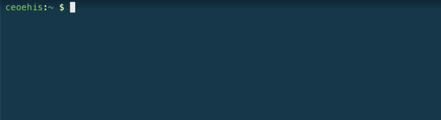
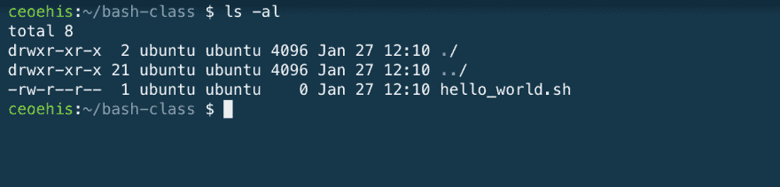
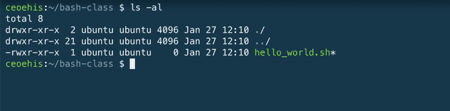
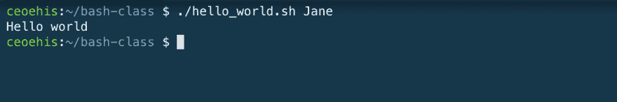
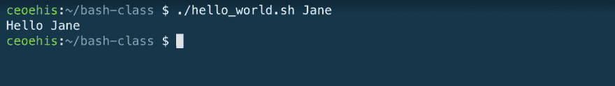
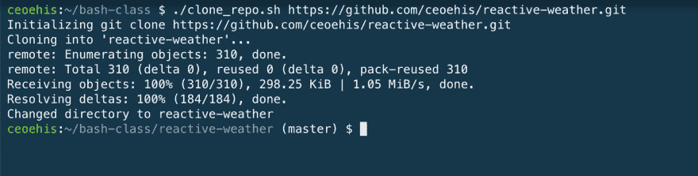

# Web 开发人员 Bash 脚本入门

> 原文：<https://dev.to/ceoehis/getting-started-with-bash-scripting-for-web-developers-268m>

Web 开发人员一直在寻找提高效率的方法，其中一个关键的方法是至少在一定程度上自动化构成我们日常活动的最平凡和重复的任务。Bash Scripting 是一种可以帮助解决这一问题并且不需要额外开销就可以开始使用和利用的工具。

本文旨在让您开始使用 Bash。我的目的是强调它作为开发人员的工作流程的一个补充的潜力。

从前面的陈述中可以明显看出，我假设您对软件开发有点熟悉，您知道什么是 Git 和 Github，至少知道什么是终端。

已经说过，为了跟随本教程，您需要包括:

*   终端(Linux 或 Mac)
*   文本编辑器

如果你有这些，我们可以开始了。

## 简介

### 什么是 Bash 和 Bash 脚本

Bash 代表 Bourne Again Shell，它是一个命令处理器或解释器，用户可以在其中键入可执行的命令。另一方面，简单地说，Bash 脚本是 Bash 命令的集合。

[](https://res.cloudinary.com/practicaldev/image/fetch/s--kMUo8brC--/c_limit%2Cf_auto%2Cfl_progressive%2Cq_auto%2Cw_880/https://thepracticaldev.s3.amazonaws.com/i/ucqm6qmeidhtb3ljrqap.png)

### 一个简单的 hello world 脚本

让我们从一个简单的 hello world 脚本开始。
在 Bash 中，将内容打印到终端(控制台)的构造是`echo`关键字。它相当于 JavaScript 中的`console.log`,只是打印出提供给它的参数。

为了制作我们的第一个脚本，我们需要创建一个名为`hello_world.sh`的简单文件。

```
$ touch hello_world.sh 
```

从我们的 hello world 脚本开始，我们将在脚本中创建一个 Bash 命令，我们可以运行并执行它。在文本编辑器中打开`hello_world.sh`文件，输入以下内容

```
 #!/bin/bash

  echo "Hello world" 
```

### 制作可执行文件

为了运行这个脚本，我们需要让它成为一个可执行文件。如果您使用`ls -al`列出当前目录中的文件，我们创建的`hello_world.sh`文件将列出如下属性，如下所示

[](https://res.cloudinary.com/practicaldev/image/fetch/s--jrIrHEb5--/c_limit%2Cf_auto%2Cfl_progressive%2Cq_auto%2Cw_880/https://thepracticaldev.s3.amazonaws.com/i/jac4js3e9gjgcuw765ld.png)

`-rw-r--r--`部分显示当前用户对该文件只有`r` ead 和`w` rite 权限。

为了执行此脚本，请运行以下命令为当前用户添加执行权限。

```
$ chmod 755 hello_world.sh 
```

再次运行`ls -al`来查看当前的权限，您应该会看到类似这样的内容。`x`表示当前用户拥有该文件的执行权限。

[](https://res.cloudinary.com/practicaldev/image/fetch/s--dXPPRyx8--/c_limit%2Cf_auto%2Cfl_progressive%2Cq_auto%2Cw_880/https://thepracticaldev.s3.amazonaws.com/i/0a7bileat5amyhunenvu.png)

### 运行脚本

为了执行我们的 Hello world 脚本，只需在当前目录中运行`./hello_world.sh`。这个 Bash 脚本只是在执行时向终端输出字符串“Hello world”。

激动人心吧？🚀🔥

如果我们能让这个函数接受一个参数，然后打印出这个参数，会怎么样。如果没有提供参数，它可以打印出默认的“Hello world”问候语。

我们将更新脚本来处理参数的接收和使用。

### Bash 脚本基础知识

#### 命令行参数

我们可以通过在调用脚本之前提供参数来将参数传递给脚本。假设我们想执行我们的脚本并传递一个参数(比如一个名字)给它，我们可以这样做

[](https://res.cloudinary.com/practicaldev/image/fetch/s---NodtXIk--/c_limit%2Cf_auto%2Cfl_progressive%2Cq_auto%2Cw_880/https://thepracticaldev.s3.amazonaws.com/i/jjxjw8atrmjip6xfpty1.png)

以这种方式执行我们的脚本会将字符串“Jane”传递给我们的脚本。然而，我们目前无法在当前脚本中使用这个参数。

命令行参数通常作为一个参数列表提供给正在运行的脚本，第一个参数用`$1`表示，第二个用`$2`表示，依此类推。

所以在上面的例子中，我们可以更新我们的脚本来接受一个名字，并打印出一个“Hello”问候和名字。编辑您的`hello_world.sh`文件，并用以下内容替换它:

```
 #!/bin/bash

  echo "Hello" $1 
```

执行`./hello_world.sh Jane`应该会打印出预期的结果

[](https://res.cloudinary.com/practicaldev/image/fetch/s--n84xxsT3--/c_limit%2Cf_auto%2Cfl_progressive%2Cq_auto%2Cw_880/https://thepracticaldev.s3.amazonaws.com/i/gjs7zh8s7xhx4fmw1wt5.png)

#### 如果...else 条件句

现在我们有了一个脚本，用提供的名称打印问候语。如果您不带任何参数运行该脚本，您会注意到它只是打印出“Hello”。我们可以通过在 Bash 中使用条件来扩展它的功能。简单的如果...else 语句也可以。

将您的脚本更新为以下内容:

```
 #!/bin/bash

  if [ $1 ]; then echo "Hello" $1
  else echo "Hello World"
  fi 
```

通过上面的例子，我们检查是否有命令行参数提供给脚本，然后我们打印带有参数的问候语，否则我们打印“Hello World”。运行几次来验证这一点。

### 一个更实用的 Bash 脚本

现在我明白你不能只用一个“Hello World”脚本做很多事情，所以我们将尝试构建一个你可以实际使用的脚本。

为此，我们将着眼于解决我认为开发人员在日常活动中遇到的一个问题，即在一个步骤中克隆 Github 存储库并将目录更改为新克隆的存储库。

在您选择的名为`clone_repo.sh`的文件夹中创建一个新文件。通过运行`chmod 755 clone_repo.sh`向文件添加执行权限

在其中输入以下内容

```
 #!/bin/bash

  echo "Initializing git clone $1"

  git clone $1

  basename=$(basename $1)
  folder_name=${basename%.*}

  echo "Changed directory to $folder_name"
  cd $folder_name
  exec bash 
```

上面的脚本做了什么是相当明显的。首先，我们打印出一条消息，通知开始 git 克隆。然后我们运行实际的 git 克隆命令。(注意，该脚本假设您的环境中已经安装了 git)。

接下来，我们使用标准 Unix 程序 [basename](https://en.wikipedia.org/wiki/Basename) 从提供的 Github URL 中获取姓氏，忽略任何尾随斜线。下一行只是为了在 Github URL 末尾也有一个`**.git`扩展名的情况下获得正确的路径名，例如`https://github.com/ceoehis/reactive-weather.git`。

获得正确的文件夹名称后，我们通过另一个`echo`语句通知用户我们的设置位置，然后向`cd`发出命令或将目录更改为文件夹名称。

最后一行是在脚本末尾执行当前 Bash 实例的调用，以使`cd`命令在父 shell 上生效。这是因为 Bash 脚本通常运行在子 shell 中，不能改变父 shell 的工作目录。这意味着`cd`命令的效果通常不会影响父 shell。为了让`cd`命令在父 shell 上生效，我们需要如上所述在脚本中`exec`执行子 Bash 实例。

最后，我们需要执行这个脚本并传递一个 Github 存储库作为参数。

```
$ ./clone_repo.sh https://github.com/ceoehis/reactive-weather.git 
```

[](https://res.cloudinary.com/practicaldev/image/fetch/s--nMdiT0Uc--/c_limit%2Cf_auto%2Cfl_progressive%2Cq_auto%2Cw_880/https://thepracticaldev.s3.amazonaws.com/i/spqr2wb7572j684mvyr1.png)

瞧啊。由于我们的脚本，repo 被成功克隆，结果目录成为当前的工作目录。🔥💪🏽

我们的演示脚本可以在几个方面进行改进。看看是否可以通过处理潜在的错误，甚至在用户没有提供 Github URL 的情况下提示用户正确的用法信息，来改善这个脚本的用户体验。

shell 脚本的可能性是无穷无尽的，从打印名称到控制台到自动完成几个任务。本教程是让您开始学习基本 Bash 构造和脚本的入门书。您可以在下面的链接中找到更多资源。

[Shell 脚本教程](https://www.shellscript.sh/)
[给初学者的迎头痛击](https://linuxconfig.org/bash-scripting-tutorial-for-beginners)

*感谢阅读。这篇文章最初发表在我的[博客](https://blog.ekohordan.com/posts/intro-to-bash/)T3 上*