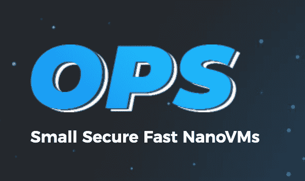

# 运营——反思云基础设施

> 原文：<https://dev.to/eyberg/ops---rethinking-cloud-infrastructure-c40>

在过去的几年中，单核技术已经被预测为软件基础设施的未来。

等等，什么是单核！？考虑单内核的一种方式是，如果你把你的应用程序转换成它自己的操作系统，会发生什么。它是一个单一用途的操作系统，而不是像 Linux 这样的通用操作系统。另一个很大的区别是，单内核意味着每台服务器只能运行一个应用程序。由于目前部署的几乎所有东西都部署在虚拟机上(例如:公共云的所有*和*)，所以 unikernels 建议，您不需要为每个要部署的应用程序准备一个成熟的操作系统。这使得他们跑得更快，更安全，他们变得更小。

然而，单核并非没有问题。unikernels 传统上遇到的问题之一是，在过去，要真正利用它们，你必须是系统开发人员或低级 c 程序员。

不再

OPS 是一个工具，可以帮助任何人以任何语言或任何应用程序构建和运行 unikernels。OPS 只是像 Linux 一样加载 ELF 二进制文件，但是具有单内核的优点。在“单核”之前，我们有所谓的“库操作系统”。OPS 和它使用的内核“纳米”包含了这个概念。他们都在积极开发，并且有一个全职的付费内核工程师团队在工作。(这在历史上也是生态系统的一个大问题。)

对于本地开发，OPS 目前在 linux 或 mac 上运行。

首先，你需要安装 cli 工具——如果你不是 Go 用户，你可以从网站下载二进制文件，但是如果你是 Go 用户，一旦你获得了[源代码](https://github.com/nanovms/ops)，你也可以自己编译它。

### 安装

```
$ curl https://ops.city/get.sh -sSfL | sh 
```

让我们尝试一个快速的 Node.js hello world。

将此放入文件:

```
 console.log("Hello World!"); 
```

然后你可以运行它。

```
 $ ops load node_v11.15.0 -a ex.js 
```

简单吧。想试试更复杂的东西吗？让我们试试 Go 网络服务器。

把这个放到 main.go:

```
 package main

  import (
      "log"
      "net/http"
  )

  func main() {
      fs := http.FileServer(http.Dir("static"))
      http.Handle("/", fs)

      log.Println("Listening...on 8080")
      http.ListenAndServe(":8080", nil)
  } 
```

如果你在 mac 上，指定操作系统为“linux”。值得注意的是，它根本没有运行 linux。单核不是容器。我们将 GOOS 指定为 linux 的唯一原因是 Nanos 实现了 POSIX 标准(在某种程度上),并将我们的程序作为 elf 加载。

```
 $ GOOS=linux go build main.go 
```

您可以通过查看文件类型来验证这一点:

```
➜  twe  file main
main: ELF 64-bit LSB executable, x86-64, version 1 (SYSV), statically linked, not stripped 
```

请注意，我是在本机文件类型为 Mach-O 的 mac 上构建的。我们主要支持 ELF，因为这是部署到生产中的内容。

```
➜  twe  file main
main: Mach-O 64-bit executable x86_64 
```

现在让我们创建一个文件夹来存放静态资产:

```
 $ mkdir static
  $ cd static 
```

```
 <!doctype html>
  <html>
  <head>
  <meta charset="utf-8">
      A static page
  </head>
  <body>
      <h1>Hello from a static page</h1>
  </body>
  </html> 
```

那么让我们为此指定一个 config . JSON:

```
 {
      "Dirs" : ["static"]
  } 
```

这只是说明我们希望将目录“static”放入/static，作为文件系统中的一个文件夹。您可以使用 OPS config.json 探索许多高级选项，但请注意，它正在积极开发中，许多内容可能会发生变化。

现在我们要运行它。OPS 实现了一个非常小的 QEMU 包装器。Qemu 允许我们将生成的映像作为虚拟机运行。虚拟机是 ops 将您的应用程序构建成自己独特的小操作系统的结果。有没有想过打造自己的操作系统？你已经做到了。

默认情况下，OPS 将在没有 KVM 加速的“用户模式”网络中运行您的 unikernel。用户模式网络比适当的桥接网络(你在 AWS 或 GCE 上得到的)要慢一点，但我们在你的笔记本电脑上玩，所以这很容易上手。另外，请记住，默认情况下，我们以非 root 用户的身份运行，默认情况下，KVM 需要 root 权限。在后面更高级的课程中，我们将向您展示如何正确配置。还要记住，在 mac 上，我们无法访问 KVM，但是，如果我们愿意，我们可以使用一个等效的英特尔 HAX。

```
 $ ops run -p 8080 -c config.json server 
```

现在它正在运行，你应该可以在你的服务器上运行 curl 了！

```
 curl http://localhost:8080/hello.html 
```

您刚刚构建并运行了您的第一个作为单内核的 Go 服务器！多酷啊。

看看 github repo，启动它，看看还能创造出什么！

##  [纳米虚拟机](https://github.com/nanovms) / [ ops](https://github.com/nanovms/ops)

### ops -构建和运行 nanos 单核

<article class="markdown-body entry-content container-lg" itemprop="text">

# (美国)物价管制局(Office of Price Stabilization)

[](https://circleci.com/gh/nanovms/ops)[](https://goreportcard.com/report/github.com/nanovms/ops)[](http://godoc.org/github.com/nanovms/ops)

[](https://camo.githubusercontent.com/afea73696ba9e983c7da0c99ce026611da5ebcbe/68747470733a2f2f692e696d6775722e636f6d2f4f7466414142552e706e67)

Ops 是一个创建和运行 [Nanos](https://github.com/nanovms/nanos) unikernel 的工具。它用于打包、创建和运行您的应用程序，作为一个 [nanos](https://github.com/nanovms/nanos) 单核实例。

查看[文档](https://nanovms.gitbook.io/ops/)

# 装置

大多数用户应该从网站上下载二进制文件:

## 二进制安装

```
curl https://ops.city/get.sh -sSfL | sh
```

## 从源代码构建和安装

如果你以前使用过 Go，从源代码构建是很容易的。

此程序需要 GO 版本 1.13.x 或更高版本。

从源安装遵循以下一般步骤:

安装依赖项:

```
- `make deps` 
```

构建:

```
- `make build` 
```

osx 注释:

```
GO111MODULE=on go build -ldflags "-w" 
```

关于[的详细说明](https://nanovms.gitbook.io/ops/developer/prerequisites),请查阅文档。

# 基本用法示例

在了解更多关于`ops`的知识之前，最好先看一些基本的用法示例。下面是使用各种编程平台的简单示例的链接:

让我们现在运行你的第一个单核。

[](https://asciinema.org/a/256914)

把这个扔进 hi.js:

```
var http = require('http')
```

…</article>

[View on GitHub](https://github.com/nanovms/ops)