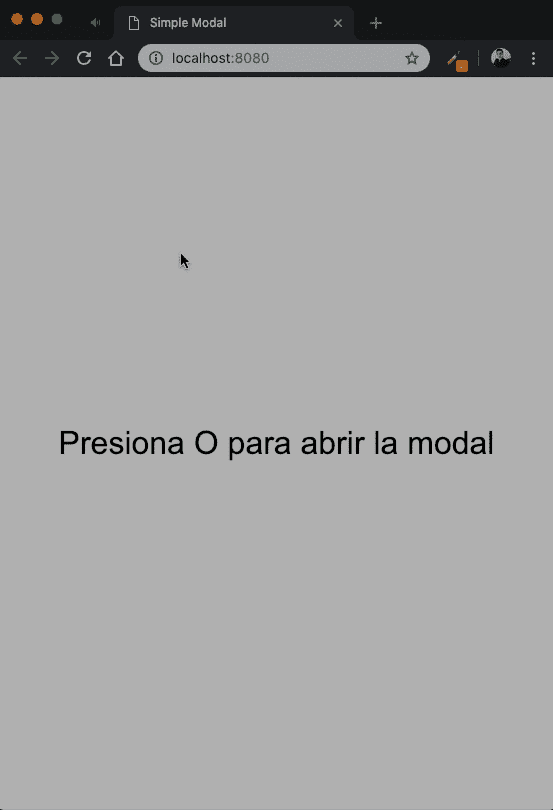

# 创建带有 vue 和 typescript 的模式

> [https://dev . to/gugadev/create-one 模态-带视图-y-typescript-3g31](https://dev.to/gugadev/creando-una-modal-con-vue-y-typescript-3g31)

# 创建一个模态对话框并打印出来

## [【gugadev】](https://github.com/gugadev)/[视图模态](https://github.com/gugadev/vue-modal)

### 基于 Vue 和 Typescript 构建的简单模型。

<article class="markdown-body entry-content container-lg" itemprop="text">

# 简单模态

基于 Vue 和 Typescript 构建的简单模型。

[](https://camo.githubusercontent.com/70689c9b2292593c1fc65999e716666f0f68da88b0aaa496e74d65307f04f51e/687474703a2f2f672e7265636f726469742e636f2f5158734e796f6c4c66792e676966)

## 性能

*   `title`:模态的标题
*   `open`:表示模态是否打开的标志。

## 事件

*   `close`:近距离点击时触发。

</article>

[View on GitHub](https://github.com/gugadev/vue-modal)

去年增长最快的 JavaScript 框架之一就是 este。这一框架的特点是既简单又强大，它攻击了前端社区。

misma 在 Github 的普及程度并没有超过 React 和 Angular，尽管[并不意味着开发者的使用水平保持相同的](https://zendev.com/2018/06/19/react-usage-beating-vue-angular.html)。事实上 vista 是一个不可思议的、灵活的、强大的和充满可能性的框架。我借此机会祝贺埃文·优和他身后的全体队员和贡献者。各位，冷静点！

## 项目准备

好吧，让我们开始吧。我们首先需要的是启动项目并安装一些设备。我们将把单位分为两个单位:发展单位和业务单位。

开发依赖项基本上将是 Typescript 和 vue 的加载程序。这些是:

*   以打字打的文件
*   契特林
*   ts-loader
*   视图加载程序
*   视图样式加载器
*   模板编译器
*   css 加载程序
*   样式加载器
*   html 网页包插件
*   web pack-开发-服务器
*   网络包
*   webpack-cli

主要的毒性是:

*   某视频剪辑软件
*   vue 类组件
*   vue-属性-装饰

现在，我们已安装了依赖项，我们将创建一个名为“`tsconfig.json`”的文件，该文件将读取 Typescript 以考虑某些设置。

```
{  "include":  [  "./src/**/*"  ],  "compilerOptions":  {  "target":  "esnext",  "lib":  ["dom",  "esnext"],  "module":  "es2015",  "moduleResolution":  "node",  "noUnusedLocals":  true,  "noUnusedParameters":  true,  "emitDecoratorMetadata":  true,  "experimentalDecorators":  true  },  "compileOnSave":  false  } 
```

Enter fullscreen mode Exit fullscreen mode

我们所做的，理论上是告诉他考虑到*内的任何文件，我们想使用*是模块*，并激活[装饰器](https://github.com/tc39/proposal-decorators)的使用。*

完成此步骤后，以下是准备 Webpack 配置文件:

```
const path = require('path')
const VueLoaderPlugin = require('vue-loader/lib/plugin')
const HtmlWebpackPlugin = require('html-webpack-plugin')

module.exports = {
  context: __dirname,
  entry: './src/index.ts',
  output: {
    path: path.resolve(__dirname, 'dist'),
    filename: '[name].js'
  },
  resolve: {
    alias: {
      vue$: 'vue/dist/vue.esm.js'
    },
    extensions: ['.ts', '.js']
  },
  module: {
    rules: [
      {
        test: /\.ts$/,
        exclude: /node_modules/,
        use: {
          loader: 'ts-loader',
          options: {
            appendTsSuffixTo: [/\.vue$/]
          }
        }
      },
      {
        test: /\.css$/,
        use: [
          'vue-style-loader',
          'css-loader'
        ]
      },
      {
        test: /\.vue$/,
        exclude: /node_modules/,
        use: {
          loader: 'vue-loader'
        }
      }
    ]
  },
  devtool: 'sourcemap',
  plugins: [
    new VueLoaderPlugin(),
    new HtmlWebpackPlugin({
      template: './src/index.html'
    })
  ]
} 
```

Enter fullscreen mode Exit fullscreen mode

我们将使用 提起。文件`index.html`放在我们项目的`src`文件夹中。将改为:

```
<!DOCTYPE html>
<html lang="en">
<head>
  <meta charset="UTF-8">
  <meta name="viewport" content="width=device-width, initial-scale=1.0">
  <meta http-equiv="X-UA-Compatible" content="ie=edge">
  Simple Modal
</head>
<body>
  <div id="app"></div>
</body>
</html> 
```

Enter fullscreen mode Exit fullscreen mode

现在，让我们继续我们的应用程序的入口点。在此，我们将与主构件一起抬起视图。

```
import Vue from 'vue'
import App from './index.vue'

new Vue({
  el: '#app',
  template: '<App/>',
  render: h => h(App)
}) 
```

Enter fullscreen mode Exit fullscreen mode

我们已准备好开始创建模态。

## 模式创建

模态将简单且面向元件。我们将执行结构，映射一些属性，并设置您要发布的事件。模态内容将根据我们每次需要插入。

第一步是建立*模板*:

> **注**:记住*模板*和*样式*和*脚本*都在文件`.vue`内。

```
<template>
  <div class="modal" :class="{ open }">
    <div class="modal-content">
      <header class="modal-header">
        <h3>{{ title }}</h3>
        <span @click="close">&times;</span>
      </header>
      <article class="modal-body">
        <slot name="content"></slot>
      </article>
      <footer class="modal-footer">
        <slot name="actions"></slot>
      </footer>
    </div>
  </div>
</template> 
```

Enter fullscreen mode Exit fullscreen mode

如你所见，它是一个相当简单的结构。模态的标题应由
属性`title`的中间提供，此外，我们将通过属性`open`知道是开还是关。

下一行:

```
<span @click="close">&times;</span> 
```

Enter fullscreen mode Exit fullscreen mode

它告诉我们，单击“x”时，将执行我们组件的方法`close`。

此外，为了能够显示或隐藏模态，我们将以此行为基础:

```
<div class="modal" :class="{ open }"> 
```

Enter fullscreen mode Exit fullscreen mode

它告诉我们，如果属性`open`是`true`，则会添加一个名为`open`的 CSS 类，该类将显示具有过渡效果的模式，如 CSS 代码所示:

```
<style scoped>
  .modal {
    align-items: flex-start;
    background-color: rgba(0,0,0,.75);
    display: flex;
    height: 100vh;
    justify-content: center;
    opacity: 0;
    position: fixed;
    transition: visibility 250ms, opacity 250ms;
    width: 100%;
    z-index: -1;
  }
  .modal.open {
    opacity: 1;
    visibility: visible;
    z-index: 2;
  }
  .modal.open .modal-content {
    transform: translateY(100px);
  }
  .modal-content {
    background-color: #fff;
    border-radius: 2px;
    box-shadow: 0 8px 16px 0 rgba(0,0,0,.25);
    display: inline-block;
    min-width: 320px;
    max-width: 480px;
    transition: transform 450ms ease;
    width: 100%;
  }
  .modal-header {
    border-bottom: 1px solid #eee;
    padding: 20px;
    position: relative;
    text-align: center;
  }
  .modal-header h3 {
    color: #444;
    font-family: Arial, Helvetica, sans-serif;
    font-size: 14px;
    font-weight: 600;
    text-transform: uppercase;
  }
  .modal-header span {
    cursor: pointer;
    font-weight: bolder;
    position: absolute;
    right: 15px;
    top: 50%;
    transform: translateY(-50%);
  }
  .modal-body {
    padding: 40px;
  }
  .modal-footer {
    background-color: #f8f8f8;
    border-top: 1px solid #eee;
    display: flex;
    justify-content: flex-end;
    padding: 20px;
  }
</style> 
```

Enter fullscreen mode Exit fullscreen mode

> **注意**:我们使用`scoped`属性确定这些样式将封装在组件内，避免与应用程序中的其他样式发生冲突。

上面的 CSS 代码只是将一个不透明度过渡添加到模态中，同时使该过渡从上到下滑动，从而产生引人注目的平滑效果。

最后，我们编写了我们的核心组件，该组件与模板通信，并具有模板需要使用的属性和方法。

```
<script lang="ts">
  import Vue from 'vue'
  import Component from 'vue-class-component'
  import { Prop, Emit } from 'vue-property-decorator'

  @Component
  export default class Modal extends Vue {
    @Prop({ required: true, type: String }) title: string
    @Prop({ required: true, type: Boolean, default: false }) open

    @Emit('close')
    close(): void {}
  }
</script> 
```

Enter fullscreen mode Exit fullscreen mode

我们做的第一件事是进口装饰品`Component`，这是为了向您表明该类是一个组件，`Prop`表示该变量是接收该组件的属性，`Emit`表示该方法将向父级发出事件。

如我们所说，财产`title`和`open`是必需的。同样，`open`也会初始化为 false。

*方法，运行时将向包含模态的父项发出事件，通知*要关闭模态*。*

## 使用模态

使用模态相当简单。只需将其包含在零部件列表中并放置在模板中即可。让我们来看看一个例子。

```
<template>
  <div class="container" @keypress="catchKey" tabindex="0">
    <Modal :title="modalTitle" :open="modalOpened" @close="closeModal">  
      <template slot="content">
        <blockquote>
          <p>Debido a nuevas políticas de seguridad, a partir de hoy, 22 de Enero del 2019, usted es reponsable de la seguridad de sus archivos. Para saber como reforzar y manejar la seguridad de su cuenta, lea la <a href="#">Documentación.</a></p>
          <caption>TI & Information Security</caption>
        </blockquote>
      </template>
      <template slot="actions">
        <button class="decline">Declinar</button>
        <button class="accept">Aceptar</button>
      </template>
    </Modal>
    <h1>Presiona O para abrir la modal</h1>
  </div>
</template>

<script lang="ts">
  import Vue from 'vue'
  import Component from 'vue-class-component'
  import Modal from './modal.vue'

  @Component({
    components: {
      Modal
    }
  })
  export default class App extends Vue {
    modalTitle = 'Alerta de seguridad'
    modalOpened = false
    MODAL_TRIGGER = 111

    catchKey(e: KeyboardEvent) {
      if (e.keyCode === this.MODAL_TRIGGER) {
        this.modalOpened = true
      }
    }
    closeModal() {
      this.modalOpened = false
    }
  }
</script> 
```

Enter fullscreen mode Exit fullscreen mode

如我们所见，模态的性质`title`与`modalTitle`和`open`相关联，因此，当按下键或将状态从`modalOpened`变更为`true`时，显示模态。

看看`closeModal`方法，就是当检测到`Modal`发出`close`类型的事件时将执行的方法，对此我们正在通过`@close="closeModal"`线路收听。

**结果数据**

[](https://res.cloudinary.com/practicaldev/image/fetch/s--4yc1kBBz--/c_limit%2Cf_auto%2Cfl_progressive%2Cq_66%2Cw_880/http://g.recordit.co/QXsNyolLfy.gif)

* * *

## 结论

如您所见，在视图中建立元件非常简单。我们只需几个小时就能拥有一个相对复杂且功能强大的组件。我个人认为，任何前端开发者都应该给这个伟大的框架一个机会。😉