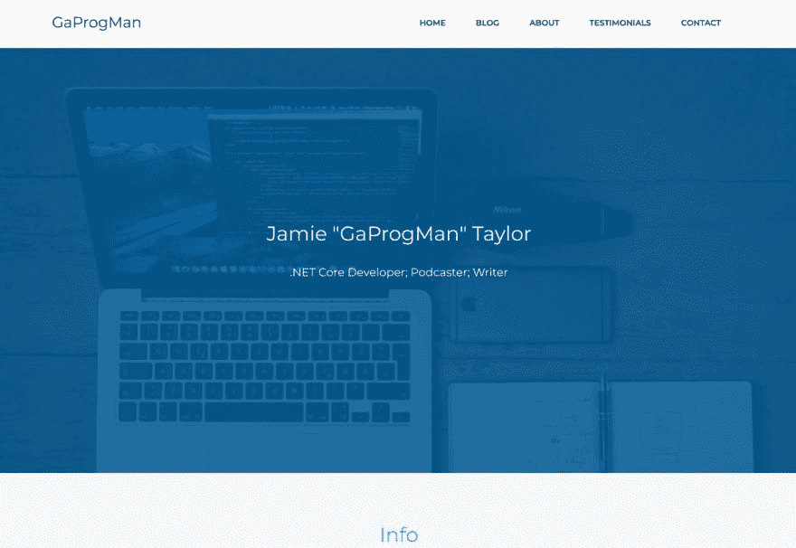

# HTML 渲染:重要的一课

> 原文：<https://dev.to/dotnetcoreblog/html-rendering-an-important-lesson-54hp>

*标题图片:[现场笔记和铅笔](https://unsplash.com/photos/EPppwcVTZEo)by[hello queue](https://unsplash.com/@helloquence)T5】*

我周末发了一条推特:

> dotnetcore . show@ dotnetcore show当你把一个页面的负载从 2.99 秒降到 700 毫秒的那一刻(无需使用缓存)
> [# kindOfABigDeal](https://twitter.com/hashtag/kindOfABigDeal)[# web optimization](https://twitter.com/hashtag/webOptimisation)下午 14:31-2019 年 1 月 19 日[](https://twitter.com/intent/tweet?in_reply_to=1086632262702108672)

我想我应该解释一下到底发生了什么，以及我如何设法将页面渲染时间从几乎 3 秒缩短到 700 毫秒，而不需要(这是关键部分)使用任何类型的缓存。

进入这个领域，你需要知道的一件事是，我不擅长前端开发——我只能说，我的水平一般。这就是为什么这(我最终发现的)对我来说有点突然发现。但这也很有道理。

## 现场

首先，你需要了解我试图优化的网站的原始状态。首先，HTML 看起来不起眼:

```
<!DOCTYPE html>
<html>

<head>
    <meta charset="utf-8">
    <meta name="viewport" content="width=device-width, initial-scale=1.0, shrink-to-fit=no">
    <link rel="stylesheet" href="dist/css/bootstrap.min.css">
    <link rel="stylesheet" href="dist/css/custom.min.css">
</head>

<body>
  <main class="page landing-page">
        <section class="clean-block clean-hero" id="hero">
            <div class="text">
                <h2>Jamie "GaProgMan" Taylor<br></h2>
                <p>.NET Core Developer; Podcaster; Writer</p>
            </div>
        </section>
  </main>
</body>
</html> 
```

然后是`custom.css`的一些内容:

```
/* other rules, which override
 * default bootstrap styles here
 */

#hero { 
  background-image: url('../img/header.jpg');   
  color: rgba(0,92,151,0.85);   
} 
```

`custom.css`被设计为一个覆盖一些默认引导样式的文件，因此它必须在引导后加载。这就是为什么 css 文件的顺序很重要。

所有这些创建了与下面的截图相匹配的东西:

[](https://res.cloudinary.com/practicaldev/image/fetch/s--wOTbkTJn--/c_limit%2Cf_auto%2Cfl_progressive%2Cq_auto%2Cw_880/https://thepracticaldev.s3.amazonaws.com/i/j6l5xjxh97crwcqx5xqo.jpg)

## 问题——以及浏览器如何呈现 HTML

一些浏览器

我将解释浏览器是如何获取、渲染、获取和重画的。我要把细节弄错了，因为我要从一个很高的层次来做这件事。但是这个想法是对的。

因此，当页面被访问时，上面的 HMTL 被下载。浏览器开始解析 HTML 并发出链接 css 文件的请求。跟我到目前为止？

因为首先请求的是`bootstrap.min.css`，所以不管`custom.min.css`返回的速度是否更快，浏览器都会首先解析并应用来自`bootstrap.min.css`的规则。一旦应用了引导程序，浏览器将只应用自定义的样式规则。

这意味着在下载并应用了引导程序之后的*之前，具有“hero”Id 的 div 不会应用`background-image`规则。即使这样，浏览器也需要下载图片。所以我们要等很长时间才能下载图像。*

当我测试这个的时候，是在一个被故意限制的网络连接上

我的目标是从移动第一的角度设计网站；当我这样做时，我也从移动优先的角度测试它们。这通常意味着在我的测试循环中，我会将我的互联网连接降低到低质量的 3G 连接

我发现标题图片平均需要 2-3 秒的时间来加载和显示。

不太好。

### Dev 要做什么？

我花了一点时间思考我能做什么。我把标题图像缩小了；我通过像 [TinyPng](https://tinypng.com/) 这样的工具把它放进去；我把图像转移到一个非常快的服务器上；我甚至考虑使用缓存反向代理服务，如 [CloudFlare](https://www.cloudflare.com/) 。

我研究了在服务器上使用 Brotli 压缩图像(但这在某些浏览器上不可行)；我研究了使用 [`srcset`属性](https://developer.mozilla.org/en-US/docs/Learn/HTML/Multimedia_and_embedding/Responsive_images)；我甚至考虑使用服务器端缓存。

然后我去吃午饭了。

当我吃完午饭回来时，我去掉了 bootstrap，并意识到瓶颈变成了服务器为映像提供服务的速度。在我的节流连接上，花了大约 400 毫秒。

> 等一下。为什么 bootstrap 会造成这种情况？

不是的。

### CSS 文件顺序

还记得我之前说过，在应用“hero”的背景图像规则之前，我们必须等待 bootstrap 被下载并应用吗？那么，为什么不创建一个单独的 css 文件来保存这个规则呢？

所以我重写了 HTML:

```
<!DOCTYPE html>
<html>

<head>
    <meta charset="utf-8">
    <meta name="viewport" content="width=device-width, initial-scale=1.0, shrink-to-fit=no">
    <link rel="stylesheet" href="dist/css/header.min.css">
    <link rel="stylesheet" href="dist/css/bootstrap.min.css">
    <link rel="stylesheet" href="dist/css/custom.min.css">
</head>

<body>
  <main class="page landing-page">
        <section class="clean-block clean-hero" id="hero">
            <div class="text">
                <h2>Jamie "GaProgMan" Taylor<br></h2>
                <p>.NET Core Developer; Podcaster; Writer</p>
            </div>
        </section>
  </main>
</body>
</html> 
```

在`header.min.css`中唯一的规则是:

```
#hero { 
  background-image: url('../img/header.jpg');   
  color: rgba(0,92,151,0.85);   
} 
```

这意味着在必须下载映像之前，不需要加载 bootstrap。

大获成功！页面顶部的英雄横幅和导航将在大约 600 毫秒内加载。由于设计将这些项目(而不是其他任何东西)放在了文件夹的上方，这意味着我不用担心其他内容需要多长时间才能加载。

### 但是我们可以做得更好

CSS 文件很棒，而且超级快。但是为了下载背景图片，浏览器不得不与服务器进行一次往返。那么我们如何减少这种情况呢？

我们不能假设服务器将支持 http2，这将允许我们并行地将更多的内容推送到客户端。那我能做什么呢？

输入:Base64 字符串

对于那些不知道的人来说， [Base64](https://en.wikipedia.org/wiki/Base64) 是一种编码字符串的方式——它一点也不安全，但是如果你需要通过一个只有 [ASCII](https://en.wikipedia.org/wiki/ASCII) 的媒介来传输二进制数据，它会很有用。

您可以获取一个图像，将其编码为 base64 字符串，并使用该字符串作为图像元素的`src`属性值。这种技术确实有它的缺点，主要有两个:

*   [浏览器支持不完善](https://caniuse.com/#feat=datauri)
    *   除非你不在乎瞄准微软浏览器
*   由于图像的 base64 表示长度很长，下载时间可能会稍长
    *   例如，本文顶部的渲染网站设计的屏幕截图的 base64 字符串有 80，161 个字符长

*但是*如果你把 base64 字符串和 gzip 结合起来，你可以获得相当快的传输速度。所以我为我的英雄图像生成了一个 base64 字符串，并修改了`header.min.css`文件:

```
#hero { 
  background-image: url('data:image/jpeg;base64,/9j/4AAQSkZJRgABAQAAAQABAAD/2wBDAAUEBAQEAwUEBAQGBQUGCA0ICAcHC /* and the rest of the base64 string here*/ 5c1O5zUrxIMGEJWl6f/2Q=');
  color: rgba(0,92,151,0.85);   
} 
```

这不再需要到服务器的额外往返，这比最初的下载又节省了 50 毫秒。额外的好处是 css 一下载就被缓存在浏览器中。

### 倒影

我真的不需要额外的步骤(使用 base64 字符串)，但是，如果我对你诚实，我只是用它作为一个实验，看看它是否可以更快。

正是这种微优化(将更简单的 css 规则置于阻止调用之上)能够真正对网站的感知速度产生巨大的影响。正如我在这篇文章的顶部所说，我不是前端开发的最佳人选，但我想我会分享这一点。

此外，我可能没有以一种模糊的“正确”或优化的方式做到这一点。如果你是我，你会怎么做？