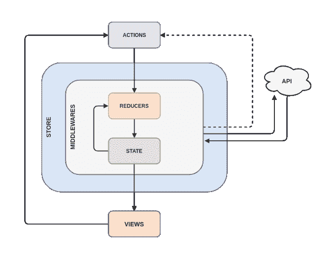
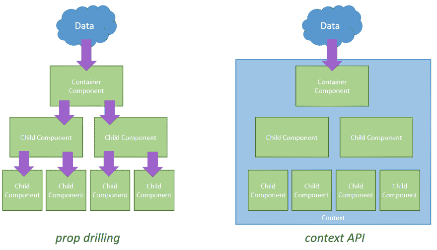

# 反应上下文 API

> 原文：<https://dev.to/gugadev/react---context-api-490>

直到发行版本 16 之前，只有一种原生方式-在元件之间共用属性，是透过「*prop drilling*或*drill*进行的，也就是说，属性在预先设定的阶层中由上而下流动。

## 支柱钻 y Redux

通常有如下部件:

```
class Me extends React.Component<P, S> {
  state = {
    lastName = 'Garzaki'
  }
  render = _ => (
    <div>
      <p>Hola, yo soy Gustavo {this.state.lastName} y mi niña se llama </p>
      <Child lastName={this.state.lastName} />
    </div>
  )
}

class Child extends React.Component<P, S> {
  render = _ => (
    <p>Mía {this.props.lastName}</p>
  )
} 
```

Enter fullscreen mode Exit fullscreen mode

这就是所谓的*属性钻*，它不过是把财产从父传给子、从子传给孙、从孙传给孙等等。随着时间的推移，诸如 Redux、Mobx 等 React 的新的补充库陆续问世，它们所提供的是一种“T4”互连状态处理，这种处理是全球性的，因此无需钻取整个组件层次结构即可将属性从组件`A`传递到除此之外，它们还为我们提供了一种真正简单的方法，让我们能够在兄弟之间共享财产。

[](https://camo.githubusercontent.com/777e7ba1d6296e1b17660f11a3d53bf619048a73/68747470733a2f2f766963746f72766870672e6769746875622e696f2f6173736574732f636f6e746575646f2d706f7374732f323031382f72656475782f72656475782e706e67)

但是，这带来了迫在眉睫、不可避免的后果:复杂性。我们需要考虑 middlewares 软件、股票、配置商店等，因为它过去和现在都使 Redux 部署起来相当复杂。

## 上下文 API - Alternativa a Redux？🤔

从 React 16 开始，实施了一种称为上下文 API 的新工具。该新工具是作为对*属性钻*和【Redux】的建议而创建的。Context API 背后的想法与 Redux 相同，但要轻得多，简洁得多，最好的，警官。

此新功能通过创建一个“*”上下文*来工作，该上下文是一个保存某些数据(如变量、函数等)的运行时环境。此上下文分为两部分:`Provider`和`Consumer`。

[](https://res.cloudinary.com/practicaldev/image/fetch/s--zc37DLsB--/c_limit%2Cf_auto%2Cfl_progressive%2Cq_auto%2Cw_880/https://www.carlrippon.com/wp-content/uploads/2018/04/prop-drilling-v-context.png)

要创建上下文，只需使用方法
:

```
const AppContext = React.createContext({})
export const AppProvider = AppContext.Provider
export const AppConsumer = AppContext.Consumer 
```

Enter fullscreen mode Exit fullscreen mode

**提供者**是存储要消费的信息的地方；此信息通过一个名为“`value`”的属性传递。把它想成是一个我们要消费的蜜蜂。

另一方面，**消费者**则是负责消费包含**提供者**的数据的元素，因此它对我们的组件起着*代理作用。* 

```
import { AppProvider, AppConsumer } from './context'

class App extends Component<P, S> {
  state = {
    title: 'Hello from App',
    updateTitle: title => {
      this.setState({ title })
    }
  }
  render = _ => (
    <AppProvider value={this.state}>
      <Header />
      {this.props.children}
    </AppProvider>
  )
}

export default App 
```

Enter fullscreen mode Exit fullscreen mode

`Provider`一旦有了数值，无论想要消耗信息的元件所在的深度如何，都可以消耗:

```
const Header = _ => (
  <header className="header">
    
  </header> ) 
```

Enter fullscreen mode Exit fullscreen mode

```
const Title = _ => (
  <AppConsumer>
  {
    context => (
      <h1 className="header__title">
        { context.title }
      </h1>
    )
  }
) 
```

Enter fullscreen mode Exit fullscreen mode

正如我们看到的，尽管组件`Title`不是`App`的直接子代，但我们可以利用其状态而不用继承为属性，即使`Title`处于很多更深的层次。

不仅如此，我们还可以通过更新提供它的组件的状态来更新“`Provider`”的值。可能性很大，要由开发人员来决定如何使用它。

* * *

## 结论

Context API 是 Redux 的一个相当好的替代方案。如果你要找的是简单实用的东西，那是你的选择。但是，有时它可能对你不够有用，你想使用 Redux 和另一种选择。就我个人而言，我只需要 Context API，甚至可以创建自己基于它的 Redux，如[反应瀑布](https://github.com/didierfranc/react-waterfall)。