# 用 Oauth.io 和 Bit 创建一个可重用的 OAuth React 组件

> 原文：<https://dev.to/kris/create-a-reusable-oauth-react-component-with-oauthio-and-bit-1jee>

#### 一次创建组件，与 Bit 共享，随处使用，节省时间！

[](https://res.cloudinary.com/practicaldev/image/fetch/s--8E5M-nCg--/c_limit%2Cf_auto%2Cfl_progressive%2Cq_auto%2Cw_880/https://cdn-images-1.medium.com/max/1024/1%2AiiMYBk-3F4jW52sncb9WsA.png)

谁不想专注于创建产品而不是处理代码中的 OAuth 逻辑呢？将代码中的 OAuth 占用减少到一个请求！

在本帖中，我们将在 React with OAuth.io 中创建一个简单的可重用 OAuth 组件，OAuth 市场参与者拥有 100 多家提供商！让我们看看怎么做。

[](https://res.cloudinary.com/practicaldev/image/fetch/s--ISL5wVGj--/c_limit%2Cf_auto%2Cfl_progressive%2Cq_auto%2Cw_880/https://cdn-images-1.medium.com/max/1024/1%2AR3h8Mx4qcMOA7M79Nf9j7g.png)

#### 设置 OAuth.io 用户

自己在 Oauth.io 注册，免费:)

[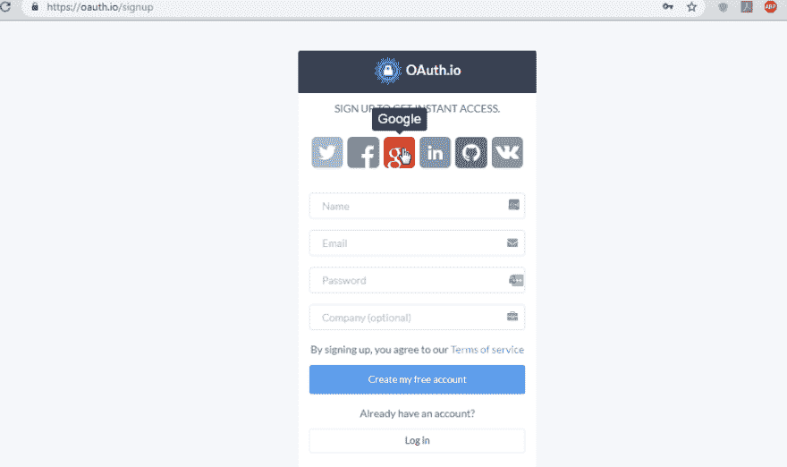](https://res.cloudinary.com/practicaldev/image/fetch/s--vzlMnn-T--/c_limit%2Cf_auto%2Cfl_progressive%2Cq_auto%2Cw_880/https://cdn-images-1.medium.com/max/1024/1%2ArTy_GtdeT73XwMbve0yfwg.png)

登录后，您将进入如下所示的仪表板。

[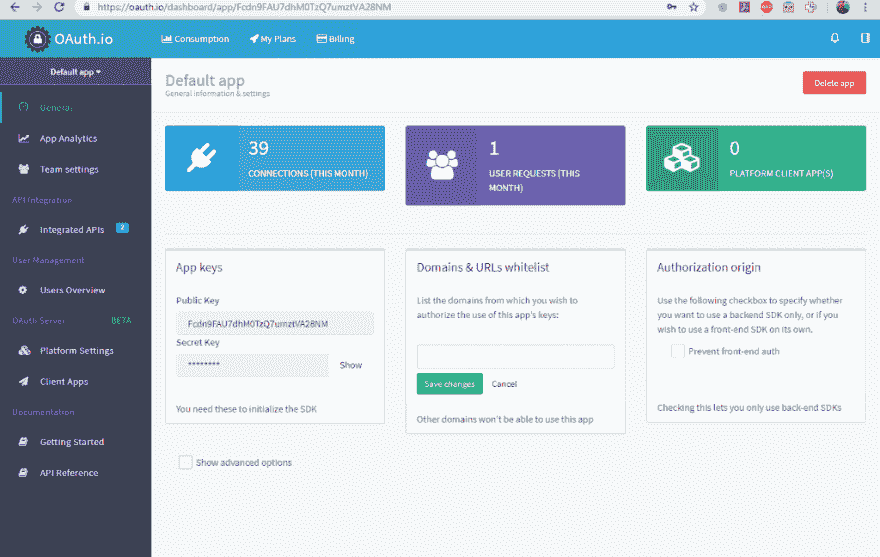](https://res.cloudinary.com/practicaldev/image/fetch/s--FU9TjWd7--/c_limit%2Cf_auto%2Cfl_progressive%2Cq_auto%2Cw_880/https://cdn-images-1.medium.com/max/1024/1%2AgnKQjLS0NnZ-3hIEaL8X1A.png)

然后，您可以尝试任何集成，但是记住首先要设置集成的 API！以下是方法。

### 添加 API

点击添加 API。

[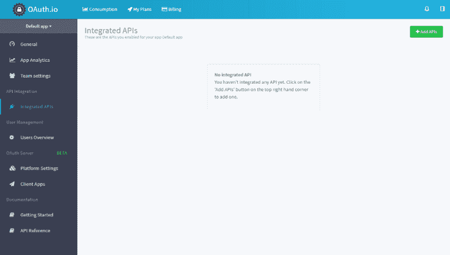](https://res.cloudinary.com/practicaldev/image/fetch/s--h8q1xqhM--/c_limit%2Cf_auto%2Cfl_progressive%2Cq_auto%2Cw_880/https://cdn-images-1.medium.com/max/1024/1%2AJilVHXNjaxNppV5W8ZSEVA.png)

选择脸书作为应用程序的提供商。

[](https://res.cloudinary.com/practicaldev/image/fetch/s--mGk47msD--/c_limit%2Cf_auto%2Cfl_progressive%2Cq_auto%2Cw_880/https://cdn-images-1.medium.com/max/605/1%2A9VX-OCgYs1x1ODen8VukFw.png)

现在，您需要 client_id 和 client_secret。因此，创建一个脸书应用程序来获取这些凭证。

[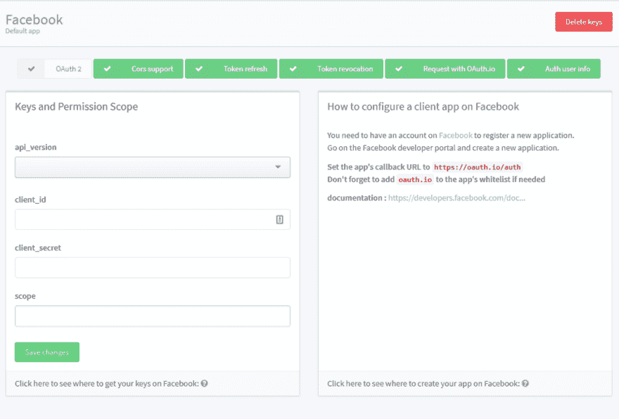](https://res.cloudinary.com/practicaldev/image/fetch/s--FyzA9XXw--/c_limit%2Cf_auto%2Cfl_progressive%2Cq_auto%2Cw_880/https://cdn-images-1.medium.com/max/1024/1%2AQq2UeIwpy0hdKyfs-bVacg.png)

转到[https://developers.facebook.com](https://developers.facebook.com)创建一个应用程序，并插入 oauth.io 作为应用程序的域。

[](https://res.cloudinary.com/practicaldev/image/fetch/s--c5Dmrp2B--/c_limit%2Cf_auto%2Cfl_progressive%2Cq_auto%2Cw_880/https://cdn-images-1.medium.com/max/983/1%2AAr4YNmOvpaJ8jegUxgHDVg.png)

将回拨 URI 添加为 oauth.io/auth

[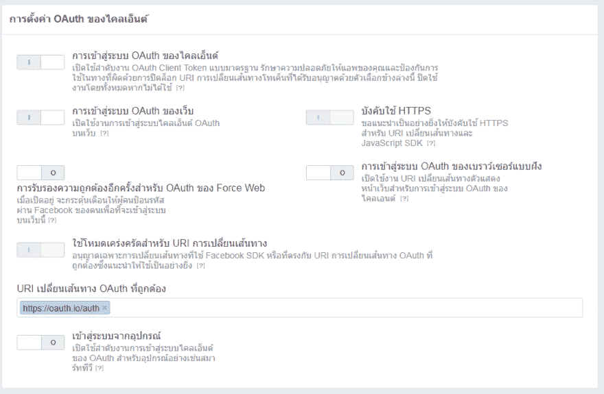](https://res.cloudinary.com/practicaldev/image/fetch/s--nVu1UEzq--/c_limit%2Cf_auto%2Cfl_progressive%2Cq_auto%2Cw_880/https://cdn-images-1.medium.com/max/971/1%2Aqt_lmdY4h9dXDf6r963Bsw.png)

将 id 和秘密放入 OAuth.io 的表单中。

[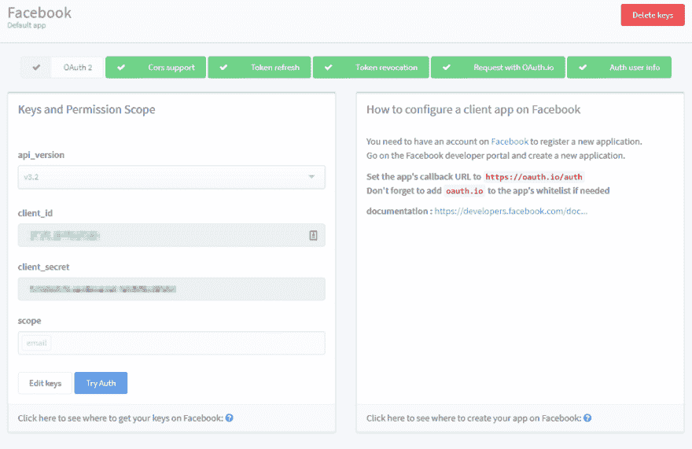](https://res.cloudinary.com/practicaldev/image/fetch/s--R2njWmqc--/c_limit%2Cf_auto%2Cfl_progressive%2Cq_auto%2Cw_880/https://cdn-images-1.medium.com/max/1024/1%2ADPGZKxFh3eGG7BlakFFk9A.png)

点击保存，你也可以添加更多的 API。让我们先利用脸书 API。

[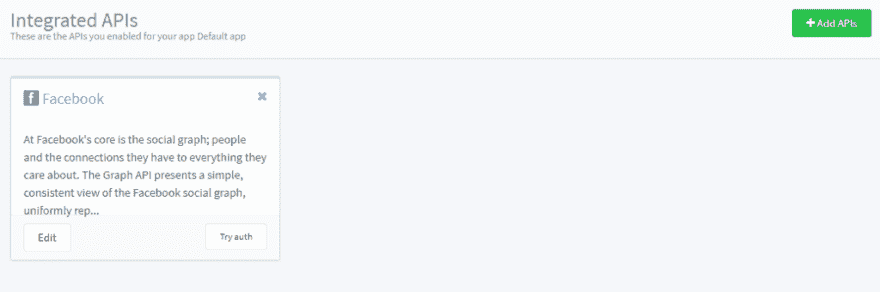](https://res.cloudinary.com/practicaldev/image/fetch/s--S6725acZ--/c_limit%2Cf_auto%2Cfl_progressive%2Cq_auto%2Cw_880/https://cdn-images-1.medium.com/max/1024/1%2AwAfILm_KlKIXdJpYIOymow.png)

### 创建 React 组件

接下来，让我们创建一个 React 组件来使用 Oauth.io SDK。oauth.io 的文档位于 [http://docs.oauth.io](http://docs.oauth.io/)

为了快速演示，我将在 VS 代码中使用 create-react-app 准备一个小组件。它看起来会像这样。

[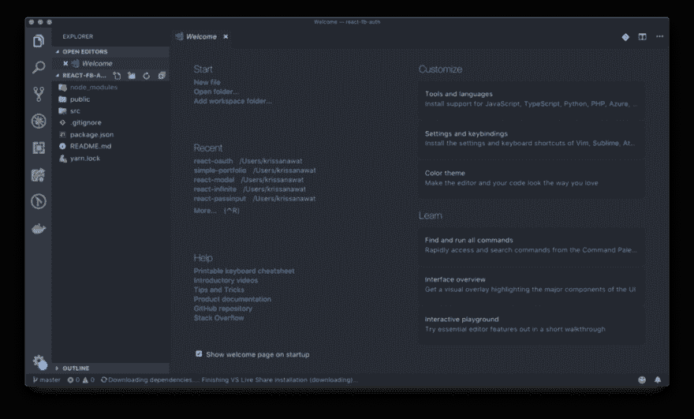](https://res.cloudinary.com/practicaldev/image/fetch/s--3LEherci--/c_limit%2Cf_auto%2Cfl_progressive%2Cq_auto%2Cw_880/https://cdn-images-1.medium.com/max/1024/1%2Aw1i3Rd9eLClEHYtWUU_koQ.png)

下面是 OAuth 组件结构。

[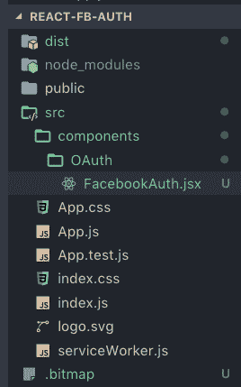](https://res.cloudinary.com/practicaldev/image/fetch/s--ZhjpYx_9--/c_limit%2Cf_auto%2Cfl_progressive%2Cq_auto%2Cw_880/https://cdn-images-1.medium.com/max/268/1%2AuONM_tw5pW1ZKdFliVib3g.png)

### 用 Bit 使组件可重用

[](https://res.cloudinary.com/practicaldev/image/fetch/s--H5bvkTbt--/c_limit%2Cf_auto%2Cfl_progressive%2Cq_auto%2Cw_880/https://cdn-images-1.medium.com/max/1024/1%2AfNYrSYwk58rUC6L6uUWbKg.png)

Bit 是基于云的软件合成工具。

这是一个平台，让您可以轻松地共享、组织、发现和使用组件来构建多个应用程序。团队可以创建他们共享组件的集合，他们可以在多个项目和应用程序之间共享、更新和同步这些组件。

简单地说，您可以将 Bit 视为您的组件“Lego box ”,您可以在其中共享来自任何项目的组件，然后找到并使用它们来构建更多的东西。有用吧？还有很多，但我们现在不会深入讨论。

[位共享和构建代码组件](https://bitsrc.io)

为什么我在 OAuth 演示中放了一个关于 Bit 的部分？

我使用 Bit 作为我的组件工作流的一部分，我用它来使我的组件可重用，并在我不同的应用程序中使用它们。这个组件也成为了我收藏的一部分，就像你现在看到的一样。

首先，登录 Bit 并创建您的集合(Scope)。

<figure>[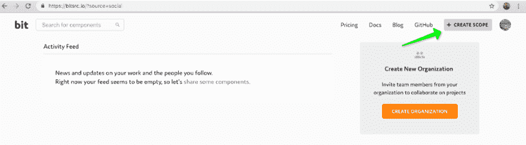](https://res.cloudinary.com/practicaldev/image/fetch/s--iInOHexi--/c_limit%2Cf_auto%2Cfl_progressive%2Cq_auto%2Cw_880/https://cdn-images-1.medium.com/max/1024/1%2ANbsjniwoRi7YnR4d8MsKHg.png) 

<figcaption>创建位范围</figcaption>

</figure>

填写所需的详细信息。

[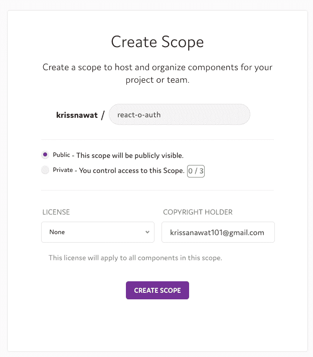](https://res.cloudinary.com/practicaldev/image/fetch/s--J2RnoTlI--/c_limit%2Cf_auto%2Cfl_progressive%2Cq_auto%2Cw_880/https://cdn-images-1.medium.com/max/624/1%2A-SOD5c5VQJgusAX9Ej6lYg.png)

我将它命名为 react-o-auth，并将其公开。

[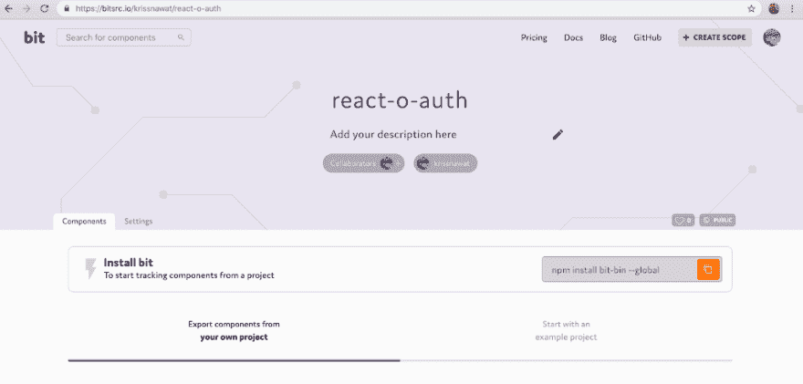](https://res.cloudinary.com/practicaldev/image/fetch/s--XFBjl1N---/c_limit%2Cf_auto%2Cfl_progressive%2Cq_auto%2Cw_880/https://cdn-images-1.medium.com/max/1024/1%2AMxtP6mbhMg4JOk_fgXgw6w.png)

现在我们的系列已经准备好了；让我们使用 Bit 从它所在的存储库中快速共享组件(Bit 发挥了“魔力”；它会自动隔离组件，并将其共享到云，无需更改任何代码或文件！).

我们来分享一下组件。

### 安装钻头

如果您还没有 Bit，使用
进行全局安装

```
npm install -g bit-bin 
```

[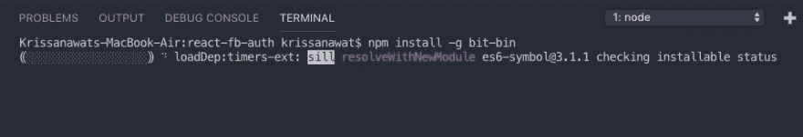](https://res.cloudinary.com/practicaldev/image/fetch/s--crcrQWlo--/c_limit%2Cf_auto%2Cfl_progressive%2Cq_auto%2Cw_880/https://cdn-images-1.medium.com/max/958/1%2AyAJ5KqcxDn8ALJD3eM3PAA.png)

### 为项目初始化位

用
初始化 Bit 工作空间

```
bit init 
```

这个命令添加 bit.json 和。位图文件，这样 Bit 就可以开始跟踪和隔离存储库中的组件。

#### 连接到您的收藏

使用 bit login 登录到 bit。该链接将在浏览器中打开。

[](https://res.cloudinary.com/practicaldev/image/fetch/s--ObI-4EX---/c_limit%2Cf_auto%2Cfl_progressive%2Cq_auto%2Cw_880/https://cdn-images-1.medium.com/max/565/1%2ALchn1fYH-VnsC6C45jhUTw.png)

认证成功也反映在终端上。

[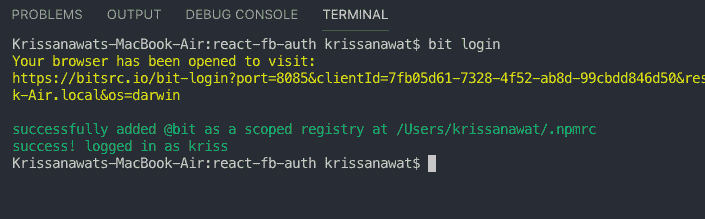](https://res.cloudinary.com/practicaldev/image/fetch/s--_1nB6P2a--/c_limit%2Cf_auto%2Cfl_progressive%2Cq_auto%2Cw_880/https://cdn-images-1.medium.com/max/705/1%2A26fPjMFap6HKIiBBb9jFew.png)

### 开始发育

打开 facebook.jsx，一步一步跟着做

1.  导入必要的库

```
import React from "react";
import { OAuth } from "oauthio-web"; 
```

1.  创建 *FacebookAuth* 类

```
export default class FacebookAuth extends React.Component {

} 
```

1.  创建一个状态来存储访问令牌

```
state = {

access\_token: ""

}; 
```

1.  用 Initialize 初始化 OAuth-io SDK 并从 props 接收数据

```
componentDidMount() {
   OAuth.initialize(this.props.api\_key);
} 
```

1.  创建 OAuth 处理程序方法

```
Auth = () => {
    OAuth.popup("facebook")
      .done(res => {
          this.setState({ access\_token: res.access\_token });
      })
      .fail(err => {
    });
}; 
```

1.  呈现登录按钮

```
render() {
   return (
      <button onClick={this.Auth}
       className="btn btn-tw btn-block">
       Sign in with facebook
      </button>
   );
} 
```

1.  最后，在 index.js 中导入这个组件

```
import FacebookAuth from "./components/FacebookAuth"; 
```

1.  通过将组件放置在某处来激活它

```
<FacebookAuth api\_key={"Fcdn9FAU7dhM0TztVA28NM"} /> 
```

### 将组件添加到位

现在，让 Bit 跟踪你放在 src/components 目录中的所有组件。

```
bit add src/components/\* 
```

结果呢

[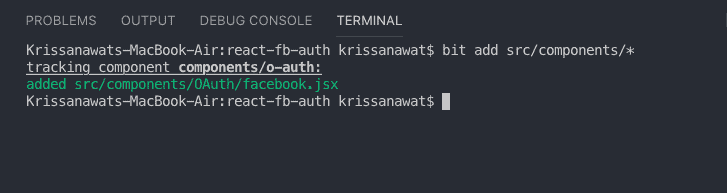](https://res.cloudinary.com/practicaldev/image/fetch/s--Ut8pPgfC--/c_limit%2Cf_auto%2Cfl_progressive%2Cq_auto%2Cw_880/https://cdn-images-1.medium.com/max/727/1%2APIB31qTeAbMYUSeEBpPJSw.png)

运行 bit status 以查看 yout Bit 实例的当前状态。

[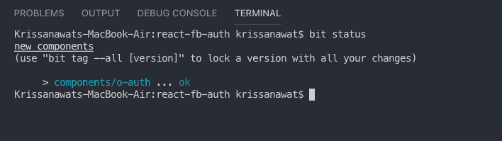](https://res.cloudinary.com/practicaldev/image/fetch/s--_sjBHbD2--/c_limit%2Cf_auto%2Cfl_progressive%2Cq_auto%2Cw_880/https://cdn-images-1.medium.com/max/708/1%2A0tdEx01Cs5aTT9wwIDOdtg.png)

[为工作区设置一个 Bit 编译器](https://bitsrc.io/bit/envs)(我用 react) :

```
bit import bit.envs/compilers/react --compiler 
```

您可以构建自己的组件。

```
bit build components/o-auth 
```

现在，声明这是 1.0.0 版本。

```
bit tag --all 1.0.0 
```

再次运行 bit status 以确认是否附加了此版本:

[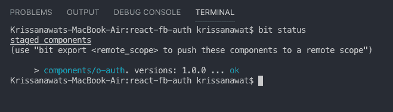](https://res.cloudinary.com/practicaldev/image/fetch/s--H8O0HiFR--/c_limit%2Cf_auto%2Cfl_progressive%2Cq_auto%2Cw_880/https://cdn-images-1.medium.com/max/659/1%2AQFlyLzjVMX8Ee4tBb1U2Fg.png)

将它们推到 Bit 远程作用域:

```
bit export krissnawat.react-o-auth 
```

就是这样！您刚刚导出的组件现在将显示在您的集合中。

组件定义上面的任何注释块都被用作组件描述，如果我要添加测试，Bit 也会运行它们。

[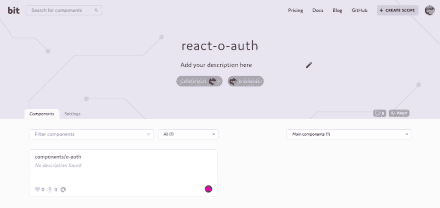](https://res.cloudinary.com/practicaldev/image/fetch/s--DlVv5qMs--/c_limit%2Cf_auto%2Cfl_progressive%2Cq_auto%2Cw_880/https://cdn-images-1.medium.com/max/1024/1%2AHXKSiyE0Y1A1JbvjwN2jRQ.png)

现在，您可以使用 npm 在单独的项目中轻松安装这些组件。只需将位注册表添加到 npm 配置:

```
npm config set '@bit:registry' [https://node.bitsrc.io](https://node.bitsrc.io) 
```

使用此命令
获取一个位组件

```
npm i @bit/krissnawat.react-o-auth.components.o-auth 
```

### 包装完毕

本教程到此为止！

我们创建了一个可重用的 React OAuth 组件，它使用 OAuth.io 呈现了一个简单的脸书登录选项，并与 Bit 共享了这个可重用组件，以便在其他项目中重用它。

希望你玩得开心，随时评论和询问任何事情。鼓掌表示支持！

### 了解更多

*   [在 React 中加快开发的 5 种工具](https://blog.bitsrc.io/5-tools-for-faster-development-in-react-676f134050f2)
*   [如何在项目和应用之间共享 React UI 组件](https://blog.bitsrc.io/how-to-easily-share-react-components-between-projects-3dd42149c09)
*   [2019 年你应该知道的 11 个 React UI 组件库](https://blog.bitsrc.io/11-react-component-libraries-you-should-know-178eb1dd6aa4)

* * *