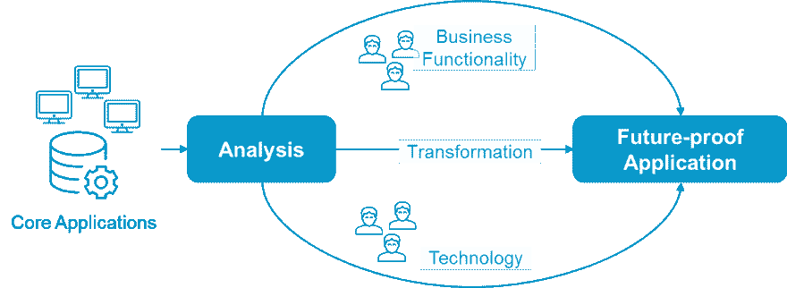
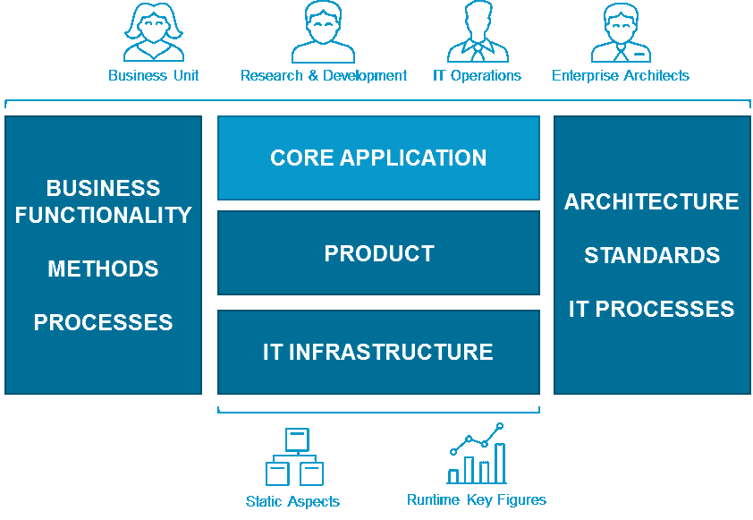
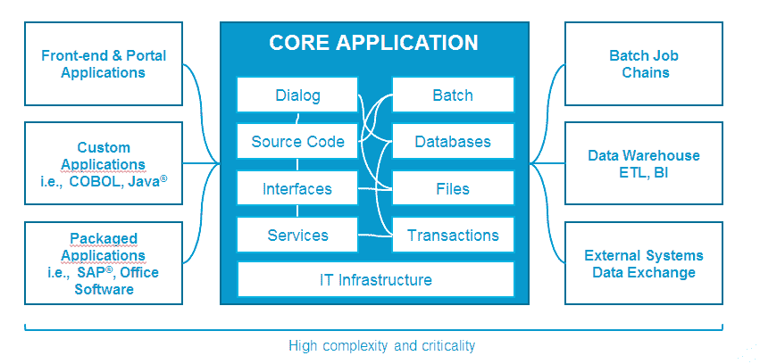
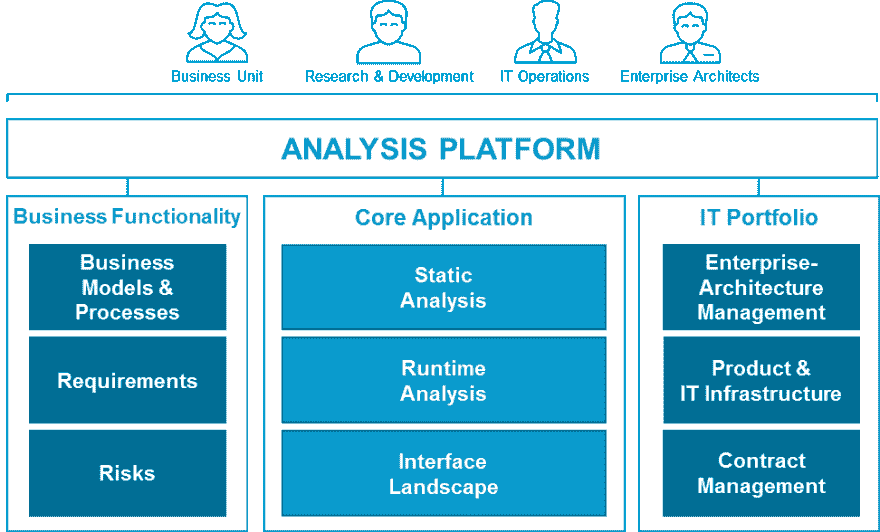
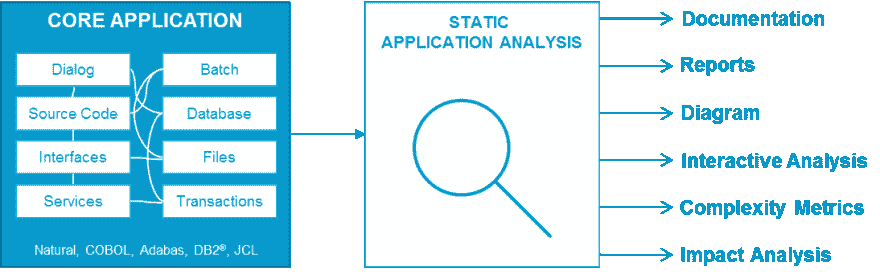
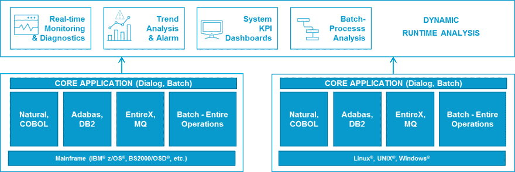
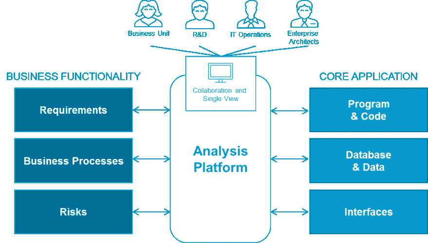
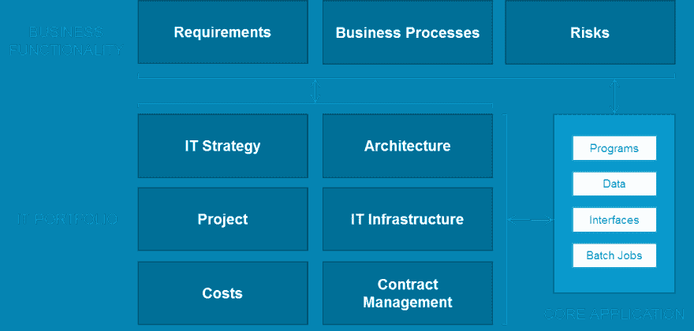
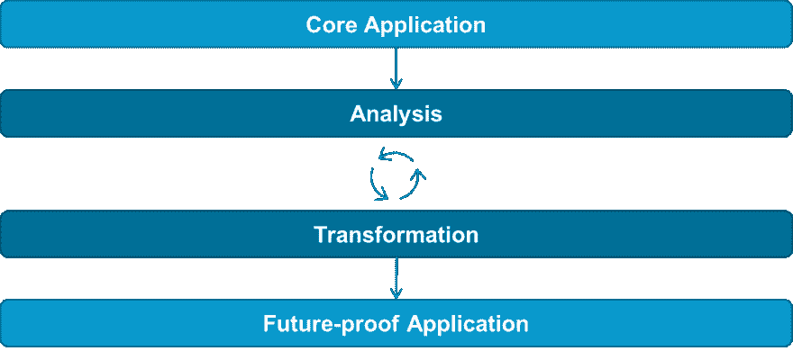

# 关键业务核心应用程序的分析

> 原文：<https://dev.to/techcommunity/analysis-of-business-critical-core-applications-ini>

# 阿达巴斯&自然 2050

* *对于许多 IT 部门来说，在削减成本和为业务模式提供最佳支持之间取得平衡是一项重大挑战。他们还需要计算如何根据业务模式的需求调整 IT 支持的数量，而不增加其 IT 基础架构的复杂性，也不允许应用程序环境失控。从进行全面的分析到建立关键的决策参数，本文涵盖了成功的核心应用程序转换的旅程，以适应业务模型的需求。**

## 不断变化的 IT 环境中的核心应用

每个大型且不断发展的 IT 应用程序环境都有大量的业务关键型应用程序，这些应用程序都是在多年的时间里单独开发的。他们承受未来的能力必须接受考验。这些定制的核心应用程序可以在公共和私营部门的组织中实现核心流程或管理巨大的财务数据流。他们的任何失误都会给公司带来巨大的经济损失和/或不可挽回的形象损害。

由 It 决策者来决定这些应用程序的未来:它们应该被替换、重新实施还是现代化？在此决策阶段，对某些方面(如复杂性、专业知识、透明度、治理)的错误或考虑不充分将导致项目失败(“钱坑”)或错过最后期限和预算，而不会增加业务或 IT 的价值。

为了降低风险、最大化潜在收益并确保项目成功，必须在决策过程中纳入广泛的核心应用程序分析。分析必须考虑核心应用程序的技术和业务功能，以及所有相关利益方的知识，如业务部门、用户、程序员和 it 运营。

最终目标是实现渐进、透明和可控的应用转型，在不损害现有应用的内在价值或运营的情况下，满足不断增长的数字世界的当前和未来需求。

## 需要综合分析

如果系统之间的依赖关系不清楚，如果模块和元素不透明，并且接口维护得很差并且只有最低限度的文档记录，那么转换如何能够成功呢？如果您不知道业务流程中使用了哪些模块和组件，以及如何使用，那么如何进行转换呢？当工作人员即将退休时，哪些应用程序知识将会丢失？在这些条件下，如何现实地计算成本、时间和风险等因素的价值？

全面的分析必须解决这些问题，以便为决策建立一个坚实的信息基础，从而以可控的方式将应用程序发展成面向未来的架构。

 

_ **图 1:** 核心应用分析与改造 _

应用程序的分析必须涉及所有相关的组织实体，如业务部门和研发部门。分析必须涵盖核心应用程序的业务和 IT 环境，例如，行业特定的方法、业务流程、软件产品、IT 基础架构和 IT 架构。

只有对业务和 IT 环境进行完整的分析，才能使您对核心应用程序进行彻底的评估，从而在预计风险的情况下做出决策。除了应用程序细节之外，开发和运行时环境(例如，编程语言和环境、数据库系统、中间件、作业控制)以及 IT 基础设施(例如，操作系统、硬件、设备)中的系统组件和系统的依赖性必须是透明的。

必须考虑静态方面(例如，应用程序结构、源代码、接口)以及动态标准(例如，运行时行为)。所有相关的业务和 IT 因素必须一致地记录下来，并且相互关联。所有利益相关者都应该能够访问分析结果，以便查看和用于协作决策。

 

_ **图 2:** 核心应用 _

## 核心应用的复杂性

业务关键型应用程序，无论是对话框还是批处理，都非常复杂。这不仅反映在源代码中，还反映在各自的业务和数据库事务逻辑中。还涉及多个接口，这些接口将内部和外部 IT 系统紧密地联系在一起，为各种业务流程和用户组提供服务。

核心应用程序主要运行在大型机平台或高度可扩展的服务器平台上，并采用 Natural、COBOL、Adabas、DB2 或 VSAM 等技术。由于这些系统经过多年的优化，它们实现了高水平的运行质量，这从它们严格的服务级别协议(SLA)的履行中可以明显看出。

由于员工退休和随之而来的代际转换等因素，这些关联应用程序的完全透明性和完整知识面临风险。IT 实施和相关业务功能的最新、一致的文档通常不可用。

 

_ **图 3:** 核心应用的复杂性 _

## 一个综合分析平台

为了记录所有与上下文相关的元素，建立它们之间的关系，并与各种利益相关者共享它们，您需要一个集成的协作分析平台。这是定义与核心应用程序和 IT 投资组合和企业架构的主要元素相关的业务功能信息的地方。

这为所有利益相关者的查询和决策提供了一个全面、一致和集中的知识库。

## 核心应用分析

核心应用程序分析必须考虑结构(静态)和运行时(动态)方面，以确定应用程序使用的复杂程度和关键程度。

 

_ **图 4:** 综合分析平台 _

## 静态应用分析

业务和流程逻辑由源代码以及相关的程序结构和库来实现。然而，源代码通常包含比结构更多的“意大利面条式代码”，这使得识别和改变业务逻辑变得困难。Natural Engineer 是一个用于静态应用程序(例如，程序和数据结构)分析的工具，它准确地映射了当前的情况。各种评估选项可以使静态应用程序分析的复杂性更易于管理。

 

_ **图 5:** 静态应用分析 _

理想的分析平台，如 Natural Engineer，提供以下功能:

*   COBOL、IBM CICS 表、JCL 和自然源代码的分析工具
*   支持 Adabas & Natural、COBOL 和其他 3GL 语言和特性，例如各种编程类型，如子程序和复制本以及不同的产品版本
*   界面识别和文档
*   以多种格式(如 Microsoft Excel、Microsoft Word、PDF 和 HTML)自动生成应用程序文档、结构图(如控制流、决策表)、报告和影响分析
*   数据库(如 Adabas、DB2)、数据库结构和访问类型的识别
*   复杂性度量(例如，McCabe、Halstead)
*   过时或冗余源代码的识别
*   基于网络的工具，用于程序结构和依赖关系的交互式导航

## 流程的动态分析

动态分析评估应用程序的运行时事务负载、数据库访问、用户交互以及正常操作和峰值负载期间的服务调用。它提供了特定时间段内应用程序的用户数量信息，以及处理峰值负载的效率。

整个操作评估批处理作业操作和整个批处理作业网络。检查所有作业的处理状态，以检测和报告任何违反 SLA 的情况，并更好地了解依赖性。

 

_ **图 6:** 对话框和批处理应用的动态分析 _

一个理想的分析平台，如完整的操作，提供以下动态分析功能:

*   对话框和批处理应用程序支持
*   执行时的源代码诊断(概要分析和代码覆盖率)
*   跨分布式和异构平台的生产状态监控
*   通过定期监控系统 KPI 来检测关键情况
*   测量和可视化已完成的批处理过程，并确定过程差异(目标与实际)
*   用于快速、轻松评估的图形仪表盘

## 分析业务功能

分析核心应用程序业务功能的主要目的是建立业务和技术元素之间的关系，以便确定应用程序的哪些部分实现了哪些业务规则和/或流程。只有这些关联才能提供应用程序的全貌，允许业务部门和 IT 部门的员工之间进行基于事实的交流。

静态分析工具 Natural Engineer 和用于业务功能分析的 ARIS 之间的接口以易于理解的方式为非技术人员提供了关于应用程序、程序和关系的知识。它是记录业务流程以及改进和增强建议的基础。

 

_ **图 7:** 核心应用业务功能分析 _

具有自然工程师 ARIS 界面和 ARIS 平台的理想分析提供了以下功能:

*   将业务流程和规则与实现组件配对
*   将技术程序逻辑转换成一种附加的文档格式，例如业务流程建模符号(BPMN ),这种格式易于被业务单位理解并对其有意义
*   将批处理数据与业务相关事件相匹配(业务逻辑)
*   а分析业务流程及其优化实施
*   促进业务和技术部门之间的协作

## IT 组合分析

核心应用程序及其业务功能的分析结果将为 IT 组合的总体清点和分析奠定基础。IT 组合分析应规划并评估业务功能、应用程序、技术、策略、需求、项目及其相互之间的复杂关系，目的是优化应用程序环境并使其与业务目标保持一致。

理想的情况是使用像 Software AG 的 Alfabet 这样的 IT 组合管理平台，并包括实施和法规遵从性治理的计划。在收集信息、评估投资组合和做出与投资组合相关的决策时，拥有明确的角色和职责尤为重要。IT 项目组合管理涉众需要关于应用程序及其上下文的可靠信息。他们还必须能够访问特定于角色的内容、视图、功能和工作流。

 

_ **图 8:** 业务功能、IT 组合和核心应用之间的关系 _

在分析过程中，IT 组合管理平台 Alfabet 使所有利益相关者能够:

*   链接业务功能、应用程序、技术、项目、战略、需求、项目和成本
*   定义记录和评估项目的标准，如成本/收益分析
*   利用应用程序和业务功能分析的结果来优化应用程序环境并使其与业务战略保持一致
*   评估当业务功能或技术发生变化时，应用程序组合会受到怎样的影响，反之亦然
*   为应用程序环境创建开发计划并监控其合规性
*   集成现有的 IT 存储库及其资产
*   配置报告和分析功能
*   定义和配置特定于角色的访问和工作流

## 规划和模拟战略性 IT 转型

对应用程序、业务功能和整个 IT 组合的分析结果是做出决策的起点，这些决策将有助于制定可靠的演进计划，将您当前的核心应用程序架构转变为经得起未来考验的目标架构。有效的分析允许相关部门根据需要持续监控和管理转换过程。在实施期间并行运行当前和目标应用程序意味着可以在早期评估修改或添加的架构元素，从而显著降低风险并缩短实施时间。

 

_ **图 9:** 进化改造核心应用 _

## 你的成功之路

成功的转型需要全面、相关的分析结果。分析应分三步进行:

1.  分析核心应用程序，考虑在线和批处理的静态和动态方法
2.  考虑第一步的结果，分析业务功能
3.  考虑第一步和第二步的结果，分析 IT 投资组合

如果有必要，子步骤可以同时进行，这可以帮助你快速得出有见地的结果。