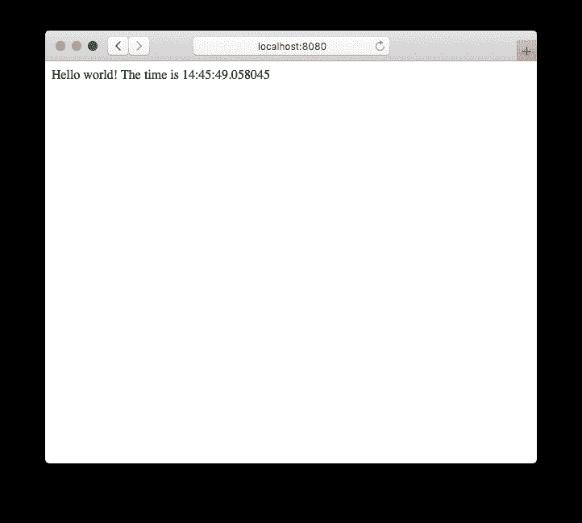
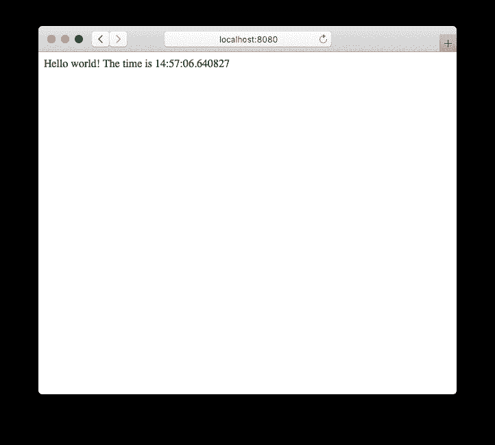
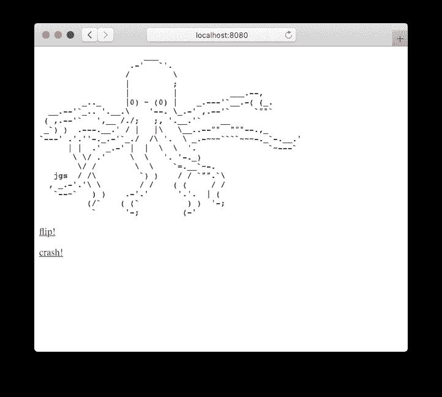
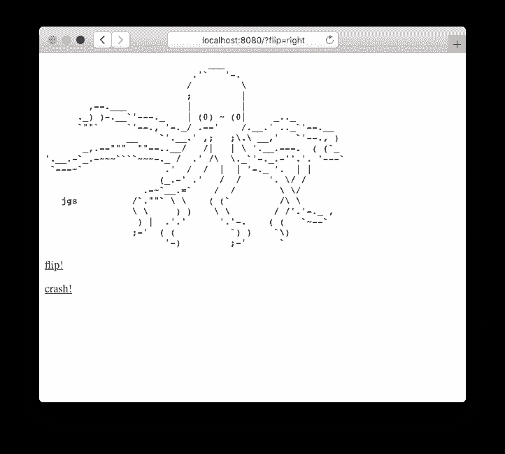

# 服务插件:从头构建一个仙丹 HTTP 服务器

> 原文：<https://dev.to/appsignal/serving-plug-building-an-elixir-http-server-from-scratch-205i>

欢迎回到另一个版本的炼丹术！在我们继续探索到底发生了什么的过程中，我们将深入研究 Elixir 中的 HTTP 服务器。

为了理解 HTTP 服务器如何工作，我们将实现一个可以运行插件应用程序的最小示例。我们将了解解码请求和编码响应，以及 Plug 如何通过构建一个 HTTP 服务器的最小子集来与 web 服务器交互，该服务器可以接受 HTTP 请求并运行一个 Plug 应用程序。

->我们正在构建的 HTTP 服务器是用于教育目的的。我们不会构建一个生产就绪的 HTTP 服务器。如果您正在寻找这样的服务器，请尝试使用 [cowboy](https://github.com/ninenines/cowboy) ，这是 Elixir 应用程序中 HTTP 服务器的默认选择。

## HTTP over TCP

我们将从基础开始。HTTP 是一种协议，通常使用 [TCP](https://en.wikipedia.org/wiki/Transmission_Control_Protocol) 在 HTTP 客户端(如 web 浏览器)和 web 服务器之间传输请求和响应。

Erlang 提供了`:gen_tcp`模块，可用于启动接收和传输数据的 TCP 套接字。我们将使用该库作为我们服务器的基础。

```
# lib/http.ex
defmodule Http do
  require Logger

  def start_link(port: port) do
    {:ok, socket} = :gen_tcp.listen(port, active: false, packet: :http_bin, reuseaddr: true)
    Logger.info("Accepting connections on port #{port}")

    {:ok, spawn_link(Http, :accept, [socket])}
  end

  def accept(socket) do
    {:ok, request} = :gen_tcp.accept(socket)

    spawn(fn ->
      body = "Hello world! The time is #{Time.to_string(Time.utc_now())}"

      response = """
      HTTP/1.1 200\r
      Content-Type: text/html\r
      Content-Length: #{byte_size(body)}\r
      \r
      #{body}
      """

      send_response(request, response)
    end)

    accept(socket)
  end

  def send_response(socket, response) do
    :gen_tcp.send(socket, response)
    :gen_tcp.close(socket)
  end

  def child_spec(opts) do
    %{id: Http, start: {Http, :start_link, [opts]}}
  end
end 
```

在这个例子中，我们创建了一个 TCP 服务器，它用 HTTP 响应中的当前时间来响应每个请求。

我们启动一个套接字来监听`start_link/1`中传入的端口，我们将在一个新的进程中生成`accept/1`，该进程通过调用`:gen_tcp.accept/1`来等待通过套接字传入的请求。

当它出现时，我们将其放入`request`变量，并创建一个响应发送给客户端。在这种情况下，我们将发送一个显示当前时间的响应。

> ### 构建 HTTP 响应
> 
> ```
> HTTP/1.1 200\r\nContent-Type: text/html\r\n\r\n\Hello world! The time is 14:45:49.058045
> ```
> 
> HTTP 响应包含几个部分:
> 
> *   状态行，带有协议版本(`HTTP/1.1`)和响应代码(`200`)
> *   一个[回车符](https://en.wikipedia.org/wiki/Carriage_return)，接着是一个[换行符](https://en.wikipedia.org/wiki/Newline) ( `\r\n`)，用于将状态行从其余的响应中分离出来
> *   (可选)标题行(`Content-Type: text/html`)，由 CRLFs 分隔
> *   一个双 CRLF，用于将消息头与响应正文分开
> *   将在浏览器中显示的响应正文(`Hello world! The time is 14:45:49.058045`)

我们将构建的主体传递给`send_response/2`，它负责通过套接字发送响应，并最终关闭套接字连接。

我们为每个请求生成一个进程，这样服务器可以再次调用`accept/1`来接受新的请求。这样，我们可以并行地响应请求，而不是让后续的请求必须等待前面的请求处理完毕。

## 运行服务器

让我们试一试。我们将使用一个[监控器](https://blog.appsignal.com/2017/08/10/elixir-alchemy-supervisors-building-fault-tolerant-elixir-applications.html)来运行我们的 HTTP 服务器，以确保它在失败时立即重启。

我们的服务器实现有一个`child_spec/1`函数，指定它应该如何启动。它声明应该用传递的选项调用`Http.start/1`函数，这将返回新生成的进程的 ID。

```
# lib/http.ex
defmodule Http do
  # ...

  def child_spec(opts) do
    %{id: Http, start: {Http, :start_link, [opts]}}
  end
end 
```

因此，我们可以将它添加到`lib/http/application.ex`中主管管理的孩子列表中。

```
# lib/http/application.ex
defmodule Http.Application do
  @moduledoc false
  use Application

  def start(_type, _args) do
    children = [
      {Http, port: 8080}
    ]

    opts = [strategy: :one_for_one, name: Http.Supervisor]
    Supervisor.start_link(children, opts)
  end
end 
```

当应用程序启动时，我们通过`{Http, port: 8080}`作为我们主管的一个孩子在端口 8080 启动服务器。

```
$ mix run --no-halt
19:39:29.454 [info]  Accepting connections on port 8080 
```

如果我们启动服务器并使用浏览器发送请求，我们可以看到它确实返回了当前时间。

[](https://res.cloudinary.com/practicaldev/image/fetch/s--7KMPdswz--/c_limit%2Cf_auto%2Cfl_progressive%2Cq_auto%2Cw_880/https://blog.appsignal.cimg/blog/2019-01/http_1.png)

## 塞

现在我们知道了 web 服务器是如何工作的，让我们进入下一个层次。我们当前的实现将响应硬编码到服务器中。为了让我们的 web 服务器运行不同的应用程序，我们将把应用程序移到一个单独的[插件](https://github.com/elixir-plug/plug)模块中。

```
# lib/current_time.ex
defmodule CurrentTime do
  import Plug.Conn

  def init(options), do: options

  def call(conn, _opts) do
    conn
    |> put_resp_content_type("text/html")
    |> send_resp(200, "Hello world! The time is #{Time.to_string(Time.utc_now())}")
  end
end 
```

`CurrentTime`模块定义了一个`call/2`函数，它接受传入的`%Plug.Conn`结构。然后，在发送“Hello world！”之前，它将响应内容类型设置为“text/html！”消息—连同当前时间—作为响应返回。

我们的新模块的行为与 web 服务器示例相同，但是它与 web 服务器是分离的。因为有了 Plug，我们可以在不改变应用程序代码的情况下更换服务器，我们也可以在不接触 web 服务器的情况下改变应用程序。

### 编写一个插头适配器

为了确保我们的 web 服务器能够与我们的 web 应用程序通信，我们需要构建一个`%Plug.Conn{}`结构来传递给`CurrentTime.call/2`。我们还需要将发送的响应转换成一个字符串，我们的 web 服务器可以通过套接字发送回来。

为此，我们将创建一个适配器来处理插件应用程序和 web 服务器之间的通信。

```
# lib/http/adapter.ex
defmodule Http.PlugAdapter do
  def dispatch(request, plug) do
    %Plug.Conn{
      adapter: {Http.PlugAdapter, request},
      owner: self()
    }
    |> plug.call([])
  end

  def send_resp(socket, status, headers, body) do
    response = "HTTP/1.1 #{status}\r\n#{headers(headers)}\r\n#{body}"

    Http.send_response(socket, response)
    {:ok, nil, socket}
  end

  def child_spec(plug: plug, port: port) do
    Http.child_spec(port: port, dispatch: &dispatch(&1, plug))
  end

  defp headers(headers) do
    Enum.reduce(headers, "", fn {key, value}, acc ->
      acc <> key <> ": " <> value <> "\n\r"
    end)
  end
end 
```

我们将使用适配器的`dispatch/2`函数构建一个`%Plug.Conn{}`结构，并将其传递给插件的`call/2`函数，而不是直接从`Http.accept/2`响应。

在`%Plug.Conn{}`中，我们将设置`:adapter`链接到我们的适配器模块，然后将应该发送的响应传递给套接字。这确保了插件程序知道在哪个模块上调用`send_resp/4`。

我们的适配器的`send_resp/4`接受套接字连接、响应状态、头列表和主体，这些都是由插件应用程序准备的。它使用传入的参数来构建响应，并调用我们之前实现的`Http.send_response/2`。

我们适配器的`child_spec/1`返回`Http`模块的`child_spec/1`。这导致 web 服务器在我们监控适配器时启动。我们将把 dispatch 函数作为 dispatch 来传递，这样当 web 服务器收到响应时就可以调用它。

```
# lib/http/application.ex
defmodule Http.Application do
  @moduledoc false
  use Application

  def start(_type, _args) do
    children = [
      {Http.PlugAdapter, plug: CurrentTime, port: 8080}
    ]

    opts = [strategy: :one_for_one, name: Http.Supervisor]
    Supervisor.start_link(children, opts)
  end
end 
```

我们将启动`Http.PlugAdapter`，而不是在我们的应用程序模块中启动`Http`，它将负责设置插件、准备调度函数和启动 web 服务器。

```
# lib/http.ex
defmodule Http do
  require Logger

  def start_link(port: port, dispatch: dispatch) do
    {:ok, socket} = :gen_tcp.listen(port, active: false, packet: :http_bin, reuseaddr: true)
    Logger.info("Accepting connections on port #{port}")

    {:ok, spawn_link(Http, :accept, [socket, dispatch])}
  end

  def accept(socket, dispatch) do
    {:ok, request} = :gen_tcp.accept(socket)

    spawn(fn ->
      dispatch.(request)
    end)

    accept(socket, dispatch)
  end

  # ...
end 
```

因为我们现在在插件中处理请求，所以我们可以删除`Http.accept/2`中的大部分代码。`Http.start_link/2`函数现在将从适配器接收调度函数，该函数用于将请求发送到`Http.accept/2`中。

```
$ mix run --no-halt
19:39:29.454 [info]  Accepting connections on port 8080 
```

再次运行服务器，一切仍然和以前一样。然而，我们的 HTTP 服务器、web 应用程序和插件适配器现在是三个独立的模块。

[](https://res.cloudinary.com/practicaldev/image/fetch/s--JbehwlPI--/c_limit%2Cf_auto%2Cfl_progressive%2Cq_auto%2Cw_880/https://blog.appsignal.cimg/blog/2019-01/http_2.png)

## 换出插件应用

因为我们的服务器现在与我们的适配器和 web 应用程序是分离的，所以我们可以把插件换出来，在服务器上运行另一个应用程序。让我们试一试。

```
# mix.exs
defmodule Http.MixProject do
  # ...

  defp deps do
    [
      {:plug_octopus, github: "jeffkreeftmeijer/plug_octopus"},
      {:plug, "~> 1.7"}
    ]
  end
end 
```

在我们的`mix.exs`文件中，我们添加了`:plug_octopus`作为依赖项。

```
# lib/http/application.ex
defmodule Http.Application do
  @moduledoc false
  use Application

  def start(_type, _args) do
    children = [
      {Http.PlugAdapter, plug: Plug.Octopus, port: 8080}
    ]

    opts = [strategy: :one_for_one, name: Http.Supervisor]
    Supervisor.start_link(children, opts)
  end
end 
```

然后我们在我们的`Http.Application`模块中用`CurrentTime`替换`Plug.Octopus`。启动服务器，访问 [http://localhost:8080](http://localhost:8080) 现在显示一只章鱼！

[](https://res.cloudinary.com/practicaldev/image/fetch/s--05TlJ_1q--/c_limit%2Cf_auto%2Cfl_progressive%2Cq_auto%2Cw_880/https://blog.appsignal.cimg/blog/2019-01/octopus_1.png)

但是，点击*翻转！*和*撞车了！* buttons 不做任何事情，任何被调用的 URL 都显示相同的页面。这是因为我们完全跳过了解析请求。因为我们不读取请求，所以我们总是返回相同的响应。让我们解决这个问题。

## 解析请求

为了读取请求，我们需要从套接字读取响应。感谢我们在调用`:gen_tcp.listen/2`时传递的`http_bin`选项，请求以我们可以模式匹配的格式返回。

```
# lib/http.ex
defmodule Http do
  # ...

  def read_request(request, acc \\ %{headers: []}) do
    case :gen_tcp.recv(request, 0) do
      {:ok, {:http_request, :GET, {:abs_path, full_path}, _}} ->
        read_request(request, Map.put(acc, :full_path, full_path))

      {:ok, :http_eoh} ->
        acc

      {:ok, {:http_header, _, key, _, value}} ->
        read_request(
          request,
          Map.put(acc, :headers, [{String.downcase(to_string(key)), value} | acc.headers])
        )

      {:ok, line} ->
        read_request(request, acc)
    end
  end

  # ...
end 
```

`Http.read_request/2`函数接受一个套接字连接，并将从调度函数中调用。它将一直调用`:gen_tcp.recv/2`来接受请求中的行，直到收到一个`:http_eoh`响应，表明请求头的结束。

我们在包含完整请求路径的`:http_request`行进行匹配。稍后我们将使用它来提取路径和 URL 参数。我们还将匹配所有的`:http_header`行，我们将其转换成一个列表，稍后可以传递给我们的插件应用程序。

```
# lib/http/adapter.ex
defmodule Http.PlugAdapter do
  def dispatch(request, plug) do
    %{full_path: full_path} = Http.read_request(request)

    %Plug.Conn{
      adapter: {Http.PlugAdapter, request},
      owner: self(),
      path_info: path_info(full_path),
      query_string: query_string(full_path)
    }
    |> plug.call([])
  end

  # ...

  defp headers(headers) do
    Enum.reduce(headers, "", fn {key, value}, acc ->
      acc <> key <> ": " <> value <> "\n\r"
    end)
  end

  defp path_info(full_path) do
    [path | _] = String.split(full_path, "?")
    path |> String.split("/") |> Enum.reject(&(&1 == ""))
  end

  defp query_string([_]), do: ""
  defp query_string([_, query_string]), do: query_string

  defp query_string(full_path) do
    full_path
    |> String.split("?")
    |> query_string
  end
end 
```

我们从`Http.PlugAdapter.dispatch/2`调用`Http.read_request/1`。有了`full_path`，我们可以提取`path_info`(路径段列表)，和`query_string`(所有 URL 参数都在“？”之后)).我们将这些添加到`%Plug.Conn{}`中，让我们的插件应用程序处理剩下的部分。

重新启动服务器，我们现在可以翻转和崩溃的龙虾。

[](https://res.cloudinary.com/practicaldev/image/fetch/s--vV4E04YC--/c_limit%2Cf_auto%2Cfl_progressive%2Cq_auto%2Cw_880/https://blog.appsignal.cimg/blog/2019-01/octopus_2.png)

## 一个最小的 Web 服务器例子，翻转和崩溃

每个人都就位了，地板上没有螺丝钉，我们在 Elixir 中研究 HTTP 服务器的项目完成了。我们实现了一个 web 服务器，它从请求中提取数据，并用它向插件应用程序发送请求。它甚至包括并发性:由于每个请求产生一个单独的进程，我们的 web 服务器可以处理多个并发用户。

HTTP 服务器比我们在本文中展示的要多，但是我们希望从头实现一个服务器能让您对 web 服务器如何工作有所了解。

如果你想回顾代码，请查看已经完成的项目，如果你想阅读更多的炼丹术，别忘了[订阅邮件列表](https://appsignal.com/elixir-alchemy)！