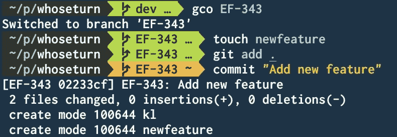

# 智能提交

> 原文：<https://dev.to/sbimochan/smart-commit-1gk2>

对于那些和吉拉一起工作的人，我们有一个惯例，就是在提交的名字前面加上票号。这个回购解决了这个繁琐的任务。

故事:我搜索了可以打印当前分支机构(我们的分支机构名称=吉拉机票号码)的命令，并决定用连字符、冒号和用户输入消息将它连接起来。

看一看。
[T3】](https://res.cloudinary.com/practicaldev/image/fetch/s--P2YHbwwY--/c_limit%2Cf_auto%2Cfl_progressive%2Cq_auto%2Cw_880/https://thepracticaldev.s3.amazonaws.com/i/lq5hoe75ktbu4liet5ak.jpg)

[智能提交 github 链接](https://github.com/sbimochan/smart-commit)