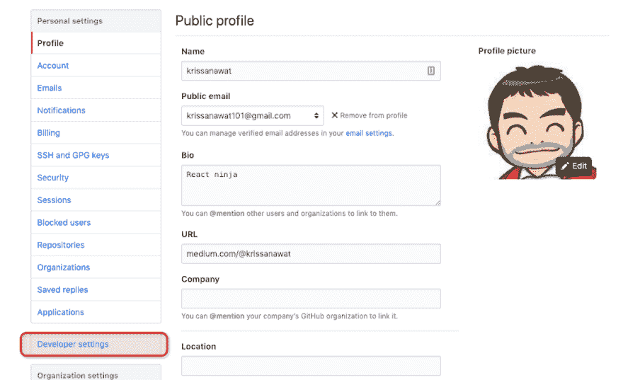
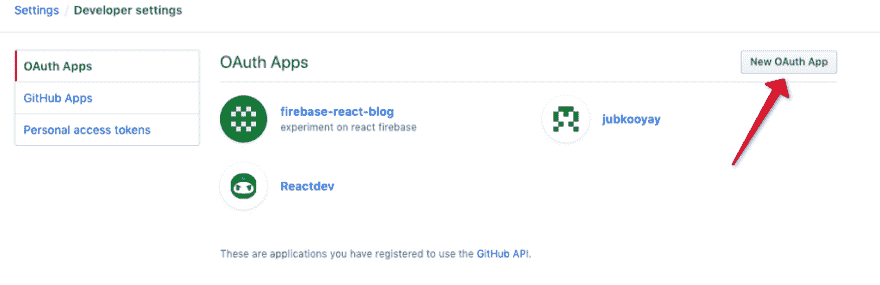
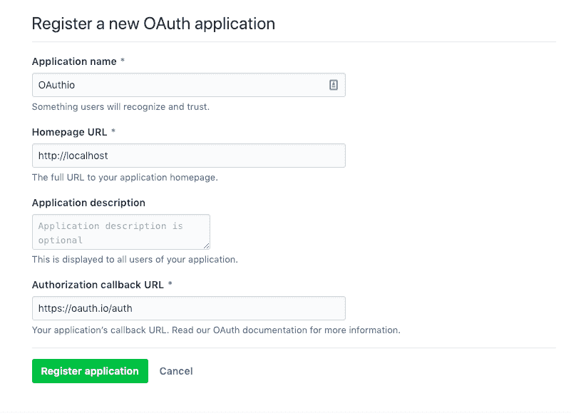
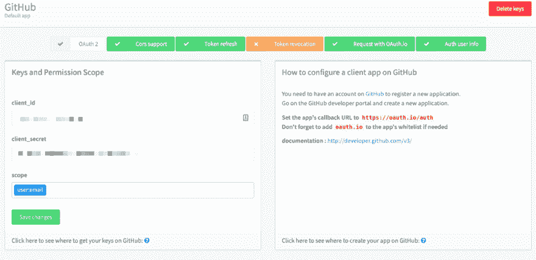
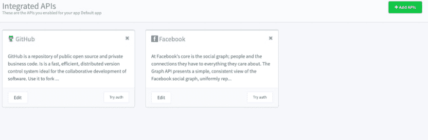
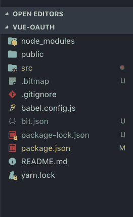

# 用 Oauth.io 创建简单的 OAuth Vue 组件

> 原文：<https://dev.to/kris/create-simple-oauth-vue-component-with-oauthio-1bcb>

[](https://res.cloudinary.com/practicaldev/image/fetch/s--Onzmpj5v--/c_limit%2Cf_auto%2Cfl_progressive%2Cq_auto%2Cw_880/https://cdn-images-1.medium.com/max/1024/1%2AQ4tNREv5fyicOw6ary1fdQ.png)

谁不想专注于创建产品而不是处理代码中的 OAuth 逻辑呢？将代码中的 OAuth 占用减少到一个请求！

在这篇文章中，我们将在 Vuejs 中用 [Oauth.io](https://oauth.io/?utm_source=medium&utm_medium=post&utm_content=krissanawat&utm_campaign=oauthio-vuejs) 创建一个简单的 Oauth 组件，OAuth 市场参与者有 100 多个提供商！更容易使用 5 线

[](https://res.cloudinary.com/practicaldev/image/fetch/s--ISL5wVGj--/c_limit%2Cf_auto%2Cfl_progressive%2Cq_auto%2Cw_880/https://cdn-images-1.medium.com/max/1024/1%2AR3h8Mx4qcMOA7M79Nf9j7g.png)

#### 设置 OAuth.io 用户

在 [Oauth.io](https://oauth.io/?utm_source=medium&utm_medium=post&utm_content=krissanawat&utm_campaign=oauthio-vuejs) 自行注册，免费！

[](https://res.cloudinary.com/practicaldev/image/fetch/s--vzlMnn-T--/c_limit%2Cf_auto%2Cfl_progressive%2Cq_auto%2Cw_880/https://cdn-images-1.medium.com/max/1024/1%2ArTy_GtdeT73XwMbve0yfwg.png)

登录后，您将进入如下所示的仪表板。

[](https://res.cloudinary.com/practicaldev/image/fetch/s--FU9TjWd7--/c_limit%2Cf_auto%2Cfl_progressive%2Cq_auto%2Cw_880/https://cdn-images-1.medium.com/max/1024/1%2AgnKQjLS0NnZ-3hIEaL8X1A.png)

您可以尝试任何集成，但首先要设置集成的 API。

### 添加 API

点击添加 API。

[](https://res.cloudinary.com/practicaldev/image/fetch/s--h8q1xqhM--/c_limit%2Cf_auto%2Cfl_progressive%2Cq_auto%2Cw_880/https://cdn-images-1.medium.com/max/1024/1%2AJilVHXNjaxNppV5W8ZSEVA.png)

选择脸书作为应用程序的提供商。

[](https://res.cloudinary.com/practicaldev/image/fetch/s--mGk47msD--/c_limit%2Cf_auto%2Cfl_progressive%2Cq_auto%2Cw_880/https://cdn-images-1.medium.com/max/605/1%2A9VX-OCgYs1x1ODen8VukFw.png)

现在，您需要 client_id 和 client_secret。因此，创建一个脸书应用程序来获取这些凭证。

[](https://res.cloudinary.com/practicaldev/image/fetch/s--FyzA9XXw--/c_limit%2Cf_auto%2Cfl_progressive%2Cq_auto%2Cw_880/https://cdn-images-1.medium.com/max/1024/1%2AQq2UeIwpy0hdKyfs-bVacg.png)

转到[https://developers.facebook.com](https://developers.facebook.com)创建一个应用程序，并插入 oauth.io 作为应用程序的域。

[](https://res.cloudinary.com/practicaldev/image/fetch/s--c5Dmrp2B--/c_limit%2Cf_auto%2Cfl_progressive%2Cq_auto%2Cw_880/https://cdn-images-1.medium.com/max/983/1%2AAr4YNmOvpaJ8jegUxgHDVg.png)

将回拨 URI 添加为 oauth.io/auth

[](https://res.cloudinary.com/practicaldev/image/fetch/s--nVu1UEzq--/c_limit%2Cf_auto%2Cfl_progressive%2Cq_auto%2Cw_880/https://cdn-images-1.medium.com/max/971/1%2Aqt_lmdY4h9dXDf6r963Bsw.png)

将 id 和秘密放入 OAuth.io 的表单中。

[](https://res.cloudinary.com/practicaldev/image/fetch/s--R2njWmqc--/c_limit%2Cf_auto%2Cfl_progressive%2Cq_auto%2Cw_880/https://cdn-images-1.medium.com/max/1024/1%2ADPGZKxFh3eGG7BlakFFk9A.png)

点击保存，你也可以添加更多的 API。让我们先利用脸书 API。

[](https://res.cloudinary.com/practicaldev/image/fetch/s--S6725acZ--/c_limit%2Cf_auto%2Cfl_progressive%2Cq_auto%2Cw_880/https://cdn-images-1.medium.com/max/1024/1%2AwAfILm_KlKIXdJpYIOymow.png)

Github 的第二个服务是

转到[开发者设置](https://github.com/settings/developers)

[](https://res.cloudinary.com/practicaldev/image/fetch/s--lF0pe9mv--/c_limit%2Cf_auto%2Cfl_progressive%2Cq_auto%2Cw_880/https://cdn-images-1.medium.com/max/1024/1%2AAh0JPt1AagAaYNfrYBiRuw.png)

创建新应用程序

[](https://res.cloudinary.com/practicaldev/image/fetch/s--RKhRugCz--/c_limit%2Cf_auto%2Cfl_progressive%2Cq_auto%2Cw_880/https://cdn-images-1.medium.com/max/1024/1%2AqHHjSFngsbwG8akJ5gBA1A.png)

填写应用信息

[](https://res.cloudinary.com/practicaldev/image/fetch/s--wnedEvL1--/c_limit%2Cf_auto%2Cfl_progressive%2Cq_auto%2Cw_880/https://cdn-images-1.medium.com/max/801/1%2AAsWSpMCmCSxh63ITB67jHQ.png)

复制应用程序 id 和应用程序密码

[](https://res.cloudinary.com/practicaldev/image/fetch/s--StGk3gXh--/c_limit%2Cf_auto%2Cfl_progressive%2Cq_auto%2Cw_880/https://cdn-images-1.medium.com/max/1024/1%2ATJgKHTdopOddyA00lS0Gyw.png)

我们得到两种服务

[](https://res.cloudinary.com/practicaldev/image/fetch/s--WI_jcbqQ--/c_limit%2Cf_auto%2Cfl_progressive%2Cq_auto%2Cw_880/https://cdn-images-1.medium.com/max/1024/1%2AChSRAQ0fVsF4pBgAh87HVw.png)

### 创建一个 Vue 组件

创建一个 Vue 组件来使用 Oauth.io SDK。oauth.io 的文档位于 [http://docs.oauth.io](http://docs.oauth.io/)

为了快速演示，我将在 VS 代码中使用 Vue CLI 准备一个小组件。

[](https://res.cloudinary.com/practicaldev/image/fetch/s--V7GjWDse--/c_limit%2Cf_auto%2Cfl_progressive%2Cq_auto%2Cw_880/https://cdn-images-1.medium.com/max/1024/1%2Af0_ZHtY6AKHuO4GdIr_tkA.png)

OAuth 组件结构

[](https://res.cloudinary.com/practicaldev/image/fetch/s--iFISGhyD--/c_limit%2Cf_auto%2Cfl_progressive%2Cq_auto%2Cw_880/https://cdn-images-1.medium.com/max/263/1%2A8xXx3SHoBkbJPYGgYBBQqQ.png)

在组件文件夹中创建 OAuth.vue，然后一步一步地操作

1.  导入必要的 CSS

```
<style>

@import "https://cdnjs.cloudflare.com/ajax/libs/twitter-bootstrap/3.4.0/css/bootstrap.css";
@import "https://cdnjs.cloudflare.com/ajax/libs/bootstrap-social/5.1.1/bootstrap-social.min.css";
@import "https://stackpath.bootstrapcdn.com/font-awesome/4.7.0/css/font-awesome.min.css";

</style> 
```

1.  导入必要的类

```
<script>
import { OAuth } from "oauthio-web";
export default {

};
</script> 
```

1.  创建 props 属性来存储与 props 一起传递的服务名

```
props: ["provider"], 
```

4 .添加数据属性以连接 bootstrap-social 类和服务名

```
data() {
 return {
 class1: "fa fa-" + this.provider,
 class2: "btn btn-block btn-social btn-" + this.provider
 };
 }, 
```

1.  使用 OAuth.io 仪表板中的 initialize and add API-key 初始化 OAuth-io SDK

```
created() {
 OAuth.initialize("API-Key");
} 
```

1.  创建 OAuth 处理程序方法

```
methods: {
 Auth() {
 OAuth.popup(this.provider)
 .done(res => {
 console.log(res.access\_token);
 })
 .fail(err => {
 //todo when the OAuth flow failed
 });
 }
 } 
```

1.  呈现登录按钮和类、事件句柄

```
<template>
 <a @click="Auth();" :class="class2">
 <span :class="class1"></span> Sign in with {{ provider }}
 </a> </template> 
```

1.  最后，在 App.vue 中导入这个组件

```
<template>
 <div class="container">
 <h1>Social Login with OAuth.io</h1>
 <div class="row">
 <div class="col-sm-4 social-buttons"></div>
 <div class="col-md-4 col-md-offset-3 social-buttons">
 </div>
 </div>
 </div> </template> 
<script>
import OAuth from "./components/OAuth";

export default {
 name: "App",
 components: {
 OAuth
 }
};
</script> 
```

1.  通过将组件放置在某处来激活它

```
<OAuth provider="facebook" />
<OAuth provider="github" /> 
```

[https://codesandbox.io/embed/32qnq0y8vm](https://codesandbox.io/embed/32qnq0y8vm)

### 包装完毕

本教程到此为止！

我们创建了一个 Vue OAuth 组件，它使用 [Oauth.io](https://oauth.io/?utm_source=medium&utm_medium=post&utm_content=krissanawat&utm_campaign=oauthio-vuejs) 来呈现一个简单的脸书和 Github 登录选项

希望你玩得开心，随时评论和询问任何事情。鼓掌表示支持！

* * *