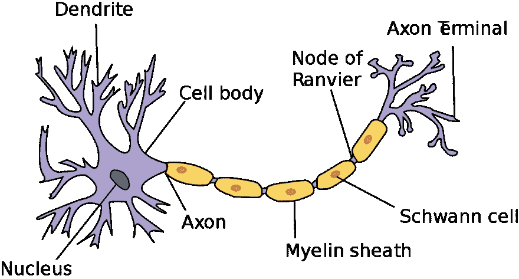
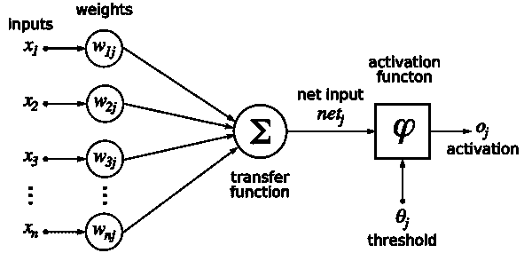
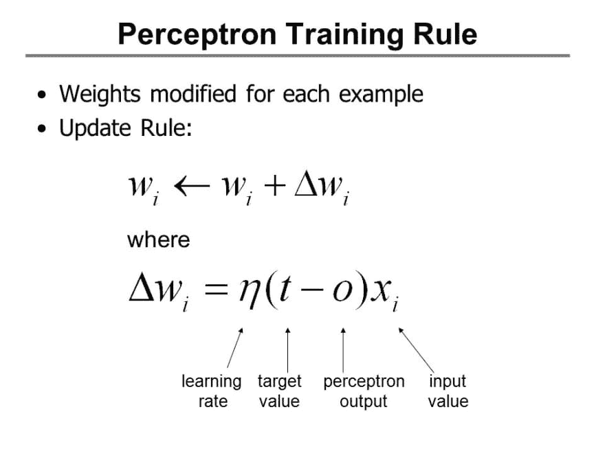
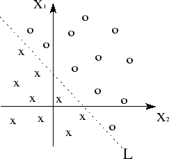
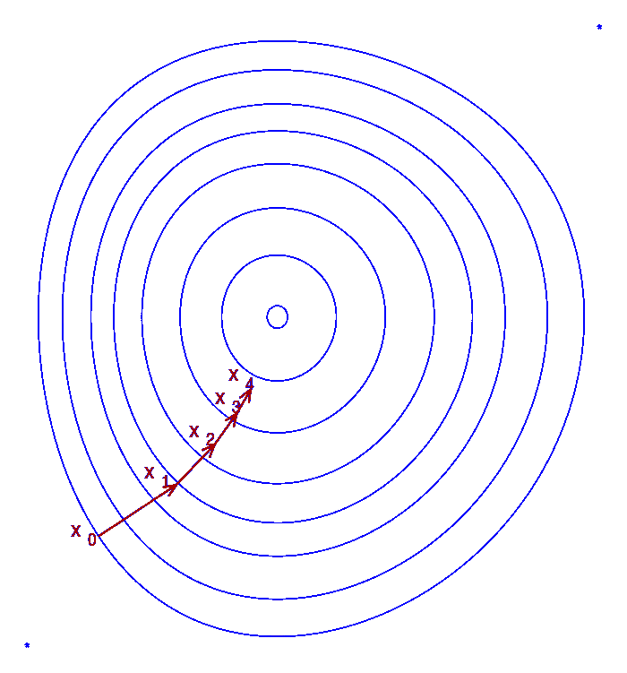
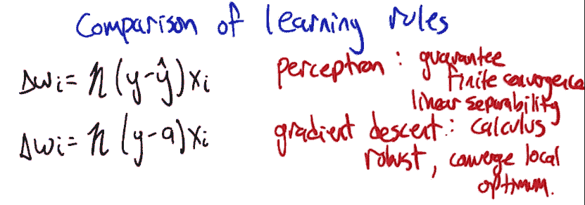
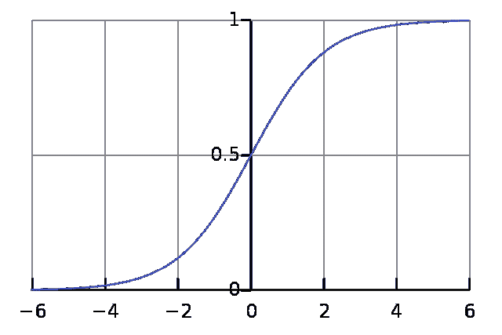
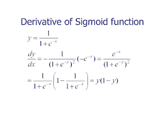
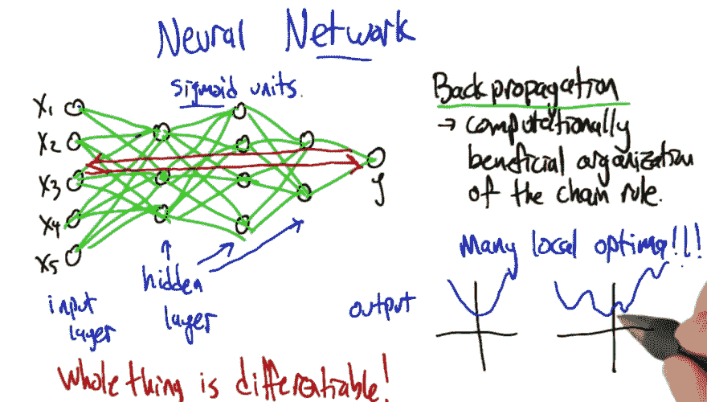

# 监督学习:神经网络

> 原文：<https://dev.to/swyx/supervised-learning-neural-networks-mpo>

*这是我学习[佐治亚理工学院/Udacity 机器学习课程](https://www.udacity.com/course/machine-learning--ud262)的系列课堂笔记中的第四篇。课堂教材是汤姆·米切尔的[机器学习。](https://www.cs.ubbcluj.ro/~gabis/ml/ml-books/McGrawHill%20-%20Machine%20Learning%20-Tom%20Mitchell.pdf)*

## 神经元和感知器

看，一个神经元。希望你有一些这样的东西。

信息从细胞体沿着轴突以“尖峰脉冲串”的形式传播，并在其他神经元上引起突触兴奋。所以神经元是一个复杂的计算单位。它们可以通过学习过程来调整或训练，以对不同的事情开火，其他神经元可以对这些事情开火，等等。大脑是由 1000 亿个神经元组成的紧密的一团，或者你可以称之为一个自然的神经网络，它们一个接一个地进行有意识和无意识的决策。

人工神经元(又名感知器)试图模仿这一点:

一个输入向量被输入到神经元，神经元将它们乘以一个权重向量并求和。如果总和高于某个触发阈值，神经元被激活并触发输出 1。如果未激活，则输出为 0。

## 感知器单元有多强大？

它可以在多个维度上表示半个平面。

*   一个简单的感知器有两个二进制输入和相等的权重，阈值高于任一权重，可以表示 and 逻辑运算符。
*   如果阈值等于任一权重，则表示 OR 逻辑运算符。
*   同样你也可以什么都不做。

更多信息，你真的应该看看这个和相关的视频:

[https://www.youtube.com/embed/VwCMm3llk1s](https://www.youtube.com/embed/VwCMm3llk1s)

要进行 XOR 运算，您必须将感知器组合在一起，方法是对 AND 感知器和 OR 感知器应用强负权重:

[https://www.youtube.com/embed/2KUq_Ou-7FY](https://www.youtube.com/embed/2KUq_Ou-7FY)

## 感知器训练

我们应该自动设置砝码，而不是像以前那样手动设置。实现这一点的两种方法是:

*   感知机规则
*   梯度下降/增量规则

## 感知器法则

设置单个单元，使其与训练集相匹配。

**权重变化**等于**目标**(我们希望它是 0 或 1)和**输出**(网络当前输出的，也是 0 或 1)的差乘以**输入**和**学习率**(这是一个小数字，比如 0.01)。

换句话说，如果感知器的输出是正确的，那么权重就不会有变化。但是如果输出是错误的，权重将向目标与输出的差异方向移动一小步。

如果一个数据集是[线性可分的](https://en.wikipedia.org/wiki/Linear_separability)，感知器规则将找到正确的平面来分离它们。太酷了！

然而，如果数据集不是线性可分的(我们没有办法提前知道，尤其是在多维空间)，感知器规则就会陷入无限循环。我们需要更结实的东西。

## 渐变下降

与感知器规则相反，梯度下降抛弃了阈值的概念。它使用相同的增量更新机制，但使用偏导数代替。事实上，这些公式看起来非常相似:

如果数据是线性可分的，感知器规则保证有限收敛。梯度下降更健壮，但是只能收敛到局部最优。

我们不能在感知器规则的`y_hat`上使用梯度下降的原因是因为激活阈值行为是一个不连续的不可微的函数。如果我们把它改成一个函数，看起来有点像激活函数，但是*是*可微的，会怎么样？

## s 形函数

方程形式的 [sigmoid 函数](https://en.wikipedia.org/wiki/Sigmoid_function)看起来非常简单，并且具有非常吸引人的图表形式:

如果你把它变得足够窄，它看起来就像二元激活函数！如果你对它求导，结果是`sigmoid(a)`乘以`(1 - sigmoid(a))`:

对于梯度下降的目的，这是一个非常简洁的封闭形式的解决方案。

## 联网感知器

拥有一个可微分的感知器网络是非常有用的。尽管在输入和输出之间有多个隐藏层，我们[可以反向传播](https://en.wikipedia.org/wiki/Backpropagation)误差来更新整个网络的权重！

## 优化权重

在梯度下降中，你经常会陷入局部最优。

要打破这种局面，您可以:

*   使用[动量项](https://en.wikipedia.org/wiki/Stochastic_gradient_descent#Momentum)
*   使用[随机优化](https://en.wikipedia.org/wiki/Random_optimization)
*   惩罚复杂性(类似于我们之前讨论的回归/决策树过度拟合)
    *   更多节点
    *   更多层
    *   大数(非显而易见！)

## 神经网络中的偏差

**限制偏差**(我们将考虑的一组假设):

*   感知器:半平面
*   Sigmoid 单元:复杂得多——它们可以表示布尔、连续(一个隐藏层)和任意函数(两个隐藏层)。

所以神经网络根本没有太多的限制偏差。也意味着很有可能过度拟合。为了防止这种情况，我们还使用交叉验证并寻找误差中的偏差来识别过度拟合。

**偏好偏差**(算法对一种表示的偏好超过另一种表示):

我们已经为梯度下降指定了一切，除了它是如何初始化的！我们最常使用的是小随机值。这是因为大权重让我们代表任意复杂的函数，这是不好的。

## 阅读更多

更多信息请参见[这里的 PDF 摘要](https://s3-us-west-2.amazonaws.com/gae-supplemental-media/neural-networkspdf/Neural-Networks.pdf)。

## 我们系列的下一个

希望这是对神经网络的一个好的介绍。我正在计划更多的初级读本，希望您能就以下方面提供反馈和问题:

*   [概述](https://dev.to/swyx/machine-learning-an-overview-216n)
*   监督学习
    *   [决策树](https://dev.to/swyx/machine-learning-classification-learning--decision-trees-1mbh)
    *   [回归](https://dev.to/swyx/supervised-learning-regression-4d17)
    *   [神经网络](https://dev.to/swyx/supervised-learning-neural-networks-mpo)
    *   [基于实例的学习(K 最近邻)](https://dev.to/swyx/supervised-learning-instance-based-learning-and-k-nearest-neighbors-kge)
    *   [集成学习(AdaBoost)](https://dev.to/swyx/supervised-learning-ensemble-learning-lim)
    *   [内核方法&支持向量机](https://dev.to/swyx/supervised-learning-support-vector-machines-3mgk)
    *   [计算学习理论](https://dev.to/swyx/supervised-learning-computational-learning-theory-160h)
    *   [VC 尺寸](https://dev.to/swyx/supervised-learning-vc-dimensions-10b)
    *   [贝叶斯学习](https://dev.to/swyx/supervised-learning-bayesian-learning-403l)
    *   [贝叶斯推理](https://dev.to/swyx/supervised-learning-bayesian-inference-4l72)
*   无监督学习
    *   [随机优化](https://dev.to/swyx/unsupervised-learning-randomized-optimization-4c1i)
    *   [信息论](https://dev.to/swyx/unsupervised-learning-information-theory-recap-4iem)
    *   聚类-2 月 25 日这一周
    *   功能选择-3 月 4 日开始的一周
    *   功能转变-3 月 11 日开始的一周
*   强化学习
    *   马尔可夫决策过程-3 月 25 日的一周
    *   “真实”RL-4 月 1 日开始的一周
    *   博弈论-4 月 15 日的一周