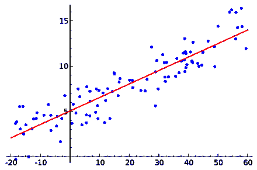
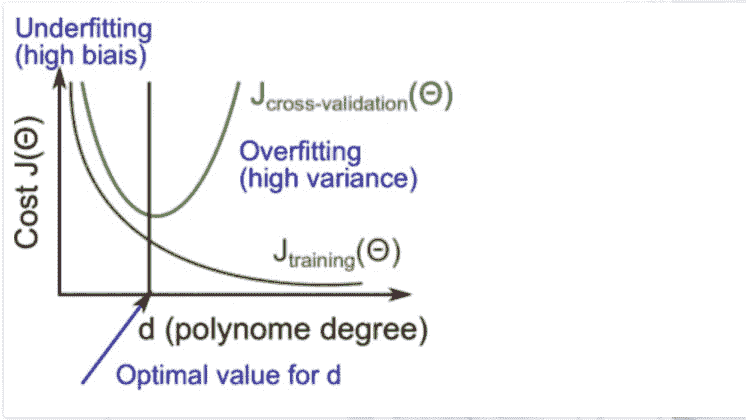
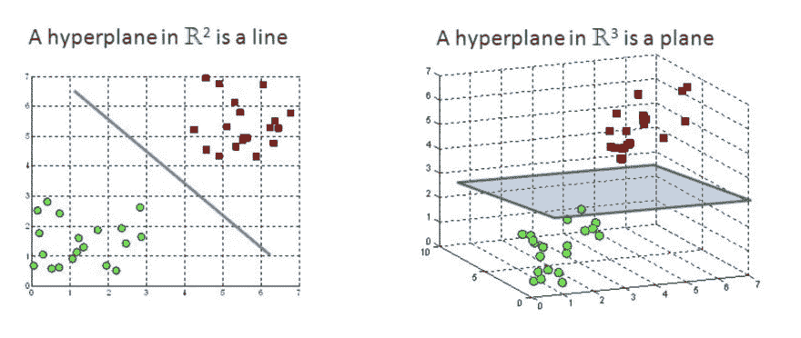

# 监督学习:回归

> 原文：<https://dev.to/swyx/supervised-learning-regression-4d17>

*这是我学习[佐治亚理工学院/Udacity 机器学习课程](https://www.udacity.com/course/machine-learning--ud262)的系列课堂笔记中的第三篇。课堂教材是汤姆·米切尔的[机器学习。](https://www.cs.ubbcluj.ro/~gabis/ml/ml-books/McGrawHill%20-%20Machine%20Learning%20-Tom%20Mitchell.pdf)*

## 回归&函数逼近

我们现在把注意力转向连续变量，而不是离散变量。我们在[统计](https://en.wikipedia.org/wiki/Regression_analysis)这个词的意义上使用了**回归**这个词。

我假设你知道这里的线性回归(包括所有的线性代数部分)，但是如果你需要赶上进度，这里有一个 pdf 摘要。

总的来说，你需要为回归选择一个好的多项式来拟合你的数据，但是不要以一种不能很好概括的方式过度拟合它。(例如 9 点数据集的 8 阶多项式)

## 错误

训练数据经常有错误。他们从哪里来？

*   传感器误差
*   恶意/不良数据
*   人为误差
*   未建模误差

误差会产生噪声，回归帮助我们在没有噪声的情况下逼近函数。

## 交叉验证

目标总是概括。我们需要一个好的检查来做我们的回归，以确保我们是正确的概括。我们不能使用测试集，因为那是“作弊”,所以解决方案是(从我们的训练集中)分离出另一组数据，其唯一目的是[交叉验证](https://en.wikipedia.org/wiki/Training,_validation,_and_test_sets#Cross-validation)

## 误差 vs 多项式

交叉验证对于防止过度拟合的有用性在这里很有帮助:

最初，两个过程开始时在低阶多项式上有中等误差。(数据为**欠拟合**)。随着这个数值的增加，拟合度会越来越好。然而，超过某个点后，多项式继续越来越好地拟合训练集，但在 CV 集上表现较差。这是你知道你已经开始**过度适应**的地方。

## 其他输入空格

到目前为止，我们已经讨论了具有连续输出的标量输入，但是同样的方法也可以应用于具有更多输入特征的矢量输入。如果你想听起来自命不凡，你可以称之为超平面:

但实际上它是二维折线图的多维模拟。

您可以将离散值编码为回归值、标量值或布尔向量。

## 我们系列的下一个

不幸的是，我以前是一名数学专业的学生，并没有发现这个系列的这一部分有什么值得注意或解释的。如果你需要一本关于回归的入门书，可以参考上面的链接资源或者寻找你自己的教程。我正在计划更多的初级读本，希望您能就以下方面提供反馈和问题:

*   [概述](https://dev.to/swyx/machine-learning-an-overview-216n)
*   监督学习
    *   [决策树](https://dev.to/swyx/machine-learning-classification-learning--decision-trees-1mbh)
    *   [回归](https://dev.to/swyx/supervised-learning-regression-4d17)
    *   [神经网络](https://dev.to/swyx/supervised-learning-neural-networks-mpo)
    *   [基于实例的学习(K 最近邻)](https://dev.to/swyx/supervised-learning-instance-based-learning-and-k-nearest-neighbors-kge)
    *   [集成学习(AdaBoost)](https://dev.to/swyx/supervised-learning-ensemble-learning-lim)
    *   [内核方法&支持向量机](https://dev.to/swyx/supervised-learning-support-vector-machines-3mgk)
    *   [计算学习理论](https://dev.to/swyx/supervised-learning-computational-learning-theory-160h)
    *   [VC 尺寸](https://dev.to/swyx/supervised-learning-vc-dimensions-10b)
    *   [贝叶斯学习](https://dev.to/swyx/supervised-learning-bayesian-learning-403l)
    *   [贝叶斯推理](https://dev.to/swyx/supervised-learning-bayesian-inference-4l72)
*   无监督学习
    *   [随机优化](https://dev.to/swyx/unsupervised-learning-randomized-optimization-4c1i)
    *   [信息论](https://dev.to/swyx/unsupervised-learning-information-theory-recap-4iem)
    *   聚类-2 月 25 日这一周
    *   功能选择-3 月 4 日开始的一周
    *   功能转变-3 月 11 日开始的一周
*   强化学习
    *   马尔可夫决策过程-3 月 25 日的一周
    *   “真实”RL-4 月 1 日开始的一周
    *   博弈论-4 月 15 日的一周