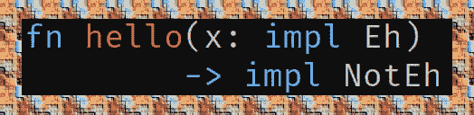

# 程序员的 Rust impl 特征

> 原文：<https://dev.to/hertz4/rust-impl-trait-for-programmers-k15>

[](https://res.cloudinary.com/practicaldev/image/fetch/s--a1Nn5Cm1--/c_limit%2Cf_auto%2Cfl_progressive%2Cq_auto%2Cw_880/https://thepracticaldev.s3.amazonaws.com/i/65m72cdmjuuor8r8rzqy.png)

# 目录

1.  [简介](#orgf424d38)
2.  [例题](#org450011c)
    1.  [返回 impl 特性](#orgd8294b0)
    2.  [参数输入特性](#org3916b39)
    3.  [与 dyn/动态类型的关系](#org361baaa)
3.  [解说](#orgcfa2305)
    1.  [论点立场争议](#org3776596)
    2.  [impl 性状的未来](#org1445a82)
    3.  [类型理论在哪里？](#org8c880cb)
    4.  [应用示例(返回位置)](#org642d739)

# 简介

Rust 的`impl Trait`有点用。

能够在函数中隐藏类型。最好放在`-> return`位置，但也可以放在`(argument)`位置。

当你知道你想要某样东西的什么特性，但你不在乎它到底是什么时，就用它。

# 例子

## 返回 impl 特征

就是这里:

```
 use std::fmt::Display;

    // First case: compiler wants more
    fn <T: Display>does_not_work() -> T {"Whoops!"}
    // Second case: compiler satisfied
    fn actually_works() -> impl Display {"Not whoops!"} 
```

没有 impl Trait，看起来是这样的:

```
 fn old_explicit_way_that_works() -> String {"Duh"}
    fn slow_way_that_works() -> Box<dyn Display> {Box::new("Hello")} 
```

有时候，旧的方法需要你写一个大的，可怕的类型，这与它实际上是如何被使用的毫无关系。这个解决了这个问题。

## 自变量 impl Trait

下面两件事几乎一模一样:

```
 fn visible_type_parameter<T: Trait>(x: T) {}
    fn hidden_type_parameter(x: impl T) {} 
```

使用`turbofish_aka_explicit_type::<DesiredType>`指定 T 有时很有帮助。这在目前的`impl T`中是不可能的。这个不要想多了；我喜欢类型参数。见辩论评论。

## 与 dyn/动态类型的关系

由`&'lifetime dyn Trait`或`Box<dyn Trait>`指定的运行时特征对象可以被转换成编译时类型。这是从动态类型到静态类型的转换。

```
 trait Trait {}
    struct Type;
    impl Trait for Type {}

    fn dynamic_type(x: &dyn Trait) {}

    fn static_explicit_type(x: &Type) {}
    fn static_implicit_hidden_type(x: &impl Trait) {}
    fn static_implicit_visible_type<T: Trait>(x: &T) {}

    fn main() {
        let x = Type;
        dynamic_type(&x as &Type);
        static_explicit_type(&x);
        static_implicit_hidden_type(&x);
    //    static_implicit_hidden_type::<Type>(&x); doesn't work (yet?)
        static_implicit_visible_type(&x);
        static_implicit_visible_type::<Type>(&x);
    } 
```

这只在`&dyn Trait`引用单一类型时有效；也就是说，一个函数只能返回一种类型。

# 解说

## [争论立场](#argument-position-controversy)争论

[https://github.com/rust-lang/rfcs/pull/2444](https://github.com/rust-lang/rfcs/pull/2444)
这个问题我不好概括。自己看，尤其是最后一个帖子，来个感悟。

## impl 性状的未来

官方追踪发布:
[https://github.com/rust-lang/rust/issues/34511](https://github.com/rust-lang/rust/issues/34511)
现在是 2019 年 1 月。这是我所看到的:

*   存在主义类型(又名`type x = impl Trait`,但在某种程度上是有意义的)
*   `impl X + Y`为多个性状。
*   各种其他的东西使它更加完整。
*   势说明`::<Turbofish>`将出现一个 la "合成"型参数。[https://github . com/rust-lang/rust/issues/44721 # issue comment-330945507](https://github.com/rust-lang/rust/issues/44721#issuecomment-330945507)

## 类型论在哪里？

人们曾试图这样解释(存在主义？万能的？)，而是退一步看铁锈。`impl Trait`是类型推理的一个进步。

认识到我没有使用一套强大的工具来理解确实存在的类型系统。给这篇文章读一读:
[https://var kor . github . io/blog/2018/07/03/existence-types-in-rust . html](https://varkor.github.io/blog/2018/07/03/existential-types-in-rust.html)

## 应用示例(返回位置)

幼稚的尝试:

```
 use std::fmt::Display;

    fn main() {
        println!("{}", make_value(0));
        println!("{}", make_value(1));
    }

    fn make_value<T: Display>(index: usize) -> T {
        match index {
            0 => "Hello, World",
            1 => "Hello, World (1)",
            _ => panic!(),
        }
    } 
```

失败是因为…

```
 error[E0282]: type annotations needed
     --> /home/sam/code/trash/impl-return.rs:4:20
      |
    4 |     println!("{}", make_value(0));
      |                    ^^^^^^^^^^ cannot infer type for `T`

    error[E0308]: match arms have incompatible types
      --> /home/sam/code/trash/impl-return.rs:9:5
       |
    9  | /     match index {
    10 | |         0 => "Hello, World",
       | |              -------------- match arm with an incompatible type
    11 | |         1 => "Hello, World (1)",
    12 | |         _ => panic!(),
    13 | |     }
       | |_____^ expected type parameter, found reference
       |
       = note: expected type `T`
                  found type `&'static str`

    error: aborting due to 2 previous errors

    Some errors occurred: E0282, E0308.
    For more information about an error, try `rustc --explain E0282`. 
```

好的，我这样做:

```
 use std::fmt::Display;

    fn main() {
        println!("{}", make_value::<&'static str>(0));
        println!("{}", make_value::<&'static str>(1));
    }

    fn make_value<T: Display>(index: usize) -> T {
        match index {
            0 => "Hello, World",
            1 => "okay",
            _ => panic!(),
        }
    } 
```

另一个死胡同:

```
 error[E0308]: match arms have incompatible types
      --> /home/sam/code/trash/impl-return.rs:9:5
       |
    9  | /     match index {
    10 | |         0 => "Hello, World",
       | |              -------------- match arm with an incompatible type
    11 | |         1 => "okay",
    12 | |         _ => panic!(),
    13 | |     }
       | |_____^ expected type parameter, found reference
       |
       = note: expected type `T`
                  found type `&'static str`

    error: aborting due to previous error

    For more information about this error, try `rustc --explain E0308`. 
```

然而这成功了:

```
 use std::fmt::Display;

    fn make_value(index: usize) -> impl Display {
        match index {
            0 => "Hello, World",
            1 => "Hello, World (1)",
            _ => panic!(),
        }
    } 
```

(使用组织模式生成)