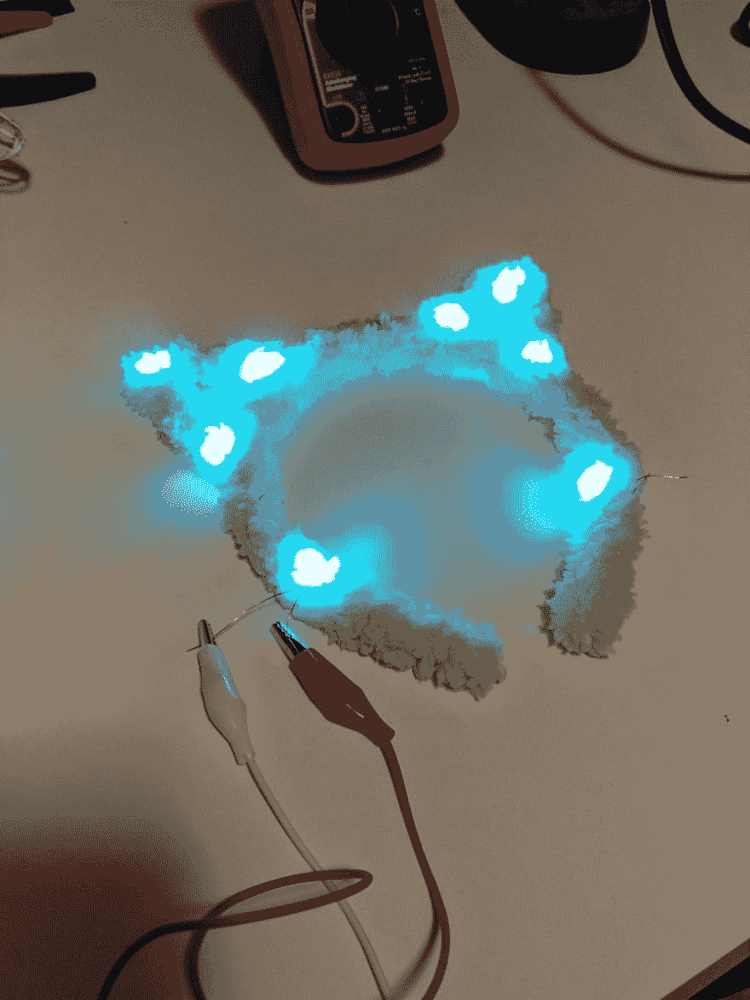
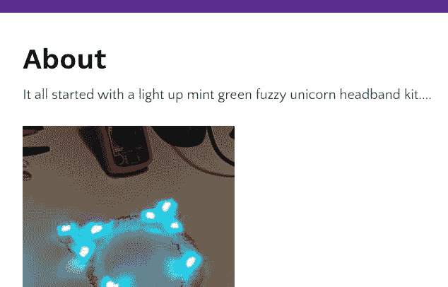

# 学习焊接如何教会我 Gatsby.js 和 AWS

> 原文：<https://dev.to/geekgalgroks/how-learning-to-solder-taught-me-gatsbyjs-and-aws-1mpk>

# 我为什么想学焊锡

我一直对电子和技术很感兴趣，但在成长过程中，我无法接触到所有我想尝试的东西。在我的小镇上没有一家电子商店，我的朋友中也没有人对焊接或电子套件感兴趣。大一点的孩子有电子设备，不会让我玩。所以我不得不凑合着在杂志和书上读到它。

现在我 30 多岁了，我仍然想学习焊接，但承认自己没有这种“核心经典书呆子技能”时感到尴尬。有一天，我偶然发现了一个学习焊接套件，这是一个模糊的发光小猫耳朵头带，我冲动地买下了它。意识到工具包已经在路上了，我买了一个烙铁、焊料、斜切刀和一个剥线器，这样我就可以完成它了。

# 分享我的进步

在我等待一切到来的时候，我告诉朋友我正在学习焊接。他们都很好奇，那些知道如何焊接的人问我有什么供应，我要做什么。意识到人们感兴趣，我决定与他们分享我的进步。

## 学习焊接

一旦我拥有了一切，我就等到一天深夜去尝试这个工具包。我很快就意识到焊接基本上和焊接一样，只是更小。我能够完成我的头带，并迷上了订购更多的套件。

> Jenn[@ geekgalgroks](https://dev.to/geekgalgroks)它还活着！2018 年 9 月 30 日上午 03:3404

我很快就习惯了，每个周末都会发布一个初学者工具包。我开始录视频，发讲解，做器材推荐。跟踪我做的每件事变得越来越难，有几个人要求我建立一个网站。

## 学习盖茨比

我选择 [Gatsby.js](https://www.gatsbyjs.org/) 是因为我想更好地使用 [React.js](https://reactjs.org/) 。我花了一天时间完成了教程，然后开始了我的网站。

我应该有一个更好的计划如何建立我的网站，并在开始之前选择一个颜色主题。但我冲在了前面。一个多星期以来，我已经建立了一个小型静态网站。如果让我再做一次，我会选择博客入门，而不是基础入门。

> Jenn[@ geekgalgroks](https://dev.to/geekgalgroks)感觉做我的网站要花很长时间。22:55PM-2019 年 1 月 19 日07

## 学习 AWS

现在我有了一个工作网站，我需要一个地方来托管它。我选择了[亚马逊网络服务](https://aws.amazon.com/),因为我在之前的项目中使用过它。这一次，我是自己一个人设置的。我遇到了一些困难，因为一些关键的用户界面和权限最近已经更新，而文档和演练还没有更新。

> <video loop="" controls=""><source src="https://video.twimg.com/tweet_video/DxZJM0WXQAAcJ8m.mp4" type="video/mp4"></video>Jenn[@ geekgalgroks](https://dev.to/geekgalgroks)Ugh build spec . yml .我只要我的持续部署。
> 
> 【Gif:坐在办公桌前的女人。她对电脑很生气，打了她的显示器的一边。】2019 年 1 月 20 日 23:59PM04

但是我能够部署我的网站，并建立一个持续的部署。

# 吸取教训

*   与全世界分享你的学习进步，可能会感到害怕，但每个人都有宝贵的经验可以分享。

*   尽管从小事做起，但要开始分享。你比别人走得更远。

*   不是所有的东西都需要完全从零开始构建，可以随意使用教程和初学者作为起点。

每个人都可以关注我在 solderingwithjenn.com 的焊接冒险。