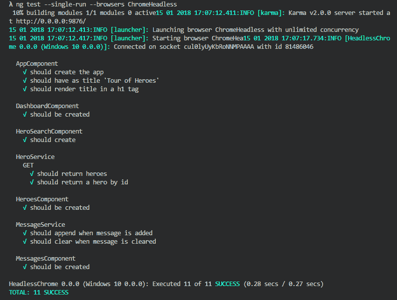
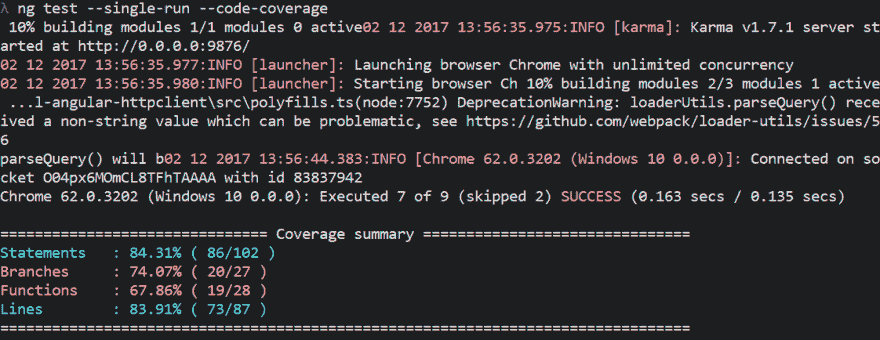
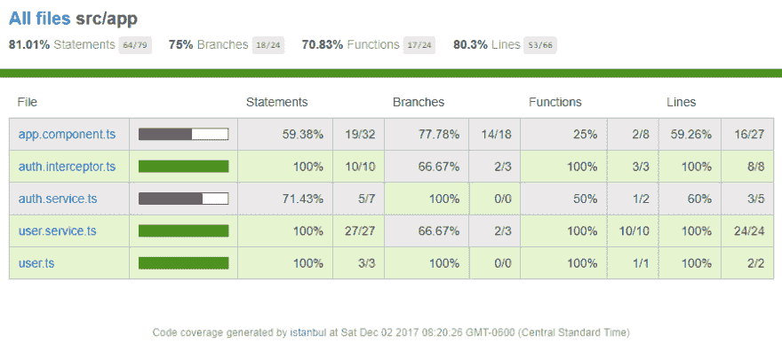
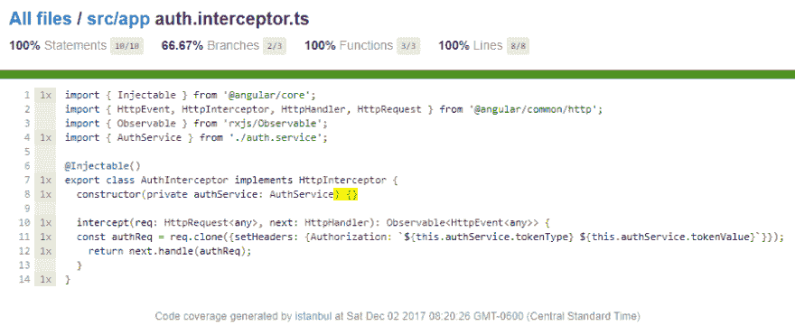
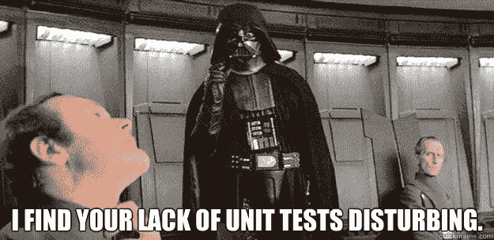
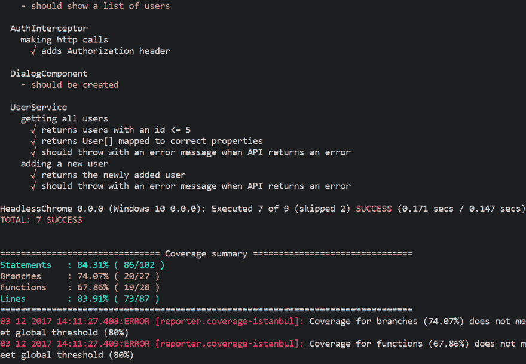

# 如何升级你的角度单位测试游戏(2/3)

> 原文：<https://dev.to/alisaduncan/how-to-level-up-your-angular-unit-testing-game-23-ged>

这是角度单元测试系列的第二篇文章。如果您不熟悉 Angular CLI 的使用，请阅读本系列的第一篇文章。

在之前的文章中，我们学习了如何将参数传递到 Angular CLI 来运行单元测试。在本帖中，我们将深入 Karma 配置，并根据我们的独特需求对其进行配置，使测试运行程序更加时髦。是时候升级你的测试游戏，开始单元测试了！

[](https://i.giphy.com/media/bdpIDWZFkI67S/giphy.gif)

# 跟着一起走

我们使用 Angular CLI 测试应用程序，并使用我以前写的一篇文章中的代码。

[](/alisaduncan) [## 拦截 Http 请求——使用和测试 Angular 的 HttpClient

### 亚里沙 8 月 28 日 174 分钟阅读

#angular #testing #javascript #programming](/alisaduncan/intercepting-http-requests---using-and-testing-angulars-httpclient)

您也可以克隆[tutorial-angular-http client](https://github.com/alisaduncan/tutorial-angular-httpclient)并运行测试。帖子中讨论的所有关卡都可以在“测试-配置”分支中找到。

# 因果报应配置

在你的 Angular app 里，找到`$/src/karma.config.js`。这是 Karma 用来运行测试的配置文件。开始剪辑吧！

## 记者

开箱即用，Angular CLI 支持“进度”和“kjhtml”报告程序。在 v7 和 v5 中，您可以通过命令行配置 reporters，但遗憾的是，这个选项在 v6 中被删除了。尽管如此，我们仍然可以通过 v6 的配置文件进行修改！

如果您使用 Angular v5 或 v7，使用`reporters`标志传入一个逗号分隔的报告者列表。

要更改 *karma.config.js* ，在`reporters`数组中，删除‘progress’并替换为‘dots’。现在，当您运行测试时，控制台的输出使用点报告器而不是进度报告器。

[](https://res.cloudinary.com/practicaldev/image/fetch/s--S1rtqtb8--/c_limit%2Cf_auto%2Cfl_progressive%2Cq_auto%2Cw_880/https://cdn.someecards.com/someecards/usercards/MjAxMy04Zjg3NGFhZDE1NTI2Mjg2.png)

## 添加新记者

但是我们的测试结果可以更好。还没什么值得大书特书的。让我们尝试添加一个记者。

添加“karma-spec-reporter”NPM 包

```
npm install karma-spec-reporter --save-dev 
```

Enter fullscreen mode Exit fullscreen mode

通过将 Require 语句添加到`plugins`数组
来要求 *karma.conf.js* 中的记者

```
plugins: [
      require('karma-jasmine'),
      require('karma-chrome-launcher'),
      require('karma-jasmine-html-reporter'),
      require('karma-coverage-istanbul-reporter'),
      require('@angular-devkit/build-angular/plugins/karma'),
      require('karma-spec-reporter')
    ], 
```

Enter fullscreen mode Exit fullscreen mode

添加到`reporters`数组

```
reporters: ['kjhtml', 'spec'] 
```

Enter fullscreen mode Exit fullscreen mode

现在，当您运行测试时，您将看到类似这样的输出
[](https://res.cloudinary.com/practicaldev/image/fetch/s--oXY_zRq---/c_limit%2Cf_auto%2Cfl_progressive%2Cq_auto%2Cw_880/https://github.com/alisaduncan/tutorial-angular-httpclient/blob/test-configuration/post-images/spec.png%3Fraw%3Dtrue)

[](https://i.giphy.com/media/WuGSL4LFUMQU/giphy.gif)

有各种各样的记者可以报道因果报应。如果您希望单元测试输出在您的 CI 环境中可用，您可以为 JUnit 输出添加一个报告器，并将 Jenkins 配置为使用 JUnit 报告。如果你在生活中需要更多的天赋，添加 nyan 猫进展报告。

[](https://res.cloudinary.com/practicaldev/image/fetch/s--e5KQcf6O--/c_limit%2Cf_auto%2Cfl_progressive%2Cq_66%2Cw_880/https://raw.githubusercontent.com/dgarlitt/image-repo/master/karma-nyan-reporter/v0.2.2/karma-nyan-reporter.gif)

## 代码覆盖率

既然您已经知道如何运行测试并设置它以获得您喜欢的输出格式，那么是时候测量覆盖率了。

请记住，通过测试重要的东西，测试覆盖度量不能确定应用程序是否如预期的那样工作，或者您的测试是否是“好的”。

> 本莱什🧢🏋️‍♂️💻🎨[@ benlesh](https://dev.to/benlesh)只是提醒一下，你可以进行 100%代码覆盖率的单元测试，一切都经过类型检查，你的应用程序仍然可能完全崩溃01:21AM-26 Sep 2017[](https://twitter.com/intent/tweet?in_reply_to=912487170371284994)[](https://twitter.com/intent/retweet?tweet_id=912487170371284994)[](https://twitter.com/intent/like?tweet_id=912487170371284994)

Angular CLI 自动将伊斯坦布尔添加和配置为报道记者。在 *karma.conf.js* 中有一个用于`coverageIstanbulReporter`的部分，它已经被设置为生成报告。在 Angular 的 v7 之前，它只启用了“html”和“lcov”。如果数组中没有“text-summary ”,则将它添加到数组中。

在启用覆盖率标志的情况下运行测试。在 v6 中使用`--code-coverage`。

```
ng test --watch false --browsers ChromeHeadless --codeCoverage 
```

Enter fullscreen mode Exit fullscreen mode

现在，您已经在控制台中获得了覆盖率总结的良好输出。

[](https://res.cloudinary.com/practicaldev/image/fetch/s--wnNH3w71--/c_limit%2Cf_auto%2Cfl_progressive%2Cq_auto%2Cw_880/https://github.com/alisaduncan/tutorial-angular-httpclient/blob/test-configuration/post-images/ng-cc-text-summary.png%3Fraw%3Dtrue)

使用“html”报告运行覆盖率以 html 格式创建覆盖率的可视化概述。您可以查看按文件细分的整个应用程序的覆盖率结果。

[](https://res.cloudinary.com/practicaldev/image/fetch/s--wHprnVt9--/c_limit%2Cf_auto%2Cfl_progressive%2Cq_auto%2Cw_880/https://github.com/alisaduncan/tutorial-angular-httpclient/blob/test-configuration/post-images/ng-test-cc-overview.png%3Fraw%3Dtrue)

进入单个文件的覆盖率报告，查看每行代码被执行的次数。

[](https://res.cloudinary.com/practicaldev/image/fetch/s--4i1yBvib--/c_limit%2Cf_auto%2Cfl_progressive%2Cq_auto%2Cw_880/https://github.com/alisaduncan/tutorial-angular-httpclient/blob/test-configuration/post-images/ng-test-cc-view.png%3Fraw%3Dtrue)

添加本机报告格式，如“text”、“json”、“Cobertura”、“TeamCity”，或者使用“lcov”报告作为 CI 流程的一部分，以便您可以显示每个构建的测试覆盖趋势线。

## 维护阈值

[](https://res.cloudinary.com/practicaldev/image/fetch/s--vND51Nu1--/c_limit%2Cf_auto%2Cfl_progressive%2Cq_auto%2Cw_880/http://s2.quickmeme.com/img/03/0347c3efdc17cc1959d089f60b8b2fc267d9093caa8e8cb483bf476b58e63e45.jpg)

如果想保证一定的覆盖率，可以在 *karma.conf.js* 中配置`coverageIstanbulReporter`对象来添加`thresholds`。

对于`thresholds`对象，填写`statements`、`lines`、`branches`和`functions`的键值。

```
coverageIstanbulReporter: {
      dir: require('path').join(__dirname, '../coverage'),
      reports: ['html', 'lcovonly', 'text-summary'],
      fixWebpackSourcePaths: true,
      thresholds: {
            statements: 80,
            lines: 80,
            branches: 80,
            functions: 80
      }
}, 
```

Enter fullscreen mode Exit fullscreen mode

现在，当您使用代码覆盖率运行测试时，如果您的项目没有达到覆盖率的阈值，您的测试将会失败。

[](https://res.cloudinary.com/practicaldev/image/fetch/s--X1OFqRvO--/c_limit%2Cf_auto%2Cfl_progressive%2Cq_auto%2Cw_880/https://github.com/alisaduncan/tutorial-angular-httpclient/blob/test-configuration/post-images/ng-cc-threshold-fail.png%3Fraw%3Dtrue)

# 设置 *angular.json* 为默认值

当然，我们可以创建 npm 脚本来包装我们在运行单元测试时发送的所有参数，但是有些情况下我们总是想要某个配置集。代码覆盖率就是一个例子。不管`watch`或`browsers`配置如何，我们总是想要运行覆盖。我们可以在 *angular.json* 中进行设置。

在`$/angular.json`文件中，找到“测试”的配置。它有一个“选项”属性。为“codeCoverage”添加一个新属性，并将值设置为 true。

除了 coverage 之外，您还可以设置更多属性。您传递给 Angular CLI 的所有参数都可以配置。查看 angular.json 的[模式，了解更多细节](https://github.com/angular/angular-cli/blob/master/packages/angular/cli/lib/config/schema.json)。

# 添加一个 Git 挂钩

想要确保回购的每一次推动都通过了单元测试并有足够的覆盖率吗？添加 npm 包‘husky’并添加运行单元测试的`pre-push`步骤[按照他们的指令](https://github.com/typicode/husky)。

现在人们不能在没有通过满足代码覆盖率的单元测试的情况下将代码推入回购。这一要求适用于所有分支，可能会使团队合作变得困难，因此您可能希望遵循本期 GitHub 中发布的方法，只针对主分支。

# [ 仅对特定分支应用哈士奇 git 钩子 #186](https://github.com/typicode/husky/issues/186) 

[](https://github.com/IAMtheIAM) **[IAMtheIAM](https://github.com/IAMtheIAM)** posted on [<time datetime="2017-09-19T19:47:33Z">Sep 19, 2017</time>](https://github.com/typicode/husky/issues/186)

有没有办法配置 husky 应用一个特定的 git 钩子，即`prepush`只应用到一个特定的分支，即`master`？

我知道我可以修改包中的钩子，但这让事情变得更复杂，因为 husky 安装了自己的钩子，然后我必须使用一些脚本用修改后的版本覆盖它。

主要目的是在推送到 master 之前只运行 e2e 或单元测试，而不是每次推送到 dev 时(每次等待和看到浏览器弹出都很烦人)。

[View on GitHub](https://github.com/typicode/husky/issues/186)

[](https://i.giphy.com/media/8fen5LSZcHQ5O/giphy.gif)

在下一篇文章中，我们将学习如何定位要运行的测试，并更深入地研究定制解决方案。