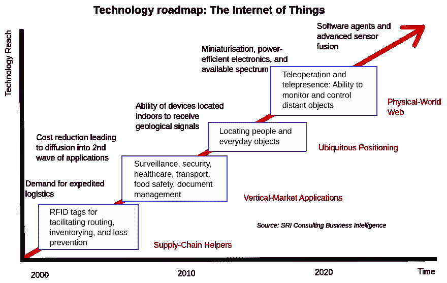
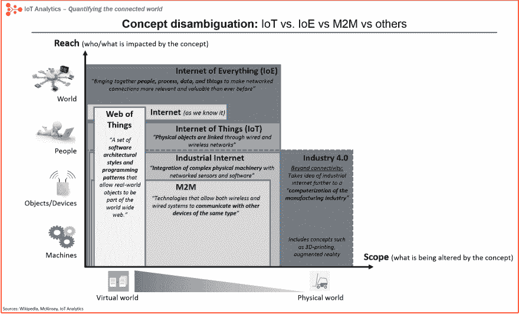

# 物联网简介:IOT

> 原文：<https://dev.to/abhishekalbert/a-introduction-to-the-internet-of-things-iot-3ni9>

你好。希望你做得很好。在本文中，我们将讨论 IOT，即物联网。这只是一篇介绍性的文章，我们不会深究。

先决条件:
学习 IOT 你只需要 3 个要素:

1.  好奇心
2.  坚持
3.  时间

就是这样。不要被任何技术细节或术语吓倒。如果有人告诉你，不要听他们的。

**总结**

物联网定义:“嵌入物理对象中的传感器和执行器通过有线和无线网络连接”

有许多类似的概念，但物联网是迄今为止描述这一现象最流行的术语
物联网一词是在 1999 年发明的，最初是为了推广 RFID 技术
物联网一词的流行直到 2010/2011 年才加速，并于 2014 年初进入大众市场
M2M 或工业互联网并不是物联网的对立概念。相反，它们是细分市场。

什么是 IOT？

首先，我会建议你选一张纸和一支笔，写下你所理解的物联网这个词。

根据维基百科:

> “物联网是车辆和家用电器等设备的网络，包含电子设备、软件、执行器和连接，允许这些设备连接、交互和交换数据。”

我认为这有点令人困惑，很难理解。让我们用一个简单的否定来理解 IOT。
或
希望现在物联网的概念清晰了。

**IOT 简史:**

物联网这个名词已经有 16 年的历史了。但联网设备的实际概念存在的时间更长，至少从 70 年代就开始了。当时，这个想法通常被称为“嵌入式互联网”或“普适计算”。但是“物联网”这个术语是凯文·阿什顿([https://twitter.com/kevin_ashton](https://twitter.com/kevin_ashton))在 1999 年在宝洁公司工作期间创造的。从事供应链优化工作的 Ashton 希望将高级管理层的注意力吸引到一种名为 RFID 的令人兴奋的新技术上。因为互联网是 1999 年最热门的新趋势，也因为它有点道理，他把自己的演讲称为“物联网”。
尽管凯文引起了一些宝洁公司高管的兴趣，但在接下来的 10 年里，物联网这个术语并没有得到广泛关注。

**物联网应用:**

物联网设备的广泛应用通常分为消费、商业、工业和基础设施领域。

**消费者应用:**

智能家居，养老。

**商业应用:**

医疗保健、运输、建筑和家庭自动化。
IOT 是嵌入日常物品中的计算设备通过互联网的互联，使它们能够发送和接收数据。
这是一个简单的概念，它意味着将世界上所有的东西都连接到互联网上。

**工业应用:**
制造业、农业、基础设施应用、大都市规模部署、能源管理、环境监测、生活实验室。

**技术路线图:物联网**

**IOT VS 埃奥 VS M2M VS 其他:**

**M2M :**

> 机器对机器通信，或 M2M，正如它听起来的那样:两台机器“通信”，或交换数据，没有人类接口或互动。这包括串行连接、电力线连接(PLC)或工业物联网(https://www.link-labs.com/industrial-iot-and-control/)(IoT)中的无线通信。切换到无线网络使得 M2M 通信变得更加容易，并且能够连接更多的应用程序。

**IOE :**

> 万物互联(IoE)是一个概念，它扩展了物联网(IoT(http://what is . techtarget . com/dention/Internet-of-Things))对机器对机器(M2M(http://search networking . techtarget . com/dention/M2M))通信的强调，以描述一个更复杂的系统，该系统还包含人和流程。

IOT 很重要吗？

当一个东西连接到互联网上，这意味着它可以发送信息或接收信息，或两者兼而有之。这种发送和/或接收信息的能力使事物变得智能，而智能是好的。为了更加清晰，我们举一个简单的智能手机的例子。如今，我们大多数人更喜欢像 wink 这样的在线音乐播放器，而不是普通的 oine 音乐播放器，他们有一个很长的歌曲列表，按照语言、日期或字母顺序进行了很好的组织。要听音乐，你不必下载歌曲
云存储。
你所需要的只是一个互联网连接。你最喜欢的歌曲列表。所有歌曲都存储在云存储中。

要想变得聪明，一个东西不需要有超级存储或超级计算机在里面。所有要做的事情就是连接到超级存储器或超级计算机。联网真是太棒了。
在物联网中，所有连接到互联网的事物都可以分为三类:

1.  收集信息然后发送出去的东西。
2.  接收信息并根据信息采取行动的事物。
3.  两者兼而有之的东西。

这三者都有巨大的优势，相互促进。希望你喜欢这篇文章。感谢您的阅读。

下一篇文章再见。

坚持学习，快乐编码。