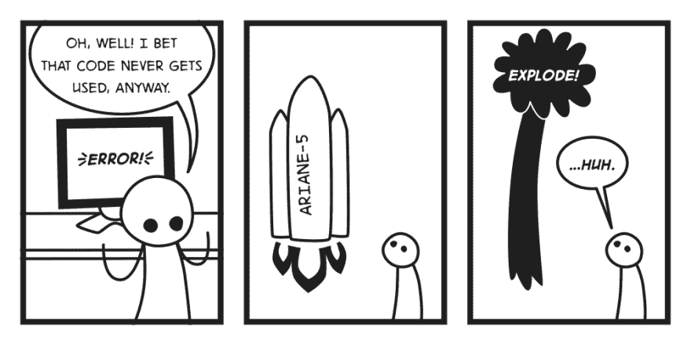
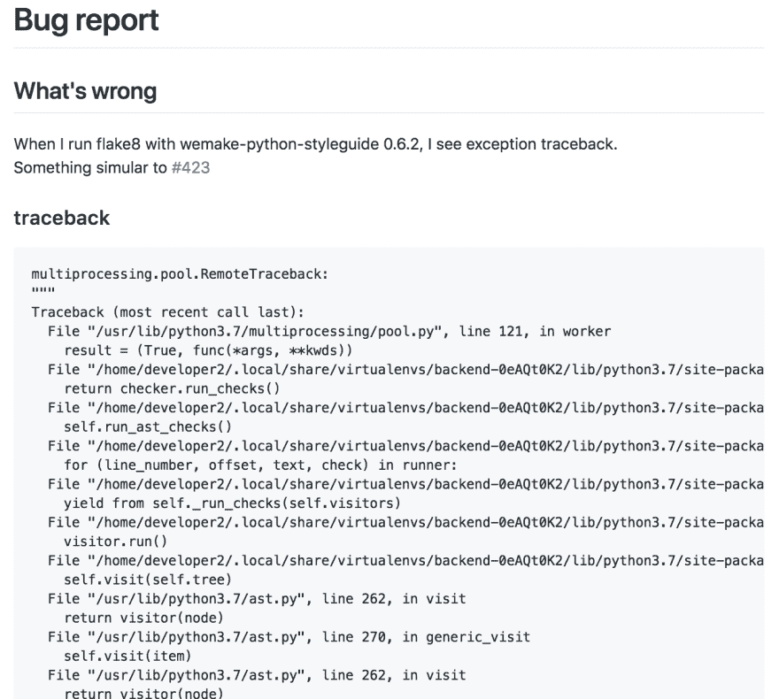
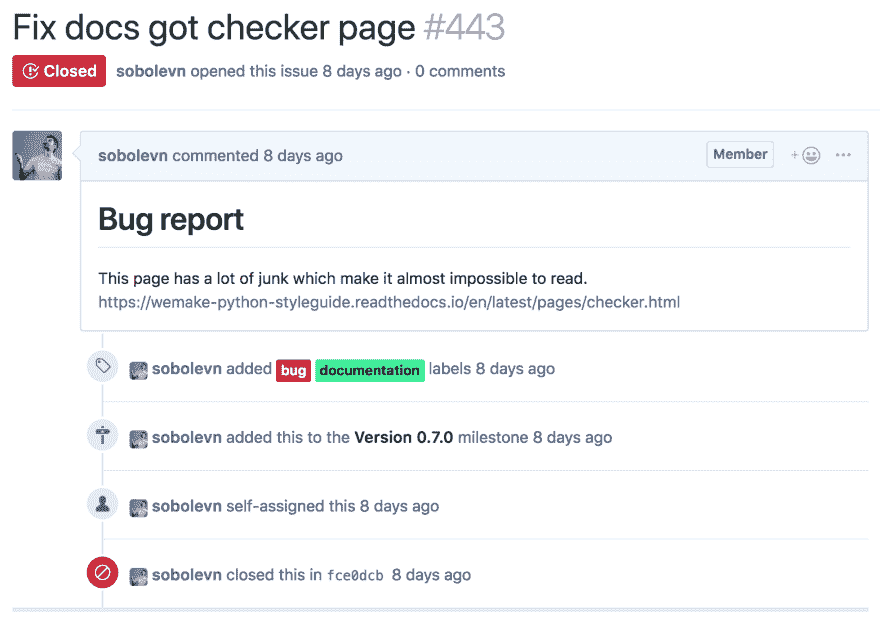
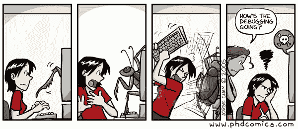

# 最佳工程实践:如何修复 bug？

> 原文：<https://dev.to/wemake-services/best-engineering-practices-how-to-fix-a-bug-58g5>

有一些基本的工程实践，我想以最重要的一个开始，用一系列的帖子来涵盖:如何修复一个 bug？

一、为什么我认为修复 bug 是最重要的？因为 bug 一直都在发生。如果你写代码，你写的就是 bug。
这完全不是问题。[我们坚持的可重复的软件开发过程](https://wemake.services/meta/)，工作的基础是:人会犯错。
不久前我写了一篇关于它的文章:[开发人员不应该为错误负责，项目应该是](https://dev.to/sobolevn/building-blameless-working-environment--17hl)。

重要的是:你如何应对你和其他人制造的 bug？你会做些什么来防止它们在未来发生？你怎么知道这种错误情况存在呢？

## 发现一只虫子

在您实际修复某个东西之前，您需要发现不正确的行为。这可能会很棘手。考虑这两种情况:

1.  由于出现错误，所有用户都无法登录该帐户。
2.  确切地说，有一个用户不时会在本地机器上面对你的应用程序的奇怪行为。

哪个会更容易被发现？我猜你已经猜对了:第一个。有些虫子比其他的更容易被发现。

[](https://res.cloudinary.com/practicaldev/image/fetch/s--Ns5w_g1v--/c_limit%2Cf_auto%2Cfl_progressive%2Cq_auto%2Cw_880/https://thepracticaldev.s3.amazonaws.com/i/nhz2o6st76c8y6ucxi6l.png)

有几个因素会影响 bug 的可发现性:

*   有多少用户受到这个 bug 的影响？如果人数足够多，肯定会有人告发的。把你的用户作为监控服务合理吗？这是另一个我们不会在本文中讨论的问题。
*   代码在哪里执行？在您的服务器上，创建一个监控服务要容易得多，它将捕捉大多数意想不到的事情并就此向您发出警报。有时你无法接触到自己创造的产品。例如，当它被运送到使用他们自己的基础设施的公司客户时。在您自己的服务器上创建一个固定的环境也容易得多，这样任何第三方实体都不会干扰您的项目。
*   繁衍后代有多难？有些虫子很容易繁殖。点击这个链接，输入文本，回车。有些虫子疯了！你需要建立一个特殊的环境，安装一些特定的软件，执行奇怪的动作，然后你就会重现 bug(运气好的话你这边)。值得一提的是，有些 bug 根本不可复制。它们可以被忽略。

当然，有一些工具可以帮助你发现错误，并在错误发生时提醒你。

*   Sentry 帮助你跟踪代码中的错误。它支持几乎任何语言，并且有一个免费的自托管版本。它还允许从用户那里收集直接的口头反馈。
*   [普罗米修斯](https://prometheus.io/)是最流行的监控工具之一。通过 [`docker-compose up`可以快速启动](https://github.com/vegasbrianc/prometheus)。
*   还有像`NewRelic`、`Wombat`、`DataDog`等许多付费服务。

**Lifehack** :你可以从`Sentry`开始，它将用最简单的设置满足你的大部分需求。您可以在需要时添加更多的服务和工具。

## 报告一个错误

一旦发现漏洞，就需要报告。看起来很简单，不是吗？嗯，实际上，这看起来很容易，但这肯定是这个过程中最重要的部分。要报告一个好的 bug，你需要提交大量的信息。你的问题必须讲述一个故事:

*   你为什么认为这是一个错误？也许这是一个特点...
*   在你看来应该会发生什么？没有明确定义预期行为的 bug 会变得很难修复。并且它们可以增长到特性请求。应该用不同的方法解决。
*   为什么这个 bug 很重要？你必须证明它应该马上被修复。因为有些 bug 是微不足道的，暂时可以忽略*。*
**   如何重现一个问题？这应该包含有关该问题的所有技术信息。使用了什么版本？使用什么浏览器/操作系统？应用了什么配置？有时，甚至可以创建一个单独的存储库来显示问题的再现。*   在哪里可以找到关于所发生事件的额外信息:日志、堆栈跟踪、屏幕截图、监控报告、必需的输入数据、相关的错误和特性等。所有的链接必须在提交。否则，随着时间的推移，这个问题真的很难解决。*

 ***Lifehack** : [截图](https://www.cnet.com/how-to/how-to-take-screenshots-in-macos-mojave/)和[gif](https://www.screentogif.com)rock for system with UI！尽可能频繁地使用它们。但是，千万不要使用截图从堆栈跟踪和调试输出中获取文本信息，因为它不能被其他开发人员复制。

现在，让我们看看在同一个项目中创建的两个不同 bug 的例子。第一个是严格的版本，追溯，范围。[很好的 bug 报告](https://github.com/wemake-services/wemake-python-styleguide/issues/450)。

[](https://res.cloudinary.com/practicaldev/image/fetch/s--FyZce1Pn--/c_limit%2Cf_auto%2Cfl_progressive%2Cq_auto%2Cw_880/https://thepracticaldev.s3.amazonaws.com/i/321nl8is2abun52lk9y6.png)

[第二个是我举报的](https://github.com/wemake-services/wemake-python-styleguide/issues/443)。这是一个错误报告的坏例子。

[](https://res.cloudinary.com/practicaldev/image/fetch/s--NJxeqNXo--/c_limit%2Cf_auto%2Cfl_progressive%2Cq_auto%2Cw_880/https://thepracticaldev.s3.amazonaws.com/i/w16h19e3yiwung1kmy4r.png)

它违反了我们之前定义的几乎所有规则。它是在匆忙中制作的——在我与我的一个用户进行了一次手机通话后，我没有忘记这张票。**不要这样做**。

这里有一些真实世界的 bug 报告[模板](https://help.github.com/articles/manually-creating-a-single-issue-template-for-your-repository/)，你可以在你的项目中使用:

*   [GitHub 和开源的模板](https://github.com/wemake-services/wemake-python-styleguide/blob/master/.github/ISSUE_TEMPLATE/Bug.md)
*   [git lab 和商业软件模板](https://github.com/wemake-services/meta/blob/master/.gitlab/issue_templates/Bug.md)

在 [`github-issue-templates`回购](https://github.com/stevemao/github-issue-templates)中也有一系列不同的 bug 模板。请随意使用它们中的任何一个来使您的开发过程变得更好！

## 复制一个 bug

现在，你需要重现这个错误。不仅仅是用你的手，还有你的代码。记住——你的目标是不要再犯同样的错误。这怎么可能呢？

你需要编写一个会失败的回归测试。
这可能是一个单位或 E2E 的试验，没关系。这只是一个失败的测试，暴露了你试图解决的问题。

有时你可能想要提交一个不完整的代码到你的分支，这样它将触发一个 CI 构建。构建完成后，它将保存在您的项目中。你的同事将能够联系到这个问题。您的下一次提交必须解决这个问题。

[](https://res.cloudinary.com/practicaldev/image/fetch/s--RXRUoejM--/c_limit%2Cf_auto%2Cfl_progressive%2Cq_auto%2Cw_880/https://thepracticaldev.s3.amazonaws.com/i/h6jp54mkijet0la0qf3s.jpg)

什么仪器帮助你重现复杂的 bug？嗯，有几个例子:

*   在任何情况下，调试器都是您最好的朋友。
*   发现并发错误很难，有时甚至更难重现。在这种情况下，您可以退回到[静态分析](https://github.com/mre/awesome-static-analysis)并使用它静态地找到您的 bug。
*   有时你可能需要调整你的基础设施，这就是[基础设施即代码](https://en.wikipedia.org/wiki/Infrastructure_as_code)派上用场的地方。

请记住，有些错误无法在合理的时间内重现。

你可以看看我为 [`wemake-python-styleguide`](https://sourcegraph.com/search?q=repo:%5Egithub%5C.com/wemake-services/wemake-python-styleguide%24+regression) 创建的一些回归测试。这里有一个为我们工作的测试结构的秘密峰值:

```
code_that_breaks = '''
def current_session(
    telegram_id: int,
    for_update: bool = True,
) -> TelegramSession:
    ...
'''

def test_regression112(default_options):
    """
    There was a conflict between ``pyflakes`` and our plugin.

    We were fighting for ``parent`` property.
    Now we use a custom prefix.
    See: https://github.com/wemake-services/wemake-python-styleguide/issues/112
    """
    ...

    # It was failing on this line:
    # AttributeError: 'ExceptHandler' object has no attribute 'depth'
    flakes = PyFlakesChecker(module)

    assert flakes.root 
```

## 修复 bug

现在，当我们发现、报告和复制了我们的 bug 后，我们必须实际修复它。

这是您实际修改代码库以移除意外行为的部分。这应该没那么难吧！

修复代码并提交代码后，CI 构建必须通过。如果是这样的话，bug 就修复了。但是，还有一件事要做。

等等，什么？

是的，还有一件事是大多数开发人员倾向于不做的:写一篇事后分析文章。有些 bug 真的很简单，不需要这一步，但是有些 bug 花费了我们大量的时间和金钱。我们应该格外关心他们。事后分析是一个关于已经发生的事情的非技术性的故事，你可以向你的管理层展示(并且他们会理解)。尸检应该包括什么？

*   为什么会出现 bug？这必须是导致此问题的所有行动的非技术性总结。并且它必须包含到原始错误报告的链接。
*   我们做了什么来修复这个 bug？再次强调，保持简单，不要深入技术细节。请确保您的提交链接到此文档。
*   它对我们的产品/用户/客户有什么影响？需要计算或者智能猜测。
*   时间表是什么？还记得你保存所有链接到日志/监控/等等吗？建立一个时间表会很有用。我们被这种病毒折磨了多久？什么时候解决的？

这就是为什么需要事后分析:它将向未来的团队讲述一个关于这个 bug 的故事。保持最重要的 bug 的一致列表将会极大地改善你的项目文档。和往常一样，这里有一个链接指向[不同的尸检模板](https://github.com/dastergon/postmortem-templates)。

## 后记

高技能工程师就是这样修复 bug 的。有些实现可能会有所不同，但原则总是相同的:发现、报告、复制、修复、记录。

我希望这篇文章能帮助你的项目成长。如果你想知道我目前正在为开发者开发什么工具，请订阅我的 github 账户。*