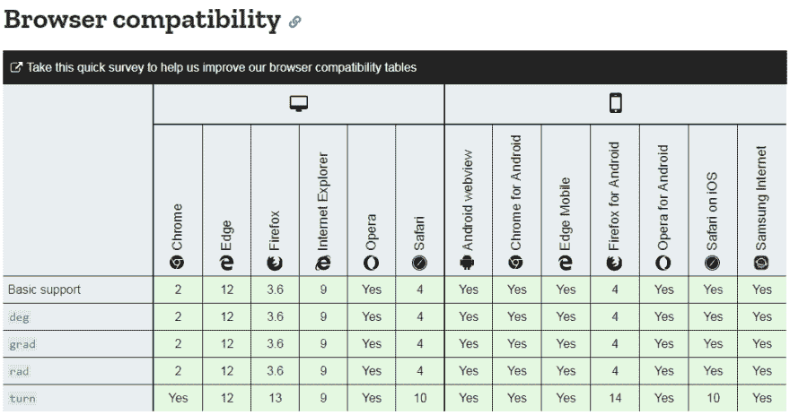

# 格拉迪安斯和转身:CSS 天使的安静的英雄

> 原文：<https://dev.to/kenbellows/gradians-and-turns-the-quiet-heroes-of-css-angles-7ia>

当一个设计感觉有点太静态，你想给它添加一点点运动(无论是动画还是简单的[暗示](http://www.gdbasics.com/pdfs/Time_Motion.pdf)，考虑给你的设计添加一些旋转或倾斜。

*   稍微旋转用户图片，然后在悬停时旋转回来:[粉碎弹匣](https://www.smashingmagazine.com/)
*   旋转一些图片，倾斜你的页眉背景:[条纹](https://stripe.com/)
*   加载各种旋转器: [loading.io](https://loading.io/css/)
*   总有那些令人印象深刻的 CSS 动画演示

无论你如何使用它，在一天结束时，如果你在旋转或倾斜某物，那么你就在处理**角度**。

对很多人来说，角度...令人生畏。甚至可怕。但是我想说的是，通过使用不同的**角度单位**来定义你的角度，它们可以变得*容易得多*。

# 度和弧度都是硬性的

两个最常见的角度单位是我们都知道又讨厌的，度数(`deg`)和弧度(`rad`)。学位似乎是每个人的默认设置，它们很好，我们都习惯了，但退一步说，数学很难。(`180deg`和`270deg`中间又是什么？)我猜，谈论弧度会让很多人回到高中的三角学，当他们问一个关于 3π4 的正切的问题时，尽量不要和老师有眼神接触。

> *简短的侧面咆哮*:为什么我需要 2π来做一个圆，这样一切都是应有的一半？为什么(3/4)π不只是圆的四分之三？？我的意思是，我知道历史上的原因，但是为什么我们还没有[改用τ而不是](https://tauday.com/)呢？

无论如何，如果你是对旋转感到紧张的人之一(包括我自己)，因为它意味着笨拙的单位和令人沮丧的数学，我有一个好消息:CSS 实际上有四个不同的角度单位**，另外两个，嗯，*更容易使用。这些单位被称为**梯度** ( `grad`)和**圈数** ( `turn`)。***

# 格拉迪安

梯度是一种旋转单位，实际上已经存在了几个世纪。它也被称为“公制度数”,因为它在 18 世纪的法国和公制一起被正式化了。

似乎有些人受够了我们现在称之为英制单位的那些疯狂的数学运算(8 品脱代表一加仑，12 英寸代表一英尺，14 磅代表一块石头，...你们没事吧？并决定建立一个系统，在这个系统中一切都基于 10 的幂:100 厘米代表一米，1000 毫升代表一升，1000 克代表一千克，等等。

同样的事情也发生在天使身上。有人建议将一个圆分成一个漂亮的圆形 *400 个部分*，而不是 360 度，这样每个**象限**，或四分之一圆，就被很好地分成了 100 个比特。因此，我们有了格拉迪安！一整圈有 **400 个梯度**。四分之一圆是 100 格拉迪安(CSS 中的`100grad`)，半圆是 200 格拉迪安(`200grad`)。那不是比 360，90，180 更好想吗？

所以格拉迪亚人很酷，我一会儿再来谈他们。但现在让我告诉你我真正感兴趣的单位。

# 转弯

转弯是我非常兴奋(可以说是过于兴奋)的一件小事。但是如果你已经完成了大量的旋转设计，尤其是动画，希望你马上会有同样的感觉。

当你在设计一个动画或者考虑如何给你的设计添加一些旋转时，你是怎么想的？你可能没有用数字来思考。你可能在想:

*   “我想让这个物体滚入视野。它滚动的时候应该会翻两次。”
*   “为什么我们不在悬停时将图标旋转四分之一圈呢？这可能会很酷。”
*   "那个装载图标应该每秒转两次."

你通常不会用度数或弧度来思考。你考虑的是整圈和部分圈。至少，我知道。

现在想象一下，如果你能把这个告诉浏览器，告诉它你旋转的东西应该转多少圈，而不用把它转换成任何疯狂的单位。事实证明...*可以！*这就是转弯！

一圈(CSS 中的`1turn`)就是“一整圈”的意思。换句话说，你知道，“转一圈”。(显然，这也是[一个有点标准化的角度测量单位](https://en.wikipedia.org/wiki/Turn_(geometry)%20that%20is%20called%20a%20bunch%20of%20other%20names%20in%20other%20contexts,%20if%20you're%20interested%20in%20that.)

我喜欢把转弯看作“透明”的角度单位，因为它们根本算不上一个单位。它们只是上面那个问题的答案:“这个东西要转多少圈？”或者换个说法，“这个东西要转多少*圈*”

# 这些单位为什么有用？

让我们看看一些常见的角度之间的比较度，弧度，梯度(所有四舍五入到小数点后两位)。

| 度 | 弧度 | 弧度 | 变成 | 我最喜欢的单位 |
| --- | --- | --- | --- | --- |
| `30deg` | `0.52rad` | `33.33grad` | `0.08turn` | 格拉迪亚人 |
| `45deg` | `0.79rad` | `50grad` | `0.13turn` | 弧度 |
| `60deg` | `1.04rad` | `66.67grad` | `0.17turn` | 弧度 |
| `90deg` | `1.57rad` | `100grad` | `0.25turn` | 变成 |
| `180deg` | `3.14rad` | `200grad` | `0.5turn` | 变成 |
| `360deg` | `6.28rad` | `400grad` | `1turn` | 变成 |
| `720deg` | `12.56rad` | `800grad` | `2turn` | 变成 |
| `1080deg` | `25.12rad` | `1200grad` | `3turn` | 变成 |

在每种情况下，我都发现 gradians 或 turns 是最容易阅读、可视化和用于心算的。的确，我习惯于处理一些角度，通常是 30 度、90 度、180 度、270 度、360 度。但是一旦我需要任何不在列表上的角度，就会变得非常困难，非常快。问题是，我习惯于处理以 10 为基数的其他一切事情，从钱到学校成绩到我的年龄，所以我对以 10 为基数的心算更有经验。

当涉及到设计的时候，无论如何都不是真正的心算。这是关于**可视化**我想做什么，并把它变成代码。我认为格拉迪安和转弯更容易，即使是普通的角度。

例如，如果我想一想，我可以算出 30 度是 90 度象限的三分之一。但是我不能*看到*在我头上 30 度，不是没有很大的努力。但是当我看到`33.33grad`的时候，所有那些 3 立刻*对我说*“三分之一”。我知道那个数字看起来像什么，出于某种原因，我可以更容易地想象那是什么样的角度，即使是同一个角度。

# 举例！

你不可能写一整篇关于代码特性的文章而不展示它，对吗？

[https://codepen.io/kenbellows/embed/bzbQZB?height=600&default-tab=css,result&embed-version=2](https://codepen.io/kenbellows/embed/bzbQZB?height=600&default-tab=css,result&embed-version=2)

# 什么时候应该各用各的？

再看一下表格，如果我在一个象限内做很多动画，我可能不想使用转弯。`30deg`皈依`0.0833turn`，`60deg`皈依`0.1667turn`，这两个对我来说都没有任何意义。但我认为 gradians 真正发光的地方是一个象限。一切基本上都变成了象限的百分比！这太棒了！

在光谱的另一端，我更愿意使用任何大于一个象限的转弯，*尤其是*你旋转超过一个整圆的那个。

# 浏览器支持

如果您担心浏览器支持，请不要担心！在很长一段时间里，所有主流浏览器，包括桌面和移动浏览器，都完全支持这两个单元。看看 [MDN 对于`<angle>` CSS 类型](https://developer.mozilla.org/en-US/docs/Web/CSS/angle#Browser_compatibility)的兼容性表:

甚至 *IE 9* 也完全支持 gradians 和 turns。这是很久以前的事了。所以不用担心浏览器支持。

# 关于 SVG 的一个注记

不幸的是，在 SVG 动画中有一个地方你*不能*使用这些惊人的新单位，所以如果你是那种喜欢手工制作复杂 SVG 的人，你就不走运了，我很抱歉😢

可悲的是，虽然 SVG 确实使用 CSS，但它与用于 HTML 的 CSS 并不完全相同。正如 [Sara Soueidan](https://twitter.com/SaraSoueidan) 在[她的关于 SVG 转换的优秀文章](https://www.sarasoueidan.com/blog/svg-transformations/)中指出的，用于 SVG 的 CSS 变体中的角度总是没有单位，它们总是度。这是一个巨大的遗憾，因为 SVG 是制作动画的好地方。但是另一方面，我想现在大多数人通常使用编辑器来生成他们的 SVG，不是吗？我自己对此不太感兴趣，所以我不是专家，但这是我听到的。

# 结论

我想听一些关于这个的反馈！这篇文章很主观，所以我很想听听其他人对这些设备的看法。有人在重大项目中使用过它们吗？你喜欢他们吗？它们真的是因为我没有考虑到的原因而变得可怕吗？让我知道！