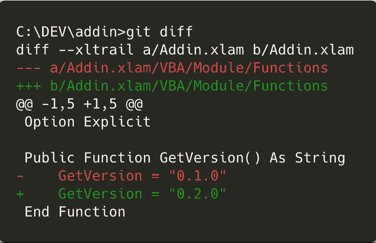
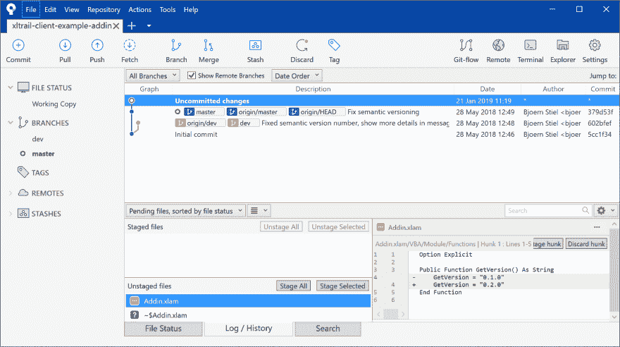

# 如何在源代码树中区分 Excel VBA 代码(Git 客户端)

> 原文：<https://dev.to/fzumstein/how-to-diff-excel-vba-code-in-sourcetree-git-client-36k>

如果您的日常工作依赖于 Excel，您的文件夹很可能包含同一文件的许多不同版本，如“myfile_final_v2.xlsx”或“myfile_final_final.xlsx”(您不想无意中弄乱您的文件吧？).如果你知道如何使用 [Git](https://git-scm.com) 版本控制，用它来跟踪你的 Excel 文件是一个很容易做出的决定。这将使您不必总是在本地重命名文件，并为您提供添加提交消息的选项，这样您就知道发生了什么。
然而，用不了多久你就会错过 Git 的核心功能:“Git diff”特性。对于 Git，Excel 文件只是一个二进制文件，你看不到从一个版本到另一个版本有什么变化。
如果你使用 SourceTree，这对于你的 VBA 代码来说是一个很容易解决的问题！

# 源代码管理

SourceTree 是 Atlassian 流行的免费 Git 图形用户界面应用程序，专为喜欢桌面应用程序而不是命令行的用户设计。不用说，SourceTree 的行为与任何其他 Git 平台或 GUI 客户端没有什么不同:它不会向您展示开箱即用的 Excel 文件的差异:

让我们看看如何解决这个问题！

# 去 XL

[xltrail](https://www.xltrail.com) 是 Excel 文件的版本控制平台，工作方式类似于 [GitHub](https://github.com) 、 [BitBucket](https://bitbucket.org) 或 [GitLab](https://gitlab.com/) ，区别在于 xltrail 理解 Excel 文件的内容。
虽然 xltrail 允许您集成所有这些 Git 提供者，但它也提供了一个免费的开源 Git 扩展 [Git XL](https://www.xltrail.com/git-xl) ，允许您在命令行上或最近还通过 SourceTree 在本地区分和合并您的 VBA 代码。
这里可以下载 Git XL [。请注意，您不必开立帐户就可以使用它。点击安装程序后，您可以为所有回购协议(`git xl install`)或仅为特定存储库(`git xl install --local`)激活扩展。详情见此处](https://www.xltrail.com/git-xl)的说明[。
如果您现在转向命令行并运行 Git diff 命令，它会很高兴地向您显示 VBA 代码中的变化:](https://www.xltrail.com/git-xl)

# 激活 Git XL 的源代码树

一旦为您的存储库安装并激活了 Git XL，请返回 SourceTree，在这里您可以看到 VBA 代码中未提交的差异，而无需更改任何设置:

