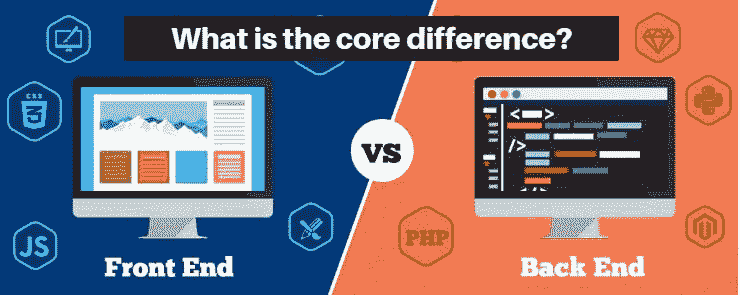

# 前端 vs 后端开发:核心区别是什么？

> 原文：<https://dev.to/appdevelopmentagency/front-end-vs-back-end-development--what-is-the-core-difference--185f>

web 或手机 app 开发项目中的前端或后端是什么意思？如果这两个词在开发阶段之前出现了太多次，那么这是因为它们在 app 开发公司开发一个数字项目时尤为重要。

以设计一个 web 应用程序为例。假设您的应用程序开发公司想要开发一个 BBB 交换和文件共享应用程序，例如，在一个公共会计师和一个承包商之间。为了工作，您的应用程序将需要一个会计师客户端的用户界面和一个管理员界面，这将是会计师的界面。

要开发这样一个应用程序，你至少需要两类开发人员:前端开发人员和后端开发人员。为了理解他们在哪里进行干预，以及在 web 项目中有哪些声誉良好的应用程序开发公司代表后端和前端，让我们停留在示例上。

## 前端开发:设计图形用户界面

会计师和专家客户将在这两个界面上进行交互，这两个界面被认为是前端。事实上，它是应用程序的可视部分，其目的是由第三方操纵它。

所以不要混淆“前端”和“后端”与“客户端界面”和“管理面板”。在第一个和第二个平面设计中，这是一个前端开发人员的技能，这将是必需的。

事实上，它会给最终用户提供图形空间，让他们在界面上找到自己的方向，并使界面变得简单。他还将开发对话、动画、响应设计...他将与至少一名网页设计师合作，最好是一名 UX 专家，以提供符合人体工程学和有趣的界面。
前端开发者的技能微乎其微。

*   超文本标记语言
*   半铸钢ˌ钢性铸铁(Cast Semi-Steel)
*   Java Script 语言

**它还可以信任以下设置:**

*   jQuery
*   有角的
*   引导程序
*   基础
*   语义用户界面
*   纯的

名单很完整。有大量的图书馆和设置，与一些专业，使他们的声誉:轻，人体工程学 UX，项目类型，在任何情况下，通常一个框架的开发前端的一个应用程序的选择将需要在其设计，为问题的成本，时间和安全。

## 后端开发:web 应用的基石

如果一个后端开发团队不干涉你的 web 应用程序，那么一个好的界面就是一个空壳。根据规范，后端开发团队将致力于开发移动应用程序的功能。后端神的工作对最终用户来说是看不见的，但是没有任何干扰，没有应用。后端部分将构建、开发应用程序运行所需的三大支柱并与之交互:

*   托管服务器
*   网络应用
*   数据库ˌ资料库

服务器是保存应用程序的硬盘，是构成页面、设计和应用程序可见部分的所有文件的前端部分。

数据库是由后端开发人员创建的，因此可以为应用程序运行所需的所有数据(用户 ID、用户权限、word 密码存储等)保存特定的表。).

因此，数据库可以被更新、修改或与元素的现有数据库集成(例如新用户)，后端开发人员将使用动态语言，应用程序将添加数据库。为此，后端开发人员将使用语言:

*   服务器端编程语言（Professional Hypertext Preprocessor 的缩写）
*   红宝石
*   计算机编程语言
*   结构化查询语言

出于与前端开发人员相同的原因，如成本、速度和盈利能力，后端开发人员通常使用如下框架:

*   交响乐
*   姜戈
*   Ruby on Rails
*   有角的
*   流星

虽然 PHP 在历史上被归因于后端开发，但这种趋势正在改变，特别是随着 angular 的兴起。因此，后端开发人员转向 js 开发并非不可能。这些简介也有很多需求。

## 后端和前端开发者如何支持？

你已经看到，在全球范围内，应用程序项目、web 或移动工作是如何在每个部分完成的。你知道前端会担心可见的和交互的部分，但这是基于前端开发者对冰山淹没部分所做的工作。
特别是后端和前端开发者如何支持？假设会计希望能够在应用程序的管理界面上创建一个新的客户帐户。

## 它将从应用程序中遵循以下路线:

*   tplogin
*   转到添加用户页面
*   要创建新用户，请填写表单
*   使生效

在所有这些时候，会计师都使用后端和前端完成的工作。实际上，要进行连接，最终用户必须与一个表单(前端)进行交互，该表单将进行查询以验证输入到数据库中的信息的准确性(后端)。

然后，它将进入用户页面，并与表单交互以打开一个新用户(前端)。然后，他将填写前端的表单，然后，通过验证，将允许表单在数据库中创建一个新条目，这将允许其客户端连接到用户界面(后端)。

后端团队和前端团队可以以不同的方式协同工作。前端可以专注于 UI(用户界面)，尤其是后端开发，已经创建了与数据库的所有交互。

其他情况下，侧重于后端开发数据库的功能开发。然后，这些数据被提供给前端开发人员，他们将在数据库中的代码中使用这些调用。

最后，线有时候是细的，其实是前端开发者和后端开发者之间的。一个人掌握该领域的另一部分并不罕见，因为这两个方面的发展是相互联系的。还有第三类开发人员，能够在后端和前端实现他们的技能:全栈开发人员

所有的[应用程序开发公司和代理机构](https://www.appdevelopmentagency.com/top-mobile-app-development-companies/)都在寻找全栈开发人员，因为他们在项目中拥有更广泛的全球视野和技能。她也可以成为一名优秀的顾问，因为她自己有能力让自己站在前端开发人员或后端的立场上。