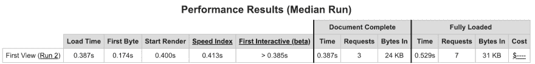

# 使用 Hugo 和 AWS 构建一个快速、静态、易于管理和部署的网站。

> 原文：<https://dev.to/tom_geraghty/using-hugo-and-aws-to-build-a-fast-static-easily-managed-and-deployed-website-2fme>

我的大多数网站都是在 AWS 的 Linux 上使用 Wordpress 构建的，使用 EC2 进行计算，使用 S3 进行存储，使用 Aurora 进行数据层。以 [sono.life](http://sono.life) 为例看一下。

对于这个网站，我想建立一些与云技术一致的东西，并展示一些[的关键原则——即:可伸缩性、弹性、可用性和安全性，并且是为 云设计的 ***，而不是简单的*** 云中的 ***。***](https://hackernoon.com/principles-and-practices-of-cloud-applications-4a8ef32cab36)

我选择了云原生的、尽可能快、易于管理、版本可控、快速部署并通过 TLS 呈现的技术。我选择了 [Hugo](https://gohugo.io/) ，一个超快的静态网站生成器，可以从命令行管理。它被像[让我们加密](https://letsencrypt.org/)这样的组织用来建立超快速、安全、可靠和可扩展的网站。我剩下的选择列在下面。只要有可能，我都使用本机 AWS 解决方案。

*   框架:[雨果](https://gohugo.io/)
*   源代码控制: [Git/Github](https://github.com/tom-geraghty)
*   DNS: [AWS 路由 53](https://aws.amazon.com/route53/)
*   部署: [AWS cli](https://aws.amazon.com/cli/) - boto/python
*   脚本: [NPM](https://www.npmjs.com/)
*   持续集成:[圈 CI](https://circleci.com/blog/automate-your-static-site-deployment-with-circleci/)
*   SSL: [AWS 证书管理器](https://aws.amazon.com/certificate-manager/)
*   存储: [AWS S3](https://aws.amazon.com/s3/)
*   表示层: [AWS CloudFront](https://aws.amazon.com/cloudfront/) 分发
*   分析和跟踪:[谷歌分析](https://analytics.google.com/analytics/web/)
*   正在评论:[问题](https://disqus.com/)

[](https://res.cloudinary.com/practicaldev/image/fetch/s--Zyvp4kPt--/c_limit%2Cf_auto%2Cfl_progressive%2Cq_auto%2Cw_880/https://d1dy13pz7fy27z.cloudfront.nimg/speedtest.png)

整个站点[在不到半秒](https://www.webpagetest.org/result/190116_1W_9c9428be930a0cd9e0d590fce1f396b9/)的时间内加载完毕，而且还有待改进。可能不好看，但是很快。下面是一个演示和注释，应该可以帮助你在 AWS 中建立自己的 Hugo 站点。这些说明假设您熟悉命令行，拥有 AWS 帐户，并对构建中涉及的服务有基本的了解。我想我已经涵盖了所有的步骤，但是如果你试着按照这个去做，并且发现一个遗漏的步骤，[让我知道](https://cv.tomgeraghty.co.uk/contact/)。

**构建-测试-部署注意事项:**

Hugo 是通过 [HomeBrew](https://brew.sh/) 安装的，用来搭建网站。如果你还没装家酿，那就装吧。通过运行获取:

```
/usr/bin/ruby -e "$(curl -fsSL https://raw.githubusercontent.com/Homebrew/install/master/install)"
```

然后安装 Hugo:

```
brew install hugo
```

我喜欢 Hugo 的一点是，它能够对网站进行快速、即时的更改，并立即看到结果，在本地运行 [Hugo 服务器](https://gohugo.io/commands/hugo_server/)。

```
hugo server -w -D
```

选项-D 在输出中包含草稿，而-w 监视文件系统的更改，因此您不需要对每个小的更改进行重新构建，甚至不需要在浏览器中刷新。

要创建内容，只需运行

```
hugo new $postname.md
```

然后创建和编辑您的内容，使用本地 Hugo 服务器进行质量保证，并在您满意时构建网站:

```
hugo -v

```

v 代表冗长。

如果您还没有安装 AWS CLI，那么您需要安装它。

```
brew install awscli
```

检查它是否有效:

```
aws --version
```

然后使用您的 AWS IAM 凭据进行设置:

```
aws configure
AWS Access Key ID [None]: <your access key>
AWS Secret Access Key [None]: <your secret key>
Default region name [None]: <your region name>
Default output format [None]: ENTER
```

You don't need to use R53 for DNS, but it doesn't cost much and it will make your life a lot easier. Plus you can use funky features like routing policies and target health evaluation (though not when using Cloudfront distributions as a target). Create your record set in R53\. You'll change the target to a Cloudfront distribution later on. Create the below json file with your config.

```
{
            "Comment": "CREATE/DELETE/UPSERT a record ",
            "Changes": [{
            "Action": "CREATE",
                        "ResourceRecordSet": {
                                    "Name": "a.example.com",
                                    "Type": "A",
                                    "TTL": 300,
                                 "ResourceRecords": [{ "Value": "4.4.4.4"}]
}}]
}
```

And run:

```
aws route53 change-resource-record-sets --hosted-zone-id ZXXXXXXXXXX --change-batch file://sample.json
```

Create a bucket. Your bucket name needs to match the hostname of your site, unless you want to get really hacky.

```
aws s3 mb s3://my.website.com --region eu-west-1
```

If you're using Cloudfront, you'll need to specify permissions to allow the Cloudfront service to pull from S3\. Or, if you're straight up hosting from S3, ensure you allow the correct permissions. There are many variations on how to do this - the AWS recommended way would be to set up an [Origin Access Identity](https://docs.aws.amazon.com/AmazonCloudFront/latest/DeveloperGuide/private-content-restricting-access-to-s3.html#private-content-creating-oai), but that won't work if you're using Hugo and need to use a custom origin for Cloudfront (see below). If you don't particularly mind if visitors can access S3 assets if they try to, your S3 policy can be as below:

```
{
  "Version":"2012-10-17",
  "Statement":[{
    "Sid":"PublicReadGetObject",
        "Effect":"Allow",
      "Principal": "*",
      "Action":["s3:GetObject"],
      "Resource":["arn:aws:s3:::example-bucket/*"
      ]
    }
  ]
}
```

Request your SSL certificate at this time too:

```
aws acm request-certificate --domain-name $YOUR_DOMAIN --subject-alternative-names "www.$YOUR_DOMAIN" 
```

ACM will automatically renew your cert for you when it expires, so you can sleep easy at night without worrying about SSL certs expiring. That stuff you did last summer at bandcamp will still keep you awake though. Note: Regards Custom SSL client support, make sure to select ONLY SNI. Supporting old steam driven browsers on WinXP will cost you $600, and I don't think you want that. The only way to use https with S3 is to stick a Cloudfront distribution in front of it, and by doing this you get the added bonus of a super fast CDN with over 150 edge locations worldwide. Create your Cloudfront distribution with a json config file, or straight through the cli.

```
aws cloudfront create-distribution --distribution-config file://distconfig.json
```

Check out the [AWS documentation](https://docs.aws.amazon.com/cli/latest/reference/cloudfront/create-distribution.html) for details on how to create your config file. Apply your certificate to the CF distribution too, in order to serve traffic over https. You can choose to allow port 80 or redirect all requests to 443\. Choose "custom" certificate to select your cert, otherwise Cloudfront will use the Amazon default one, and visitors will see a certificate mismatch when browsing to the site. When configuring my Cloudfront distribution, I hit a few issues. First of all, it's not possible to use the standard AWS S3 origin. You must use a custom origin (specifying the region of the S3 bucket as below in order for pretty URLs and CSS references in Hugo to work properly. I.e.

```
cv.tomgeraghty.co.uk.s3-website-eu-west-1.amazonaws.com 

```

代替

```
cv.tomgeraghty.co.uk.s3.amazonaws.com
```

此外，确保将 CF 发行版中的默认根对象指定为 index.html。

现在您的 CF 发行版已经准备好了，您的 S3 存储桶中的任何内容都将被缓存到 CF CDN 中。一旦您的发行版的状态是“已部署”，它就准备好了。在第一次设置时可能需要一点时间，但是不要担心。去泡杯茶吧。

现在，把你的 R53 记录指向你的 S3 桶或者你的云锋经销商。您可以通过 cli 执行此操作，但通过控制台执行意味着您可以查看您的目标是否出现在别名目标列表中。只需选择“A - IPv4 地址”作为目标类型，并在下拉菜单中选择您的别名目标(CF 或 S3)。

将一个 index.html 文件放在 bucket 的根目录下，通过浏览您的站点进行端到端测试。

**构建-测试-部署**

现在你已经有了一个在本地运行的 Hugo 网站，S3、R53、TLS 和 Cloudfront，你已经准备好把它们放到互联网上了。

Git push(如果您使用 Git ),通过您选择的任何方法部署公共内容。在我的例子中，提到了之前创建的 S3 桶:

```
aws s3 cp public s3://$bucketname --recursive
```

递归开关确保子文件夹和内容也将被复制。

至关重要的是，因为我是通过 Cloudfront 托管的，所以新的部署意味着旧的 Cloudfront 内容在过期之前都是过时的，所以除了每个部署之外，还需要一个失效来触发从 S3 源的新获取:

```
aws cloudfront create-invalidation --distribution-id $cloudfrontID  --paths /\*
```

这不是最干净的方式，但刷新 CDN 缓存的速度惊人地快，所以现在还可以。

是时候选择一个主题并修改 hugo 配置文件了。这就是你如何定义你的 Hugo 网站的工作方式。

我用了“隐士”这个主题:

```
git clone https://github.com/Track3/hermit.git themes/hermit
```

但是你可以从[https://themes.gohugo.io/](https://themes.gohugo.io/)T3】中选择任何你喜欢的主题

修改 config.toml 文件的重要元素:

```
baseURL = "$https://your-website-url"
languageCode = "en-us"
defaultContentLanguage = "en"
title = "$your-site-title"
theme = "$your-theme"
googleAnalytics = "$your-GA-UA-code"
disqusShortname = "$yourdiscussshortname"
```

习惯运行部署:

```
hugo -v
```

```
aws s3 cp public s3://your-site-name --recursive 
```

```
aws cloudfront create-invalidation --distribution-id XXXXXXXXXX --paths /\*
```

或者，为了节省时间，设置 npm 来处理您的构建和部署。如果你还没有安装 node 和 NPM(我假设你会再次使用家酿)。

```
$ brew install node
```

然后，通过检查版本来检查节点和 npm 是否已安装:

```
npm -v
```

和

```
node -v
```

一切都好吗？那么继续吧:

```
npm init
```

创建一些方便的脚本:

```
{
    "name": "hugobuild",
    "config": {
        "LASTVERSION": "0.1"
    },

    "version": "1.0.0",
    "description": "hugo build and deploy",
    "dependencies": {
        "dotenv": "^6.2.0"

    },

    "devDependencies": {},
    "scripts": {
        "testvariable": "echo $npm_package_config_LASTVERSION",
        "test": "echo 'I like you Clarence. Always have. Always will.'",
        "server": "hugo server -w -D -v",
        "build": "hugo -v",
        "deploy": "aws s3 cp public s3:// --recursive && aws cloudfront create-invalidation --distribution-id  --paths '/*'"
    },
    "author": "Tom Geraghty",
    "license": "ISC"
}

```

然后，跑步:

```
npm run server
```

将启动运行在 [http://localhost:1313](http://localhost:1313) 的本地服务器

然后:

```
npm run build
```

将为部署构建您的站点。

并且:

```
npm deploy
```

将内容上传到 S3，并告诉 Cloudfront 使旧内容无效，并获取新内容。

现在你可以开始添加内容，制作东西。或者，如果你像我一样，喜欢瞎搞，你可以开始实施 Circle CI 和其他工具。

**注意:一些你可能在其他 Hugo 文档中找不到的东西:**

当配置 SSL 证书时，请耐心等待它加载。甚至多次重新加载页面。每次都是这样。AWS 证书管理器服务的更新速度可能非常慢。

看看您的 CF 发行版中错误页面的自定义行为，这样它们的缓存时间会更短。你不希望 404 显示的内容实际上是存在的。

**最后，我还在做一些事情:**

Cloudfront 通过端口 80 从 S3 获取内容，而不是 443，所以这不适合安全应用程序，因为它不是端到端加密的。我正在想办法解决这个问题。

我在实施[圈 CI](https://circleci.com/) ，真的只是为了好玩。

最后，无效。如上所述，如果您没有在部署后使您的 CF disti 无效，旧内容将被提供，直到缓存过期。但是无效是低效的，并且最终花费(稍微)更多。解决方案是实现版本化的对象名，尽管我还没有找到一个不破坏 Hugo 其他功能的解决方案。如果你知道一种干净的方法，请告诉我