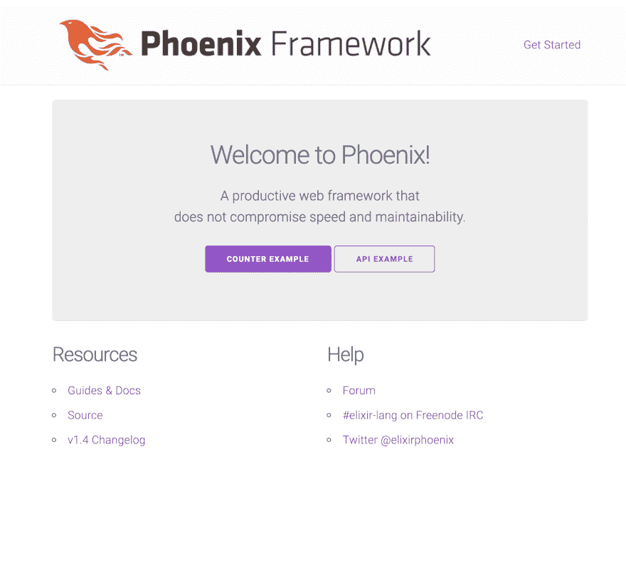
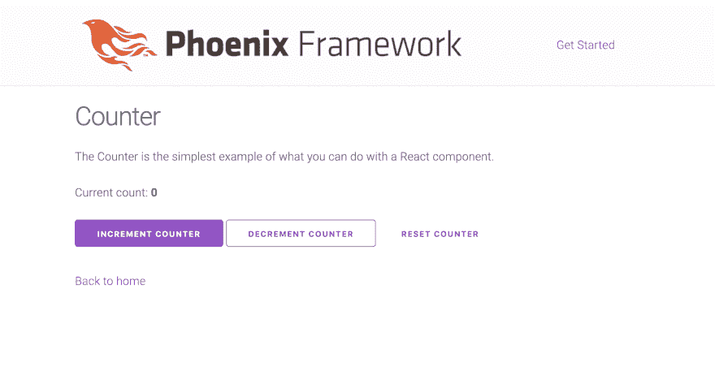
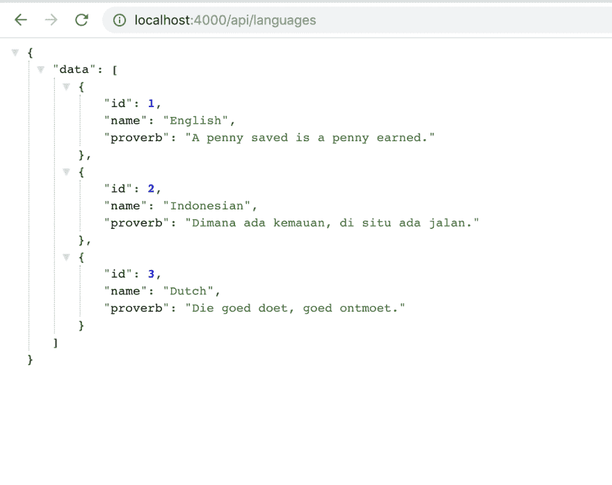
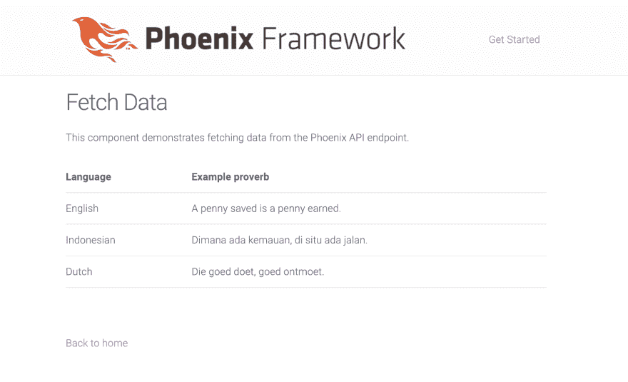

# 凤凰与 React:正确的方式

> 原文：<https://dev.to/resir014/phoenix-with-react-the-right-way-25gi>

这是一篇期待已久的重写文章，关于如何完美设置使用 Phoenix 和 React，最初发布在我的网站上。默认情况下，Phoenix 1.4 附带了 [Webpack](https://webpack.js.org/) ，因此设置比以前简单多了。拖延已久的重写已经完成，并且随着最近对 Phoenix 的更新而更新。[样本报告](https://github.com/resir014/phoenix_react_playground)也已更新。

对于那些正在寻找我的迁移到 TypeScript 指南的第 2 部分的人，请放心！它将在下周内完成。

* * *

最近我一直在玩长生不老药。最近，一个朋友[给我看了 Discord 工程团队的这篇博文](https://blog.discordapp.com/scaling-elixir-f9b8e1e7c29b)，内容是关于他们如何通过长生不老药的力量来扩展他们的平台，读完之后，我被说服去试一试。如果你打算学习这门语言，并且像我一样来自 Node.js，我建议你去看一下[这个介绍视频](https://www.youtube.com/watch?v=q8wueg2hswA)。

如果说 Ruby 有 [Rails](http://rubyonrails.org/) ，PHP 有 [Laravel](https://laravel.com/) ，那么 Elixir 有[凤凰](http://phoenixframework.org/)。如果你以前用过 Rails，你会有宾至如归的感觉。它拥有典型 web 框架的基本要素，尽管它有一些简洁的附加功能，如[通道](https://hexdocs.pm/phoenix/channels.html)，这使得使用套接字构建 web 应用程序更加容易。

我理想的 web 应用堆栈通常包括一个 React 前端。所以很自然地，我想知道如何用 React 前端构建一个 Phoenix 应用程序。不幸的是，用 Phoenix 设置 React 并不像许多人想象的那样简单。我在互联网上看到的几乎所有指南都只是渲染了一个 React 组件，并没有涵盖路由和 API 获取等基本内容。这花了我一段时间，但最终，我找到了一个实际可行的设置。

因此，如果你像我一样，一直想知道你究竟是如何让它工作的，我将向你展示如何。希望这能一劳永逸地回答这个问题。

## TL；速度三角形定位法(dead reckoning)

如果你不喜欢阅读，我在这里准备了这个指南的最终结果。一旦你设置好了，你应该有一个可以工作的 Phoenix 设置，它有如下的栈:

*   仙丹(`^1.7.4`)
*   Node.js ( `^10.15.0`)
*   npm ( `^6.4.1`)
*   凤凰(`^1.4.0`)
*   做出反应(`^16.7.0`)
*   打字稿(`^3.0.0`)
*   Webpack ( `^4.0.0`)

* * *

## 入门

在本指南中，我将假设您已经安装了[仙丹](https://elixir-lang.org/)、[凤凰](https://hexdocs.pm/phoenix/installation.html)和 [Node.js](https://nodejs.org/en/) 。如果你还没有，请在一个新的标签页中打开上面的链接。别担心，我会等的。

我们还将使用 Phoenix 1.4，这是撰写本文时可用的最新版本。

### 样板文件

我们将建立一个新的 Phoenix 项目，包括我们将要使用的构建环境。

从 1.4 版本开始，Phoenix 默认自带 [Webpack](https://webpack.js.org/) 。通过运行下面的命令，我们将有一个内置 JS 捆绑支持的 Phoenix 设置。

```
$ mix phx.new phoenix_react_playground 
```

Enter fullscreen mode Exit fullscreen mode

当你被问及是否也要获取和安装依赖项时，回答 No。我们稍后会讲到。

默认情况下，`package.json`文件、Webpack 配置和`.babelrc`文件位于`assets/`文件夹中，而不是项目根目录中。这并不理想，因为它可能会和像 [Visual Studio Code](https://code.visualstudio.com/) 这样的 ide 搞砸。因此，让我们将它们移到项目根目录下。

```
$ cd phoenix_react_playground
$ mv assets/package.json .
$ mv assets/webpack.config.js .
$ mv assets/.babelrc . 
```

Enter fullscreen mode Exit fullscreen mode

这意味着我们需要更改 Phoenix 提供的一些默认设置:

`.gitignore`

```
@@ -26,7 +26,7 @@ phoenix_react_playground-*.tar
 npm-debug.log

 # The directory NPM downloads your dependencies sources to.
-/assets/node_modules/ +node_modules/ 
 # Since we are building assets from assets/,
 # we ignore priv/static. You may want to comment 
```

Enter fullscreen mode Exit fullscreen mode

`package.json`

```
@@ -6,8 +6,8 @@
     "watch": "webpack --mode development --watch"
   },
   "dependencies": {
-    "phoenix": "file:../deps/phoenix",
-    "phoenix_html": "file:../deps/phoenix_html" +    "phoenix": "file:deps/phoenix",
+    "phoenix_html": "file:deps/phoenix_html"
   },
   "devDependencies": {
     "@babel/core": "^7.0.0",
@@ -18,7 +18,7 @@
     "mini-css-extract-plugin": "^0.4.0",
     "optimize-css-assets-webpack-plugin": "^4.0.0",
     "uglifyjs-webpack-plugin": "^1.2.4",
-    "webpack": "4.4.0",
-    "webpack-cli": "^2.0.10" +    "webpack": "4.28.4",
+    "webpack-cli": "^3.2.1"
   }
 } 
```

Enter fullscreen mode Exit fullscreen mode

`webpack.config.js`

```
@@ -13,11 +13,11 @@ module.exports = (env, options) => ({
     ]
   },
   entry: {
-      './js/app.js': ['./js/app.js'].concat(glob.sync('./vendor/**/*.js')) +    app: './assets/js/app.js'
   },
   output: {
     filename: 'app.js',
-    path: path.resolve(__dirname, '../priv/static/js') +    path: path.resolve(__dirname, 'priv/static/js')
   },
   module: {
     rules: [
@@ -36,6 +36,10 @@ module.exports = (env, options) => ({
   },
   plugins: [
     new MiniCssExtractPlugin({ filename: '../css/app.css' }),
-    new CopyWebpackPlugin([{ from: 'static/', to: '../' }])
-  ] +    new CopyWebpackPlugin([{ from: 'assets/static/', to: '../' }])
+  ],
+  resolve: {
+    // Add '.ts' and '.tsx' as resolvable extensions.
+    extensions: ['.ts', '.tsx', '.js', '.jsx', '.json']
+  }
 }); 
```

Enter fullscreen mode Exit fullscreen mode

上面的 Webpack 配置适用于将未捆绑资产放在`assets/`文件夹中的理想 Phoenix 设置。我们需要确保 Phoenix 作为我们的观察者正确运行 Webpack 命令。为此，将`config/dev.exs`修改如下:

```
-  watchers: [] +  watchers: [
+    {"node", [
+      "node_modules/webpack/bin/webpack.js",
+      "--watch-stdin",
+      "--colors"
+    ]}
+  ] 
```

Enter fullscreen mode Exit fullscreen mode

为了确保一切正常，运行以下命令:

```
$ mix deps.get
$ npm install 
```

Enter fullscreen mode Exit fullscreen mode

一切正常吗？很好！接下来，我们将设置我们的 TypeScript 环境。

首先，我们将为 Babel 安装 TypeScript + React 预设，并将其放入我们的`.babelrc`。

```
$ yarn add --dev @babel/preset-react @babel/preset-typescript @babel/plugin-proposal-class-properties @babel/plugin-proposal-object-rest-spread typescript 
```

Enter fullscreen mode Exit fullscreen mode

```
@@ -1,5 +1,10 @@
 {
-    "presets": [
-        "@babel/preset-env"
-    ]
-} +  "presets": [
+    "@babel/preset-env",
+    "@babel/preset-react",
+    "@babel/preset-typescript"
+  ],
+  "plugins": [
+    "@babel/plugin-proposal-class-properties",
+    "@babel/plugin-proposal-object-rest-spread"
+  ]
+} 
```

Enter fullscreen mode Exit fullscreen mode

然后，我们将创建一个标准的`tsconfig.json`文件，并用以下内容填充它。

```
{  "compilerOptions":  {  "allowJs":  true,  "allowSyntheticDefaultImports":  true,  "esModuleInterop":  true,  "isolatedModules":  true,  "lib":  ["dom",  "esnext"],  "jsx":  "preserve",  "target":  "es2016",  "module":  "esnext",  "moduleResolution":  "node",  "preserveConstEnums":  true,  "removeComments":  false,  "sourceMap":  true,  "strict":  true  },  "include":  ["./**/*.ts",  "./**/*.tsx"]  } 
```

Enter fullscreen mode Exit fullscreen mode

最后，修改我们的 Webpack 配置，使`babel-loader`接受 JS 和 ts 文件。不要忘记改变你的 Webpack 入口文件的扩展名！

```
@@ -13,7 +13,7 @@ module.exports = (env, options) => ({
     ]
   },
   entry: {
-    app: './assets/js/app.js' +    app: './assets/js/app.tsx'
   },
   output: {
     filename: 'app.js',
@@ -22,7 +22,7 @@ module.exports = (env, options) => ({
   module: {
     rules: [
       {
-        test: /\.js$/, +        test: /\.(js|jsx|ts|tsx)$/,
         exclude: /node_modules/,
         use: {
           loader: 'babel-loader' 
```

Enter fullscreen mode Exit fullscreen mode

设置好样板文件后，Phoenix 项目的文件夹结构应该如下所示。

```
phoenix_react_playground/
├── assets/
│   ├── js/
│   │   ├── ...
│   │   └── app.tsx
│   ├── scss/
│   │   ├── ...
│   │   └── app.scss
│   └── static/
│       ├── images/
│       │   └── ...
│       ├── favicon.ico
│       └── robots.txt
├── config/
│   └── ...
├── lib/
│   └── ...
├── priv/
│   └── ...
├── test/
│   └── ...
├── .gitignore
├── mix.exs
├── package.json
├── README.md
├── tsconfig.json
└── webpack.config.js 
```

Enter fullscreen mode Exit fullscreen mode

### 设置反应

现在让我们以正确的方式与菲尼克斯联系起来。当然，首先我们需要安装 React。

```
$ yarn add react react-dom react-router-dom
$ yarn add --dev @types/react @types/react-dom @types/react-router-dom 
```

Enter fullscreen mode Exit fullscreen mode

然后，我们可以设置我们的基本 React 样板文件。在我们的 assets 文件夹中，将`app.js`重命名为`app.tsx`，并将文件重写如下。

`assets/js/app.tsx`

```
import '../css/app.css'

import 'phoenix_html'

import * as React from 'react'
import * as ReactDOM from 'react-dom'
import Root from './Root'

// This code starts up the React app when it runs in a browser. It sets up the routing
// configuration and injects the app into a DOM element.
ReactDOM.render(<Root />, document.getElementById('react-app')) 
```

Enter fullscreen mode Exit fullscreen mode

`assets/js/Root.tsx`

```
import * as React from 'react'
import { BrowserRouter, Route, Switch } from 'react-router-dom'

import Header from './components/Header'
import HomePage from './pages'

export default class Root extends React.Component {
  public render(): JSX.Element {
    return (
      <>
        <Header />
        <BrowserRouter>
          <Switch>
            <Route exact path="/" component={HomePage} />
          </Switch>
        </BrowserRouter>
      </>
    )
  }
} 
```

Enter fullscreen mode Exit fullscreen mode

`assets/js/components/Header.tsx`

```
import * as React from 'react'

const Header: React.FC = () => (
  <header>
    <section className="container">
      <nav role="navigation">
        <ul>
          <li>
            <a href="https://hexdocs.pm/phoenix/overview.html">Get Started</a>
          </li>
        </ul>
      </nav>
      <a href="http://phoenixframework.org/" className="phx-logo">
        
      </a>
    </section>
  </header>
)

export default Header 
```

Enter fullscreen mode Exit fullscreen mode

`assets/js/components/Main.tsx`

```
import * as React from 'react'

const Main: React.FC = ({ children }) => (
  <main role="main" className="container">
    {children}
  </main>
)

export default Main 
```

Enter fullscreen mode Exit fullscreen mode

`assets/js/pages/index.tsx`

```
import * as React from 'react'
import { RouteComponentProps } from 'react-router-dom'
import Main from '../components/Main'

const HomePage: React.FC<RouteComponentProps> = () => <Main>HomePage</Main>

export default HomePage 
```

Enter fullscreen mode Exit fullscreen mode

应该可以了。

现在，打开我们项目的`router.ex`文件夹，在`"/"`范围内修改我们的路线，如下所示。

```
-    get "/", PageController, :index +    get "/*path", PageController, :index 
```

Enter fullscreen mode Exit fullscreen mode

然后，修改我们的模板文件，以便它正确地加载我们的 React 代码。在基本布局模板中，我们可以用脚本处理`<body>`标签中的所有内容。

`templates/layout/app.html.eex`

```
 <body>
    <%= render @view_module, @view_template, assigns %>
    <script type="text/javascript" src="<%= Routes.static_path(@conn, "/js/app.js") %>"></script>
  </body> 
```

Enter fullscreen mode Exit fullscreen mode

现在是索引页面模板。确保将`id`属性设置为在`app.tsx`上指定的应用程序入口点。

`templates/page/index.html.eex`

```
<div id="react-app"></div> 
```

Enter fullscreen mode Exit fullscreen mode

## 理智检查

现在我们要检查一切是否正常。再次运行`mix deps.get`和`npm install`来确认一下，然后运行`mix ecto.setup`来建立我们的数据库(如果我们有任何设置的话)。然后运行`mix phx.server`，等待 Webpack 过程完成，然后前往`localhost:4000`。

如果它工作了，你可以看到你的网页加载，祝贺你！让我们进入精彩的部分。

[](https://res.cloudinary.com/practicaldev/image/fetch/s--Xni_maS5--/c_limit%2Cf_auto%2Cfl_progressive%2Cq_auto%2Cw_880/https://thepracticaldev.s3.amazonaws.com/i/zhf0qa0c3hhfjfs0cbd2.png)

* * *

## 用`react-router`创建附加页面

现在我们已经运行了基本的 Phoenix 服务器，让我们创建几个可以用 React 做的漂亮事情的例子。在演示 React 的功能时，人们最常举的例子是计数器应用程序。

首先，我们将把计数器路径添加到我们的`Root.tsx`文件中。

```
 import * as React from 'react'
 import { BrowserRouter, Route, Switch } from 'react-router-dom'

 import Header from './components/Header'
 import HomePage from './pages'
+import CounterPage from './pages/counter' 
 export default class Root extends React.Component {
   public render(): JSX.Element {
     return (
       <>
         <Header />
         <BrowserRouter>
           <Switch>
             <Route exact path="/" component={HomePage} />
+            <Route path="/counter" component={CounterPage} />
           </Switch>
         </BrowserRouter>
       </>
     )
   }
 } 
```

Enter fullscreen mode Exit fullscreen mode

然后，我们将添加`Counter`组件。

`assets/js/pages/counter.tsx`

```
import * as React from 'react'
import { Link } from 'react-router-dom'

import Main from '../components/Main'

// Interface for the Counter component state
interface CounterState {
  currentCount: number
}

const initialState = { currentCount: 0 }

export default class CounterPage extends React.Component<{}, CounterState> {
  constructor(props: {}) {
    super(props)

    // Set the initial state of the component in a constructor.
    this.state = initialState
  }

  public render(): JSX.Element {
    return (
      <Main>
        <h1>Counter</h1>
        <p>The Counter is the simplest example of what you can do with a React component.</p>
        <p>
          Current count: <strong>{this.state.currentCount}</strong>
        </p>
        {/* We apply an onClick event to these buttons to their corresponding functions */}
        <button className="button" onClick={this.incrementCounter}>
          Increment counter
        </button>{'  '}
        <button className="button button-outline" onClick={this.decrementCounter}>
          Decrement counter
        </button>{'  '}
        <button className="button button-clear" onClick={this.resetCounter}>
          Reset counter
        </button>
        <br />
        <br />
        <p>
          <Link to="/">Back to home</Link>
        </p>
      </Main>
    )
  }

  private incrementCounter = () => {
    this.setState({
      currentCount: this.state.currentCount + 1
    })
  }

  private decrementCounter = () => {
    this.setState({
      currentCount: this.state.currentCount - 1
    })
  }

  private resetCounter = () => {
    this.setState({
      currentCount: 0
    })
  }
} 
```

Enter fullscreen mode Exit fullscreen mode

现在去`localhost:4000/counter`测试你的创作。如果有效，我们可以继续下一部分。

[](https://res.cloudinary.com/practicaldev/image/fetch/s--23YW1f3r--/c_limit%2Cf_auto%2Cfl_progressive%2Cq_auto%2Cw_880/https://thepracticaldev.s3.amazonaws.com/i/hfep4xayecb6bp1gb1by.png)

## 获取 APIs 一个简单的例子

如前所述，我在网上找到的几乎所有 React + Phoenix 教程都只是渲染了一个 React 组件。他们似乎从来没有解释如何使双方反应和凤凰适当，以便他们可以互相沟通。希望这能解释一切。

在您开始之前，请请*请*确保在`router.ex`时，您将`"/api"`范围声明为*在*声明之上。说真的。我花了整整一周的时间弄清楚为什么我的 API 路由不起作用，然后直到最近才意识到我的路由声明反过来了。

`router.ex`

```
 # ...

  scope "/api", PhoenixReactPlaygroundWeb do
    pipe_through :api

    # ...your API endpoints
  end

  # ...

  scope "/", PhoenixReactPlaygroundWeb do
    pipe_through :browser # Use the default browser stack

    # This route declaration MUST be below everything else! Else, it will
    # override the rest of the routes, even the `/api` routes we've set above.
    get "/*path", PageController, :index
  end 
```

Enter fullscreen mode Exit fullscreen mode

当我们完成所有设置后，为我们的示例数据创建一个新的上下文。

```
$ mix phx.gen.json Example Language languages name:string proverb:string 
```

Enter fullscreen mode Exit fullscreen mode

`router.ex`

```
 scope "/api", PhoenixReactPlaygroundWeb do
      pipe_through :api

+     resources "/languages", LanguageController, except: [:new, :edit]
    end 
```

Enter fullscreen mode Exit fullscreen mode

您还可以创建一个数据库种子来预先填充数据。关于如何做到这一点的更多信息可以在这个[药剂铸造课程](https://elixircasts.io/seeding-data-in-phoenix)中找到。

是时候进行另一次理智检查了！运行凤凰服务器，进入`localhost:4000/api/languages`。如果一切正常，您应该会看到一个空白的或填充的 JSON(取决于您是否预先加载了数据库)。

[](https://res.cloudinary.com/practicaldev/image/fetch/s--ZVnHecYM--/c_limit%2Cf_auto%2Cfl_progressive%2Cq_auto%2Cw_880/https://thepracticaldev.s3.amazonaws.com/i/3m20d2w7pie56rthdo8y.png)

如果一切顺利，我们现在可以继续我们的组件。

`Root.tsx`

```
 import * as React from 'react'
 import { BrowserRouter, Route, Switch } from 'react-router-dom'

 import Header from './components/Header'
 import HomePage from './pages'
 import CounterPage from './pages/counter'
+import FetchDataPage from './pages/fetch-data' 
 export default class Root extends React.Component {
   public render(): JSX.Element {
     return (
       <>
         <Header />
         <BrowserRouter>
           <Switch>
             <Route exact path="/" component={HomePage} />
             <Route path="/counter" component={CounterPage} />
+            <Route path="/fetch-data" component={FetchDataPage} />
           </Switch>
         </BrowserRouter>
       </>
     )
   }
 } 
```

Enter fullscreen mode Exit fullscreen mode

`pages/fetch-data.tsx`

```
import * as React from 'react';
import { Link } from 'react-router-dom';

import Main from '../components/Main';

// The interface for our API response
interface ApiResponse {
  data: Language[];
}

// The interface for our Language model.
interface Language {
  id: number;
  name: string;
  proverb: string;
}

interface FetchDataExampleState {
  languages: Language[];
  loading: boolean;
}

export default class FetchDataPage extends React.Component<
  {},
  FetchDataExampleState
> {
  constructor(props: {}) {
    super(props);
    this.state = { languages: [], loading: true };

    // Get the data from our API.
    fetch('/api/languages')
      .then(response => response.json() as Promise<ApiResponse>)
      .then(data => {
        this.setState({ languages: data.data, loading: false });
      });
  }

  private static renderLanguagesTable(languages: Language[]) {
    return (
      <table>
        <thead>
          <tr>
            <th>Language</th>
            <th>Example proverb</th>
          </tr>
        </thead>
        <tbody>
          {languages.map(language => (
            <tr key={language.id}>
              <td>{language.name}</td>
              <td>{language.proverb}</td>
            </tr>
          ))}
        </tbody>
      </table>
    );
  }

  public render(): JSX.Element {
    const content = this.state.loading ? (
      <p>
        <em>Loading...</em>
      </p>
    ) : (
      FetchData.renderLanguagesTable(this.state.languages)
    );

    return (
      <Main>
        <h1>Fetch Data</h1>
        <p>
          This component demonstrates fetching data from the Phoenix API
          endpoint.
        </p>
        {content}
        <br />
        <br />
        <p>
          <Link to="/">Back to home</Link>
        </p>
      </Main>
    );
  }
} 
```

Enter fullscreen mode Exit fullscreen mode

一切都好！现在去`localhost:4000/fetch-data`试一试。

[](https://res.cloudinary.com/practicaldev/image/fetch/s--l7Qn1p2I--/c_limit%2Cf_auto%2Cfl_progressive%2Cq_auto%2Cw_880/https://thepracticaldev.s3.amazonaws.com/i/9l9k7ymg4t6pxq8c1ugr.png)

* * *

## 结果

如果你还在，恭喜你，你的设置完成了！再次运行`mix phx.server`并检查所有内容。如果一切正常，那就双重祝贺！

现在，您可以使用这些知识来构建下一个 React + Phoenix 应用程序。该指南的最终结果可在[这里](https://github.com/resir014/phoenix_react_playground)获得，供每个人试用。

祝你好运！如果你有任何问题，请随时发微博给我。

* * *

*感谢[~塞尔斯基](https://tilde.town/~selsky)对这篇文章校对的帮助！*