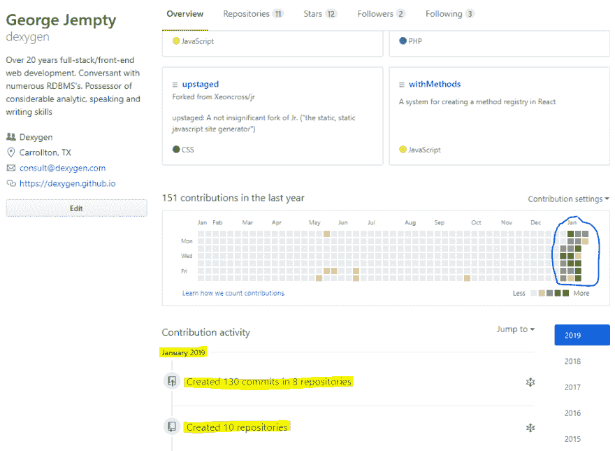

# 2.5 个月“坐冷板凳”

> 原文：<https://dev.to/dexygen/25-months-on-the-bench-27d7>

这篇文章的四个标签中的最后三个是误导性的；这是关于所有这些的缺乏。自从我 2.5 个月前开始一份新工作以来，我一直“坐在板凳上”，没有写过一个字符的代码！！

出于某种原因，尽管我是一名体育迷，但我从未想到过与体育运动的类比，直到我阅读了城市词典中的条目，它将体育运动比作“等待(你的)外出比赛”，而“一些球队正在场上比赛”。这一页在其他方面也很到位，至少就我而言是这样的，即“顾问们担心，如果坐在板凳上太久，没人想要他们的技能，这是可以理解的。”

也许后者解释了我这个月在 Github 上持续的活动: 

什么时候(如果？)我的工作开始了，我被告知需要的技能在我的简历上会很好看。假期也很棒，每年 10 天，而不是像许多美国工作提供的 6 或 7 天，通常从 1 月 1 日到 5 月下旬没有假期。例如，我明天休息，虽然在某种程度上，我将如何能够告诉区别；)