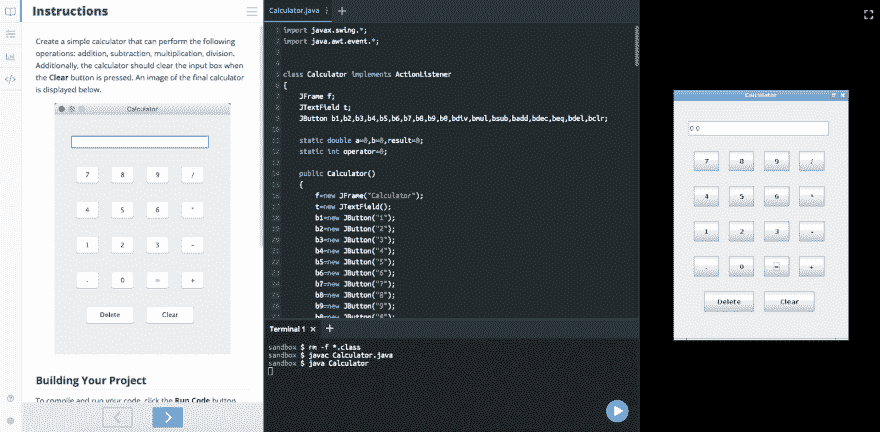
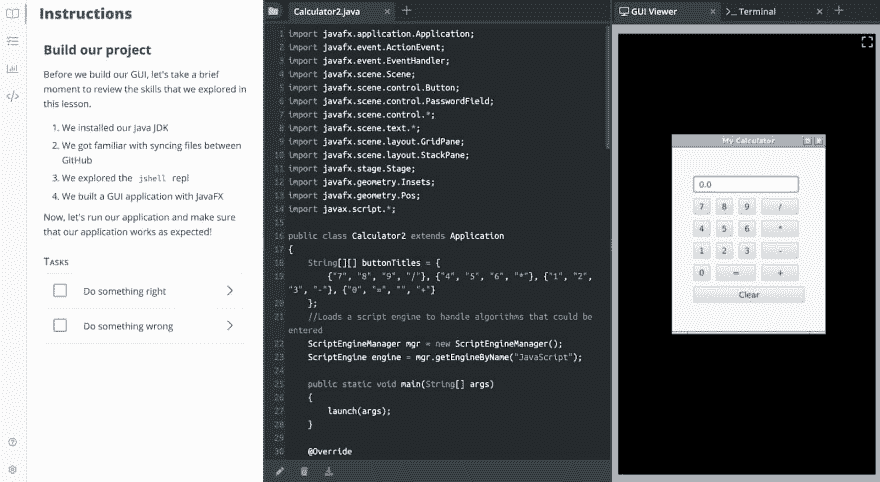

# 新的一年新的界面！

> 原文：<https://dev.to/nexttech/new-year-new-interface-38bo>

在 Next Tech，我们非常激动地宣布我们基于标签的界面的发布！这使得任何界面组件(例如网络浏览器或终端)能够被放置在界面的任何部分(或“窗格”)中。这意味着终端可以在代码文件旁边加载，完整的 GUI 查看器可以在 SQL 显示旁边，等等。

以前，每个窗格只能支持一个组件。因此，如果您想要一个代码编辑器、终端和 web 浏览器，您需要一个三窗格布局。这对于介绍性用例来说工作得很好，但是当我们进一步用学习材料为开发者和初学者服务时，我们发现这种方法是一个主要的限制。例如，在教授 web 框架时，只需要终端运行一两个命令。因此，必须将它放在屏幕上，占用代码编辑器和 web 浏览器的空间，导致了不必要的拥挤布局。

这可能是以前的样子:

这是它现在的样子:

请注意，GUI 和终端选项卡现在并排位于两个窗格的布局中，而不是需要三个窗格的布局来适应相同的用例。

现在，我们支持的大量界面元素和我们正在创建的新元素可以以数百种方式混合和匹配。相对于预先配置，打开新选项卡的选项也可以留给学习者。

目前，我们支持以下选项卡类型:

*   可编辑的代码和文本文件
*   具有或不具有 root 访问权限的终端
*   任何端口的网络浏览器
*   支持 X 的 GUI 显示
*   SQL 结果表
*   Skulpt 程序的 Python 图形显示
*   图像和视频等媒体文件

我们全心全意地相信，提供一个加载了菜单的传统 IDE 对学习者和任何从事项目工作的人都是有害的。同时，仅仅运行代码的机器也没有用。因此，这个界面，就像我们已经建立的其他界面一样，是精心设计的，一次一个，以确保它功能强大，但对任何人来说都简单易用。

我们已经在编程、web 开发、数据库设计和机器学习的课程中很好地使用了这个界面。我们现在提供每月 9 美元的订阅来访问我们的课程，你可以免费开始一周！

如果你想了解更多关于如何在 Next Tech 上用这个界面建立你自己的课程，我们很乐意[听听你的意见](https://next.tech)。