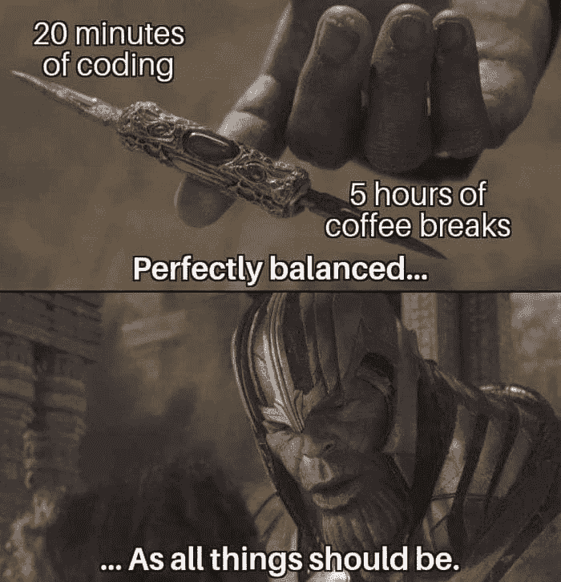

# 作为生产力倍增器的直播

> 原文：<https://dev.to/pretzelhands/live-streaming-as-productivity-multiplier-13bj>

<small>尼基塔·卡恰诺夫斯基在 Unsplash 上的照片</small>

> 这篇文章最初发表在我的个人博客上。

你们中可能有人知道这种迷因的某种形式

有时候，当谈到副业时，这就是我。不要误会我的意思，我喜欢建立辅助项目，真的想得到尽可能多的东西。但是，有时互联网的兔子洞可能会非常深，开始时在文档中快速检查的东西可能会在阅读一些你永远不会使用的深奥编程语言的几个小时中结束。

我承认我可能有点拖延症。它发生在我们最好的人身上。

但是有一个很好的方法来对抗它并同时与其他人分享:在你编码的时候进行实时流传输。这已经有一段时间了，但是特别是自从奥地利程序员同事[阿明·乌尔里希](https://twitter.com/arminulrich)的[shipstreams.com](https://shipstreams.com)出现后，围绕它出现了一点热潮。当它开始的时候，我也加入了。

原来流媒体有点像按需结对编程，但有更多的社会因素。当你陷入困境时，有人看着你并帮助你就像一种超能力。与此同时，你可以谈论你正在做的事情，并与那些对你正在做的事情感兴趣的人进行互动，这让人感到无比的谦卑和激励。

一般来说，在任何时候都只有 4-5 个人在看我的流，但是知道他们花他们的空闲时间来看我的代码让我更加专注，并且防止我意外地偏离非生产性行为的主题。最后，这比你自己编码要累一点，但是我感觉在同样的时间里至少完成了两倍的工作。

同样，无论何时你发现一个错误，你都会加倍努力去改正它，让事情继续发展。是的，你的代码可能不总是非常漂亮，但至少你完成了任务！有时候这很重要。您可以修复已经编写好的代码，但是您不能对不存在的代码做任何事情。

所以，如果你发现自己陷入了创造性的困境，试试流媒体吧！在 Twitch 和 Shipstreams 上设置一个帐户，[了解如何设置您的 PC/笔记本电脑](https://shipstreams.com/blog/recommended-twitch-streaming-setup-guide)进行流媒体播放，然后就可以开始了！不一定要完美，不一定要超专业。不管怎样，人们都会很乐意看着你。这很有趣，也许你能学到一两件事。

给你一个无耻的建议:你可以在 Twitch 上关注我，看看我什么时候直播。我很想和你们大家聊天！