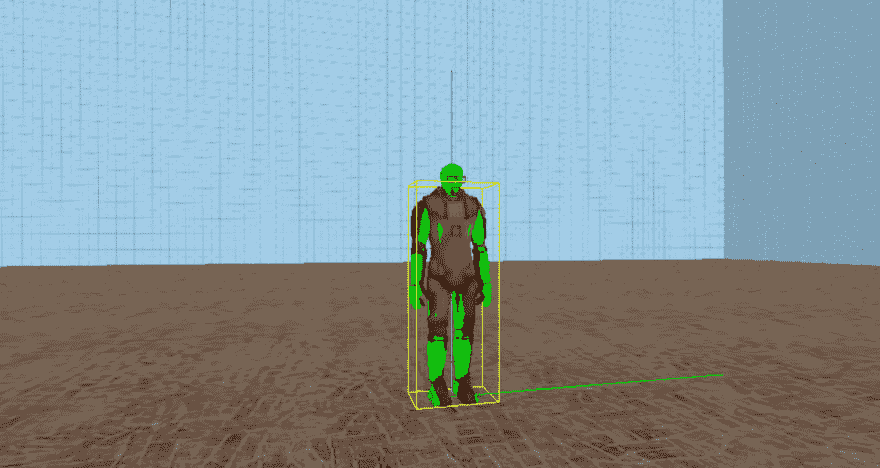
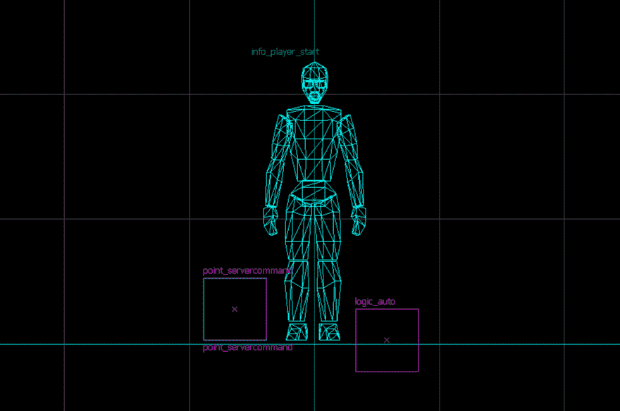

# 如何穿着 HEV 套装启动地图？

> 原文：<https://dev.to/grawl/how-to-start-map-with-hev-suit-on-2nje>

> 使用锤子编辑器 4.1 的快速指南，Build 6412，Source SDK Base 2013 single player[即将推出]

如果你只是放上`info_player_start`并启动地图，你将没有 HEV 套装:你不能跑，你没有十字准线，没有手电筒，等等。如果你想在地图开始后把 HEV 套装给玩家，这很好，但是你可能想以一场战斗开始地图。

最简单和明显的方法是将`item_suit`实体放在`info_player_start`实体的正上方，但当 Freeman 在 17 号城市的 Isaac Kleiner 实验室第一次穿上 HEV 套装时，你将以“登录声”和手部动画开始游戏。

> 克鲁克 1 级

如果你想在没有手势动画和“登录声音”的情况下启动地图，这里有一个简短的指南:

1.  创建实体:`point_servercommand`
2.  名称:给它取任何名称，例如`command`
3.  创建`logic_auto`实体
4.  在输出选项卡上，使用窗口底部的按钮添加新项
5.  我的输出名为:`OnMapSpawn`
6.  目标实体命名:您之前创建的`point_servercommand`实体的名称
7.  通过此输入:`Command`
8.  参数覆盖为:`give item_suit`

> 35 级 boss

简而言之，我们创建一个在 map 启动时运行的触发器，它运行控制台命令来获取 HEV。你可以试着在游戏控制台中输入`give item_suit`,也会有同样的效果。