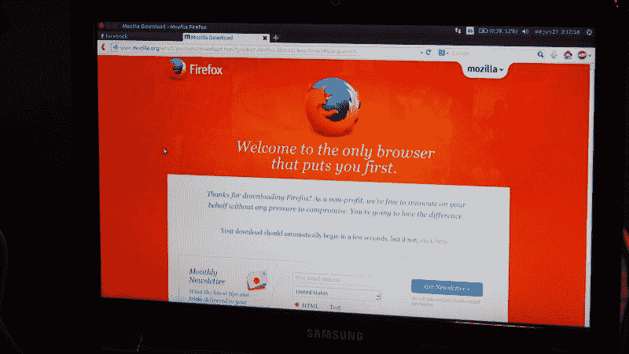
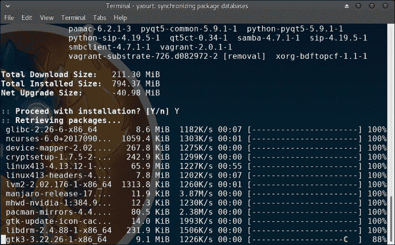
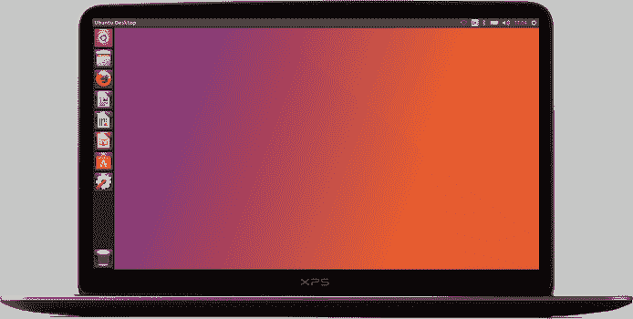
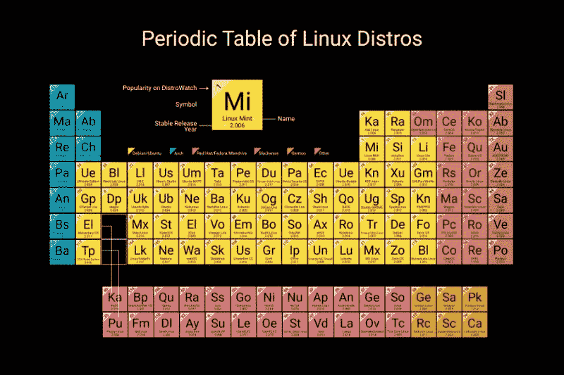
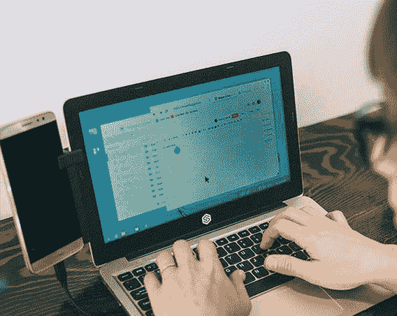
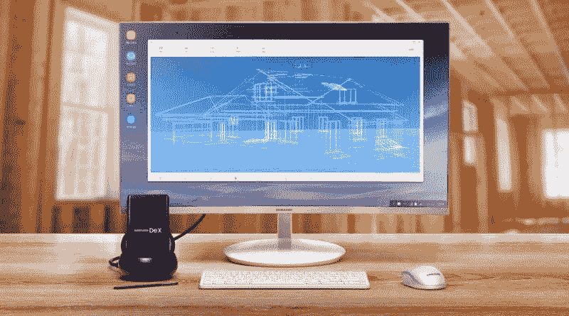
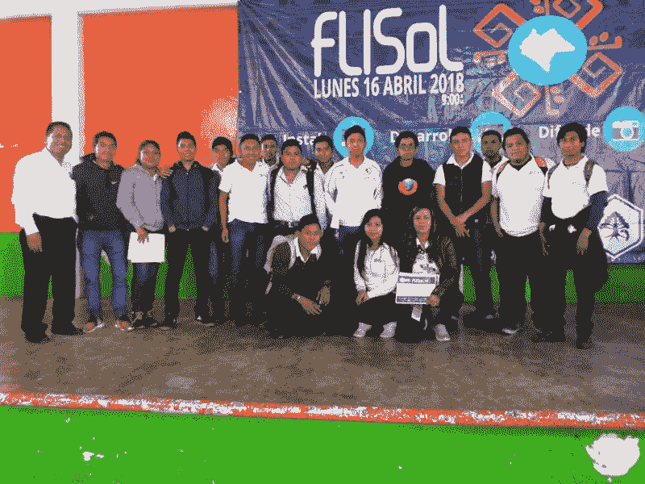

# 什么是使用自由和开放源码软件？

> 原文：<https://dev.to/mattdark/por-qu-usar-software-libre-17fh>

 
【我自 2006 年底以来一直是 **[【自由软件】](https://www.gnu.org/philosophy/free-sw.es.html)** 的用户，在大学上学期我参加的一个课程中听说了这个问题，我在

在课程中，我学会了如何安装 Ubuntu，这是一个面向最终用户的 GNU/Linux 发行版，5.04 或 5.10(我不记得确切版本)，但从那时起，我开始进一步调查，不久我将参与一些项目。

我不会试着说服你使用自由软件，如果我在接下来的几行中要做的就是告诉你我十多年来从使用自由技术中学到了什么，我会解释为什么你应该考虑给它一个机会来保证你的自由的工具。

## 是自由软件吗？

谈论自由软件就是谈论给我们一些自由的软件工具。1983 年发起的一场全球性运动，由当时在麻省理工学院的人工智能部工作的美国黑客**[【Richard stallman】](https://es.wikipedia.org/wiki/Richard_Stallman)**发起

 *理查德·斯泰曼。2011 年国际自由和开放源码软件大会。塔帕卡乌拉，恰帕斯。*

## 自由软件的自由

为了使一个工具被认为是自由软件，[自由软件基金会，](https://fsf.org/)T3]规定了一个程序必须实现的四项基本自由。

*   **自由 0** :以任何目的按自己的意愿执行程序。
*   **自由 1** :研究程序的工作方式并加以修改。
*   **【自由 2】**:重新分发副本。
*   **自由 3** :向第三方分发修订版的副本。

但是，∞这意味着什么？本质上，如果你找到一个自由软件工具来帮助你日常生活并想与他人分享，你可以这样做而不用担心违反软件许可，因为自由 2 允许你这样做。

对于更技术性的人来说，获取程序源代码是实现自由 1 和自由 3 的必要条件，因此，如果您开发软件，您可以研究它的工作方式，并根据需要进行修改，然后创建一个可以共享的新版本。

从法律上来说，《GNU 通用公共许可证》 (GNU GPL)是用于作为自由软件发布程序的许可证，保障上述自由。

## 软件自由 vs 软件私有

自由和开放源码软件一词来源于英语**，一个模棱两可的概念，因为在西班牙语中，" Free "一词既指自由也指免费，但自由和开放源码软件程序不一定是免费的，一些公司，如**[【red hat】](https://www.redhat.com/)****

 **虽然 Red Hat 并不收取软件许可费，而是收取其服务费用。大多数自由和开放源码软件是免费的，但不应与其他免费提供但不提供上述自由的工具相混淆，这些工具被称为专有软件。因此，必须澄清这两个概念之间的区别。

专有软件是微软(华盛顿州 Redmond)介绍的一个概念。它指的是发布源代码的许可证不允许对源代码进行研究和修改的程序，因此只有开发人员才能纠正错误和实施新功能。

此外，您可以免费下载专用程序，也可以通过支付许可费用购买，许可费用通常只允许在单台计算机上安装，因此您必须为每台使用专用程序的计算机购买许可。也就是说，您不需要支付许可证费用就可以分发本软件的副本。

但是，实际情况是，在许多情况下，使用专有软件(如 windows 或 Redmond 的官方套件)的用户并不总是购买许可证，而是使用这些程序的“破解”版本，其中包含未经许可而安装或收集数据的修改

许可证费用迫使人们寻找安装这些应用程序的备选方案，而不必购买这些应用程序，这要么是因为人们负担不起这种费用，要么是因为计算机设备维护者所提倡的文化。

在自由和开放源码软件中，除了现有的自由之外，还有其他一些好处，包括“”一些政府正在将其技术基础设施迁移到使用自由和开放源码软件，正如“[”蒙特利尔市“](https://lamiradadelreplicante.com/2018/05/17/la-ciudad-de-montreal-se-pasa-al-software-libre/)”所做的那样，它们是从那里开始的这些优势包括:

*   技术独立性。如果程序开发人员决定终止软件，则社区可以通过访问源代码继续执行该项目。

*   经济。大多数自由和开放源码软件工具都是免费提供的，虽然有商业工具，但不是为许可证付费，而是为所提供的服务付费。

*   使用和再分配的自由。如果使用自由软件工具，您可以制作副本并与附近的人共享，而不会受到任何使用限制。

*   纠错。自由和开放源码软件的开发不仅依赖于公司或负责人，而且还依赖于为这些项目贡献部分时间的人员，从而缩短了错误纠正和功能实施的时间。

*   安全。一个系统不能完全安全，许多安全错误取决于我们采取的行动。但是，通过自由和开放源码软件，我们可以知道是否有恶意代码或后门进入程序，因为可以访问源代码。

*   支持和兼容性。与专有软件不同，您不必每次发布程序时都购买新硬件，因此我们可以继续使用计算机更长时间。这使得我们使用的设备虽然不是市场上最新的，但我们仍然可以使用工具的最新版本。

## 是否使用自由软件？

到目前为止，您可能还不清楚自由和开放源码软件是否适合您，因为您可能在本文之前没有听说过这个主题，或者您对它的含义有错误的认识。

如果你认识一个学习或研究过任何信息技术相关职业的人，你肯定听说过“t0”【GNU/Linux】【Linux】【Linux】【Linux】(在学术上被称为)【Linux】，这是自由和开放源码软件中最重要的项目之一，而当你听到这一点时，你脑海中就会产生如下的画面

*manjaro*的系统更新

听了之后，你大概还记得那些电影里一个“ **[【黑客】](https://www.fayerwayer.com/2015/05/el-decalogo-de-la-cultura-hacker/)** (从正确的意义上来说)用空白字母在黑屏上写指示，告诉电脑或其他设备该怎么做。

> Hacker 是一个热衷于学习、了解事物的运作方式、改进事物或创造新事物以及分享知识的人。他们是信通技术、艺术、医学等领域的专家。

事实上，自由和开放源码软件不仅适用于“黑客”，然后他们使用自由和开放源码软件吗？诸如**【谷歌】**、**【Facebook】**、**【Twitter】**、**【维基媒体】**等公司和组织在其技术基础设施中使用自由软件，使您能够访问其服务。

[【NASA】](https://code.nasa.gov/)和**[【CERN】](https://www.linux.com/blog/2018/5/how-cern-using-linux-open-source)**在其服务器上使用 GNU/Linux 发行版，因为其基础设施的可扩展性和信息处理的可靠性允许它们这样做。他们提倡使用开放标准，这些机构开发的许多工具作为开源软件发布在 GitHub 存储库中。

在诸如**羽毛、**蜘蛛侠 2、**和**美国队长:冬令兵**等电影中，以及在歌曲 **[黑色是灵魂](https://youtu.be/z0EY-vQXRwc)T9 的视频中并且自共混基金以来，推动了 **[【开放式电影】](https://www.blender.org/about/projects/)** 的创作，至今共出版了八篇论文。****

自由和开放源码软件也是选择、**、**、**、**、**、**、**、**系统管理员的，尽管近年来，我遇到了一些受过信息通信技术以外培训的人，他们除了使用自由和开放源码软件之外，还从该运动的技术、政治和哲学角度宣传这一软件。

但是，如果我告诉你你也使用或曾经使用过自由软件，你会相信吗？事实上，我们几乎都使用自由软件，如果你使用以下任何程序，你也使用自由软件，直到今天你才知道。

**安卓**
**Mozilla 火狐**
**VLC**
**WordPress**

我必须指出，并非上述所有程序都是根据 GNU GPL 授权发布的，而是根据其他兼容的授权发布的，因此，那些不使用 GNU GPL 授权的程序有时被称为“”开源软件，这是一个非常相似的概念，但两个术语之间存在差异，这就是为什么

## 自由和开放源码软件中的备选方案

第一个问题涉及计算机设备或移动设备的使用和使用的工具，以便根据这些信息在自由和开放源码软件中寻找替代办法，使我们能够执行同样的任务。我会推荐一些我已经阅读或使用过的程序，您可以用它们来替换您当前使用的一些工具。

几年前我就不再使用 Windows 作为预设作业系统，每当我买笔记型电脑时，我首先要做的就是删除预先安装的系统，并安装一个版本的「GNU/Linux」。

**GNU** 是由自由软件运动之父 **Richard Stallman** 创建的 Unix 型自由操作系统；**Linux**是由**Linus Torvalds【Linux】开发的系统内核(核心)】**

操作系统是一组相互作用的程序，因此您可以使用计算机设备或移动设备。它负责将我们的指令翻译成这些设备能够理解的语言(0s 和 1s)。

GNU/Linux 有几个版本，称为“单独”或“分发”，每个版本都是为特定目的和不同类型的用户设计的。其中一些是面向最终用户的解决方案，旨在使您能够更轻松地从 Windows 或其他操作系统进行迁移。

我安装的第一个发行版是**【Ubuntu】**，由 **[【规范】](https://canonical.com/)** 开发，基于**[【debian】](https://debian.org/)我第一次安装此操作系统是在 2006 年 12 月，安装程序为文本模式。它目前有一个图形安装程序，使这一过程比当时简单得多，并采用了与终端用户不同的方法。**

*Ubuntu 界面。资料来源-[https://Ubuntu . com/](https://ubuntu.com/)*

我使用 Ubuntu 有几年了，然后安装了其他的发行版，包括**[【debian】](https://debian.org/)**、**[【fedora】](https://getfedora.org/es/)**、**[【arch Linux】](https://archlinux.org/)此外，我还安装或虚拟化了其他的软体，只是为了测试它们，看看我是否应该向想要测试 GNU/Linux 的人推荐一些软体。**

如果您来自 Windows 并且想要测试 GNU/Linux，我建议您给 Ubuntu 一个机会。虽然 Canonical 因在发行过程中作出的错误决定而受到批评，但它还是 GNU/Linux 向最终用户公开的系统之一。您可以在熟悉 Ubuntu 界面的同时安装这两种操作系统，也可以从 USB 内存或 CD 进行测试。

您应该考虑的其他分配:

*   **[Linux 为](https://linuxmint.com/)T3**
*   **[初等 OS](https://elementary.io/es/)**
*   **[openSUSE](https://www.opensuse.org/)T3】**

如果您想了解其界面以及预安装的工具，还建议最终用户访问其官方网站或在 YouTube 上搜索视频。并且，如果您想了解现有自由操作系统的更完整列表，请参阅下面的“[”GNU/Linux 发行版的周期表“](http://lamiradadelreplicante.com/2017/11/08/la-tabla-periodica-de-las-distribuciones-gnulinux/)”。

*GNU/Linux 发行周期表资料来源:复制人的视角*

到目前为止，我只提到了可以在 PC、笔记本电脑和服务器上使用的发行版，但也有人试图将 Linux 或 GNU/Linux 移植到移动设备上，有些项目比其他项目更成功。

**Android** 是最常用的移动操作系统之一，我们可以在平板电脑和智能手机上找到。您可能正在从 Android 设备阅读这篇文章。而且由于今天的融合理念，有可能把手机改造成配备了像**[【super book】](https://www.sentio.com/)**这样的设备的笔记本电脑。

 *超级本- Fuente: Sentio*

其他不太幸运的项目有**【Firefox OS】**，“T2”[【Mozilla】](https://mozilla.org/)的移动操作系统，其中我们看到了一些智能手机、平板电脑和智能电视，并于 2013 年 10 月 30 日在墨西哥推出，其中一个项目是

 *智能手机 con Firefox OS*

**Ubuntu for Phones** 是一个将 Ubuntu 带入移动设备的规范项目，几个月前就停止了。**[【bq】](https://bq.com/)**(一家西班牙公司)与 Canonical 合作，随操作系统推出智能手机和平板电脑。虽然去年社会上宣布了“T6”复兴项目(葡萄牙文文章)的意向，但是 [Canonical 向 UBPorts](http://maslinux.es/canonical-dona-telefonos-de-ubuntu-a-ubports-para-continuar-con-el-desarrollo-de-ubuntu-touch/) 捐赠了手机。

而且，虽然这些项目没有奏效，但去年我们在路上看到了一点光明，据说‘t0’[【libem 5】](https://puri.sm/shop/librem-5/)的 Kickstarter 上的融资活动取得了成功。这是一款关注安全性和隐私的智能手机，您可以安装某些 GNU/Linux 发行版，如 Debian、Ubuntu 或 Arch Linux。此外，另一台设备，即“T4”[【necuno mobile】](https://necunos.com/)，搭载了 KDE 等离子体，现已可以预定 1，199 欧元。

另一方面，三星宣布了银河上的 Linux 项目，通过融合的概念，该项目将使银河系列智能手机能够使用 GNU/Linux。

 *银河上的 Linux-Fuente:Linux Adictos*

最后，如果你决定不改变操作系统但你想给它一个自由软件的机会，我会给你一个专有软件及其在自由软件中的替代方案的列表。

Photoshop-**[GIMP](https://gimp.org/)**
Corel DRAW-**[Inkscape](https://inkscape.org/)**
Microsoft Office-**[libre Office](http://www.libreoffice.org/)**
Windows Media Player-**[VLC](https://www.videolan.org/)**
Internet Explorer-**[Firefox](http://getfirefox.com/)**
WhatsApp-**[电报](https://telegram.org/)**

以上列表只包含了我此刻想到的几个例子，如果你想找别的工具的替代品，你可以在谷歌上搜索或者问我。

近年来，自由和开放源码软件发生了很大变化，现在我们有了更多的工具，可以为我们的日常活动服务，其中大部分免费提供。

开始吗？
如果你想了解更多关于自由和开放源码软件的知识，我建议你在论坛、博客和谈论它的网站上阅读，接近一个了解主题的人，尝试，最重要的是出席活动。

### 尽可能多地阅读

了解一个主题的最好方法是阅读，关于自由和开放源码软件，有几个网站我可以推荐，下面我给你列出一些西班牙语网站，你可以从中找到信息。

MuyLinux-[muylinux.com](http://muylinux.com/)
Linux Adictos-[linuxadictos.com](https://www.linuxadictos.com/)T5】OpenLibra-[openlibra.com](http://openlibra.com/)

### 烟草赤星病

列出您每天使用的应用程序，并在 Google 上搜索，以找到可以替代您已经使用的程序的自由软件替代方案。

虽然您肯定会找到您所使用的大多数工具的替代方案，但对于其中的任何一种工具来说，自由和开放源码软件可能还没有一个选项，因此您无法替换所有这些工具。
可查阅包含 Windows 免费软件目录的项目网站**[【cdfree . org】](http://www.cdlibre.org/)**。

### 请教专家

如果你想了解自由和开放源码软件而又不知道从哪里开始，那么你的学校、你的家人或你住的地方的某人很可能已经在使用自由和开放源码软件了，请过来问你需要知道些什么。保证他会指导你的过程，从而使你的经历尽可能友好，充满学习。

如果说我们使用自由技术的人有什么特点就是我们喜欢分享我们所知道的并帮助他人，那就是我们从自由软件中学到的哲学的一部分。

所以读完这篇文章后，如果你有什么问题在这里没有回答，你可以联系我，我会很快回复你。

### Intenta

学习新事物的最好方法是尝试，不要害怕尝试新技术，更重要的是鼓励自己采取下一步行动。你想做的事很可能不是第一次尝试，但你只要坚持到成功为止。此外，重要的是要用笔记或个人博客记录学习过程。

### 出席活动

认识别人和学习？参加讨论您感兴趣主题的活动。这次我们讲的是自由和开放源码软件，我建议你参加以下活动:

*   **[FLISoL](http://flisol.info/)T3】**
*   **[软件自由日](http://softwarefreedomday/)**

**拉丁美洲自由软件安装节【flisol】**是拉丁美洲最大规模的自由软件推广活动，自 2005 年以来在该地区 200 多个城市举行。节日每年四月的第四个星期六举行。

*FLISoL 2018 en rayn，Chiapas，MX*

这是我推荐你参加的活动，在活动现场你可以找到最近的总部，如果没有的话，我请你举办，你不需要成为这个主题的专家，在你的城市里找找是否有人知道活动所涉及的主题，并邀请他参加会议或讲习班。

**【软件自由日】**是每年 9 月第三个星期六举办的类似 FLISoL 的活动，涉及与自由软件相关的问题，是一项全球性活动。

除了上述活动外，该地区的每个国家还组织其他活动，因此您必须在社交媒体上查看或在 Google 上搜索，以了解在您的城市正在举办哪些谈论自由和开放源码软件的活动。

### 预装自由软件

每当我购买计算机设备时，我首先要删除默认安装的操作系统，通常是 Windows，然后安装 **Manjaro** ，这是一个基于 **Arch Linux** 的分发版，是我自 2013 年第一版发布以来一直使用的操作系统。

如果你想给像 **Ubuntu** 这样的自由操作系统一个机会，而又不具备执行安装的技术知识，请不要忘记联系已经使用**【GNU/Linux】**的人，向他寻求帮助。

另一方面，如果您正在考虑购买新的计算机，并希望避免这一过程，一些公司销售 Ubuntu 或其他预安装的分发版的计算机设备，如“[戴尔”去年推出的 Ubuntu](https://www.ubuntizando.com/dell-presenta-su-famila-de-portatiles-con-ubuntu/)系列笔记本电脑。

诸如 **[【站 x】](https://stationx.rocks/)**等设在英国的公司，几个月前推出了配备**[【manjaro】](https://manjaro.org/hardware/)**的笔记本电脑。 **[【纯主义】](https://puri.sm/)**，“T12”[【纯】](https://pureos.net/) 的开发公司，一个注重安全和隐私的操作系统；**libem 5**的后面，智能手机想到了隐私和安全；在旧金山设有办事处，并销售预装了“**纯”**笔记本电脑的用户。

另一方面，如果打算购买 **Chromebook** ，那么安装 **Ubuntu** 就不再需要遵循任何简单的流程，因为**chrome**，在这些计算机上预先安装的系统将支持

因此，如果您想要购买预先安装 GNU/Linux 发行版本的电脑，您目前有多种选择。

## 对自由和开放源码软件作出贡献

支持自由和开放源码软件的方法有多种，这取决于您可以花多少时间和有兴趣做些什么。

### 美国软件 Libre

促进自由和开放源码软件的最简单方法是尽可能使用自由和开放源码软件。如果您一直使用专有软件，请写一份您使用的工具列表，并搜索替代工具。如果您与他人合作，请不要使用自由软件。

### 促进其使用

建议你身边的人使用自由软件，告诉他们主题，告诉他们为什么他们应该开始使用它。如果你能多花点时间，喜欢在别人面前讲话，就准备一次谈话，讲述自己的经历。

### 帮助他人

如果在告诉某人自由和开放源码软件的情况后，您决定尝试，请帮助他们安装您选择的程序，并解释如何使用这些程序。只要你有答案就回答他们问你的问题，而是去找她，继续学习。分享你知道的和学到的。

### 项目协作

您不需要具备与自由和开放源码软件项目协作的技术配置文件，因为您总是需要其他领域的帮助。

*   发展。如果你知道如何编程或者你想学习如何编程，你会为自由和开放源码软件项目贡献代码。你可以搜索**[【github】](https://github.com/)**，并找到可以协作的项目存储库。你也可以帮助你最喜欢的工具。并且在 10 月期间参加**[【hacktoberfect】](https://hacktoberfest.digitalocean.com/)**并为开源项目做出贡献，帮助解决错误，实施功能等。

*   **位置**。除了发布程式的语言之外，您还会说其他语言，因此您可以协助寻找(翻译)使用者介面文字、说明选项等。

*   设计。你学习或学习图形设计或一些相关的职业，或者你有使用设计工具的经验，那么你可以帮助为项目创建图形材料。

还可以开展其他工作，例如编写文件、分发文件等。

### Crea 软件 Libre

一年前，我在博客上发表了一篇文章，题目是[学习编程，而不是在尝试](https://medium.com/pythonchiapas/aprender-a-programar-y-no-morir-en-el-intento-dfb001d8d5ed)时死去，讲述了我作为开发人员的经历，以及我对有意学习编程的人有何建议。

改进的最好方法，是在学习语言后解决问题，阅读在诸如**[【github】](https://github.com/)**、**[【gitlab】](https://gitlab.com/)**等平台上发布的项目源代码

如果你热衷于用技术编程和解决问题，我建议你相信的任何应用程序，无论语言或做什么，都应将源代码发布到 **GitHub** 或任何类似的平台上。

根据我的经验，我可以说任何小工具，如果有助于优化流程，可能会引起其他人的兴趣。我的一些项目已被墨西哥、巴西、美国等国的开发人员使用。

此外，它还使用许可证(如“**、GNU GPL、**(自由软件)或“**”Apache、**、**MIT**(开源)发布您的项目，以便其他人可以访问源代码、创建修改版本或为其做出贡献

我推荐您访问网站 **[【选择许可证】](https://choosealicense.com/)** ，这将帮助您选择最适合您项目的许可证。如果你有兴趣学习如何创建自由和开放源码软件项目，我建议你申请“T4”[【Mozilla open leaders】](https://mozilla.github.io/leadership-training/)计划，该计划每年有两轮，从 2 月至 5 月以及从 9 月至 12 月，这是我 2017 年毕业的计划，其中

### 组织事件

如果您有更多的时间和工作团队，您可以组织活动、访问学校讨论主题、计划网络研讨会(在线讲座和/或研讨会)，以及其他宣传自由和开放源码软件的活动。

公开演讲并不容易，也不总是让我们做好准备，但如果有机会的话，请一定要参加，这是一个很好的经验，你会学到很多东西。

### 自由和开放源码软件社区

它参与技术社区，每个自由和开放源码软件项目都得到社区组织人员的支持，他们花费部分时间参与该项目。

如果您所在的城市或语言中没有社群，而您又无法参与全球社群，那么您总是可以选择建立一个社群，这个社群可以是主题性的，也就是专注于特定的技术，或是 GNU/Linux 使用者群组，一般来说，这些群组都是自由软体。

什么是参与社区？过去几年里，我曾与几个技术和创业团体合作过，而你应该合作的一些原因如下(以下是 [Mariana García](https://medium.com/@marianagarca_5627) 在 FLISoL 举办的一次会议的一部分)，以及一个关于“技术团体在教育中的重要性”的服务器

*   技术学习。事实上，课程更新的频率不如技术更新的频率高，特别是在接受培训的专业人员认识到技术发展的速度和市场变化的情况下，将技术的使用纳入其日常活动的专业领域。参与社区使您能够了解新技术、趋势和市场需求，并有助于补充现有的学校课程。

*   技能和能力。参与社区有助于培养你在学校可能学不到的技能和能力。与他人合作，学会沟通，在公共场合表达自己的想法，热衷于学习，这是一个社区可以提供给你的东西的一部分。

*   网络。认识有自己兴趣的其他人。

希望文章有助于你迈向自由和开放源码软件，不要忘记，如果你对这里没有回答的主题有任何疑问，随时可以写信给我。

*经修订并受[【mariana】](https://medium.com/@marianagarca_5627)*启发的文章**