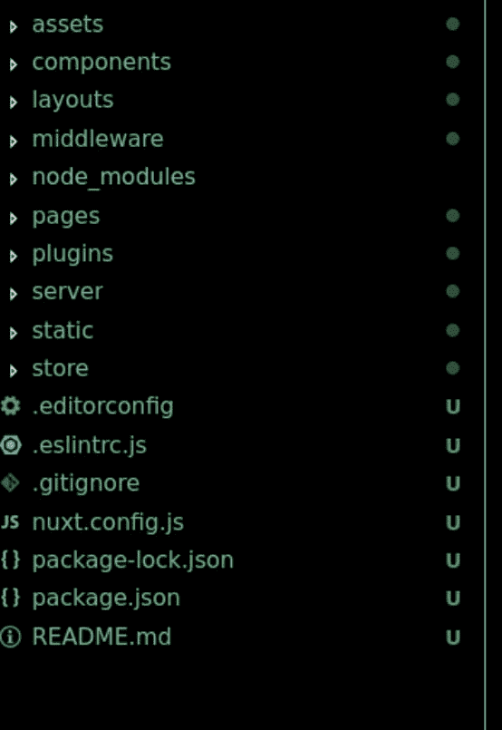

# 将我的个人网站移植到 nuxt.js

> 原文：<https://dev.to/errietta/porting-my-personal-website-to-nuxtjs-29p5>

[](https://res.cloudinary.com/practicaldev/image/fetch/s--JOKOPGaP--/c_limit%2Cf_auto%2Cfl_progressive%2Cq_auto%2Cw_880/https://thepracticaldev.s3.amazonaws.com/i/ww9tmuj1u7zx2ooebo73.png)

我的[个人网站](https://www.errietta.me)是我可以轻松实验的地方之一，写了又重写了几次。话虽如此，懒惰意味着它会在一段时间内停留在以前的 PHP-laravel 实现上。

PHP 是我作为一名开发人员首先学习的东西之一，当时我在大学学习一些框架，认为 Laravel 是组织我的代码的一种不错的方式。

近年来，我一直在尝试 node.js 等新技术，我相信单页面应用程序的服务器端呈现在某种程度上可以让你两全其美:开发速度、服务人员和组织 SPAs 前端代码的框架的优势，以及服务器端呈现应用程序的 SEO 优势

在这种情况下，我选择了 vue.js，因为它是一个轻量级且易于使用的框架，尤其是 nuxt.js，它允许您使用 Vue.js 和 express 等服务器框架进行服务器端渲染(SSR)。本质上，nuxt (vue SSR)是很好的老式 vue.js，第一个页面加载在服务器上呈现，因此搜索引擎仍然可以解析内容。此外，使用 node.js 很容易实现 API 路由来执行服务器端代码。

在这篇文章中，我将解释我是如何为这个网站做到这一点的。请注意，我建议在阅读本指南之前先了解一下 vue.js 和 node.js 的基础知识，因为我会假设你对它们有所了解。

## 创建应用程序

首先要做的是安装 create-nuxt-app ( `npm install -g create-nuxt-app`)。然后，我们可以用它来获得我们的应用程序的样板:`npx create-nuxt-app errietta.me-nuxt`

如果你观察创建的目录，你会看到…很多样板文件！

[](https://res.cloudinary.com/practicaldev/image/fetch/s--9h2PsQ_r--/c_limit%2Cf_auto%2Cfl_progressive%2Cq_auto%2Cw_880/https://thepracticaldev.s3.amazonaws.com/i/l7lfd3tnb5zbsfy9c9s9.png)

并非所有这些目录都是必需的，但是在知道项目需要什么之前，保留它们是值得的。

## nuxt . js 目录

这是对 nuxt.js 创建的目录的快速介绍；如果你不感兴趣，可以跳过这一部分。

*   assets 包含由 webpack 的文件加载器加载的 SVG 和图像等文件。这意味着您可以在 javascript 代码中使用它们。
*   *这与静态目录不同，express 只将静态目录中的文件作为静态文件。
*   组件包含组成页面的所有部分，如徽标组件、段落组件或博客组件。这些就像是你的页面的组成部分。
*   布局这是一种在页面内容周围创建一个或多个包装器的方法，这样您就可以在页面周围创建通用内容，如页眉、页脚、导航栏等。
*   中间件是在页面呈现之前运行代码的一种方式。例如，您可能希望检查用户是否经过身份验证。
*   pages 是页面的主要代码所在的位置。页面可以通过 AJAX 获取数据并加载组件。这是将由客户机和服务器执行的代码，因此如果您有只想在服务器上执行的代码，您希望它可以通过您的 pages 代码可以使用的 HTTP api 来访问。
*   插件是一个包含第三方插件的目录。
*   server 是您的 express(或其他框架)服务器代码。只要保留 nuxt.js 自动注入的代码，就可以像平常一样使用这个框架，它会为您处理 SSR。您可以在这里创建 API，服务器可以在页面加载时访问这些 API，或者 SPA 通过 AJAX 访问这些 API。
*   store 包含 VUEX 商店的代码。

## 开发应用程序

现在我们知道了目录是关于什么的，终于是时候动手了。当然是在隐喻的意义上。请不要用脏手打字…对我的页面来说，大部分是静态内容，所以很容易上手。比如 index.vue 是默认主页，我是从标准的 vue.js 代码开始:

```
<template>
  <div>
    <h1>Hello world!</h1>
     Welcome to my website.
  </div>
</template>

<script>
export default {
  name: 'Index',
  components: { },
  props: { },
  asyncData( { } ) { }
  computed: { }
}
</script>

<style scoped>
h1 {
  font-size: 200%;
}
</style> 
```

Enter fullscreen mode Exit fullscreen mode

目前为止没什么异常。然而，我的网站主页继续我最新博客文章的摘录，为了检索，我想解析我博客的 RSS。我想在 node.js 服务器端做实际的工作，这样如果我愿意的话，以后可以用适当的 API 调用来替换它。在这种情况下，我可以从客户端和服务器端调用这些代码，但是有些情况下，您只需要服务器端的代码，比如数据库连接，所以这是一个很好的例子。

我的意思是，实际获取博客文章的代码总是由节点服务器执行。SPA 将简单地从该服务器加载数据，或者在呈现时加载，或者通过前面解释的 HTTP 请求加载。

希望下图能解释发生了什么:

```
# Case 1: initial page load

VUE SSR (node) --HTTP--> express api (node) --> blog RSS

# Case 2: content loaded by HTTP on SPA

VUE (browser)  --HTTP--> express api (node) --> blog RSS 
```

Enter fullscreen mode Exit fullscreen mode

因此，您可以看到，无论应用程序的入口是什么，业务逻辑都只存在于节点层并在节点层执行。我在这里的下一步是创建 server/api/posts.js 来创建所说的业务逻辑:

```
const Parser = require('rss-parser')

const postsApi = async (req, res) => {
  const posts =  await parser.parseURL('https://www.errietta.me/blog/feed')
  // transform data to a uniform format for my api
  return res.json(posts)
}

module.exports = postsApi 
```

Enter fullscreen mode Exit fullscreen mode

这是一个简化的版本，如果你好奇，我在 github 上有一些更多的逻辑[，但没关系；要点是数据的检索是在 nodejs 上完成的。现在，我们可以将这条路线添加到`app.use(nuxt.render)`线之前的`server/index.js`。这是因为 nuxt 中间件将处理其他中间件不处理的所有路由。](https://github.com/errietta/errietta.me-nuxt/blob/master/server/api/posts.js) 

```
 app.use('/api/posts', require('./api/posts'))
  app.use(nuxt.render) 
```

Enter fullscreen mode Exit fullscreen mode

现在我们只需要在页面的`asyncData`部分调用这个 API。`asyncData`是一个 nuxt 函数，在服务器端和客户端呈现内容时执行。我们已经在`index.vue`中有了`asyncData`，所以我们可以修改它。

```
 asyncData({ $axios }) {
    return $axios.get('api/posts').then(res => ({ posts: res.data })).catch((e) => {
      // eslint-disable-next-line
      console.log(e)
      return { posts: [] }
    })
  }, 
```

Enter fullscreen mode Exit fullscreen mode

注意，我们从传递给函数的对象中获取`$axios`。这是 nuxt.js axios 插件，它有特殊的配置来使用 vue。它的工作方式与常规的 axios 实例相同，所以正如您所看到的，我们正在执行对 API 的 HTTP 请求。请注意，这将执行 HTTP 请求，无论它是通过服务器还是客户端完成的，但是因为服务器端请求是在本地完成的，所以它不会影响性能。

到目前为止，这些帖子还没有在任何地方使用。让我们在`components/Posts.vue`
中制作一个帖子组件

```
<template>
  <div>
    <div v-for="item in posts" :key="item.id">
      <h4>
        <a :href="item.link">
          {{ item.title }}
        </a>
      </h4>
      <p v-html="item.content" />
    </div>
  </div>
</template>

<script>
export default {
  name: 'Posts',
  props: {
    posts: {
      type: Array,
      default: () => []
    }
  }
}
</script> 
```

Enter fullscreen mode Exit fullscreen mode

注意:小心`v-html`。在这种情况下，我有点相信我的博客的 RSS，但在其他方面，这可能是一个想玩 XSS 攻击的人的一天。不管怎样，这只是一个简单的组件，显示文章摘要和文章链接。我们要做的就是把它包含在`index.vue`里。

注册组件:

```
import Posts from '../components/Posts.vue'

export default {
  name: 'Index',
  components: {
    'app-posts': Posts
  },
  ...
} 
```

Enter fullscreen mode Exit fullscreen mode

然后用:

```
<template>
  <div>
    <h1>Hello world!</h1>
     Welcome to my website.
  </div>
  <div>
    <h2>blog posts</h2>
    <app-posts :posts="posts" />
</template> 
```

Enter fullscreen mode Exit fullscreen mode

注意，我们将`posts`绑定到来自`asyncData`的`posts`属性。它的工作方式和`data`完全一样！如果一切正常，你应该可以在你的页面上看到博客文章。恭喜你，你已经制作了你的 vue SSR 应用程序！此外，如果您“查看源代码”,您会注意到博客帖子已经在页面加载时呈现。由于 SSR，这里实际上不需要客户端 JS！

## 正在部署

正如我提到的，我的网站是部署在 nginx 后面的数字海洋上的现有平台。另外，它在同一个域上托管我的 wordpress 博客，我也不想改变。所以，node app 只好坐在 nginx 后面。无论如何，在 express 前面有某种代理是个好主意。

我还使用节点进程管理器，`pm2`来后台处理和分叉 express 进程，以使用多个 cpu。这是我的`ecosystem.config.js`

```
module.exports = {
  apps: [{
    name: 'errietta.me',
    script: 'server/index.js',

    instances: 0,
    autorestart: true,
    watch: false,
    max_memory_restart: '1G',
    env: {
      NODE_ENV: 'production',
      HOST: '127.0.0.1',
      API_URL: 'https://www.errietta.me'
    }
  }]
} 
```

Enter fullscreen mode Exit fullscreen mode

我害怕让 Ubuntu 14.04 在系统启动时自动启动我的 node 应用程序；我不得不与 upstart 或 systemd 打交道，我从来不擅长这些东西。但是，pm2 来救场了！我所要做的就是运行 pm2 启动程序，并按照说明操作，瞧！我的节点应用程序会自动启动。

我也跟着[这个教程](https://pm2.keymetrics.io/docs/tutorials/pm2-nginx-production-setup)设置了 nginx 反向代理。

第一步是将节点服务器注册为上游:

```
upstream my_nodejs_upstream {
    server 127.0.0.1:3000;
    keepalive 64;
} 
```

Enter fullscreen mode Exit fullscreen mode

如前所述，我确实想保留我的博客的 php 配置，结果出乎意料地简单。

我编辑了我已经存在的`server { }`块，并保留了这个部分:

```
server {
    # other config...

    location /blog {
        index index.php index.html index.htm;

        if (-f $request_filename) {
            break;
        }

        if (-d $request_filename) {
            break;
        }

        location ~ \.php$ {
            fastcgi_pass 127.0.0.1:9000;
            fastcgi_index index.php;
            fastcgi_param SCRIPT_FILENAME /path/to/$fastcgi_script_name;
            include fastcgi_params;
        }

        rewrite ^(.+)$ /blog/index.php?q=$1 last;
        error_page  404  = /blog/index.php?q=$uri;
    } 
```

Enter fullscreen mode Exit fullscreen mode

在添加节以将所有其他内容代理到节点之前:

```
 location / {
      proxy_set_header X-Forwarded-For $proxy_add_x_forwarded_for;
      proxy_set_header Host $http_host;
      proxy_set_header X-NginX-Proxy true;
      proxy_http_version 1.1;
      proxy_set_header Upgrade $http_upgrade;
      proxy_set_header Connection "upgrade";
      proxy_max_temp_file_size 0;
      proxy_pass http://my_nodejs_upstream/;
      proxy_redirect off;
      proxy_read_timeout 240s;
    } 
```

Enter fullscreen mode Exit fullscreen mode

我们完成了——我已经用 node.js vue SSR 后端替换了我的网站的 php 后端，并且很容易地保留了我仍然需要的 PHP 部分。我希望你喜欢这篇关于我如何发起、开发和部署我的网站到它的新 vue-ssr 主页的报道，并且它在某些方面被证明是有帮助的。

查看[我的 github](https://github.com/errietta/errietta.me-nuxt) 获得最终版本。