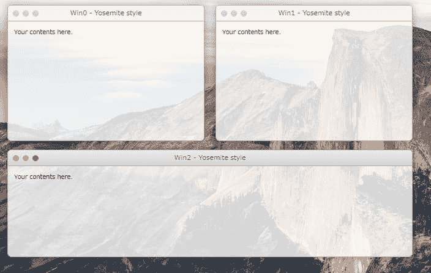
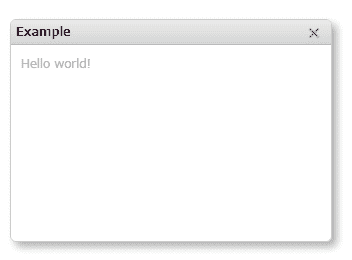
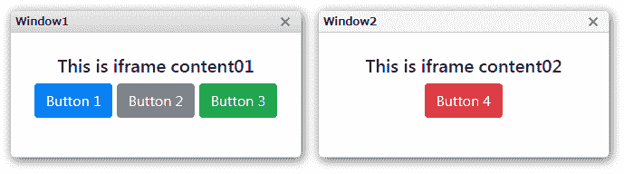
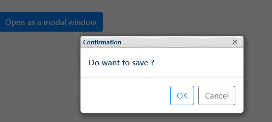
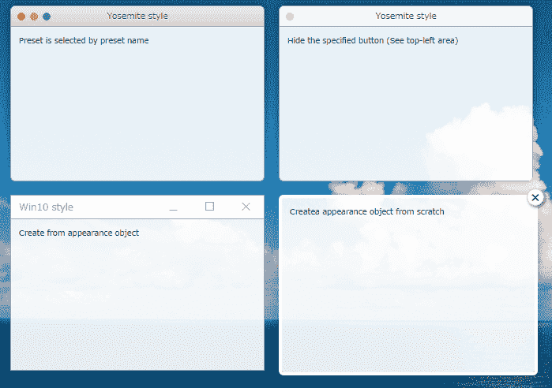

# 浮动窗口库“JSFrame.js”介绍

> 原文：<https://dev.to/riversun/introduction-of-floating-window-library-jsframejs-14ho>

你好。
今天我要介绍我做的库“JSFrame.js”。
是一个独立的轻量级的 JavaScript 浮动窗口库。
你可以像这样创建各种浮动窗口和弹出窗口。它是在麻省理工学院的许可下授权的。

我想先给你们看这个演示。请看一看！

[https://river sun . github . io/js frame/examples/v 150/preset _ Yosemite _ auto . html](https://riversun.github.io/jsframe/examples/v150/preset_yosemite_auto.html)

[](https://riversun.github.io/jsframe/examples/v150/preset_yosemite_auto.html)

你喜欢吗？如果你愿意，你可以很容易地创建流动窗口。

# “js frame . js”是什么样子的？

它是一个独立的轻量级多窗口库，不依赖于其他 JavaScript 库。

*   您可以创建各种浮动窗口(称为框架)和弹出窗口。
*   您可以创建一个模式窗口。
*   你可以做一个祝酒词。
*   您可以创建多窗口应用程序。
*   弹出窗口和多窗口涵盖了移动，调整大小，改变外观动画等。

# 演示

该库实现了在浏览器上使用浮动窗口。
[https://river sun . github . io/js frame/examples/v150/preset _ Yosemite _ auto . html](https://riversun.github.io/jsframe/examples/v150/preset_yosemite_auto.html)
[https://river sun . github . io/js frame/examples/v150/preset _ material . html](https://riversun.github.io/jsframe/examples/v150/preset_material.html)
[https://river sun . github . io/js frame/examples/v150/preset _ win 10 . html](https://riversun.github.io/jsframe/examples/v150/preset_win10.html)
[https://river sun。](https://riversun.github.io/jsframe/examples/v150/chatbot_ui.html)

# 如何使用/安装

*   使用 with script 标记

```
<script src="https://riversun.github.io/jsframe/jsframe.js"></script> 
```

*   从 npm 注册表安装

```
npm install jsframe.js 
```

# 快速启动

## 创建窗口

下面是 JSFrame.js 的基本示例，展示一个简单的窗口。

*   用初始化参数调用 **JSFrame.create** 方法显示一个窗口
*   将 html 设置为窗口的内容。内容可以只是一些文本或 html。
*   **frame.show** 显示窗口

**创建窗口的代码**

```
const jsFrame = new JSFrame();
const frame = jsFrame.create({
    title: 'Window',
    left: 20, top: 20, width: 320, height: 220,
    movable: true,//Enable to be moved by mouse
    resizable: true,//Enable to be resized by mouse
    html: '<div id="my_element" style="padding:10px;font-size:12px;color:darkgray;">Contents of window</div>'
});
//Show the window
frame.show(); 
```

【演示】
[https://river sun . github . io/js frame/examples/v 150/simple . html](https://riversun.github.io/jsframe/examples/v150/simple.html)

**结果**

[](https://riversun.github.io/jsframe/examples/v150/simple.html)

**提示**

*   您还可以从设置为 html 内容中获取 DOM 元素。呼叫框架。$([选择器])。例如，您可以通过调用 frame 来获取 id 为' my_element '的元素。$('#my_element ')

```
 frame.$('#my_element').innerHTML = '<span style="color:red">Hello world</span>'; 
```

## 显示指定的 URL 作为窗口内容

*   将 **url** 设置为初始化参数。
*   窗口内容将显示为 iframe。
*   将加载页面后调用的回调函数设置为 **urlLoaded**

**要在 iframe 中显示的 URL 代码**

```
const frame01 = jsFrame.create({
    title: 'Window1',
    left: 20, top: 20, width: 320, height: 160,
    url: 'iframe_content01.html',//URL to display in iframe
    //urlLoaded:Callback function called after loading iframe
    urlLoaded: (frame) => {
      //Called when the url finishes loading
    }
});
frame01.show(); 
```

【演示】
[https://river sun . github . io/js frame/examples/v 150/iframe . html](https://riversun.github.io/jsframe/examples/v150/iframe.html)

**结果**

[](https://riversun.github.io/jsframe/examples/v150/iframe.html)

**提示**

*   你也可以在页面中获取 DOM 元素，显示为由 url(iframe)指定的窗口内容区域，你可以调用 like frame。$('#my_element ')。

## 显示窗口为模态窗口

*   调用 **frame.showModal** 将窗口显示为模态窗口。
*   通过指定 like**show modal(callback func)**可以在模式窗口关闭时接收回调。

**模态窗口代码**

```
 const modalFrame = jsFrame.create({
      name: 'my-modal-window',
      title: 'modal window',
      left: 0, top: 0, width: 320, height: 220,
      html: 'something'
  });

  //Show as a modal window
  modalFrame.showModal(_frame => {
  //Callback when modal window is closed.
  }); 
```

[演示]

[https://riversun.github.io/jsframe/examples/v150/modal.html](https://riversun.github.io/jsframe/examples/v150/modal.html)

**结果**

[](https://riversun.github.io/jsframe/examples/v150/modal.html)

## 造型

*   JSFrame.js 提供了一个选项，您可以在其中设计窗口外观或对某些元素应用样式，然后根据需要对它们应用样式。
*   您可以从预设中指定样式或自行设计。
*   将**外观名称**设置为初始化参数，选择名为外观的窗口设计。
*   或者如果您想从头开始设计外观，您可以将外观设置为初始化参数。

**造型代码**

```
const jSFrame = new JSFrame();

 //Style from preset
 const frame01 = jSFrame.create({
     title: 'Yosemite style',
     left: 20, top: 20, width: 320, height: 220,
     appearanceName: 'yosemite',//Preset name is 'yosemite','redstone','popup'
     style: {
         backgroundColor: 'rgba(220,220,220,0.8)',
     },
     html: '<div style="padding:10px;">Preset is selected by preset name</div>'
 }).show(); 
```

[DEMO]

[https://river sun . github . io/js frame/examples/v 150/styling . html](https://riversun.github.io/jsframe/examples/v150/styling.html)

**结果**

[](https://riversun.github.io/jsframe/examples/v150/styling.html)

**提示**

*   窗口标题栏的预设名称

```
 closeButton => Show close button

     minimizeButton => Show minimize button

     maximizeButton => Show maximize button

     zoomButton => Show zoom button 
```

如果您想隐藏窗口标题栏，

**隐藏标题栏顶部按钮的代码**

```
 frame02.hideFrameComponent('minimizeButton'); 
```

## 事件处理

*   您可以为由 **html** 或 **url** 指定的内容中的 DOM 元素设置一个事件处理程序(回调函数)。

*   还可以为标题栏上的按钮设置事件处理程序。

*   调用 like frame.on(选择器，' click '，(_frame，event)= > { })；设置 click 事件处理函数。

**设置事件处理程序的代码**

```
//Set click handler for DOM element specified as html or url in the initialization parameters.
frame.on('minimizeButton', 'click', (_frame, evt) => {
});

//Event handler for buttons on the title bar.
frame.on('#bt_cancel', 'click', (_frame, evt) => {
}); 
```

【演示】
[https://river sun . github . io/js frame/examples/v 150/event _ handling . html](https://riversun.github.io/jsframe/examples/v150/event_handling.html)

**成绩**
[](https://riversun.github.io/jsframe/examples/v150/event_handling.html)

## 显示祝酒辞。

*   toast 在一个小弹出窗口中提供关于操作的简单消息。在**持续时间**指定的时间后，祝酒自动消失。
*   调用 **JSFrame.showToast** 显示一段祝酒词。
*   可以自定义外观什么的。

**显示吐司代码**

```
const jsFrame = new JSFrame();
  jsFrame.showToast({
      html: 'Default toast'
  }); 
```

[演示]

[https://river sun . github . io/js frame/examples/v 150/toast _ simple . html](https://riversun.github.io/jsframe/examples/v150/toast_simple.html)

**结果**

[](https://riversun.github.io/jsframe/examples/v150/toast.html)

**提示**

*   如下图所示，您可以使用**对齐**来指定位置。

**align:'top'** = >吐司显示在顶部
**align:'center'** = >吐司显示在中间
**align:'bottom'** = >吐司显示在底部(默认)

**指定位置的代码**

```
jsFrame.showToast({
    align: 'center', html: 'Toast displayed in the center'
}); 
```

*   自定义吐司

您可以将吐司自定义为风箱:

**自定义吐司代码**

```
jsFrame.showToast({
    width: 260,//Width
    height: 100,//Height
    duration: 2000,//Duration(millis)
    align: 'center',// Alignment from 'top'/'center'/'bottom'(default)
    style: {
        borderRadius: '2px',
        backgroundColor: 'rgba(0,124,255,0.8)',
    },
    html: '<span style="color:white;">Custom toast</span>',
    closeButton: true,//Show close button
    closeButtonColor: 'white'//Color of close button
}); 
```

[](https://riversun.github.io/jsframe/examples/v150/toast.html)

【演示】
[https://riversun.github.io/jsframe/examples/v150/toast.html](https://riversun.github.io/jsframe/examples/v150/toast.html)

# 窗口操作助手

## 用**框#设定位置**确定锚位

您可以使用**帧#setPosition(x，y，anchor)** 指定位置，如下图所示。

**锚指定位置代码**

```
//Specify a position
const align = 'CENTER_CENTER';//anchor

//(x,y)Specify the center of the screen as a coordinate, set the base point (anchor) to the horizontal vertical center (center_center) of the window
const x = window.innerWidth / 2;
const y = window.innerHeight / 2;
frame0.setPosition(x, y, align); 
```

**锚的类型**

| 水平的 | 垂直的 | 价值 |
| --- | --- | --- |
| 左边的 | 顶端 | '左上' |
| 水平居中 | 顶端 | '居中 _ 顶部' |
| 对吧 | 顶端 | '右上方' |
| 左边的 | 垂直居中 | '左中心' |
| 水平居中 | 垂直居中 | '中心 _ 中心' |
| 对吧 | 垂直居中 | '右 _ 中心' |
| 左边的 | 底部 | '左下' |
| 水平居中 | 底部 | '居中 _ 底部' |
| 对吧 | 底部 | '右下' |

## 关闭窗口

```
frame.closeFrame(); 
```

## 隐藏窗口

```
frame.hide(); 
```

## 聚焦窗口(并拉起至最前面)

*   您可以使用 **frame#requestFocus** 将窗口拉至顶部。
*   之后，窗口获得焦点。

```
frame.requestFocus(); 
```

## 按名称获取窗口

*   如果您在初始化参数中指定了**名称**，您可以从 Jsframe 对象中获取窗口，如下所示:

```
 var frame = jsFrame.getWindowByName('my-modal-window'); 
```

## 帧创建初始化参数

**初始化参数示例**

```
 const frame = jsFrame.create(
{
   name: 'my-window-name',//Window name.Unique name is required.
   title: 'Window0',//Window title
   left: 20,//x coordinate of the upper left corner of the window
   top: 20,//y coordinate of the upper left corner of the window
   width: 320,//width of the window
   height: 220,//height of the window
   minWidth: 160,//The minimum width of the window
   minHeight: 100,//The minimum height of the window
   movable: true,//true:You can move the window with mouse
   resizable: true,//true:You can resize the window with mouse
   appearance: appearanceObj,//Appearance object
   appearanceName: 'yosemite',//Preset name of appearance(Not with 'appearance')
   style: {//Style of the content.Can be specified just like inline style attribute.
       backgroundColor: 'rgba(220,220,220,0.8)',//Ex.Background color of content(Opacity can be specified)
       overflow: 'auto',//Ex.What to do when the drawing extends beyond the content area
   },
   html: 'Contents',//HTML shown in the content(Not with 'url')
   url: 'content01.html',//The URL for contents.To be shown in iframe.
   urlLoaded: (frame) = {}//Callback function when url is finished loading.

}); 
```

# 总结

我希望这个指南能帮助你理解如何使用 JSFrame.js

**关于本文**

*   我介绍了我的作品浮动窗口库 **JSFrame.js**
*   你可以从这里克隆/派生源代码:[https://github.com/riversun/JSFrame.js](https://github.com/riversun/JSFrame.js)
*   可以通过“install JSFrame.js”从 npm 安装。

**js frame 的历史**

*   2004 年第一次作案。
*   我在 2006 年左右的服务中使用了这个 JSFrame.js。我试过按现代 JS 风格更新，但基本都是 200x JS 风格写的:)
*   2018 年增加部分功能后发布了 JSFrame.js 作为 npm 库。

谢谢你。