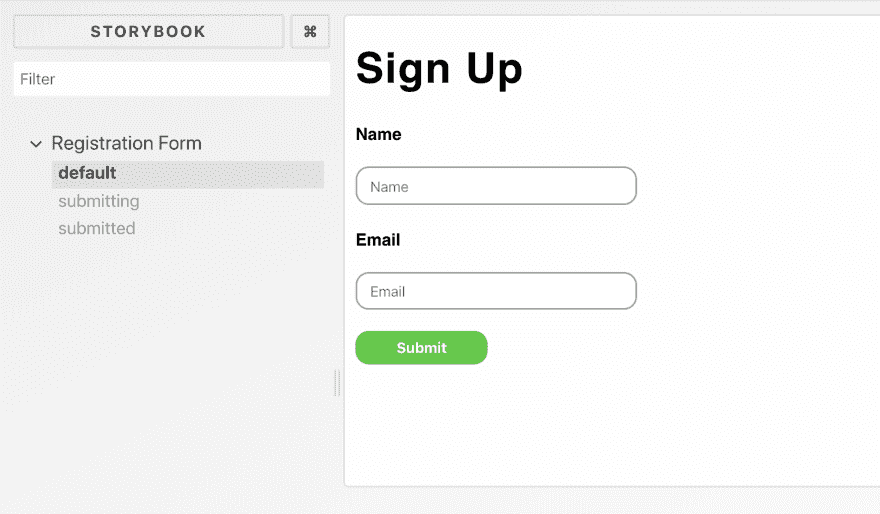
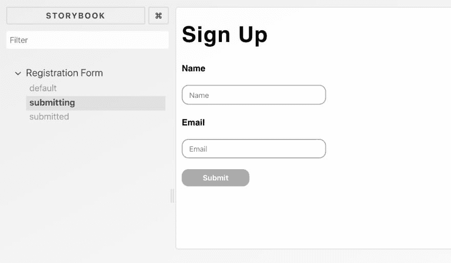
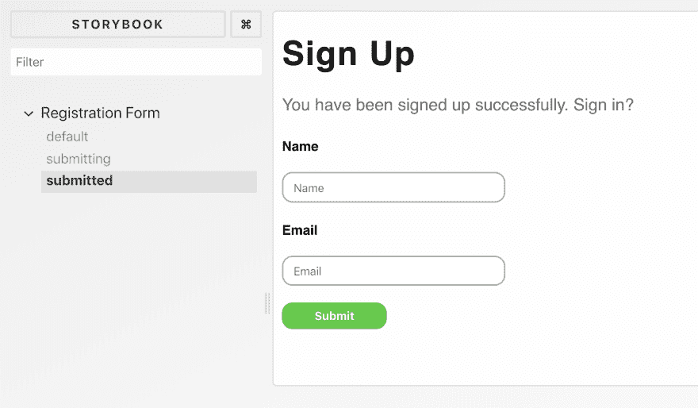

# 具有不同状态和故事书的样式表单

> 原文：<https://dev.to/ilonacodes/styling-form-with-different-states-and-storybook-2foj>

在实现和测试新功能的同时，有许多不同的有效方法来提高 web 应用程序的开发速度。其中之一是能够重用 UI 组件。

为了孤立地开发 UI 元素，然后将它们应用到项目中，我尝试并学习了[故事书](https://storybook.js.org/)。

这个图书馆的优点是:

*   有针对不同 JavaScript 库和框架的集成
*   它不会改变 web 应用程序的核心功能和结构
*   这是可以测试的
*   它还支持更多的附加组件(将 Storybook 与开发流程交叉)和装饰器(然后定制组件，使它们在应用程序中正确工作)

如何根据开发平台将 Storybook playground 应用并运行到项目中你可以在它的官方文档[这里](https://storybook.js.org/basics/introduction/)找到。

当你阅读一些博客文章时，你会注意到我的专长是 React web 应用程序。下一个例子也是用 React ⚛️.实现的

在你调整完之后，让我们给故事书添加几个故事。例如，我们有一个简单的注册表单，有一个标题、一条状态消息、两个不同的带有所属标签的输入字段和一个提交按钮。

让我们创建一个简单的注册表单，在不同的状态下标记和样式化它的元素。

首先我们需要添加`<SignUpForm />`组件，导入 **sign-up-form.css** 和相应的样式:

```
.form {
    font-family: Roboto, sans-serif;
    margin: 0;
    padding: 0;
}

.form__title {
    letter-spacing: 1px;
    font-weight: 600;
}

.form__status {
    color: #666;
    margin-bottom: 20px;
}

.form__label {
    font-size: .8em;
    font-weight: bold;
}

.form__input {
     width: 200px;
    height: 25px;
    padding-left: 10px;
    border-radius: 10px;
    border: 1px solid darkgrey;
}

.form__button {
    width: 100px;
    height: 25px;
    border-radius: 10px;
    color: white;
    background-color: limegreen;
    border: 0;
    cursor: pointer;
    font-weight: bold;
}

.form__button–submitting {
    background-color: darkgrey;
}

.form__button–submitted {
    background-color: limegreen;
} 
```

Enter fullscreen mode Exit fullscreen mode

我们的表单有三种状态:

1.  初始:当窗体默认显示时，等待用户输入
2.  提交:当提交表单后执行 HTTP 请求时
3.  已提交:API 调用完成，服务器成功响应。

根据表单状态，某些表单元素将显示/隐藏或具有不同的样式，如:

*   提交表单时，提交按钮将被禁用并呈灰色
*   如果表单被提交，那么用户将通过显示的消息被通知注册成功，建议他们登录。

这里有来自`<SignUpContainer />` :
的注入道具的`<SignUpForm />`的完整实现

```
 // SignUpForm.js

import React from 'react';

import './sign-up-form.css';

export const SignUpForm = ({onSubmit, state}) => {
    const submitting = state === 'submitting';
    const submitted = state === 'submitted';

    const buttonState = submitting ?
        'form__button--submitting' :
        'form__button--submitted';

    return (
        <form className="form" onSubmit={onSubmit}>
            <h1 className="form__title">Sign Up</h1>
            {
                submitted ?
                    <div className="form__status">
                      You have been signed up successfully. Sign in?
                    </div> : null
            }
            <label htmlFor="name" className="form__label">Name</label>
            <p>
                <input type="text"
                       id="name"
                       placeholder="Name"
                       disabled={submitting}
                       className="form__input"
                />
            </p>
            <label htmlFor="email" className="form__label">Email</label>

            <p>
                <input type="email"
                       id="email"
                       disabled={submitting}
                       placeholder="Email"
                       className="form__input"
                />
            </p>
            <p>
                <button disabled={submitting} 
                        className={`form__button ${buttonState}`}>
                    Submit
                </button>
            </p>
        </form>
    );
}; 
```

Enter fullscreen mode Exit fullscreen mode

`<SignUpContainer />`组件是父容器组件，它将通过状态和方法来操作注册表单。我们将省略这个组件，因为它与基于故事书的 styleguide 无关。

下一步是为故事书写故事。意思是制作描述表单 UI 特定状态的特定函数:

```
 //  ./stories/index.js

import React from 'react';
import {storiesOf} from '@storybook/react';
import {SignUpForm} from "../SignUpForm";

const noOp = (e) => {
    e.preventDefault();
};

storiesOf('Registration Form', module)
    .add('default', () => (
        <div><SignUpForm state="idle" onSubmit={noOp}/></div>
    ))
    .add('submitting', () => (
        <div><SignUpForm state="submitting" onSubmit={noOp}/></div>
    ))
    .add('submitted', () => (
        <div><SignUpForm state="submitted" onSubmit={noOp}/></div>
    )); 
```

Enter fullscreen mode Exit fullscreen mode

最后一个加载故事书中所有故事的:

```
 // .storybook/config.js

import { configure } from '@storybook/react';

function loadStories() {
    require('../src/stories');
}

configure(loadStories, module); 
```

Enter fullscreen mode Exit fullscreen mode

现在注册表单完全是“故事书”运行您的本地服务器来检查故事书中的结果。我的变体如下:

[](https://res.cloudinary.com/practicaldev/image/fetch/s--Vz4F7Gpt--/c_limit%2Cf_auto%2Cfl_progressive%2Cq_auto%2Cw_880/https://thepracticaldev.s3.amazonaws.com/i/i7l5rqesfdn4fkn0bv9r.png)

[](https://res.cloudinary.com/practicaldev/image/fetch/s--6DMVkcN6--/c_limit%2Cf_auto%2Cfl_progressive%2Cq_auto%2Cw_880/https://thepracticaldev.s3.amazonaws.com/i/lv6lofwzllov7iagzb1c.png)

[](https://res.cloudinary.com/practicaldev/image/fetch/s--2d0HLmfM--/c_limit%2Cf_auto%2Cfl_progressive%2Cq_auto%2Cw_880/https://thepracticaldev.s3.amazonaws.com/i/wdg3bxopjwpsjn80pje8.png)

我希望你现在有兴趣用 React 或其他库来尝试 Storybook，为你的应用程序创建一个风格指南。

只需留下评论来分享你如何为你的应用程序实现风格指南的方法？

**感谢您的阅读！**

尽你所能编码👩‍💻👨‍💻

* * *

*Goran Ivos 在 Unsplash 上拍摄的照片*