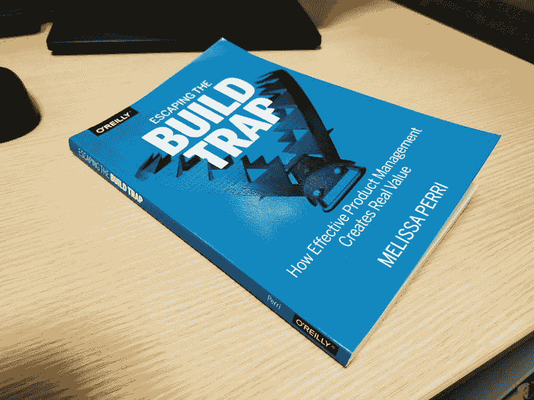

# 书评:逃离构建陷阱

> 原文：<https://dev.to/remojansen/book-review-escaping-the-build-trap-by-melissa-perri-2o82>

几天前我读完了 Melissa Perri 的《逃离建筑陷阱 】的 [***，像往常一样，我想与社区分享一篇评论。***](https://amzn.to/2DjbNnV)

我拿起这本书是因为作者是爱尔兰一个活动的演讲者。我住在爱尔兰，最后通过我的一个朋友( [@dagonzago](https://twitter.com/dagonzago) )了解到她的工作。

我在网上查阅了 Melissa Perri 的一些作品，在看了她的演讲[逃离 Melissa Perri 在 2017 年旧金山出版的《牢记产品》中的构建陷阱](https://vimeo.com/224453335)后，我决定预订她的书。

我是软件工程师，不是产品经理、产品设计师、产品负责人。然而，这本书对我很有吸引力，因为我发现了解为什么一些公司和团队失败了，而另一些却非常成功是非常有趣的。我喜欢学习能够增加一个组织或团队成功完成使命的机会的方法、实践或技术。

## 关于作者

Melissa Perri 是产品管理领域公认的专家:

> Melissa Perri 认为创造伟大产品的关键是培养伟大的产品领导者。作为 Produx 实验室的首席执行官和创始人，她帮助公司有效地扩展其产品组织。梅丽莎还创建了在线学校产品研究所，并启动了一个培训下一代首席产品官的项目。她是一位国际公认、广受欢迎的主题演讲人。Melissa 毕业于康奈尔大学，拥有运筹学和信息工程学士学位。

## 关于内容

这本书不是一部小说，但大部分内容都是用讲故事的方式介绍的，这种方式使用了一家名为 Marquetly 的虚构公司。这些章节都引用了梅丽莎和马克特里雇主之间的对话。这种风格有时让这本书感觉像一本小说，而不像一本传统的技术书，这让我想起了吉恩·金的 [***凤凰计划***](https://amzn.to/2HhL4vW) 。我个人很喜欢这种风格，因为它让我觉得内容与真实的业务真正相关。

我也很高兴作者似乎不是 Scrum 的盲目信徒。我同意作者的观点，scrum 不是一颗银弹，有时会导致巨大的时间浪费。

本书分为以下部分和章节:

*   第一部分:构建陷阱
    *   1 价值交换系统
    *   2 价值交换系统的制约因素
    *   3 项目对产品对服务
    *   4 产品主导型组织
    *   5 我们知道什么和不知道什么
*   第二部分:产品经理的角色
    *   6 个糟糕的产品经理原型
    *   7 一个伟大的产品经理
    *   8 产品经理的职业道路
    *   9 组织你的团队
*   第三部分:战略
    *   10 什么是战略？
    *   11 个战略差距？
    *   12 创建良好的战略框架
    *   13 公司愿景战略和意图
    *   14 产品愿景和产品组合
*   第四部分:产品管理流程
    *   15 产品形
    *   16 理解方向，设定成功
    *   17 问题探究
    *   18 解决方案探索
    *   19 构建和优化您的解决方案
*   第五部分:产品主导型组织
    *   20 注重结果的沟通
    *   21 奖励和激励
    *   22 安全和学习
    *   23 预算
    *   24 以客户为中心
    *   25 Marquetly:产品导向型公司

这本书的第一部分介绍了构建陷阱的概念，Melissa Perri 是这样描述的:

> 构建陷阱是指组织陷入了用产出而不是结果来衡量他们的成功。这是当他们更关注运输和开发功能，而不是这些东西产生的实际价值。当公司停止为用户创造真正的价值时，它们就开始失去市场份额，从而被打乱。公司可以通过开发有意识的和健壮的产品管理实践来摆脱构建陷阱。在这一点上，产品经理可以找到最大化商业和消费者价值的机会。

本书的第二部分描述了产品经理和产品团队其他成员的角色，以及产品职业发展阶梯。

本书的第三部分侧重于战略，以及如何将战略从最高管理层传达给人事经理和个人贡献者。

本书的第四部分关注产品管理过程，以及它如何帮助一个组织专注于他们想要的结果。

这本书的第五部分，也是最后一部分，主要关注产品导向型组织中常见的一些主要特征和管理实践。

> 产品导向型组织的特点是一种文化，这种文化理解并围绕结果而不是产出进行组织，包括围绕根据实现结果评估其战略的公司节奏。在以产品为导向的组织中，人们会因为学习和实现目标而获得奖励。管理层鼓励产品团队接近他们的客户，产品管理被视为推进业务的关键职能。

## 判决结果

我真的很喜欢这本书，我会建议拿起它。我唯一的抱怨可能是，我希望第四和第五部分长一点，深入到产品导向型组织的技术和实践中去。我几乎希望我能有一本伴侣书，同样的，凤凰计划的*后来被[***《devo PS 手册》***](https://amzn.to/2RURQvQ) 所补充。总的来说，对于任何踏入产品世界的人，或者想要了解帮助他们的团队或组织实现更多的新方法的人来说，这都是值得一读的。*

 *如果你认为你会喜欢这本书，你可以在亚马逊英国[或亚马逊美国](https://amzn.to/2VWZpkZ)或[在线购买。](https://amzn.to/2T2Cm6e)

我希望这篇评论对您有所帮助。我计划试着复习我读过的所有科技书籍。所以如果你以后想查看更多的书评，请跟我来。还有，如果你对函数式编程或者打字稿感兴趣，请查阅我即将出版的书籍 [***带打字稿的动手函数式编程***](http://www.functionaltypescript.com/) 。

*