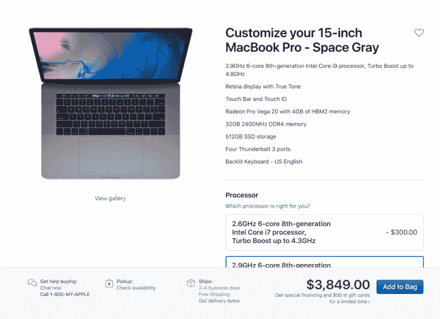
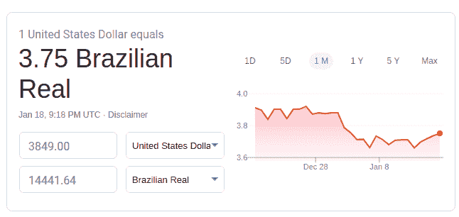
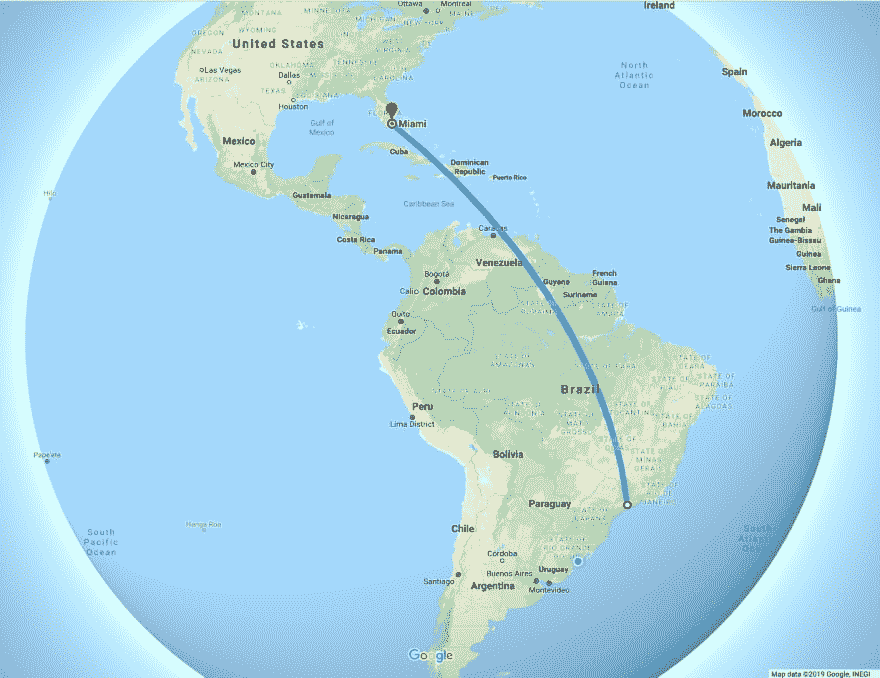

# 苹果在你的国家卖多少钱？

> 原文：<https://dev.to/mateus_vahl/how-much-does-apple-cost-in-your-country-39ig>

你努力工作，科技是你的激情所在，你每天都在使用电脑，你认为你应该拥有一台好机器来工作和娱乐。👨‍💻

苹果🍎是最受欢迎的品牌，毫无疑问，这也不奇怪，苹果确实更贵，如果你住在美国，你肯定认为苹果很贵...但是等一下，我的朋友！让我们看看我的国家，巴西🇧🇷:

让我们去 apple.com 为专业用户安装一台专业电脑🙂

### 哎哟！

那可是一大笔钱啊！3849 美元或巴西货币:14.441 雷亚尔，是巴西最低工资的 14 倍🤨

### 其实...

实际上，考虑到税收，同样的产品在苹果巴西的售价是美国的两倍，或者是 T2 最低工资的 33 倍。

> 巴西人普遍认为飞往迈阿密购买 iPhones 和 iPads 比在国内购买更便宜。

# 在你们国家，苹果产品的价格是多少？让我知道贝娄！