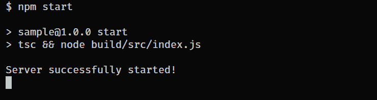
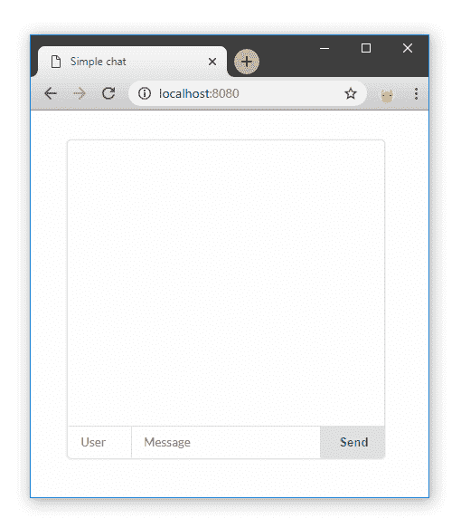
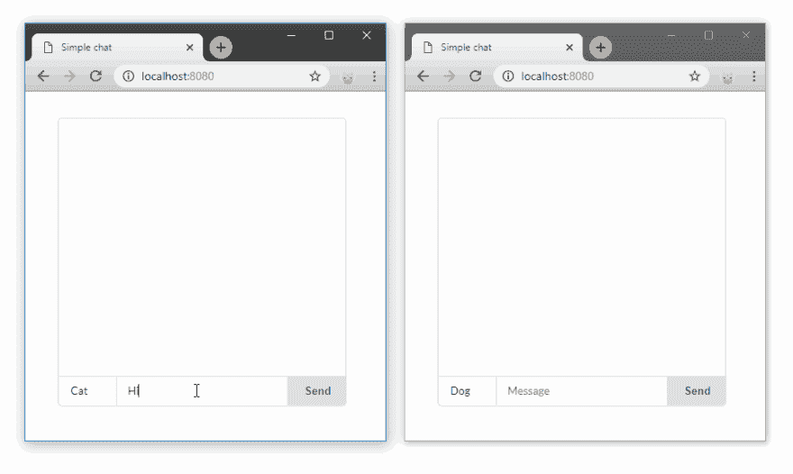

# 用 Odi 建立聊天(Node.js)

> 原文：<https://dev.to/dantsk/building-chat-with-odi-nodejs-2am1>

# 再版

抱歉再次发表同样的故事。我的队友不小心删除了之前的出版物。他认为我们在发行日期前就出版了😢谢谢理解😜

# 简介

聊天应用程序是一个非常常见的例子，用来显示客户端和服务器之间简单的实时通信。本教程描述了如何使用 Odi，type script server-side framework for
node . js 轻松实现这一点。

# 项目设置

我们要开发的应用程序不仅要建立实时通信通道，还要向客户端呈现前端，包括所需的资产。

## 基本设置

让我们建立 Odi 项目。首先要初始化`package.json`
和`tsconfig.json`文件。我们可以用两个简单的命令来完成。

```
 npm init -y
    tsc --init 
```

并安装 **Odi** 。

```
 npm install odi 
```

此外，我们需要修改`tsconfig.json`文件，因为有几个选项必须编辑。Odi 主动使用 decorators 和元数据，所以我们需要启用这些特性。

```
 "experimentalDecorators":  true,  "emitDecoratorMetadata":  true 
```

另一件事是`target`选项。默认情况下，它设置为`es5`,但是在这个规范中有几个
不被支持。由于我们是
进步，让我们把它设置为最新版本

```
 "target":  "ES2018" 
```

## 项目结构

我们将为视图、资产和服务器源代码建立不同的文件夹。

[](https://res.cloudinary.com/practicaldev/image/fetch/s--qzR4oKTL--/c_limit%2Cf_auto%2Cfl_progressive%2Cq_auto%2Cw_880/https://cdn-images-1.medium.com/max/880/1%2A2jLFB3kGBqfnLp3YfUWvXQ.png)

*   **src** —服务器源代码。
*   **视图** —将呈现给客户的 JSX 模板。
*   **资产** —客户端 *JS* 和 *CSS* 文件。

JSX 模板是必须编译的 *tsx* 文件。将**视图**文件夹添加到`tsconfig.json`文件的
*根目录*中，并设置 *outDir* 。

```
 "outDir":  "./build",  "rootDirs":  ["./src",  "./views"] 
```

# Gettings 开始

Odi 基于*依赖注入*模式，所以每一个应用组件都会被自动导入、实例化和注入。

必须只指定包含源文件的文件夹，然后 Odi 可以扫描它以导入应用程序组件(控制器、服务、存储库等)。

## 主文件

在`src`文件夹中创建`index.ts`文件。它将是服务器入口点文件。

```
 import { Core } from "odi";
    import { join } from "path";

    new Core({
        sources: __dirname,
        server: {
            port: 8080,
            socket: true,
            static: {
                root: join(__dirname, '../../assets'),
                prefix: '/assets'
            }
        }
    }).listen(() => console.log("Server successfully started!")); 
```

我们只需要实例化`Core`类。`Core`构造函数接受单个参数，设置对象。有很多可能的选择，但是现在，我们只需要其中的几个。

首先，我们需要指定`sources`属性。这是 Odi 应用程序的必需设置。作为我们为服务器端代码选择的`src`文件夹中的`index.ts`文件，我们可以使用`__dirname`来设置当前目录。

`port`属性也是必需的。它将服务器绑定到指定的端口。

现在说说下面的部分:

```
 socket: true,
    static: {
         root: join(__dirname, '../../assets'),
         prefix: '/assets'
    } 
```

我们必须启用套接字并设置静态文件服务选项，所有来自**资产**文件夹的文件都可以通过带有`/assets`前缀的 URL 获得。

## 安装依赖项

Odi 框架自动只包含几个必需的包。不同特性的所有其他依赖项都是可选的，因此只有在使用某个特性时才需要安装。

比如你准备搭建一个简单的 REST 服务器，不需要 GraphQL、WebSockets、SSR 等包。

我们希望在我们的聊天应用程序中有 WebSockets 和模板(JSX)。所以，让我们安装缺失的软件包:

```
 npm install socket.io react react-dom 
```

仅此而已，Odi 会自动导入。如你所见， [socket.io](http://socket.io) 被用于实时功能。模板处理也需要 React 包。

现在我们可以开始写代码了:)

# 申请

我们将创建一个 web 服务器，它使用
模板向客户端呈现 HTML，为客户端提供文件(JS、CSS ),并使用 WebSockets 建立一个用于聊天的实时
通信通道。让我们在聊天中加入历史。因此，最后 10 条消息将保存在我们的系统中。

## 消息和历史

`Message`会相当简单，只有`username`和`text`字段。我们可以用一个简单的接口来完成
，因为我们不打算使用数据库。

```
 export interface Message {
        username: string;
        text: string;
    } 
```

和历史服务

```
 @Service()
    export default class HistoryService {
        private store: Message[] = [];

        getMessages() {
            return this.store;
        }

        addMessage(message: Message) {
            if(this.store.length > 10)
                this.store.shift();

            this.store.push(message);
        }
    } 
```

我们的存储是一个简单的消息数组。商店管理的方法很少。如果我们得到的消息超过 10 条，我们只需从数组中删除第一条消息。

正如你所看到的，`Service` decorator 被用于`HistoryService`类来将 is 设置为一个服务组件。服务在依赖注入容器中是单例的。现在，它可以被注入到其他应用程序组件中。

将所有这些代码放在`src/services`文件夹的`history.ts`文件中。

## 网络套接字

用下面的
代码在`src/sockets`目录下创建`chat.socket.ts`文件。

```
 import { Socket, OnEvent, ISocket, Autowired } from "odi";
    import HistoryService, { Message } from "../services/history";

    @Socket('chat')
    export default class ChatSocket extends ISocket {

        @Autowired()
        history: HistoryService;

        @OnEvent('massage:send') 
        onmessage(message: Message) {
           this.history.addMessage(message); 
           this.emit('message:new', message);
        }
    } 
```

我们用`message:send`事件的处理程序定义了`/chat`名称空间。如果
`message:send`事件被触发，所有连接到该名称空间的客户端将被通知`message:new`事件和消息数据。

您可以注意到`Socket` decorator 定义了名称空间。不需要前导斜杠。要将方法设置为某个事件的处理程序，使用`OnEvent`
装饰器，它接受事件名作为参数。

同样，我们使用`Autowired`装饰器注入了`HistoryService`。`ChatSocket`类的`history`字段
会被 Odi 初始化，所以你不需要做
任何额外的事情。

唯一可以从 TypeScript
中看到这样的错误

```
 [ts] Property 'history' has no initializer and is not definitely assigned in the constructor. 
```

Odi 自动初始化注入的字段，所以只需在
`tsconfig.json`
中禁用该检查即可

```
 "strictPropertyInitialization":  false 
```

# 模板化(JSX)

有很多模板处理器——EJS、杰德、帕格。但是这些技术有很多限制和不便。在大多数情况下，要让 IntelliSense 和代码突出显示模板，需要安装 IDE/Editor 的扩展。

在 Odi 中，由 React 支持的 JSX 用于模板化。你可以简单地用 JSX 创建组件。但是记住，这只针对模板，任何逻辑，监听器或者客户端代码在渲染的时候都会被忽略。
*(目前我们正在进行全 SSR。希望它能很快发行)*

我们需要告诉 TypeScript 编译器，我们将使用 React JSX。
在`tsconfig.json`里

```
 "jsx":  "react" 
```

## 布局

让我们创建我们的布局组件`layout.view.tsx`，它将是所有页面的包装器。如上所述，所有模板都将在**视图**文件夹中。

```
 import React, { SFC } from 'react';

    export const Html: SFC = ({ children }) => (
        <html lang="en">
            <head>
                <meta charSet="UTF-8" />
                <meta name="viewport" />
                <meta httpEquiv="X-UA-Compatible" content="ie=edge"/>
                <link href="/assets/index.css" type="text/css" ... />
                 Simple chat 
            </head>
            <body>
                {children}
            </body>

            <script src="path/to/socket.io" />
            <script src="/assets/index.js" />
        </html>
    ) 
```

对于 *socket.io-client* 库，我们可以使用 CDN。所以只需用下面的链接
`https://cdnjs.cloudflare.com/ajax/libs/socket.io/2.2.0/socket.io.js`替换脚本标签中的
`path/to/socket.io`

在第二个脚本标记中指定了客户端 js 文件。稍后我们将在**资产**文件夹中创建一个
。

## 聊天组件

实际上，我们的聊天需要 3 个组成部分:

1.  消息表示
2.  控件(发送按钮、消息输入、用户名输入)
3.  聊天容器

我想我们可以把所有这些组件放在一个文件中，`chat.view.tsx`

```
 import React from 'react';
    import { Message } from './services/history.service';

    export const ChatMessage = ({ username, text }: Message) => (
        <div>
            <b>{username}: </b>
            <span>{text}</span>
        </div>
    ) 
```

我们可以使用`Message`接口作为`ChatMessage`组件的道具类型。

让我们添加聊天控件。属性是为了方便起见，因为我们
将在客户端使用 js，而不使用任何库或框架。

```
 export const ChatControlls = () => (
        <div className="message-box">
            <input placeholder="User" id="user-input" />
            <input placeholder="Message" id="message-input" />
            <button> Send </button>
        </div>
    ) 
```

最后一件事，聊天包装。

```
 interface ChatProps {
        messages: Message[];
    }

    export const Chat = ({ messages }: ChatProps) => (
        <div className="chat">
            <div className="container">
              {messages.map(msg,i) => <ChatMessage key={i} {...msg} /> )}
             </div>
            <ChatControlls />
        </div>
    ) 
```

该组件接受 props 中的一组消息(我们的历史)，以便在页面加载时呈现出来。

现在我们可以把所有东西放在一起，定义我们的页面组件`page.view.tsx`

```
 import React from 'react';
    import { Chat } from './chat.view';
    import { Html } from './layout.view';
    import { Message } from './services/history.service';

    interface ChatPageProps {
        history: Message[];
    }

    export const ChatPage = ({ history }: ChatPageProps) => (
        <Html>
            <Chat messages={history} />        
        </Html>
    ) 
```

这就是我们聊天应用程序的模板。我有几行
CSS，我将把它们包含在源代码中，你可以在文章的最后找到它们。

我们可以转向控制器。

# 控制器

控制器是一种简单而强大的路由机制。控制器方法被映射到 web 服务器路径。方法返回的值作为响应发送。

为了创建一个控制器，您必须使用`@Controller`装饰器并继承`IController`类。装饰器设置组件类型，因此 DI(依赖注入)容器可以检测该类的用途。

对于我们的聊天，我们只需要一个控制器向客户端呈现模板。因为我们要在控制器文件中使用 JSX，所以它必须有`tsx`文件的扩展名
。

所以，让我们在`src/controllers`文件夹中创建`render.controller.tsx`。

```
 import React from 'react';
    import { Controller, IController, Get, Autowired } from "odi";
    import { ChatPage } from '../../views/page.view';
    import HistoryService from '../services/history.service';

    @Controller()
    export default class RenderController extends IController {

        @Autowired()
        history: HistoryService;

        @Get index() {
            return <ChatPage history={this.history.getMessages()}/>;
        }
    } 
```

如您所见，我们将`HistoryService`注入到`history`属性中。此外，定义了使用`Get`方法的`/`路径的处理程序。我们可以简单地返回我们的 JSX 组件。结果，Odi 自动检测到它是一个模板，并将其作为简单的 HTML 呈现给客户端(web 浏览器)。

# 启动应用程序

现在，我们可以开始我们的应用程序，看看我们得到了什么。让我们在`package.json`文件:
中指定`start`脚本

```
 "scripts":  {  "start":  "tsc && node build/src/index.js"  } 
```

运行`npm start`命令编译我们的源代码并运行服务器入口文件。

[](https://res.cloudinary.com/practicaldev/image/fetch/s--O7ZGEumT--/c_limit%2Cf_auto%2Cfl_progressive%2Cq_auto%2Cw_880/https://cdn-images-1.medium.com/max/880/1%2AMOMjK0wTD3qdXbVLot83qQ.png)

让我们打开浏览器并检查`localhost:8080`

[](https://res.cloudinary.com/practicaldev/image/fetch/s--UlXuuRgU--/c_limit%2Cf_auto%2Cfl_progressive%2Cq_auto%2Cw_880/https://cdn-images-1.medium.com/max/880/1%2AFW2ep25-HbxJQCpewczhPQ.png)

如您所见，我们刚刚清空了聊天，没有任何功能，因为我们没有将客户端`index.js`指定到**资产**文件夹中。

# 客户端

首先，让我们获取聊天容器和控件的引用。

```
 const button = document.querySelector('button');

    const messageInput = document.querySelector('#message-input');
    const usernameInput = document.querySelector('#user-input');
    const container = document.querySelector('.container'); 
```

当一个新消息到来时，我们需要将它作为一个子元素添加到`container`
元素中。我们需要创建表示消息的元素的函数。

```
 function createMessage({ username, text }) {
        const element = document.createElement('div');

        element.innerHTML = `
            <b>${username}: </b>
            <span>${text}</span>
        `;

        return element;
    } 
```

然后，让我们连接到我们的`chat`名称空间，并为`message:new`事件添加事件处理程序。当激发此事件时，消息元素将被追加到容器中。

```
 const socket = io('/chat');
    socket.on('message:new', message => {
        const messageElement = createMessage(message);
        container.appendChild(messageElement);
    }); 
```

最后一步，`onclinck`为我们的按钮处理程序。

```
 button.onclick = () => {
        socket.emit('massage:send', { 
            text: messageInput.value, 
            username: usernameInput.value
        });

        messageInput.value = "";
    } 
```

我们从输入中收集数据，并将其作为`message:send`事件发送。此外，每次发送后，消息输入文本将被清除。

现在我们可以刷新页面，看看我们得到了什么。

[](https://res.cloudinary.com/practicaldev/image/fetch/s--GiHD_1HX--/c_limit%2Cf_auto%2Cfl_progressive%2Cq_66%2Cw_880/https://cdn-images-1.medium.com/max/880/1%2AeUyiuOZdH4Fe55QAHhb5yQ.gif)

刷新页面后，我们将拥有消息的历史记录。

## 沙盒

您可以在这里查看源代码并与应用程序进行交互:
[https://codesandbox.io/embed/30n2y702m](https://codesandbox.io/embed/30n2y702m)

## PS

谢谢你的阅读！如果你喜欢 Odi，请在 GitHub
上支持我们

##  [ Odi-ts ](https://github.com/Odi-ts) / [ odi](https://github.com/Odi-ts/odi)

### 🌪🌌自以为是的、声明性的、惯用的框架，用于构建可扩展的、可支持的和可靠的企业应用程序。

<article class="markdown-body entry-content container-lg" itemprop="text">

[](https://camo.githubusercontent.com/902889875218fdd521e4726dd9251e8c680ee3c2/68747470733a2f2f692e696d6775722e636f6d2f345a66334f33352e706e67)

[ ](https://codeclimate.com/github/Odi-ts/odi/maintainability) [ ](https://codeclimate.com/github/Odi-ts/odi/test_coverage)

[](https://camo.githubusercontent.com/bceb1be749c176095936b50e5d0658e24c1ce710/68747470733a2f2f696d672e736869656c64732e696f2f6e706d2f762f6f64692e737667)[](https://camo.githubusercontent.com/74a450a1a47821e18c6c75e7447e412cc9fc8fcd/68747470733a2f2f696d672e736869656c64732e696f2f6769746875622f6c6963656e73652f4f64692d74732f4f64692e737667)[](https://camo.githubusercontent.com/d2981453097980fdfe4e68a9abd3a5756a5f2818/68747470733a2f2f696d672e736869656c64732e696f2f64657066752f4f64692d74732f6f64692e737667)[](https://camo.githubusercontent.com/d529eb8fb05e27d7cad6a0735292c26dc62a3d02/68747470733a2f2f696d672e736869656c64732e696f2f6769746875622f6c6173742d636f6d6d69742f4f64692d74732f4f64692e737667)[](https://camo.githubusercontent.com/11c074ab0c404b966bad05bd42aa68b77516f2da/68747470733a2f2f7472617669732d63692e636f6d2f4f64692d74732f6f64692e7376673f6272616e63683d6d6173746572)[](https://gitter.im/odiland/community)

使用简单的 API 创建企业级(web)应用程序的 TypeScript 框架，允许您专注于业务逻辑。基于声明式和命令式编程，受[ASP.NET](https://www.asp.net/)/[春天](https://spring.io/)的启发。

**查看[文档](https://odi.gitbook.io/core/basics/getting-started)了解更多详情。**

Odi 为创建易于支持和可伸缩的 web 应用程序提供了特性集。

功能概述:

*   手动音量调节
*   全类型 DI / IoT
*   证明
*   websocket
*   类型整合
*   GraphQL
*   面向切面编程
*   苏维埃社会主义共和国

未来更新请查看[路线图](https://github.com/Odi-ts/Odi/wiki/Roadmap)
有想法、建议或功能需求吗？欢迎[提交](https://odi.nolt.io/)吧！

[](https://codesandbox.io/s/pjov89947x)

## <g-emoji class="g-emoji" alias="rocket" fallback-src="https://github.githubassets.cimg/icons/emoji/unicode/1f680.png">🚀</g-emoji>开始使用

1.  安装 npm 软件包
    `npm install odi --save`

2.  安装反射-元数据
    `npm install reflect-metadata --save`

3.  导入反射-元数据(例如在`index.ts` ):
    `import "reflect-metadata";`

4.  在`tsconfig.json`中启用以下设置

    ```
    "emitDecoratorMetadata":  true, 
    "experimentalDecorators":  true
    ```

## <g-emoji class="g-emoji" alias="tornado" fallback-src="https://github.githubassets.cimg/icons/emoji/unicode/1f32a.png">🌪</g-emoji>概述

### 控制器

控制器以极简风格充当简单而强大的路由机制。

```
@Controller('foo')
export class FooController extends IController {
```

…</article>

[View on GitHub](https://github.com/Odi-ts/odi)

此外，如果您想了解更多信息，可以查看以前的文章和文档:

1.  [文档](https://odi.gitbook.io)
2.  [第一篇文章](https://medium.com/@dantsk/odi-ddd54848c1c3)
3.  [第二篇](https://medium.com/@dantsk/odi-jsx-openapi-and-more-ca67555527b)

如果你有任何想法或问题，请随时离开！非常感谢！:)