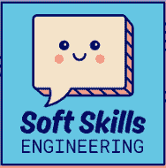

# 2019 年面向开发者的 10 个播客

> 原文：<https://dev.to/vaidotas/10-podcasts-for-developers-in-2019-2l13>

每天通勤上班的好处很少。Dev 播客就是其中之一。你可以学习新的东西，跟上最新最棒的，甚至在某些情况下得到娱乐(看你软技能工程！).以下是我今天收听的十大播客，排名不分先后。*

*我订阅的播客比这多得多，但本着简洁的精神，我将列表削减至 10 个。

### [商店脱口秀](https://shoptalkshow.com)

*戴夫·鲁伯特，克里斯·科伊尔*
关于现代网站设计与开发的前端集中展示。不管戴夫和克里斯有没有客人，他们都值得一听。事实上，他们回答听众问题的“连珠炮”节目是我最喜欢的节目之一。

### [The React 播客](https://reactpodcast.simplecast.fm/)

你大概能猜到这个节目是关于什么的。没错，就是关于 VueJS (jk)的。Chantastic 和 Michael 在与各种各样与 React 生态系统直接或间接相关的客人交谈方面做得很好。事实上，他们最近与 React 核心团队就其未来做了一集很棒的节目。这是我们这些身处反动世界的人必须做的事情！

### [轨迹变化](https://postlight.com/trackchanges)

*保罗·福特，里奇·齐亚德*
严格来说不是开发播客，但是，它是我的最爱之一。保罗和里奇是纽约 Postlight 数字产品工作室的联合创始人。他们对当前技术状态的思考，对社交媒体的怪异咆哮，以及如此有趣的客人，听起来令人愉悦。

### [。净岩](https://dotnetrocks.com/)

如果你在 JS 生态系统中，不要被播客的标题所迷惑。这是城里持续时间最长的展览之一，关注技术的各个方面。就客人而言，它可能有点以微软为中心，但它总是提供高质量的内容、精彩的对话和深入钻研某个主题的“极客”活动，这些活动可以拓展你的视野。卡尔和理查德是他们所做的专业人士，其他播客有很多东西要向他们学习。

### [变更日志](https://changelog.com/podcast)

Adam Stacoviak，Jerod Santos
让 Changelog 与众不同的是高制作质量和优秀的客人。Adam 和 Jerod 主要关注开源，每次都有所贡献。如果你想了解这个行业正在发生的事情，我认为这是一个很好的方法。多米尼克·塔尔最近的一集非常精彩。

### [语法](https://syntax.fm/)

这是榜单中最年轻的播客之一。Scott 和 Wes 涵盖了 JS 生态系统和最新最棒的技术、框架、库，只要你能想到的。如果你熟悉他们的课程，你可以在这个播客中期待同样质量的工作(注意斯科特的那些生病的赞助商过渡)。

### [暗网日记](https://darknetdiaries.com/)

杰克·里斯德尔
故事驱动播客，深入科技的“黑暗”面。Jack 对数据泄露、黑客和网络空间的其他恶意行为者和行动提出了深刻的见解。这是我最近发现的播客中的一个伟大的小瑰宝。

### [JS 党](https://changelog.com/jsparty)

苏兹·辛顿、凯文·鲍尔、杰罗德·桑托、克里斯托弗·希勒、萨菲娅·阿卜杜拉、其他人
变更日志家族的第二个成员。JS 党是以 JS 为中心的(咄！)播客涵盖了很多新的、更成熟的技术。节目主持人很棒，能提供各种各样的观点。

### [前端欢乐时光](http://frontendhappyhour.com/)

Ryan Burgess，Stacy London，Jem Young，Augustus Yuan
虽然前端是名字，但主持人涵盖的话题远不止这些。有很好的平衡意见和优秀的客人。你会有这样的感觉，主持人确实有丰富的行业经验和宝贵的见解。

### [软技能工程](https://softskills.audio/)

戴夫·史密斯、贾米森·丹斯
这个播客很有趣，尤其是当笑话不那么好笑的时候，它仍然让你咯咯地笑。戴夫和贾米森关注发展的其他方面(薪资谈判、驾驭公司文化、与同事和老板打交道等)。书面问题让你了解其他公司是如何运作的，以及其他开发人员有什么问题。

* * *

就是这样，伙计们！还有很多，但如果你是播客新手，这些都是很好的开始！
**下面分享你的最爱！**