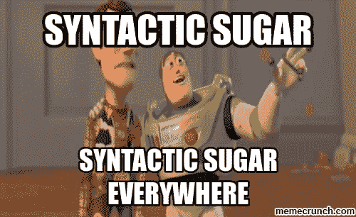

# Sh*tpost:我们能不能不说“句法糖”？

> 原文：<https://dev.to/jenc/shtpost-can-we-stop-saying-syntactic-sugar-3i4j>

“句法糖”:在自学了这个看似狭窄且不断变化的领域四年后，这个术语不断抬头。我通常不会对任何语言的语义方面争论不休...但是这个名词曾经让我陷入困惑。

我第一次听说“句法糖”这个术语是在《反应关系》中。我是在韦斯·博斯[反应](https://reactjs.org/docs/jsx-in-depth.html)的视频中听说的。然后用 [`async`和`await`](https://ponyfoo.com/articles/understanding-javascript-async-await) 来描述。见鬼，甚至还有关于这个的讨论！

(不用谷歌)我在经验丰富的开发人员之间解释它的意思是，语法糖是一种语言或框架的一个方面，它允许开发人员以一种简短、清晰和/或更简单的方式编写代码。

例如，编写 JSX 有助于在编写片段时将 javascript 集成到 HTML 视图中。`Async` / `await`让 Javascript *看起来*好像是同步的，同时提醒我们它将异步运行，暂停一个函数的执行，等待一个承诺解决或信息返回。

难道没有人认为，任何简化代码或使代码写得更简单、更干净的东西都是“语法糖”吗？模板文字、析构或者甚至`++`和`+=`难道不是语法糖吗？

尽管有这样的类比，术语“句法糖”并没有帮助我，或者帮助学习者理解一种语言或框架的非常甜蜜、精炼的特征是什么！

每次听到都只是打算省略，继续看例题。

`rant.end()`

好的。我愿意听听这个术语是如何规范和有用的。很可能我只是对我的第二职业“年轻”和不满。

* * *

因此，如果网上有人分享我的观点，我就不得不去谷歌一下，这篇文章似乎更能表达我的观点。

反正我需要一个定义，所以这里有一些我觉得有用的资源:
[Sweet API——句法糖和你](https://nordicapis.com/syntactic-sugar-apis/)
[Quora |什么是句法糖？](https://www.quora.com/What-is-syntactic-sugar-in-programming-languages)