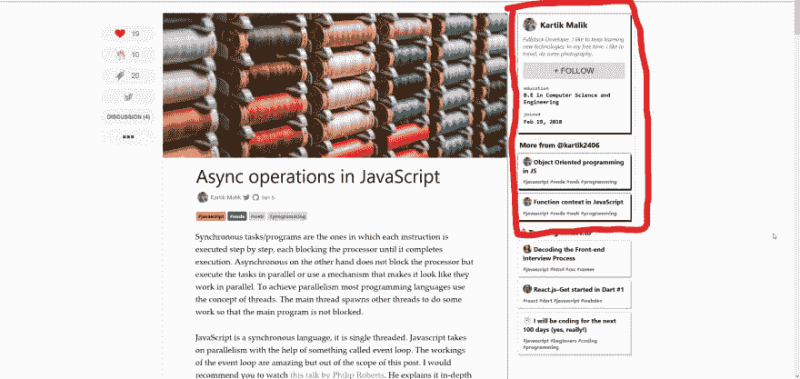
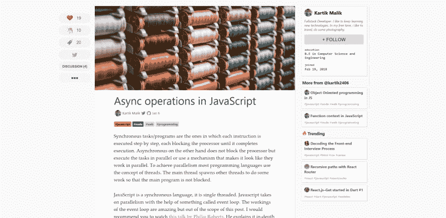
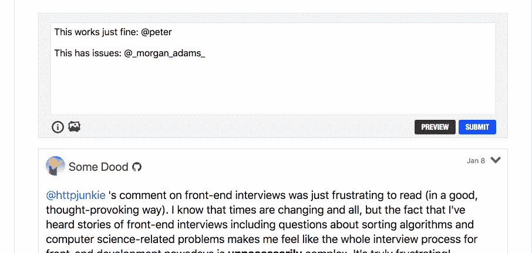
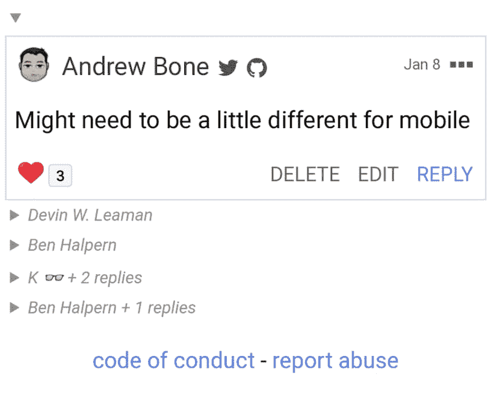
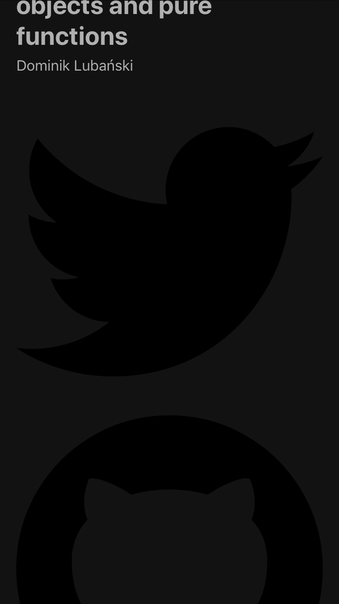

# 开发人员对上周的回购进行总结

> 原文：<https://dev.to/devteam/devto-repo-recap-from-the-past-week-22jg>

嘿大家好！这一期将涵盖 1 月 6 日至 1 月 12 日。

# 特性

*   [@timorthi](https://dev.to/timorthi) 在你的设置页面添加了 API 秘密。敬请关注我们的开发者 API 端点！谢谢，[@蒂莫西](https://dev.to/timorthi)！

    *   [链接到 PR](https://github.com/thepracticaldev/dev.to/pull/1369)
*   组织现在可以更新他们的用户名！查看下面的公关为本质的细节。

    *   [链接到 PR](https://github.com/thepracticaldev/dev.to/pull/1411)
*   在[@ link 2 twenty](https://dev.to/link2twenty)[@ Ben](https://dev.to/ben)的一个建议后，推高了崩溃评论的能力。查看更新日志，了解更多详情。

    *   [链接到 PR](https://github.com/thepracticaldev/dev.to/pull/1484)[](/ben) [## Changelog:折叠评论（通过"详细信息" HTML 标签)

        ### 本哈尔彭一月 8 日 191 分钟阅读

        # meta# changelog# web dev# html](/ben/changelog-collapse-comments-via-the-details-html-tag-4nim)
*   [@link2twenty](https://dev.to/link2twenty) 还增加了一个 SlideShare Liquid 标签。谢谢安德鲁。

    *   [链接到 PR](https://github.com/thepracticaldev/dev.to/pull/1485)
*   多亏了 [@mariocsee](https://dev.to/mariocsee) ，你现在可以在聊天信息中使用基本的减价格式。谢谢，马里奥！

    *   [链接到 PR](https://github.com/thepracticaldev/dev.to/pull/1487)

而在 iOS 回购中...

*   [@StriderHND](https://dev.to/striderhnd) 启动 app 时增加了一个加载微调器。谢谢你，埃里克！
    *   [链接到 PR](https://github.com/thepracticaldev/DEV-ios/pull/118)

# Bug 修复/其他贡献

*   [@mariocsee](https://dev.to/mariocsee) 修复了一些连接消息间距问题。再次感谢你，马里奥！

    *   [链接到 PR](https://github.com/thepracticaldev/dev.to/pull/1259)
*   [@link2twenty](https://dev.to/link2twenty) 继续他为黑暗模式添加 CSS 变量的旅程。谢谢你的多重公关，安德鲁！

    *   [添加-主题-容器-盒子-阴影错过的地方](https://github.com/thepracticaldev/dev.to/pull/1420)
    *   [添加-主题-容器背景](https://github.com/thepracticaldev/dev.to/pull/1479)
    *   [错过的主题容器边框](https://github.com/thepracticaldev/dev.to/pull/1480)
*   [@arun](https://dev.to/arun) 修复了一个 Rubocop 的冒犯:“修复哈希参数周围的大括号。”谢谢， [@arun](https://dev.to/arun) ！

    *   [链接到 PR](https://github.com/thepracticaldev/dev.to/pull/1453)
*   [@delbetu](https://dev.to/delbetu) 重构了我们的 OAuth 控制器，避免了之前的元编程解决方案。谢谢， [@delbetu](https://dev.to/delbetu) ！

    *   [链接到 PR](https://github.com/thepracticaldev/dev.to/pull/1457)
*   [@vnbrs](https://dev.to/vnbrs) 在你的个人资料设置中正确大写标签。谢谢，@vnbrs！

    *   [链接到 PR](https://github.com/thepracticaldev/dev.to/pull/1464)
*   [@ben](https://dev.to/ben) 增加了 AWS 的网站地图生成:

    *   [添加网站地图生成](https://github.com/thepracticaldev/dev.to/pull/1465)
    *   [最终确定生成的网站地图](https://github.com/thepracticaldev/dev.to/pull/1466)
*   [@ben](https://dev.to/ben) 也对文章页面的缓存做了一些改进。

    *   [改进文章展示视图的缓存](https://github.com/thepracticaldev/dev.to/pull/1467)
    *   [删除文章展示评论表单中的用户登录差异](https://github.com/thepracticaldev/dev.to/pull/1468)
*   @maestromac 修复了 Tweet Liquid 标签的一个问题。

    *   [链接到 PR](https://github.com/thepracticaldev/dev.to/pull/1481)
*   [@vinistock](https://dev.to/vinistock) 做了个 PR 把我们升级到 Ruby 2.6.0。谢谢， [@vinistock](https://dev.to/vinistock) ！

    *   [链接到 PR](https://github.com/thepracticaldev/dev.to/pull/1482)
*   我们修复了一个小错误，Windows 中的一些链接不能正确路由。

    *   [链接到 PR](https://github.com/thepracticaldev/dev.to/pull/1489)
*   我们还修复了播客液体标签的问题。如果你最近用过这个，请务必重新保存你的文章以更新它。

    *   [链接到 PR](https://github.com/thepracticaldev/dev.to/pull/1500)
*   [@jess](https://dev.to/jess) 重构了我们的 banisher 类和内部垃圾工具。:)

    *   [链接到 PR](https://github.com/thepracticaldev/dev.to/pull/1501)
*   @aspittel 将她自己添加到我们的核心贡献者列表中！🎉如果你还没有看过她的公告，请看看下面的帖子:

[](/aspittel) [## 新的一年和新的开始:我将加入开发团队！

### 阿里·斯皮特尔 1 月 9 日 191 分钟阅读

#meta #career #personalnews](/aspittel/new-years-and-new-beginnings-im-joining-the-dev-team-3dnb)

*   [@abraham](https://dev.to/abraham) 更新了我们的 gem 文件，使用已发布的`buffer` gem 版本，而不是来自 GitHub repo 的版本。谢谢亚伯拉罕。

    *   [链接到 PR](https://github.com/thepracticaldev/dev.to/pull/1507)
*   [@lightalloy](https://dev.to/lightalloy) 修复评论取消按钮重定向 url

    *   [链接到 PR](https://github.com/thepracticaldev/dev.to/pull/1508)

# 新问题/讨论

*   [@vnbrs](https://dev.to/vrnbs) 请求作为标签版主合并相似标签的能力。我们在技术上有这个功能，但是还没有工具。如果你是一个标签版主，看到了一个应该合并的标签，请随时在连接频道告诉我们。谢谢，@vnbrs！

    # [ 能够合并相似的标签 #1469](https://github.com/thepracticaldev/dev.to/issues/1469) 

    [](https://github.com/vnbrs) **[vnbrs](https://github.com/vnbrs)** posted on [<time datetime="2019-01-06T07:43:13Z">Jan 06, 2019</time>](https://github.com/thepracticaldev/dev.to/issues/1469)

    **您的功能请求是否与某个问题相关？请描述一下。**最近我发了[“我想学函数式编程:从哪里开始？”为了标记它，我搜索了人们用来标记函数式编程帖子的东西。我发现使用了两个标签，“fp”和“functionalprogramming”，但是这两个标签的意思是一样的。](https://dev.to/vnbrs/i-want-to-learn-functional-programming-where-to-start-3hek)

    **描述您想要的解决方案** Stack Exchange 可以很好地处理这一问题，并具有调节功能。它们提供了一种方法来合并标签并使其成为同义词，将其中一个标签视为主标签。

    例如，如果我们选择“功能编程”作为“正确”的，这个特性将:

    1.  从现有帖子中删除同义词，在我的情况下，它会从我的帖子中删除“fp”
    2.  给这些帖子添加主标签(“functionalprogramming”)，如果它还没有被加上标签的话
    3.  对于新帖子，用“功能编程”自动更正“fp”

    [View on GitHub](https://github.com/thepracticaldev/dev.to/issues/1469)
*   @vladkodmc 展开了一场关于 UI 和将注意力吸引到正确位置的讨论。检查问题的细节。谢谢@vladkodmc！

    # [  UI 对比和绘制注意事项 #1470](https://github.com/thepracticaldev/dev.to/issues/1470) 

    [](https://github.com/vladinator1000) **[vladinator1000](https://github.com/vladinator1000)** posted on [<time datetime="2019-01-06T16:11:29Z">Jan 06, 2019</time>](https://github.com/thepracticaldev/dev.to/issues/1470)

    **您的功能请求是否与某个问题相关？请描述一下。**文章视图很难阅读，因为用户界面让你向右看，而不是看文章: [](https://user-images.githubusercontent.com/1226564/50738262-cef87980-11c9-11e9-812c-c111ec1c0ed2.jpg)

    因为 dev.to 是关于阅读文章的，所以文章应该吸引最多的注意力。方框阴影非常华丽，但是当有大量文本需要阅读时，很快就会让人感到疲劳。

    **描述您想要的解决方案**我们可以通过调整颜色值来加强视觉层次，让眼睛看起来更轻松，这样用户就不必费力地将目光从右边移开(像我一样)。基本上，最重要的区域(文章)对比度最高，第二重要的区域对比度较低(黑色会变成灰色)，依此类推...

    下面是我在浏览器检查器中想到的，我不小心把文章的文本弄成了灰色，它应该是黑色的: [](https://user-images.githubusercontent.com/1226564/50738528-eab14f00-11cc-11e9-85b7-7126e8f5683a.png)

    **描述你考虑过的替代方案**也可以降低每一个不太重要的元素的颜色值，比如文本，而不仅仅是方框阴影，这样文章的字体会更黑，从而比不太重要的内容有更多的对比度。

    **附加背景**这种推理根植于视觉设计原则，参见本[风格指南](https://nexus.leagueoflegends.com/wp-content/uploads/2017/10/VFX_Styleguide_final_public_hidpjqwx7lqyx0pjj3ss.pdf)的第 3 节“价值”。

    为特定元素设置值范围的层次结构可以提高可读性和可访问性。当我第一次看到 dev.to 时，我非常喜欢大胆的方框阴影，我认为它增加了个性。但是随着时间的推移，我很自然地求助于 Firefox 阅读器视图，因为文章视图对我的眼睛来说太累了。

    有一个类似#1273 的问题与此相关，但我认为它在大背景下没有意义。整体体验应该是非 straneous，以便用户可以阅读更多的文章，只有在完成这一点后，人们才应该考虑如何获得更好的灯塔评分。

    [View on GitHub](https://github.com/thepracticaldev/dev.to/issues/1470)
*   [@peter](https://dev.to/peter) 提出了用户名中的下划线会阻止@-提及正确链接的问题。这在某种程度上可以用降价技术来解决，但是我们也想实现一个解决方案来处理这个问题。

    # [ 用户名中成对下划线防止@提及链接不当 #1491](https://github.com/thepracticaldev/dev.to/issues/1491) 

    [](https://github.com/pkfrank) **[pkfrank](https://github.com/pkfrank)** posted on [<time datetime="2019-01-08T18:12:24Z">Jan 08, 2019</time>](https://github.com/thepracticaldev/dev.to/issues/1491)

    **描述 bug** 我试着@提及用户`_morgan_adams_` ( [开发者简介](https://dev.to/_morgan_adams_))并注意到这个问题。它没有正确地自动链接到 DEV 配置文件，而是将下划线解释为斜体的 Markdown 指令。这在评论和帖子中都是一个问题。

    **转载**见下面 GIF。

    **预期行为**@-提到的用户名应该正确链接到 DEV 帐户。

    **截图** [](https://camo.githubusercontent.com/9348cec9657b42b697612c395084ff4e7465dc70/68747470733a2f2f636c2e6c792f6462623364373231333136322f53637265656e2532305265636f7264696e67253230323031392d30312d3038253230617425323030312e3037253230504d2e676966)

    [View on GitHub](https://github.com/thepracticaldev/dev.to/issues/1491)
*   我们提出了允许用户配置他们自己的降价呈现的讨论。请随意在这个问题上发表意见。发布者[@杰斯](https://dev.to/jess) :

    # [ 允许用户配置降价效果图 #1492](https://github.com/thepracticaldev/dev.to/issues/1492) 

    [](https://github.com/jessleenyc) **[jessleenyc](https://github.com/jessleenyc)** posted on [<time datetime="2019-01-08T18:29:46Z">Jan 08, 2019</time>](https://github.com/thepracticaldev/dev.to/issues/1492)

    **您的功能请求是否与某个问题相关？请描述一下。**减价有几种方式，有些人会对某些东西有偏好。让人们选择如何处理他们的降价是有意义的。

    **描述您希望**开始的解决方案，让我们为 markdown 解析器添加忽略某些换行符的选项。更多信息见#575。这是一个用户应该能够通过他们的设置页面切换的设置。

    [View on GitHub](https://github.com/thepracticaldev/dev.to/issues/1492)
*   [@link2twenty](https://dev.to/link2twenty) 讨论了调整移动视图中折叠评论的外观。谢谢安德鲁。

    # [【UI】可折叠移动评论 #1498](https://github.com/thepracticaldev/dev.to/issues/1498) 

    [](https://github.com/Link2Twenty) **[Link2Twenty](https://github.com/Link2Twenty)** posted on [<time datetime="2019-01-08T22:20:05Z">Jan 08, 2019</time>](https://github.com/thepracticaldev/dev.to/issues/1498)

    在移动设备上，可折叠的评论箭头和摘要有点小。

    [](https://user-images.githubusercontent.com/3534427/50861979-47119b80-1392-11e9-8e26-abea89a78e6d.png)

    Reddit 也有可折叠的评论，通过在手机上没有可折叠的评论来解决这个问题，而是只显示基本级别的评论和一个显示回复的按钮。

    [](https://user-images.githubusercontent.com/3534427/50862375-63fa9e80-1393-11e9-937d-f9ca1a7221d5.png)

    一旦回复被发现，它们就不能再被隐藏起来。

    这一期是讨论移动用户界面和任何可能需要做出的改变的地方。

    [View on GitHub](https://github.com/thepracticaldev/dev.to/issues/1498)
*   [@vinistock](https://dev.to/vinistock) 请求了一个功能，让你可以在仪表盘上看到你的每篇帖子的评论的反应总数。谢谢， [@vinistock](https://dev.to/vinistock) ！

    # [ 添加评论反应计数到仪表盘 #1505](https://github.com/thepracticaldev/dev.to/issues/1505) 

    [](https://github.com/vinistock) **[vinistock](https://github.com/vinistock)** posted on [<time datetime="2019-01-09T18:18:45Z">Jan 09, 2019</time>](https://github.com/thepracticaldev/dev.to/issues/1505)

    **您的功能请求是否与某个问题相关？请描述一下。**

    特色。

    Dev 在仪表板页面中已经有一个帖子反应计数。我认为把评论反应也计算在内是有意义的(当然，在我看来)。

    很多评论对文章的内容有很大的贡献，所以我认为把它们也包括进来是有意义的。

    **描述您想要的解决方案**

    让仪表板显示评论回复总数。

    从简短的代码分析来看，这应该像对用户评论的反应计数求和一样简单。工作的广泛部分是设计和前端部分。

    [View on GitHub](https://github.com/thepracticaldev/dev.to/issues/1505)
*   @maestromac 提出了拥有更好的液体标签错误处理的问题。

    # [ 佳液标签错误处理 #1511](https://github.com/thepracticaldev/dev.to/issues/1511) 

    [](https://github.com/maestromac) **[maestromac](https://github.com/maestromac)** posted on [<time datetime="2019-01-10T17:32:05Z">Jan 10, 2019</time>](https://github.com/thepracticaldev/dev.to/issues/1511)

    **您的功能请求是否与某个问题相关？请描述一下。**每当液体标签中出现错误时，编辑应该尽力通知作者哪里出错了，而不是显示可怕的`Liquid error: internal`。这也被证明在开发中很难调试。

    **描述您想要的解决方案**目前，我们正在制作我们自己的定制液体标签，以便在初始化时引发`StandardError`,如果有...`ArgumentError`。我们这样做是因为在`#render`中发生的任何形式的错误都会抛出一个`Liquid error: internal`。

    更好的解决方案是让 Liquid 正常解析，即`Liquid::Template.parse(sanitized_content)`，然后用`Liquid.errors`检查错误。这还有一个额外的好处，即一次捕获多个错误，让它们被添加到视图中显示的错误中。

    **描述你考虑过的替代方案**可能有更好的解决方案，我在[这个文档中错过了](https://github.com/Shopify/liquid)。

    **附加上下文**这也应该考虑到我们的两个编辑器版本。

    [View on GitHub](https://github.com/thepracticaldev/dev.to/issues/1511)
*   [@wuz](https://dev.to/wuz) 请求了一个可以在 dev.to 中创建投票的功能。谢谢，Conlin！

    # [ 实施民意调查 #1512](https://github.com/thepracticaldev/dev.to/issues/1512) 

    [](https://github.com/wuz) **[wuz](https://github.com/wuz)** posted on [<time datetime="2019-01-10T19:11:30Z">Jan 10, 2019</time>](https://github.com/thepracticaldev/dev.to/issues/1512)

    **您的功能请求是否与某个问题相关？请描述一下。**dev . to 上有许多很棒的内容类型，但我希望看到一种从社区收集信息的方式。我认为民意调查与#讨论话题和许多其他 dev.to 功能一样是一个天然的组合。

    **描述您想要的解决方案**我希望看到一个用于实施投票的标签和液体标签。首先，用一个#poll 标签和一个嵌入的 poll 服务来测试这个特性可能是值得的。如果进展顺利，内置的投票功能将会非常酷。这将避免需要一个单独的服务，并可能产生一些关于所创建的问题和答案类型的有趣的统计数据。

    **描述你考虑过的替代方案**正如我所说，使用第三方系统是一个很好的替代方案。

    **附加上下文**不适用

    [View on GitHub](https://github.com/thepracticaldev/dev.to/issues/1512)
*   @kurtz1993 提出了一个问题，在 Safari 的阅读器模式下 Twitter 和 Github 的链接太大。谢谢， [@kurtz1993](https://dev.to/kurtz1993) ！

    # [  Twitter 和 Github 在 safari 阅读视图上链接太大 #1517](https://github.com/thepracticaldev/dev.to/issues/1517) 

    [](https://github.com/Kurtz1993) **[Kurtz1993](https://github.com/Kurtz1993)** posted on [<time datetime="2019-01-11T05:11:37Z">Jan 11, 2019</time>](https://github.com/thepracticaldev/dev.to/issues/1517)

    我一直使用移动 safari 中的阅读视图来阅读网页中的文章，但最近我发现 Twitter 和 Github 图标正在以 100%的视口宽度进行渲染。

    **重现**重现行为的步骤:

    1.  使用移动 safari 访问 dev.to 中的任何文章
    2.  点击阅读视图
    3.  参见错误

    **预期行为**图标应该以正常的电影尺寸呈现。

    **截图** [](https://user-images.githubusercontent.com/5412470/51014462-63960b00-152d-11e9-943d-b69d3e113335.png)

    **智能手机(请填写以下信息):**

    *   设备:iPhone 7
    *   操作系统:iOS 12.1.2
    *   浏览器:Safari

    ```
    </div>
    <div class="gh-btn-container"><a class="gh-btn" href="https://github.com/thepracticaldev/dev.to/issues/1517">View on GitHub</a></div> 
    ```

    Enter fullscreen mode Exit fullscreen mode

*   [@jess](https://dev.to/jess) 提出了通知中 Tag liquid tag 溢出评论框的问题。

    # [ 标签通知中液体标签溢出评论框 #1520](https://github.com/thepracticaldev/dev.to/issues/1520) 

    [](https://github.com/jessleenyc) **[jessleenyc](https://github.com/jessleenyc)** posted on [<time datetime="2019-01-11T17:44:50Z">Jan 11, 2019</time>](https://github.com/thepracticaldev/dev.to/issues/1520)

    **描述 bug** 液体标签的样式被剪掉/没有正确最小化。

    **截图** [](https://camo.githubusercontent.com/21a69e05148a7efe8a5165a7b5c7f88e99a550be/68747470733a2f2f636c2e6c792f3066326531363332313137312f646f776e6c6f61642f496d616765253230323031392d30312d3131253230617425323031322e34322e3534253230504d2e706e67)

    [View on GitHub](https://github.com/thepracticaldev/dev.to/issues/1520)

*   [@artemix](https://dev.to/artemix) 讨论了移动展开/折叠指示器进行评论。谢谢@artemix！

    # [ 移动展开/折叠勾成评论卡 #1518](https://github.com/thepracticaldev/dev.to/issues/1518) 

    [](https://github.com/Arteneko) **[Arteneko](https://github.com/Arteneko)** posted on [<time datetime="2019-01-11T16:01:37Z">Jan 11, 2019</time>](https://github.com/thepracticaldev/dev.to/issues/1518)

    **您的功能请求是否与某个问题相关？请描述一下。**

    当我第一次看到展开/折叠标记时，我不明白它们最初的用途。

    在悬停它们之后，看到它不仅仅是网站中的一个 bug，而是一个实际的操作，我明白了它的目的。

    我认为这个勾号不明确，它的位置是错误的:它改变了评论卡的状态，我希望在卡的中找到它*。*

    **附加上下文**

    对于嵌套的注释，也许父卡可以在设计中包含子卡？

    最后，这里有一个刻度和嵌套注释示例的屏幕截图:

    [](https://camo.githubusercontent.com/7f85ff9e245d8a7406443e93c421f970118d46f1/68747470733a2f2f7069782e77617463682f34464c45755a2f486441474d372e706e67)

    [View on GitHub](https://github.com/thepracticaldev/dev.to/issues/1518)

我们已经就上述问题进行了一些有益的讨论，欢迎对新功能的任何反馈。感谢阅读！