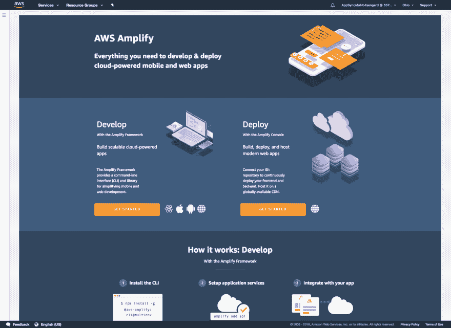
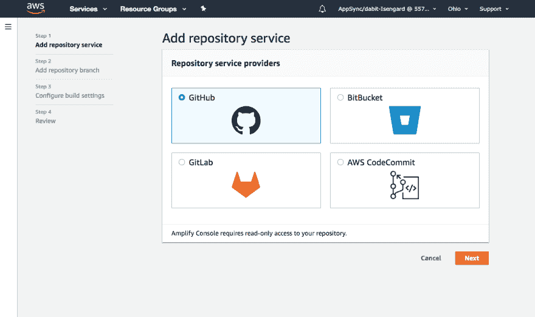
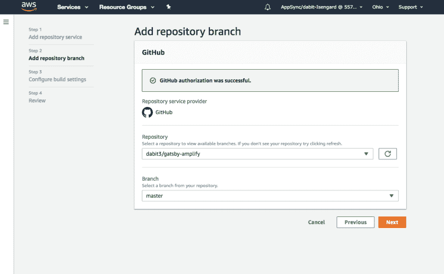
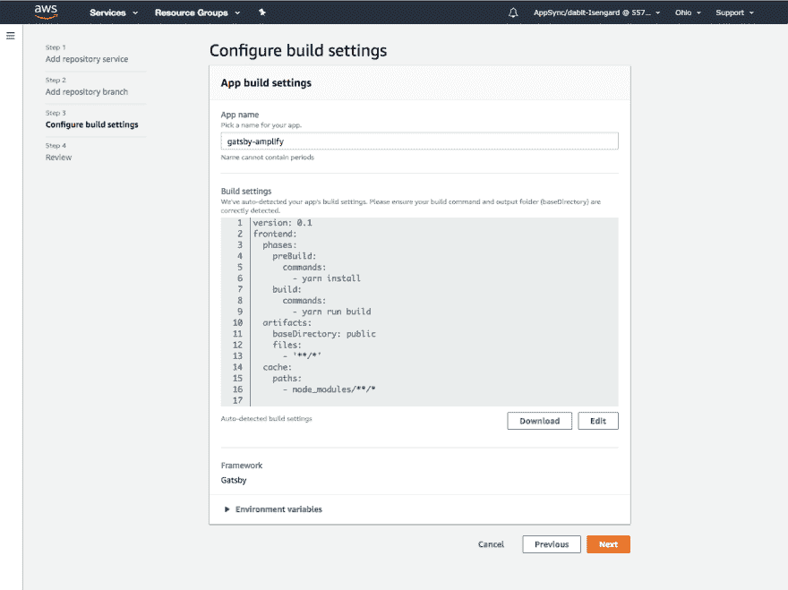
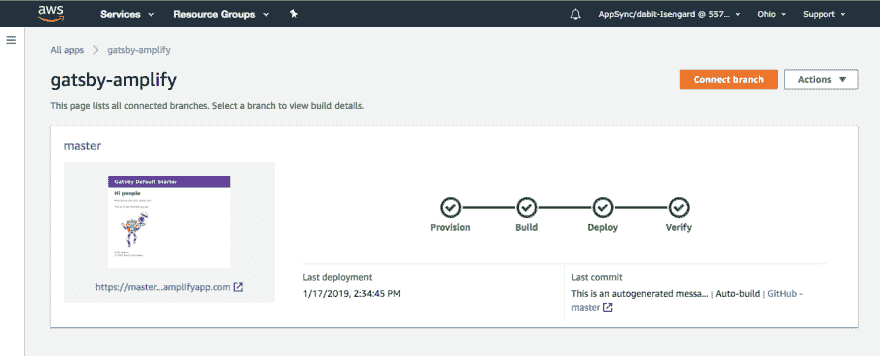
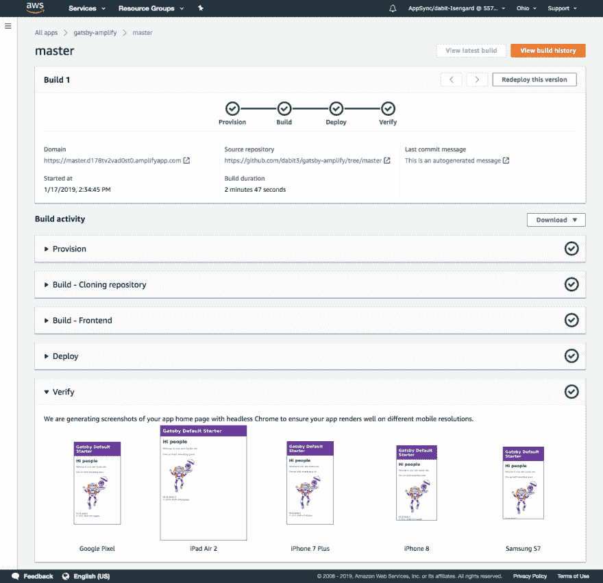
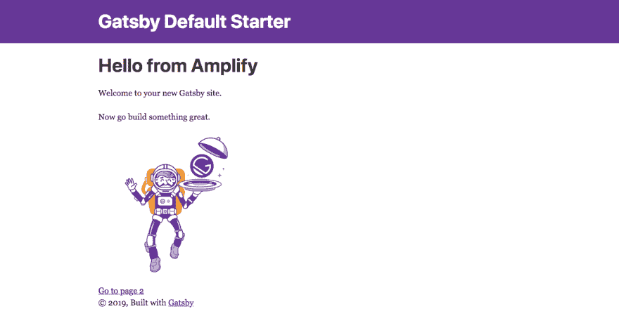

# 将 Gatsby 部署到 AWS

> 原文：<https://dev.to/dabit3/deploying-gatsby-to-aws-35di>

Gatsby 正在迅速成为那些希望使用新的 React 应用程序的开发人员的首选工具。

> 关于如何在短短 56 秒内完成这项工作的演练，请点击这里查看视频。

Gatsby 提供的开箱即用的速度、智能默认配置和易于开发的组合是我们之前所拥有的一个进步，类似于 Create React App 在早期手动配置 webpack 配置时带给我们的飞跃。

在这篇文章中，我们将学习如何使用 [Amplify 控制台](https://aws.amazon.com/amplify/console/)将你的下一个 Gatsby 站点部署到 AWS。

## 什么是放大

Amplify 开始时只是一个客户端框架，但现在已经发展到更广的范围。它现在由 CLI、控制台以及客户端框架组成。

CLI 允许您直接从命令行创建和配置新的云服务。这种体验在某种意义上类似于 [Rails](https://rubyonrails.org) ，你可以搭建这些服务&被给予一组自以为是的配置，然后你可以更新它们以满足你的需求。

一旦你创建了你的云服务，你就可以使用 Amplify 客户端来连接和交互这些服务。

最后，当您准备好启动您的应用程序时，Amplify 控制台提供了一套关于托管和持续部署的工具来帮助您。

让我们来看看如何将这两种技术结合起来。

## 入门

首先，我们将使用 [Gatsby CLI](https://www.gatsbyjs.org/tutorial/part-zero/#install-git) 或 npx &创建一个新的 Gatsby 项目，然后进入新目录:

```
npx gatsby new GatsbyAmplify

cd GatsbyAmplify 
```

Enter fullscreen mode Exit fullscreen mode

一旦创建了应用程序，我们将创建一个新的 GitHub repo &将项目推送到 repo:

```
git init

git remote add origin git@github.com:<username>/<projectname>.git

git add .

git commit -m 'initial commit'

git push origin master 
```

Enter fullscreen mode Exit fullscreen mode

## 放大控制台

现在 GitHub 项目已经创建，我们可以登录 [Amplify 控制台](https://console.aws.amazon.com/amplify/home)。

从这里，在部署下，我们可以单击**开始**:

[](https://res.cloudinary.com/practicaldev/image/fetch/s--eyCt4Hfv--/c_limit%2Cf_auto%2Cfl_progressive%2Cq_auto%2Cw_880/https://thepracticaldev.s3.amazonaws.com/i/drl8ug8xk26u9ehswy8c.png)

接下来，我们将选择 GitHub 作为我们的存储库&单击 **Next** 。

[](https://res.cloudinary.com/practicaldev/image/fetch/s--V4S9CrHq--/c_limit%2Cf_auto%2Cfl_progressive%2Cq_auto%2Cw_880/https://thepracticaldev.s3.amazonaws.com/i/f1a2htgoy7o4shx09c8l.png)

然后连接我们刚刚创建的新回购的 mater 分支，点击 **Next** :

[](https://res.cloudinary.com/practicaldev/image/fetch/s--n4Jqs3DJ--/c_limit%2Cf_auto%2Cfl_progressive%2Cq_auto%2Cw_880/https://thepracticaldev.s3.amazonaws.com/i/7r24czb7oclvq3c9tmor.png)

在此视图中，我们可以查看默认的构建设置&单击下一步的**继续:**

[](https://res.cloudinary.com/practicaldev/image/fetch/s--Hye0dwPx--/c_limit%2Cf_auto%2Cfl_progressive%2Cq_auto%2Cw_880/https://thepracticaldev.s3.amazonaws.com/i/8zted3b8c1bubqiajbgg.png)

最后，我们可以检查部署&当我们准备好部署我们的应用程序时，单击**保存&部署**:

[](https://res.cloudinary.com/practicaldev/image/fetch/s--SAj4-Xmy--/c_limit%2Cf_auto%2Cfl_progressive%2Cq_auto%2Cw_880/https://thepracticaldev.s3.amazonaws.com/i/s7yrdxphs4v8eesm2kh6.png)

一旦部署成功，您应该会看到以下内容:

[](https://res.cloudinary.com/practicaldev/image/fetch/s--NalcfaDL--/c_limit%2Cf_auto%2Cfl_progressive%2Cq_auto%2Cw_880/https://thepracticaldev.s3.amazonaws.com/i/gfcp2lz8sald97w4tpxy.png)

要查看部署的详细信息，单击分支的名称(在我们的例子中，是 **master** )。

在此视图中，您可以看到有关部署的详细信息，包括查看应用程序的链接和不同设备上的应用程序截图。

[](https://res.cloudinary.com/practicaldev/image/fetch/s--HXNMxCx---/c_limit%2Cf_auto%2Cfl_progressive%2Cq_auto%2Cw_880/https://thepracticaldev.s3.amazonaws.com/i/igjh7xyndmypatekkq2p.png)

## 开始新的构建

现在我们的应用程序已经部署好了，让我们更进一步。Amplify 控制台将自动监视您的主分支&每当新代码被合并时就开始一个新的构建。让我们来测试一下。

打开`src/pages/index.js` &替换下面一行:

```
<h1>Hi people</h1> 
```

Enter fullscreen mode Exit fullscreen mode

有了这个:

```
<h1>Hello from Amplify</h1> 
```

Enter fullscreen mode Exit fullscreen mode

保存文件并将更改推送到您的主分支:

```
git add .

git commit -m 'updated heading'

git push origin master 
```

Enter fullscreen mode Exit fullscreen mode

现在，当我们回到 Amplify 控制台时，我们会看到一个新的构建已经开始:

[](https://res.cloudinary.com/practicaldev/image/fetch/s--qoQ47Ra_--/c_limit%2Cf_auto%2Cfl_progressive%2Cq_auto%2Cw_880/https://thepracticaldev.s3.amazonaws.com/i/kq0sx5azsx3psg8p3c1v.png)

构建完成后，我们启动应用程序，我们现在应该会看到新的标题:

[](https://res.cloudinary.com/practicaldev/image/fetch/s--Z9KCQ0o9--/c_limit%2Cf_auto%2Cfl_progressive%2Cq_auto%2Cw_880/https://thepracticaldev.s3.amazonaws.com/i/jwnri28j0t5iasbsq8qc.png)

## 下一步

现在你已经掌握了使用 Amplify 控制台的窍门，接下来有哪些步骤？

如果你有兴趣在你的 Gatsby 应用中添加认证，看看我发布的这个 Gatsby Auth Starter。

如果你有兴趣给你的 Gatsby 应用添加新功能(比如身份验证或 GraphQL API)，看看 [Amplify CLI & Amplify 客户端库](https://aws-amplify.github.io/)。

您也可能对在多个环境或团队中工作感兴趣。如果是这样，看看[关于如何让&与团队一起跑步的文档](https://aws-amplify.github.io/docs/cli/multienv?sdk=js)或者看看[我写的这篇文章](https://read.acloud.guru/multiple-serverless-environments-with-aws-amplify-344759e1be08)。

> 我的名字是纳德·达比特。我是亚马逊网络服务的一名开发者倡导者，负责像 [AWS AppSync](https://aws.amazon.com/appsync/) 和 [AWS Amplify](https://aws-amplify.github.io/) 这样的项目。我专门从事跨平台&云应用开发。